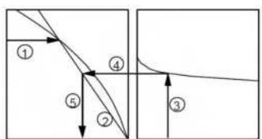
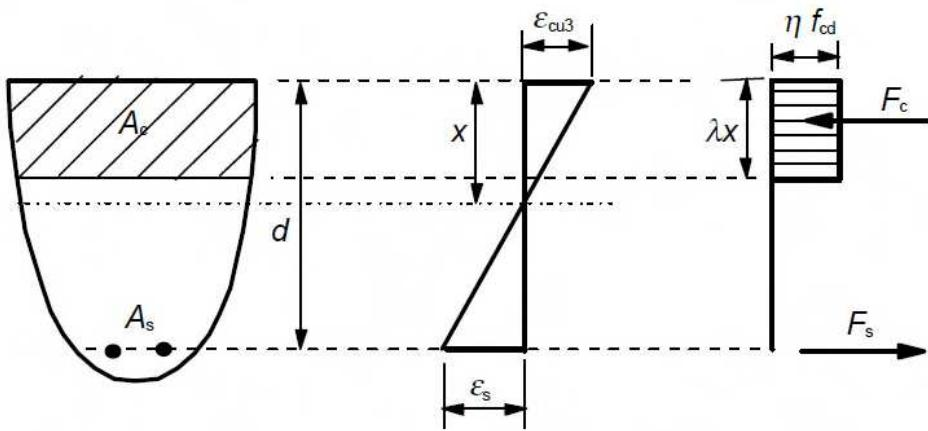
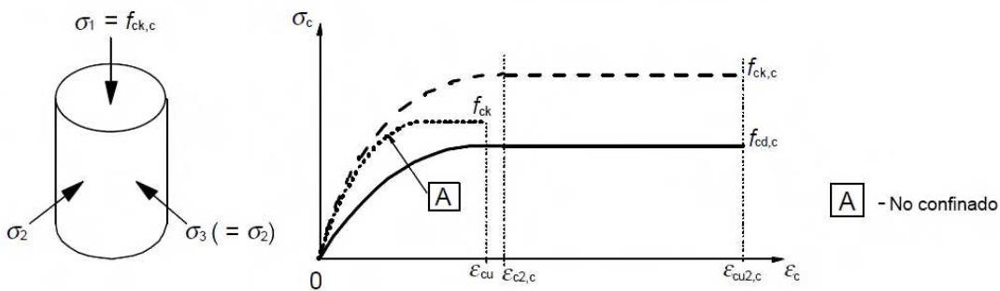

## 3 Materiales

## 3.1 Hormigón

## 3.1.1 Generalidades

(1) Se tendrá en cuenta lo establecido en el Artículo 33 de este Código, así como los principios y reglas para hormigones convencionales y de alta resistencia que se indican en las siguientes cláusulas.

(2) Las recomendaciones para los hormigones con fibras, con áridos ligeros o proyectados se establecen en los Anejos 7, 8 y 9 de este Código.

## 3.1.2 Resistencia

(1) La resistencia a compresión del hormigón se indica mediante clases resistentes que se relacionan con la resistencia característica (5%) medida en probeta cilíndrica $f_{ck}$ , de acuerdo a lo establecido en el apartado 33.3.

(2) Las clases resistentes en este Código se basan en la resistencia característica sobre probeta cilíndrica, $f_{ck}$ , determinada a los 28 días, con un valor máximo de 90 N/mm $^{2}$ .

(3) Las resistencias características, $f_{ck}$ , y las correspondientes características mecánicas para el cálculo, se indican en la tabla A19.3.1.

(4) En ciertas ocasiones (por ejemplo en el pretensado), puede ser conveniente evaluar la resistencia a compresión del hormigón antes o después de 28 días, sobre probetas de ensayo conservadas en condiciones diferentes a las indicadas en la norma UNE-EN 12390-2. En este caso, se tendrá en cuenta lo indicado en el apartado 57.3 de este Código Estructural.

Si la resistencia se determina a una edad t > 28 días, los valores $\alpha_{cc}$ y $\alpha_{ct}$ definidos en los apartados 3.1.6(1) y 3.1.6(2), se disminuirán por un factor $k_{t} = 0,85$ .

(5) Cuando se requiera especificar la resistencia a compresión del hormigón $f_{ck}(t)$ , a una determinada edad, t, (por ejemplo para operaciones de desmoldado, transferencia del pretensado, etc.), se empleará el siguiente criterio:

$$
\begin{array}{l l} f _ {c k} (t) = f _ {c m} (t) - 8 (N / m m ^ {2}) & \quad \text {para} 3 <   t <   2 8 \text {días} \\ f _ {c k} (t) = f _ {c k} & \quad \text {para} t \geq 2 8 \text {días} \end{array}
$$

Para obtener valores más precisos, especialmente para $t \leq 3$ días, habrá que basarse en la realización de ensayos.

(6) La resistencia a compresión a una determinada edad t depende del tipo de cemento, la temperatura y las condiciones de curado. Para una temperatura media de $20^{\circ}$ C y un curado conforme con la norma UNE-EN 12390 la resistencia a compresión a distintas edades $f_{cm}(t)$ se puede estimar mediante las expresiones (3.1) y (3.2).

$$
f _ {c m} (t) = \beta_ {c c} (t) f _ {c m}\tag{3.1}
$$

con:

$$
\beta_ {c c} (t) = \exp \left\{s \left[ 1 - \left(\frac {2 8}{t}\right) ^ {1 / 2} \right] \right\}\tag{3.2}
$$

donde:

$f_{cm}(t)$ es la resistencia media a compresión del hormigón a una edad de t días

$f_{cm}$ es la resistencia media a compresión del hormigón a 28 días de acuerdo con la tabla A19.3.1

$\beta_{cc}(t)$ es un coeficiente que depende de la edad del hormigón t

Sec. I. Pág. 98306

> cve: BOE-A-2021-13681
Verificable en https://www.boe.es

<!-- pag 23 -->

NOTA: $\exp\{\}$ tiene el mismo significado que $e\{\}$ .

Las expresiones (3.1) y (3.2) no podrán utilizarse cuando el hormigón no se ajuste a las especificaciones para la resistencia a compresión a 28 días.

Los criterios contenidos en esta cláusula no pueden utilizarse para justificar una resistencia no conforme con la de referencia que a posteriori a incrementado su valor.

En los casos en los que se aplique un curado al vapor al elemento, véase el apartado 10.3.1.1(3).

(7) La resistencia a tracción se refiere a la mayor tensión alcanzada bajo carga de tracción centrada. Para la obtención de la resistencia a flexo-tracción de referencia véase el apartado 3.1.8(1).

(8) La resistencia a tracción $f_{ct}$ puede estimarse a partir de la resistencia a tracción indirecta $f_{ct,sp}$ mediante la siguiente expresión:

$$
f _ {c t} = 0, 9 \times f _ {c t, s p}\tag{3.3}
$$

(9) El desarrollo de la resistencia a tracción con el tiempo depende de las condiciones de curado y secado, así como de las dimensiones de los elementos estructurales. Como primera aproximación puede suponerse que la resistencia a tracción $f_{ctm}(t)$ es igual a:

$$
f _ {c t m} (t) = (\beta c c (t)) ^ {\alpha} \cdot f _ {c t m}\tag{3.4}
$$

donde:

$$
f _ {c t m}
$$

NOTA: Cuando el desarrollo de la resistencia a tracción con el tiempo sea importante, se recomienda la realización de ensayos teniendo en cuenta las condiciones de exposición y las dimensiones del elemento estructural.

## 3.1.3 Deformación elástica

(1) Las deformaciones elásticas del hormigón dependen, en gran medida, de la dosificación (fundamentalmente de los áridos). Los valores que se establecen en este anejo deben considerarse como indicativos para las aplicaciones generales debiendo ser evaluados de forma específica cuando la estructura sea sensible a su variación.

(2) El módulo de elasticidad de un hormigón depende de los módulos de elasticidad de sus componentes. En la tabla A19.3.1 se indican unos los valores aproximados del módulo de elasticidad secante $E_{cm}$ , de hormigones con áridos cuarcíticos para valores comprendidos entre $\sigma_{c}=0$ y $0,4 f_{cm}$ . Estos valores se reducirán en un 10% cuando se utilicen áridos calizos, en un 30% cuando se utilice arenisca y se incrementaran en un 20% cuando se utilicen áridos basálticos.

Sec. I. Pág. 98307

> cve: BOE-A-2021-13681
Verificable en https://www.boe.es

<!-- pag 24 -->

**Tabla A19.3.1 Características de resistencia y deformación del hormigón**

<table><tr><td colspan="14">Clases resistentes del hormigón</td><td>Relación analítica / Explicación</td><td></td></tr><tr><td> $f_{ck}(N/mm^{2})$ </td><td>12</td><td>16</td><td>20</td><td>25</td><td>30</td><td>35</td><td>40</td><td>45</td><td>50</td><td>55</td><td>60</td><td>70</td><td>80</td><td>90</td><td></td></tr><tr><td> $f_{cm}(N/mm^{2})$ </td><td>20</td><td>24</td><td>28</td><td>33</td><td>38</td><td>43</td><td>48</td><td>53</td><td>58</td><td>63</td><td>68</td><td>78</td><td>88</td><td>98</td><td> $f_{cm}(t)=f_{ck}(t)+8(N/mm^{2})$ </td></tr><tr><td> $f_{ctm}(N/mm^{2})$ </td><td>1,6</td><td>1,9</td><td>2,2</td><td>2,6</td><td>2,9</td><td>3,2</td><td>3,5</td><td>3,8</td><td>4,1</td><td>4,2</td><td>4,4</td><td>4,6</td><td>4,8</td><td>5,0</td><td> $f_{ctm}=0,30\times f_{ck}^{(2/3)}\leq f_{ck}50 N/mm^{2}$  $f_{ctm}=2,12\cdot\ln(1+(f_{cm}/10))>f_{ck}50 N/mm^{2}$ </td></tr><tr><td> $f_{ctk;0,05}(N/mm^{2})$ </td><td>1,1</td><td>1,3</td><td>1,5</td><td>1,8</td><td>2,0</td><td>2,2</td><td>2,5</td><td>2,7</td><td>2,9</td><td>3,0</td><td>3,1</td><td>3,2</td><td>3,4</td><td>3,5</td><td> $f_{ctk;0,05}=0,7\times f_{ctm}$  cuantil 5%</td></tr><tr><td> $f_{ctk;0,95}(N/mm^{2})$ </td><td>2,0</td><td>2,5</td><td>2,9</td><td>3,3</td><td>3,8</td><td>4,2</td><td>4,6</td><td>4,9</td><td>5,3</td><td>5,5</td><td>5,7</td><td>6,0</td><td>6,3</td><td>6,6</td><td> $f_{ctk;0,95}=1,3\times f_{ctm}$  cuantil 95%</td></tr><tr><td> $E_{cm}(10^{3}\cdot N/mm^{2})$ </td><td>27</td><td>29</td><td>30</td><td>31</td><td>33</td><td>34</td><td>35</td><td>36</td><td>37</td><td>38</td><td>39</td><td>41</td><td>42</td><td>44</td><td> $E_{cm}=22[(f_{cm})/10]^{0,3} (f_{cm}en N/mm^{2})$ </td></tr><tr><td> $\varepsilon_{c1}(\%o)$ </td><td>1,8</td><td>1,9</td><td>2,0</td><td>2,1</td><td>2,2</td><td>2,25</td><td>2,3</td><td>2,4</td><td>2,45</td><td>2,5</td><td>2,6</td><td>2,7</td><td>2,8</td><td>2,8</td><td>véase la figura A19.3.2 $\varepsilon_{c1} (\%o) = 0,7 f_{cm}^{0,31} \leq 2.8$ </td></tr><tr><td> $\varepsilon_{cu1}(\%o)$ </td><td colspan="9">3,5</td><td>3,2</td><td>3,0</td><td>2,8</td><td>2,8</td><td>2,8</td><td>véase la figura A19.3.2para  $f_{ck} \geq 50 N/mm^{2}$  $\varepsilon_{cu1} (\%o) = 2,8 + 27[(98 - f_{cm}/100)]^{4}$ </td></tr><tr><td> $\varepsilon_{c2}(\%o)$ </td><td colspan="9">2,0</td><td>2,2</td><td>2,3</td><td>2,4</td><td>2,5</td><td>2,6</td><td>véase la figura A19.3.3para  $f_{ck} \geq 50 N/mm^{2}$  $\varepsilon_{c2} (\%o) = 2,0 + 0,85[(f_{ck} - 50)]^{0,53}$ </td></tr><tr><td> $\varepsilon_{cu2}(\%o)$ </td><td colspan="9">3,5</td><td>3,1</td><td>2,9</td><td>2,7</td><td>2,6</td><td>2,6</td><td>véase la figura A19.3.3para  $f_{ck} \geq 50 N/mm^{2}$  $\varepsilon_{cu2} (\%o) = 2,6 + 35[(90 - f_{ck})/100]^{4}$ </td></tr><tr><td>n</td><td colspan="9">2,0</td><td>1,75</td><td>1,6</td><td>1,45</td><td>1,4</td><td>1,4</td><td>para  $fck \geq 50N/mm^{2}$  $n=1,4+23,4[(90 - f_{ck})/100]^{4}$ </td></tr><tr><td> $\varepsilon_{c3}(\%o)$ </td><td colspan="9">1,75</td><td>1,8</td><td>1,9</td><td>2,0</td><td>2,2</td><td>2,3</td><td>véase la figura A19.3.4para  $f_{ck} \geq 50 N/mm^{2}$  $\varepsilon_{c3}(\%o)=1,75+0,55[(f_{ck}-50)/40]$ </td></tr><tr><td> $\varepsilon_{cu3}(\%o)$ </td><td colspan="9">3,5</td><td>3,1</td><td>2,9</td><td>2,7</td><td>2,6</td><td>2,6</td><td>véase la ffgura A19.3.4para  $f_{ck} \geq 50 N/mm^{2}$  $\varepsilon_{cu3}(\%o)=2,6+35[(90-f_{ck})/100]^{4}$ </td></tr></table>

> Núm. 190

B

> Martes 10 de agosto de 2021

> Sec. I. Pág. 98308

cve: BOE-A-2021-13681
Verificable en https://www.boe.es

> BOLETÍN OFICIAL DEL ESTADO

<!-- pag 25 -->

(3) La variación del módulo de elasticidad en función del tiempo puede estimarse como:

$$
E _ {c m} (t) = (f _ {c m} (t) / f _ {c m}) ^ {0, 3} \times E _ {c m}\tag{3.5}
$$

donde:

$E_{cm}(t)$ y $f_{cm}(t)$ son valores a una edad de t días, siendo $E_{cm}$ y $f_{cm}$ los valores correspondientes a la edad de 28 días. La relación entre $f_{cm}(t)$ y $f_{cm}$ sigue la expresión (3.1).

(4) El coeficiente de Poisson puede tomarse igual a 0,2 para hormigón sin fisurar e igual a 0 para hormigón fisurado.

(5) Si no se dispone de información más precisa, el coeficiente de dilatación térmica puede tomarse igual a $10 \cdot 10^{-6} K^{-1}$ .

## 3.1.4 Fluencia y retracción

(1) La fluencia y retracción del hormigón dependen de la humedad del ambiente, de las dimensiones de los elementos y de la composición del hormigón. La fluencia depende también de la madurez del hormigón en el momento de puesta en carga y de la magnitud y duración de dicha carga.

(2) El coeficiente de fluencia, $\varphi(t, t_{0})$ está relacionado con el módulo tangente, $E_{c}$ , que puede tomarse como $1,05E_{cm}$ . Cuando no se necesite una gran precisión, puede tomarse como coeficiente de fluencia el valor obtenido de la figura A19.3.1 siempre que el hormigón no esté sometido a una tensión de compresión mayor que $0,45 f_{ck}(t_{0})$ a una edad $t_{0}$ , correspondiente a la edad de puesta en carga del hormigón.

NOTA: Para más información, incluyendo el desarrollo de la fluencia con el tiempo, véase el Apéndice B.

(3) La deformación de fluencia del hormigón $\varepsilon_{cc}(\infty,t_{0})$ a tiempo $t = \infty$ para una tensión de compresión constante, $\sigma_{c}$ , aplicada sobre el hormigón a la edad $t_{0}$ , viene dada por:

$$
\varepsilon_ {c c} (\infty , t _ {0}) = \phi (\infty , t _ {0}) \cdot (\sigma_ {c} / E _ {c})\tag{3.6}
$$

(4) Cuando la tensión de compresión del hormigón a una edad $t_{0}$ supere el valor $0,45f_{ck}(t_{0})$ , se deberá considerar la no linealidad de la fluencia. Esta situación puede presentarse como resultado del pretensado que puede originar un incremento de la tensión, por ejemplo, en elementos de hormigón prefabricado a la altura de la armadura activa. En estos casos el coeficiente de fluencia teórico no lineal se obtendrá a partir de la siguiente expresión:

$$
\varphi_ {n l} (\infty , t _ {0}) = \varphi (\infty , t _ {0}) \exp (1, 5 (k _ {\sigma} - 0, 4 5))\tag{3.7}
$$

donde:

$\varphi_{nl}(\infty,t_{0})$ es el coeficiente de fluencia teórico no lineal, que reemplaza a $\varphi(\infty,t_{0})$

$k_{\sigma}$ es la relación tensión-resistencia $\sigma_{c}/f_{ck}(t_{0})$ donde $\sigma_{c}$ es la tensión de compresión y $f_{ck}(t_{0})$ es la resistencia característica del hormigón a compresión, a la edad de puesta en carga.

a) Condiciones internas – HR = 50 %

Sec. I. Pág. 98309

> cve: BOE-A-2021-13681
Verificable en https://www.boe.es

<!-- pag 26 -->

## NOTA:

-El punto de intersección entre las líneas 4 y 5 también puede estar por encima del punto 1.

-Para $t_{0} > 100$ es suficientemente exacto suponer $t_{0} = 100$ (y utilizar la línea tangente).

(5) Los valores de la figura A19.3.1 son válidos para una temperatura ambiente comprendida entre $-40^{\circ}C$ y $+40^{\circ}C$ y una humedad relativa media comprendida entre $HR = 40\%$ y $HR = 100\%$ . Se emplea la siguiente notación:

$\varphi(\infty, t_{0})$ es el coeficiente de fluencia a tiempo infinito

$t_{0}$ es la edad del hormigón en el momento de puesta en carga (en días)

$h_{0}$ es el espesor medio= $2A_{c}/u$ , donde $A_{c}$ es el área de la sección de hormigón y u es el perímetro en contacto expuesto al secado

S es la clase S, de acuerdo con 3.1.2(6)

N es la clase N, de acuerdo con 3.1.2(6)

R es la clase R, de acuerdo con 3.1.2(6)-

(6) La deformación total de retracción se compone de dos partes, la deformación de retracción por secado y la deformación de retracción autógena. La deformación de retracción por secado se desarrolla lentamente, pues es función de la migración del agua a través del hormigón endurecido. La deformación de retracción autógena se desarrolla durante el endurecimiento del hormigón, por lo que su mayor parte se desarrolla en los primeros días después de su puesta en obra. La retracción autógena es una función lineal de la resistencia del hormigón. Debe considerarse específicamente cuando el hormigón nuevo se vierte sobre hormigón endurecido. Por consiguiente, los valores de la retracción total $\varepsilon_{cs}$ se obtienen mediante la siguiente expresión:

$$
\varepsilon_ {c s} = \varepsilon_ {c d} + \varepsilon_ {c a}
$$

donde:

(3.8)

$\varepsilon_{cs}$ es la deformación total de retracción

$\varepsilon_{cd}$ es la deformación de retracción por secado

Sec. I. Pág. 98310

> cve: BOE-A-2021-13681
Verificable en https://www.boe.es

<!-- pag 27 -->

$\varepsilon_{ca}$ es la deformación de retracción autógena.

El valor final de la deformación de retracción por secado, $\varepsilon_{cd,\infty}$ , es igual a $k_{h} \cdot \varepsilon_{cd,0}$ , donde $\varepsilon_{cd,0}$ puede tomarse de la tabla A19.3.2 (valores medios esperados, con un coeficiente de variación del 30%). NOTA: La fórmula para $\varepsilon_{cd,0}$ se da en el Apéndice B.

**Tabla A19.3.2 Valores nominales de la retracción por secado $\varepsilon_{cd,0}(en\ \textperthousand)$ , para un hormigón sin coaccionar fabricado con cemento CEM de Clase N**

<table><tr><td rowspan="2"> $f_{ck}$  (N/mm2)</td><td colspan="6">Humedad relativa (en %)</td></tr><tr><td>20</td><td>40</td><td>60</td><td>80</td><td>90</td><td>100</td></tr><tr><td>20</td><td>0,62</td><td>0,58</td><td>0,49</td><td>0,30</td><td>0,17</td><td>0,00</td></tr><tr><td>40</td><td>0,48</td><td>0,46</td><td>0,38</td><td>0,24</td><td>0,13</td><td>0,00</td></tr><tr><td>60</td><td>0,38</td><td>0,36</td><td>0,30</td><td>0,19</td><td>0,10</td><td>0,00</td></tr><tr><td>80</td><td>0,30</td><td>0,28</td><td>0,24</td><td>0,15</td><td>0,08</td><td>0,00</td></tr><tr><td>90</td><td>0,27</td><td>0,25</td><td>0,21</td><td>0,13</td><td>0,07</td><td>0,00</td></tr></table>

El desarrollo en el tiempo de la retracción por secado tiene la siguiente expresión:

$$
\varepsilon_ {c d} (t) = \beta_ {d s} (t, t _ {s}) \cdot k _ {h} \cdot \varepsilon_ {c d, 0}\tag{3.9}
$$

donde:

$k_{h}$ es un coeficiente que depende del espesor medio $h_{0}$ , de acuerdo con la tabla A19.3.3.

**Tabla A19.3.3 Valores para $k_{h}$ en la expresión (3.9)**

<table><tr><td> $h_0$ </td><td> $k_h$ </td></tr><tr><td>100</td><td>1,00</td></tr><tr><td>200</td><td>0,85</td></tr><tr><td>300</td><td>0,75</td></tr><tr><td>≥ 500</td><td>0,70</td></tr></table>

$$
\beta_ {d s} (t, t _ {s}) = \frac {(t - t _ {s})}{(t - t _ {s}) + 0 . 0 4 \sqrt {h _ {0} ^ {3}}}\tag{3.10}
$$

donde:

t es la edad del hormigón en el momento de puesta en carga (en días)

$t_{s}$ es la edad del hormigón (en días) al comienzo de la retracción por secado (o expansión). Esta edad coincide normalmente con el final del curado

$h_{0}$ es el espesor medio (mm) de la sección = $2A_{C} / u$

Sec. I. Pág. 98311

> cve: BOE-A-2021-13681
Verificable en https://www.boe.es

<!-- pag 28 -->

donde:

$$
A _ {C}
$$

es el área de la sección de hormigón

es el perímetro expuesto al secado.

La deformación de retracción autógena tiene la siguiente expresión

$$
\varepsilon_ {c a} (t) = \beta_ {a s} (t) \varepsilon_ {c a} (\infty)\tag{3.11}
$$

donde:

$$
\varepsilon_ {c a} (\infty) = 2, 5 (f _ {c k} - 1 0) 1 0 ^ {- 6}\tag{3.12}
$$

y

$$
\beta_ {a s} (t) = 1 - e x p (- 0, 2 t ^ {0, 5})\tag{3.13}
$$

donde t está expresado en días.

## 3.1.5 Diagrama tensión–deformación para el análisis no lineal

(1) La relación entre $\sigma_{c}$ y $\varepsilon_{c}$ mostrada en la figura A19.3.2 (las tensiones de compresión y las deformaciones de acortamiento se muestran en valores absolutos) para carga uniaxial a corto plazo, sigue la expresión:

$$
\frac {\sigma_ {c}}{f _ {c m}} = \frac {k \eta - \eta^ {2}}{1 + (k - 2) \eta}\tag{3.14}
$$

donde:

$$
\eta = \varepsilon_ {c} / \varepsilon_ {c 1}
$$

es la deformación bajo carga máxima de acuerdo con la tabla A19.3.1

$$
k = 1, 0 5 E _ {c m} \times | \varepsilon_ {c 1} | / f _ {c m} (f _ {c m} \text {de acuerdo con la tabla A19.3.1}).
$$

La expresión (3.14) es válida para $0 < |\varepsilon_{c}| < |\varepsilon_{cu1}|$ donde $\varepsilon_{cu1}$ es la deformación nominal última.

(2) Pueden aplicarse otros diagramas tensión-deformación, siempre que representen adecuadamente el comportamiento del hormigón considerado.

Sec. I. Pág. 98312

> cve: BOE-A-2021-13681
Verificable en https://www.boe.es

<!-- pag 29 -->

## 3.1.6 Resistencias de cálculo a compresión y tracción

(1) El valor de cálculo de la resistencia a compresión se define como:

$$
f _ {c d} = \alpha_ {c c} f _ {c k} / \gamma_ {c}\tag{3.15}
$$

donde:

$\gamma_{c}$ es el coeficiente parcial de seguridad para el hormigón, véase el apartado 2.4.2.4, y $\alpha_{cc}$ es el coeficiente que tiene en cuenta los efectos a largo plazo sobre la resistencia a compresión del hormigón y los efectos desfavorables resultantes de la manera en la que se aplica la carga. Con carácter general, su valor será $\alpha_{cc} = 1,00$ , si bien para elementos estructurales en los que la carga permanente constituya una parte muy importante de la carga total (superior al 80%), el autor del proyecto podrá adoptar un valor inferior, comprendido entre 0,85 y 1,0.

(2) El valor de cálculo de la resistencia a tracción, $f_{ctd}$ , se define como:

$$
f _ {c t d} = \alpha_ {c t} f _ {c t k, 0, 0 5} / \gamma_ {c}\tag{3.16}
$$

donde:

$\gamma_{c}$ es el coeficiente parcial de seguridad para el hormigón, véase el apartado 2.4.2.4, y $\alpha_{ct}$ es el coeficiente que tiene en cuenta los efectos a largo plazo sobre la resistencia a tracción del hormigón y los efectos desfavorables resultantes de la forma en que la carga es aplicada. Su valor será $\alpha_{ct} = 1,00$ .

## 3.1.7 Diagrama tensión-deformación para el cálculo de secciones transversales

(1) Para el cálculo de secciones transversales se pueden emplear las siguientes expresiones de la relación tensión-deformación, véase la figura A19.3.3 (la deformación de compresión se tomará como positiva):

$$
\sigma_ {c} = f _ {c d} \left[ 1 - \left(1 - \frac {\varepsilon_ {c}}{\varepsilon_ {c 2}}\right) ^ {n} \right] \qquad \text {para} 0 \leq \varepsilon_ {c} \leq \varepsilon_ {c 2}\tag{3.17}
$$

$$
\sigma_ {c} = f _ {c d}
$$

$$
\mathsf {p a r a} \varepsilon_ {c 2} \leq \varepsilon_ {c} \leq \varepsilon_ {c u 2}\tag{3.18}
$$

donde:

n es el exponente de acuerdo con la tabla A19.3.1

$\varepsilon_{c2}$ es la deformación que se produce al alcanzar la máxima resistencia, de acuerdo con la tabla A19.3.1

$\varepsilon_{cu2}$ es la deformación de rotura, de acuerdo con la tabla A19.3.1.

Sec. I. Pág. 98313

> cve: BOE-A-2021-13681
Verificable en https://www.boe.es

<!-- pag 30 -->

(2) Se pueden emplear otras relaciones tensión-deformación simplificadas si son equivalentes a la definida en el punto (1) o que queden, incluso, del lado de la seguridad como, por ejemplo, el diagrama bilineal de la figura A19.3.4 (la resistencia a compresión y la deformación de acortamiento se muestran en valores absolutos) con valores de $\varepsilon_{c3}$ y $\varepsilon_{cu3}$ conformes con la tabla 3.1.

(3) Puede suponerse una distribución rectangular de tensiones como se indica en la figura A19.3.5. El coeficiente λ, que define el canto útil de la zona de compresión y el coeficiente η, que define la resistencia efectiva, se establecen de la siguiente manera:

$$
\lambda = 0, 8 \quad \text {para} f _ {c k} \leq 5 0 \mathrm{N} / \mathrm{mm} ^ {2}\tag{3.19}
$$

$$
\lambda = 0, 8 - \frac {(f c k - 5 0)}{4 0 0} \quad \text {para} 5 0 <   f _ {c k} \leq 9 0 \mathrm{N} / \mathrm{mm} ^ {2}\tag{3.20}
$$

Sec. I. Pág. 98314

> cve: BOE-A-2021-13681
Verificable en https://www.boe.es

<!-- pag 31 -->

y

$$
\eta = 1, 0 \quad \text {para} f _ {c k} \leq 5 0 \mathrm{N} / \mathrm{mm} ^ {2}\tag{3.21}
$$

$$
\eta = 1, 0 - \frac {(f _ {c k} - 5 0)}{2 0 0} \quad \text {para} 5 0 <   f _ {c k} \leq 9 0 \mathrm{N} / \mathrm{mm} ^ {2}\tag{3.22}
$$

NOTA: Si el ancho de la zona comprimida desciende en la dirección de la fibra extrema de compresión, el valor de $\eta f_{cd}$ debe reducirse en un 10%.

*Figura A19.3.5 Diagrama rectangular de tensiones*

## 3.1.8 Resistencia a flexo-tracción

(1) La resistencia media a flexo-tracción de los elementos de hormigón armado depende de la resistencia media a tracción y del canto de la sección. Se utilizan las siguientes expresiones para su determinación:

$$
f _ {c t m, f l} = \max \left\{(1, 6 - h / 1 0 0 0) f _ {c t m}; f _ {c t m} \right\}\tag{3.23}
$$

donde:

$$
h \quad \text {es el canto total del elemento en mm}
$$

$f_{ctm}$ es la resistencia media a tracción de acuerdo con la tabla A19. 3.1.

Lo establecido en la expresión (3.23) también se aplica para los valores de la resistencia característica a tracción.

## 3.1.9 Hormigón confinado

(1) El confinamiento del hormigón conlleva una modificación de la relación entre tensión y deformación: se alcanzan mayores resistencias y mayores deformaciones críticas. Se puede considerar que el resto de las características de los materiales no se ven afectadas para el cálculo.

(2) En ausencia de datos más precisos, puede utilizarse el diagrama tensión-deformación mostrado en la figura A19.3.6 (la deformación de compresión se toma positiva), con una resistencia característica y unas deformaciones incrementadas de acuerdo con:

$$
f _ {c k, c} = f _ {c k} \left(1, 0 + 5, 0 \frac {\sigma_ {2}}{f _ {c k}}\right) \quad \text {para} \sigma_ {2} \leq 0, 0 5 f _ {c k}\tag{3.24}
$$

$$
f _ {c k, c} = f _ {c k} \left(1, 1 2 5 + 2, 5 0 \frac {\sigma_ {2}}{f _ {c k}}\right) \quad \text {para} \sigma_ {2} > 0, 0 5 f _ {c k}\tag{3.25}
$$

$$
\varepsilon_ {c 2, c} = \varepsilon_ {c 2} (f _ {c k, c} / f _ {c k}) ^ {2}\tag{3.26}
$$

$$
\varepsilon_ {c u 2, c} = \varepsilon_ {c u 2} + 0, 2 \sigma_ {2} / f _ {c k}\tag{3.27}
$$

Sec. I. Pág. 98315

> cve: BOE-A-2021-13681
Verificable en https://www.boe.es

<!-- pag 32 -->

donde:

$\sigma_{2}$ (= $\sigma_{3}$ ) es la tensión transversal efectiva de compresión en Estado Límite Último debida al confinamiento y $\varepsilon_{c2}$ y $\varepsilon_{cu2}$ se toman de la tabla A19. 3.1. El confinamiento puede generarse mediante cercos o estribos adecuadamente cerrados, que pueden alcanzar la condición de plastificación por la expansión transversal del hormigón.

*Figura A19.3.6 Diagrama tensión-deformación para hormigón confinado*

## 3.2 Acero para armaduras pasivas

El acero para armaduras pasivas debe cumplir las exigencias establecidas en el Artículo 34 y las armaduras pasivas las establecidas en el Artículo 35 de este Código Estructural.

## 3.2.1 Generalidades

(1) Las siguientes cláusulas establecen los principios y reglas para las armaduras suministradas en forma de barras, rollos, mallas electrosoldadas y armaduras básicas electrosoldadas en celosía. No serán de aplicación para el caso de barras con algún tipo de recubrimiento especial.

(2) Los requisitos para las propiedades de la armadura se refieren al material colocado en el hormigón endurecido. Si las operaciones de colocación pudieran influir en sus propiedades estas deberán comprobarse tras dichas operaciones.

(3) En el caso de utilizarse aceros no conformes con la norma UNE-EN 10080, deberá verificarse que sus propiedades son conformes a lo establecido en los apartados 3.2.2 a 3.2.6 y el Apéndice C.

(4) Las propiedades requeridas para las armaduras deberán comprobarse mediante procedimientos de ensayo conformes con la norma UNE-EN 10080.

NOTA: La norma UNE-EN 10080 hace referencia a un límite elástico $R_{e}$ , que está relacionado con los valores característicos, máximo y mínimo, basados en los niveles de calidad del control de producción a lo largo del tiempo. En cambio $f_{yk}$ es el límite de elasticidad característico basado únicamente en la armadura utilizada en una estructura particular. No existe una relación directa entre $f_{yk}$ y $R_{e}$ , sin embargo, los procedimientos de evaluación y comprobación del límite elástico empleados en la norma UNE-EN 10080, proporcionan una comprobación suficiente para obtener $f_{yk}$ .

(5) Las reglas relativas a armaduras básicas electrosoldadas en celosía (véase la norma UNE-EN 10080 para su definición) serán únicamente de aplicación en aquellas que se fabriquen con barras corrugadas o grafiladas (de acuerdo con el apartado 35.2.2 de este Código Estructural). Las celosías fabricadas con otros tipos de armaduras deberán ir acompañadas por el correspondiente Documento de Evaluación Europeo.

## 3.2.2 Propiedades

(1) El comportamiento de la armadura se establece mediante las siguientes propiedades:

\- límite elástico ( $f_{yk} \circ f_{0,2k}$ ),

\- límite elástico máximo real ( $f_{y,max}$ ),

Sec. I. Pág. 98316

> cve: BOE-A-2021-13681
Verificable en https://www.boe.es

<!-- pag 33 -->

\- resistencia a tracción ( $f_{t}$ ),

\- ductilidad ( $\varepsilon_{uk}$ y $f_{t}/f_{yk}$ ),

\- aptitud al doblado,

\- características de adherencia ( $f_{R}$ véase Apéndice C),

\- tamaño de la sección y tolerancias,

\- resistencia a fatiga,

\- soldabilidad,

\- resistencia a cortante y de soldadura (despegue de nudo) para mallas electrosoldadas y para armaduras básicas electrosoldadas en celosía.

(2) Este anejo es de aplicación para armaduras corrugadas soldables, incluyendo las mallas. Los métodos de soldadura permitidos se establecen en la tabla A19. 3.4.

NOTA 1: Las propiedades requeridas para la utilización de la armadura con este anejo se recogen en los Artículos 34 y 35 de este Código Estructural.

(3) Las reglas de aplicación para el cálculo y definición de los detalles de armados establecidos en este anejo, son válidas para un rango de límite elástico comprendido entre $f_{yk} = 400 \, N/mm^{2}$ y $f_{yk} = 500 \, N/mm^{2}$ .

(4) Las características superficiales de las barras corrugadas deberán asegurar una adecuada adherencia con el hormigón.

(5) Se supone que la adherencia es adecuada si se cumplen las especificaciones recogidas en el apartado 34.2 de este Código Estructural.

(6) La armadura deberá tener una aptitud al doblado adecuada para permitir la utilización de los diámetros mínimos del mandril especificados en la tabla 34.2.b del Código Estructural y para permitir el desdoblado, de acuerdo a lo establecido en la tabla 34.2.c del Código Estructural.

## 3.2.3 Resistencia

(1) El límite elástico $f_{yk}$ (o el límite elástico característico al 0,2%, $f_{0,2k}$ ) y la resistencia a tracción $f_{tk}$ se definen, respectivamente, como el valor característico de la carga correspondiente al límite elástico, y el valor característico de la carga máxima en tracción directa, divididas por el área nominal de la sección.

## 3.2.4 Características de ductilidad

(1) La armadura deberá tener una ductilidad adecuada, definida por la relación entre la resistencia a tracción y el límite elástico, $(f_{t}/f_{y})_{k}$ , y la deformación bajo carga máxima $(\varepsilon_{uk})$ .

(2) La figura A19.3.7 muestra los diagramas tensión-deformación para acero laminado en caliente y conformado en frío.

Sec. I. Pág. 98317

> cve: BOE-A-2021-13681
Verificable en https://www.boe.es

<!-- pag 34 -->

## 3.2.5 Soldaduras

**(1) Los procesos de soldadura para barras de armado deberán ser conformes con la tabla A19.3.4, y la soldabilidad a lo indicado en la norma UNE-EN 10080. Tabla A19. 3.4 Procesos de soldadura permitidos y ejemplos de aplicación.**

<table><tr><td>Caso de carga</td><td>Método de soldadura</td><td>Barras traccionadas1</td><td>Barras comprimidas1</td></tr><tr><td rowspan="6">Predominantemente estática (ver 6.8.1(2))</td><td>Soldadura por resistencia bajo presión</td><td colspan="2">soldadura a tope</td></tr><tr><td>Soldadura manual de arco eléctrico y soldadura de arco eléctrico con electrodo de relleno</td><td colspan="2">Soldadura a tope con  $\phi \geq 20$  mm, empalmes, solapes, uniones en  $cruz^3$ , uniones con otros elementos de acero</td></tr><tr><td rowspan="2">Soldadura de arco eléctrico  $active^2$ </td><td colspan="2">Empalmes, solapes, uniones en  $cruz^3$ , uniones con otros elementos de acero</td></tr><tr><td>-</td><td>Soldadura a tope con  $\phi \geq 20$  mm</td></tr><tr><td>Soldadura por rozamiento</td><td colspan="2">Soldadura a tope, uniones con otros aceros</td></tr><tr><td>Puntos de soldadura por resistencia</td><td colspan="2"> $Unión por solape^4$ , unión en  $cruz^{2,4}$ </td></tr><tr><td rowspan="4">No predominantemente estática (ver 6.8.1(2))</td><td>Soldadura por resistencia bajo presión</td><td colspan="2">soldadura a tope</td></tr><tr><td>Soldadura manual de arco eléctrico</td><td>-</td><td>Soldadura a tope con  $\phi \geq 14$  mm</td></tr><tr><td>Soldadura de arco eléctrico  $active^2$ </td><td>-</td><td>Soldadura a tope con  $\phi \geq 14$  mm</td></tr><tr><td>Soldadura por puntos resistentes</td><td colspan="2"> $Unión por solape^4$ , unión en  $cruz^{2,4}$ </td></tr></table>

Sec. I. Pág. 98318

> cve: BOE-A-2021-13681
Verificable en https://www.boe.es

<!-- pag 35 -->

$^{1}$ Únicamente podrán soldarse juntas barras del mismo diámetro nominal.

$^{2}$ Relación admisible entre diámetros en el caso de soldadura de barras de distinto diámetro $\geq$ 0,57.

$^{3}$ Para uniones en apoyos $\phi \leq 16$ mm.

$^{4}$ Para uniones en apoyos $\phi \leq 28$ mm.

(2) Las soldaduras de barras se realizarán de acuerdo con la norma UNE-EN ISO 17660.

(3) La resistencia de las uniones soldadas a lo largo de la longitud de anclaje de las mallas electrosoldadas deberá ser suficiente para resistir los esfuerzos de cálculo.

(4) En las mallas electrosoldadas, la resistencia de las uniones soldadas puede suponerse adecuada si cumplen los requisitos establecidos en los apartados 35.2.1 y 35.2.2 de este Código Estructural.

## 3.2.6 Fatiga

(1) Cuando se requiera resistencia a fatiga esta se comprobará de conformidad a lo indicado en los apartados 34.2 y 35.2.1 de este Código Estructural.

## 3.2.7 Hipótesis de cálculo

(1) El cálculo debe basarse en el área nominal de la sección de la armadura y los valores de cálculo que se derivan de los valores característicos indicados en el apartado 3.2.2.

(2) Para un cálculo normal, se puede emplear cualquiera de las siguientes hipótesis (véase la figura A19.3.8):

a) una rama superior inclinada con un límite de deformación $\varepsilon_{ud}=0,9\ \varepsilon_{uk}$ y una tensión máxima de $k\ f_{yk}/\gamma_{S}$ en $\varepsilon_{uk}$ , donde $k=(f_{t}/f_{y})_{k}$

b) una rama horizontal superior, sin necesidad de comprobar el límite de deformación.
NOTA: El valor de $(f_{t}/f_{y})_{k}$ se indica en el Apéndice C.

(3) El valor medio de la densidad es 7850 kg/m³.

(4) El valor de cálculo del módulo de elasticidad, $E_{s}$ , es igual a 200.000 N/mm $^{2}$ .

## 3.3 Acero para armaduras activas

El acero para armaduras activas debe cumplir las exigencias establecidas en el Artículo 36 y las armaduras activas las establecidas en el Artículo 37 de este Código Estructural.

Sec. I. Pág. 98319

> cve: BOE-A-2021-13681
Verificable en https://www.boe.es

<!-- pag 36 -->

## 3.3.1 Generalidades

(1) Este apartado es de aplicación a alambres, barras y cordones utilizados como armaduras activas de pretensado en estructuras de hormigón.

(2) Las armaduras activas de pretensado deberán tener un nivel aceptablemente bajo de susceptibilidad a la corrosión bajo tensión.

(3) El nivel de susceptibilidad a la corrosión bajo tensión se puede suponer aceptablemente bajo si las armaduras pretensadas cumplen el criterio especificado en el apartado 36.2 de este Código Estructural.

(4) Los requisitos para las propiedades de las armaduras activas de pretensado se refieren a los materiales colocados en su posición final en la estructura. En caso de que los métodos de producción, ensayos y certificación de la conformidad para las armaduras activas de pretensado cumplan los criterios de este Código Estructural, o con lo dispuesto en la correspondiente Evaluación Técnica Europea, se considerará que se cumplen los requisitos de este anejo.

(5) En el caso de aceros conformes con este anejo, la resistencia a tracción, el límite elástico característico al 0,1%, y el alargamiento bajo carga máxima, se establecerán en términos de sus valores característicos; designándose por $f_{pk}$ , $f_{p0,1k}$ y $\varepsilon_{uk}$ , respectivamente.

(7) Cada producto deberá ser claramente identificable con respecto al sistema de clasificación establecido en el apartado 3.3.2(2).

(11) Para armaduras activas de pretensado suministradas en bobinas, tras desenrollar una longitud determinada de alambre o cordón, la flecha máxima del arco que se forma deberá cumplir con lo establecido en este Código Estructural, salvo que se indique otra cosa en la correspondiente Evaluación Técnica Europea.

## 3.3.2 Propiedades

(1) Las propiedades del acero de pretensado se establecen de acuerdo el Artículo 36 de este Código Estructural.

(3) La masa real de las armaduras de pretensado no deberá diferir de la masa nominal más allá de los límites establecidos en el Artículo 36, o los dispuestos en la correspondiente Evaluación Técnica Europea.

## 3.3.6 Hipótesis de cálculo

(1) El análisis estructural se realizará en base al área nominal de la sección de armadura activa y a los valores característicos de $f_{p0,1k}$ , $f_{pk}$ y $\varepsilon_{uk}$ .

(2) El valor de cálculo para el módulo de elasticidad, $E_{p}$ puede suponerse igual a 205.000 N/mm $^{2}$ , para alambres y barras. El valor real puede variar entre 195.000 a 210.000 N/mm $^{2}$ dependiendo de los procesos de fabricación. Los certificados que acompañen al suministro deben indicar el valor correspondiente.

(3) El valor de cálculo para el módulo de elasticidad, $E_{p}$ puede suponerse igual a 195.000 N/mm $^{2}$ para cordones. El valor real puede variar entre 185.000 y 205.000 N/mm $^{2}$ , dependiendo de los procesos de fabricación. Los certificados que acompañen al suministro deben indicar el valor correspondiente.

(4) A los efectos de cálculo, se puede suponer una densidad media de las armaduras de pretensado de $7850 \, kg/m^{3}$ .

(5) Los valores anteriormente indicados se supondrán válidos en un intervalo de temperaturas comprendido entre $-40^{\circ}C$ y $+100^{\circ}C$ para armaduras activas colocadas en su posición final en la estructura.

(6) El valor de cálculo para la tensión del acero, $f_{pd}$ , se tomará como $f_{p0,1k}/\gamma_{s}$ (véase la figura A19.3.10).

Sec. I. Pág. 98320

> cve: BOE-A-2021-13681
Verificable en https://www.boe.es

<!-- pag 37 -->

(7) Para el cálculo de secciones, se puede considerar alguna de las siguientes hipótesis (véase la figura A19.3.10):

\- una rama inclinada, con un límite de deformación $\varepsilon_{ud} = 0,9 \varepsilon_{uk}$ . Si no se conoce información más precisa, el valor será $\varepsilon_{ud} = 0,02$ y $f_{p0,1k}/f_{pk} = 0,9$ . El cálculo también podrá basarse en la diagrama tensión-deformación real, si es conocido, con una tensión por encima del límite elástico reducido, de forma análoga a la figura A19.3.10, o

\- una rama horizontal superior sin límite de deformación.

## 3.3.7 Armadura activa en vainas

(1) Las armaduras activas en vainas (por ejemplo, tendones adherentes en vainas, tendones no adherentes, etc.) deberán protegerse contra la corrosión de forma adecuada y permanente (véase apartado 43.3.1 de este Código Estructural).

(2) Las armaduras activas en vainas deberán tener una protección adecuada contra el fuego (véase Anejo 20 de este Código Estructural).

## 3.4 Dispositivos de pretensado

## 3.4.1 Anclajes y acopladores

Los anclajes y acopladores (elementos de empalme) deben cumplir las exigencias establecidas en el apartado 37.2 de este Código Estructural.

## 3.4.1.1 Generalidades

(2) Los anclajes y acopladores del sistema de pretensado deberán ser conformes con la correspondiente Evaluación Técnica Europea.

(3) Los detalles de armado de las zonas de anclaje deberá ser conformes con los apartados 5.10, 8.10.3 y 8.10.4.

## 3.4.2 Armaduras activas externas no adherentes

## 3.4.2.1 Generalidades

(1) Una armadura activa externa no adherente es una armadura situada fuera de la sección de hormigón conectada a la estructura mediante anclajes y desviadores.

Sec. I. Pág. 98321

> cve: BOE-A-2021-13681
Verificable en https://www.boe.es

<!-- pag 38 -->

(2) El sistema de postesado para armaduras activas externas no adeherentes deberá ser conforme con la correspondiente Evaluación Técnica Europea.

(3) Los detalles de armado deberán seguir las reglas establecidas en el apartado 8.10.

## 3.4.2.2 Anclajes

(1) El radio de curvatura mínimo en la zona de anclaje para armaduras activas no adherentes deberá indicarse en la correspondiente Evaluación Técnica Europea.

