## 5 Análisis estructural

## 5.1 Generalidades

## 5.1.1 Requisitos generales

(1) El propósito del análisis estructural es establecer la distribución de esfuerzos así como la distribución de tensiones, deformaciones y desplazamientos sobre toda la estructura o parte de la misma. Si fuera necesario, se llevará a cabo un análisis local en aquellas partes que lo requieran.

NOTA: En la mayoría de los casos habituales, el análisis se utiliza para establecer la distribución de esfuerzos. La comprobación o demostración completa de la resistencia de las secciones se basará en los efectos de dichas acciones. Sin embargo, para ciertos elementos particulares, los métodos de análisis empleados (por ejemplo el análisis mediante elementos finitos) dan como resultado tensiones, deformaciones y desplazamientos en vez de esfuerzos. Por ello, se requieren métodos especiales para utilizar estos resultados con el fin de obtener una comprobación adecuada.

(2) El análisis local será necesario cuando la hipótesis de distribución lineal de deformaciones no sea válida, por ejemplo:

\- En las proximidades de los apoyos.

\- En zonas de concentración de cargas.

\- En las intersecciones viga-pilar.

\- En zonas de anclaje.

\- En zonas de cambio de sección.

(3) Para los campos planos de tensiones, se puede emplear un método simplificado para determinar la armadura.

NOTA: En el Apéndice F se indica un método simplificado.

(4) El análisis puede llevarse a cabo utilizando modelizaciones de la geometría y del comportamiento de la estructura. Los modelos empleados deben ser adecuados para el caso considerado.

(5) El efecto de la geometría y las propiedades de la estructura sobre su comportamiento en cada fase de la construcción debe considerarse en el cálculo.

(6) Algunos modelos de comportamiento habitualmente empleados en el análisis son:

\- Comportamiento elástico lineal (véase el apartado 5.4).

\- Comportamiento elástico lineal con redistribuciones limitadas (véase el apartado 5.5).

\- Comportamiento plástico (véase el apartado 5.6), incluyendo modelos de bielas y tirantes (véase el apartado 5.6.4).

\- Comportamiento no lineal (véase el apartado 5.7).

(7) En edificación, la deformación de losas y elementos lineales debida a esfuerzos cortantes y axiles, puede despreciarse en los casos en que esta sea inferior al 10% de la deformación debida a flexión.

Sec. I. Pág. 98328

> cve: BOE-A-2021-13681
Verificable en https://www.boe.es

<!-- pag 45 -->

## 5.1.2 Requisitos especiales para las cimentaciones

(1) En los casos en los que la interacción terreno-estructura tenga una influencia importante sobre los efectos de las acciones en la estructura, las propiedades del terreno y los efectos de la interacción deberán tenerse en cuenta de acuerdo con los documentos técnicos específicos que el autor del proyecto, bajo su responsabilidad, considere más adecuados.

NOTA: Para más información relativa al análisis de cimentaciones superficiales véase el Apéndice G.

(2) Para el cálculo de cimentaciones superficiales pueden utilizarse modelos simplificados para la descripción de la interacción terreno-estructura.

NOTA: Para zapatas aisladas y encepados, los efectos de la interacción terreno-estructura puede despreciarse.

## 5.1.3 Hipótesis de carga y combinaciones

(1) Las combinaciones de acciones a considerar (véase el apartado 6 del Anejo 18 de este Código Estructural) deberán tener en cuenta las hipótesis de carga correspondientes, de forma que permitan establecer las condiciones críticas de cálculo en todas las secciones, dentro de la estructura o en la parte que sea objeto de estudio.

El autor del proyecto podrá definir las distribuciones de carga simplificadas en función de las características particulares de cada caso.

NOTA: En algunos casos, puede ser adecuado el uso de distribuciones de carga simplificadas, como por ejemplo, la carga distribuida en damero en tramos alternos. El autor del proyecto decidirá su adopción en cada caso.

## 5.1.4 Efectos de segundo orden

(1) Los efectos de segundo orden (véase apartado 1 del Anejo 18 de este Código Estructural) deberán tenerse en cuenta en los casos en los que sea probable que puedan afectar de forma significativa a la estabilidad global de la estructura, así como el cumplimiento del Estado Límite Último en las secciones críticas.

(2) Los efectos de segundo orden se tendrán en cuenta de acuerdo con el apartado 5.8.

(3) Para edificación pueden ignorarse los efectos de segundo orden por debajo de ciertos valores límite (véase el apartado 5.8.2(6)).

## 5.2 Imperfecciones geométricas

(1) En el cálculo de las estructuras y de sus elementos estructurales deberán tenerse en cuenta los efectos desfavorables de las posibles desviaciones en la geometría de la estructura y en la posición de las cargas.

NOTA: Habitualmente, las desviaciones en la dimensiones de la sección se tienen en cuenta en los coeficientes de seguridad del material. Estos no deberían estar incluidos en el cálculo estructural. En el apartado 6.1(4) se establece una excentricidad mínima para las secciones.

(2) Las imperfecciones se tendrán en cuenta en los Estados Límite Últimos en las situaciones de proyecto permanente y accidental.

(3) No será necesaria su consideración para los Estados Límites de Servicio.

(4) Los siguientes criterios son de aplicación a elementos sometidos a compresión simple y a estructuras con cargas verticales, principalmente en edificación. Los valores numéricos indicados están relacionados con desviaciones de ejecución normal (control de ejecución normal de acuerdo al apartado 14.3 de este Código Estructural). En el caso de utilizar desviaciones más estrictas, los valores deben ajustarse consecuentemente.

Sec. I. Pág. 98329

> cve: BOE-A-2021-13681
Verificable en https://www.boe.es

<!-- pag 46 -->

(5) Las imperfecciones se representan mediante una inclinación establecida a partir de la siguiente expresión:

$$
\theta_ {i} = \theta_ {0} \cdot \alpha_ {h} \cdot \alpha_ {m}\tag{5.1}
$$

donde:

$\theta_{0}$ es el valor básico y es igual a 1/200

$\alpha_{h}$ es el coeficiente de reducción por la altura o longitud : $\alpha_{h} = 2/\sqrt{l}; 2/3 \leq \alpha_{h} \leq 1$

$\alpha_{m}$ es el coeficiente de reducción por el número de elementos : $\alpha_{m} = \sqrt{0,5(1 + \frac{1}{m})}$

l es la altura o longitud (m) (véase el punto (6))

m es el número de elementos verticales que contribuyen al efecto global.

(6) En la expresión (5.1) la definición de l y m dependen del efecto considerado, por lo que se pueden distinguir 3 casos principales (véase también la figura A19.5.1):

\- Efecto sobre un elemento aislado: $l=$ longitud real del elemento, $m=1$ .

\- Efecto sobre un sistema de arriostramiento; $l=$ altura del edificio, $m=$ número de elementos verticales que transmiten el esfuerzo horizontal al sistema de arriostramiento.

\- Efecto sobre diafragmas de plantas y cubiertas que distribuyen las cargas horizontales: $l=$ altura entre plantas, $m=$ número de elementos verticales en las plantas que transmiten el esfuerzo horizontal al suelo.

(7) Para elementos aislados (véase el apartado 5.8.1), el efecto de las imperfecciones se puede tener en cuenta de dos maneras alternativas a) o b):

a) como una excentricidad, $e_{i}$ , establecida como:

$$
e _ {i} = \theta_ {i} l _ {0} / 2\tag{5.2}
$$

donde $l_{0}$ es la longitud efectiva, véase el apartado 5.8.3.2.

Para muros y pilares aislados en sistemas arriostrados, $e_{i} = l_{0}/400$ puede utilizarse siempre como una simplificación correspondiente a $\alpha_{h} = 1$ .

b) como una fuerza transversal, $H_{i}$ , en la posición de momento máximo:

Para elementos no arriostrados (véase la figura A19.5.1 a1):

$$
H _ {i} = \theta_ {i} \mathrm{N}:\tag{5.3a}
$$

Para elementos arriostrados (véase la figura A19.5.1 a2):

$$
H _ {i} = 2 \theta_ {i} \mathrm{N}\tag{5.3b}
$$

donde N es el axil.

NOTA: La excentricidad (alternativa a) será la adecuada para elementos isostáticos, mientras que la carga transversal (alternativa b) podrá emplearse para elementos isostáticos e hiperestáticos. La fuerza $H_{i}$ podrá sustituirse por otra acción transversal equivalente.

Sec. I. Pág. 98330

> cve: BOE-A-2021-13681
Verificable en https://www.boe.es

<!-- pag 47 -->

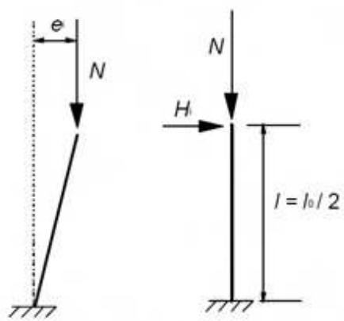
*a1) Sistema libre*

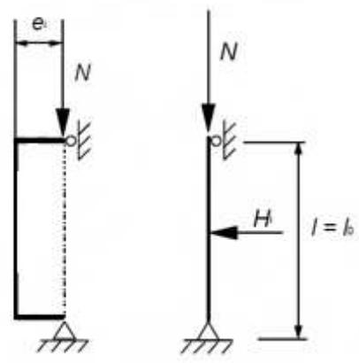
*a2) Sistema arriostrado*

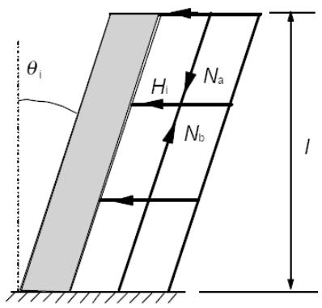
*a) Elementos aislados con carga excéntrica o lateral b) Sistema de arriostramiento*

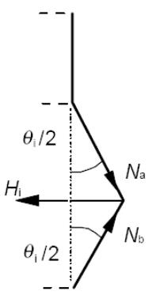
*c1) Diafragma en forjado intermedio*

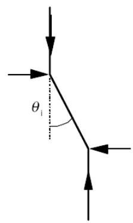
*c2) Diafragma de cubierta Figura A19.5.1 Ejemplos de los efectos de las imperfecciones geométricas*

(8) Para las estructuras, el efecto de la inclinación, $\theta_{i}$ , puede representarse por medio de las fuerzas transversales, que tendrán que incluirse en el análisis junto con el resto de acciones.

Efectos sobre el sistema de arriostramiento, (véase la figura A19.5.1 b):

$$
H _ {i} = \theta_ {i} (\mathrm{N} _ {\mathrm{b}} - \mathrm{N} _ {\mathrm{a}})\tag{5.4}
$$

Efecto sobre el diafragma de planta, (véase la figura A19.5.1 c1):

$$
H _ {i} = \theta_ {i} (\mathrm {N_ {b} - N_ {a}}) / 2\tag{5.5}
$$

Efecto sobre el diafragma de cubierta, (véasela figura A19.5.1 c2):

$$
H _ {i} = \theta_ {i} \mathrm{N}_{\mathrm{a}}\tag{5.6}
$$

Dddonde $N_{a}$ y $N_{b}$ son esfuerzos axiles que contribuyen a $H_{i}$ .

(9) Como alternativa simplificada para muros y pilares aislados en sistemas arriostrados, se puede emplear una excentricidad $e_{i} = l_{0}/400$ para cubrir las imperfecciones de las desviaciones de ejecución normales (véase el apartado 5.2(4)).

Sec. I. Pág. 98331

> cve: BOE-A-2021-13681
Verificable en https://www.boe.es

<!-- pag 48 -->

## 5.3 Modelización de la estructura

## 5.3.1 Modelos estructurales para análisis global

(1) Los elementos de una estructura se clasifican, considerando su naturaleza y función, como vigas, pilares, losas, muros, placas, arcos, láminas, etc. Las reglas para el análisis de los elementos más comunes, así como de las combinaciones de los mismos se indican a continuación.

(2) Para edificación serán de aplicación las disposiciones establecidas entre los puntos (3) y (7).

(3) Una viga es un elemento cuya luz es mayor que 3 veces el canto total de la sección, de lo contrario, será considerada como viga de gran canto.

(4) Una losa es un elemento cuya dimensión mínima del paño es mayor que 5 veces el espesor total de la losa.

(5) Una losa sometida principalmente a cargas uniformemente distribuidas, puede considerarse como unidireccional si cumple alguna de las siguientes condiciones:

\- posee 2 bordes libres (sin sustentación) y prácticamente paralelos, o

\- se trata de la parte central de una losa prácticamente rectangular apoyada en cuatro bordes, cuya relación entre la mayor y la menor luz debe ser mayor que 2.

(6) Las losas nervadas o las reticulares no necesitan ser tratadas como elementos discretos en el cálculo, siempre que el ala o la capa de compresión y los nervios transversales, tengan la rigidez a torsión suficiente. Esto se puede suponer con la condición de que:

\- El espacio entre nervios no sea superior a 1500 mm.

\- El canto del nervio bajo el ala no supere 4 veces su ancho.

\- El canto del ala sea al menos 1/10 de la distancia libre entre nervios o 50 mm, tomándose el mayor de ambos.

\- La separación entre nervios transversales no exceda 10 veces el canto total de la losa.

El espesor mínimo del ala, de 50 mm, puede reducirse a 40 mm si se disponen bloques permanentes entre los nervios.

(7) Un pilar es un elemento cuyo canto es inferior a 4 veces su ancho, y su altura es al menos 3 veces el canto de la sección. Si no cumple estos requisitos, se considerará un muro.

## 5.3.2 Parámetros geométricos

## 5.3.2.1 Ancho eficaz de las alas (para la comprobación de todos los estados límite)

(1) Para vigas en T, el ancho eficaz del ala, sobre el que se suponen unas condiciones uniformes de tensión, dependerá de las dimensiones de ala y alma, del tipo de cargas, de la luz, de las condiciones de apoyo y del armado transversal.

(2) El ancho eficaz del ala, deberá basarse en la distancia $l_{0}$ entre los puntos de momento nulo, que deberán obtenerse a partir de la figura A19.5.2.

Sec. I. Pág. 98332

> cve: BOE-A-2021-13681
Verificable en https://www.boe.es

<!-- pag 49 -->

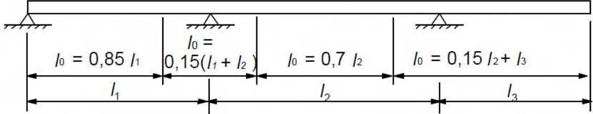
*Figura A19.5.2 Definición de $l_{0}$ para el cálculo del ancho eficaz del ala*

NOTA: La longitud del voladizo $l_{3}$ , debe ser inferior a la mitad del vano adyacente y la relación entre las luces de los vanos adyacentes oscilará entre 2/3 y 3/2.

(3) El ancho eficaz del ala $b_{eff}$ para una viga en T o en L se calculará como:

$$
b _ {e f f} = \sum b _ {e f f, i} + b _ {w} \leq b\tag{5.7}
$$

donde:

$$
b _ {e f f, i} = 0, 2 b _ {i} + 0, 1 l _ {0} \leq 0, 2 l _ {0}\tag{5.7a}
$$

y

$$
b _ {e f f, i} \leq b _ {i}\tag{5.7b}
$$

(Para la notación véanse la figura A19.5.2 y la figura A19.5.3).

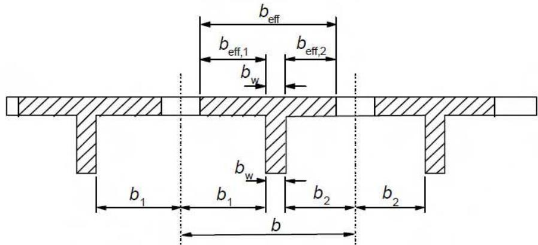
*Figura A19.5.3 Parámetro del ancho eficaz del ala*

(4) En el caso de que no se requiera gran precisión para el cálculo estructural, se puede tomar un ancho constante en todo el vano. Se aplicará el valor correspondiente a la sección del vano.

## 5.3.2.2 Luz efectiva de vigas y losas en edificación

NOTA: Las siguientes disposiciones se establecen principalmente para el cálculo de elementos. Para el cálculo de pórticos, se podrán utilizar algunas de estas simplificaciones cuando sea adecuado.

(1) La luz efectiva $l_{eff}$ de un elemento debe calcularse como:

$$
l _ {e f f} = l _ {n} + a _ {1} + a _ {2}\tag{5.8}
$$

donde:

$$
l _ {n}
$$

es la distancia libre entre las caras de los apoyos,

los valores de $a_{1}$ y $a_{2}$ , en cada extremo del vano, pueden determinarse a partir de los valores apropiados de $a_{i}$ , extraídos de la figura A19.5.4, donde t es el ancho de los elementos de apoyo.

Sec. I. Pág. 98333

> cve: BOE-A-2021-13681
Verificable en https://www.boe.es

<!-- pag 50 -->

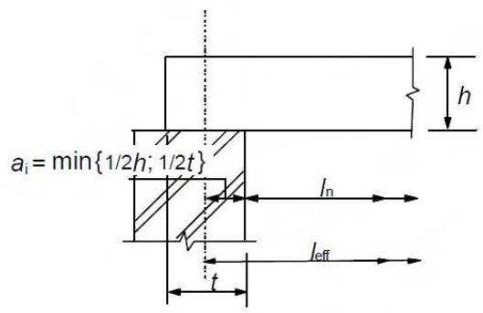
*(a) Elementos no continuos*

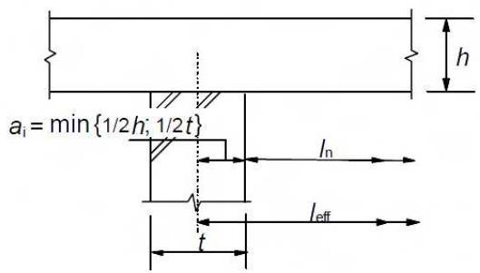
*(b) Elementos continuos*

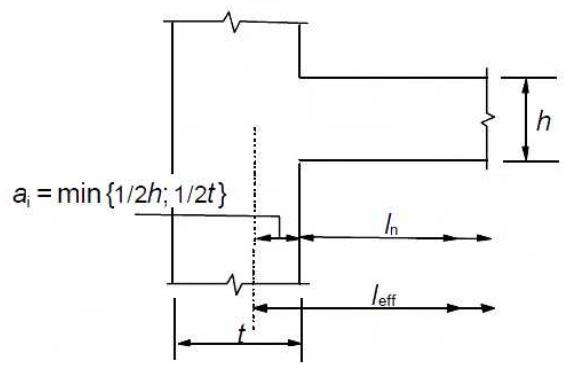
*(c) Apoyo considerado como un empotramiento perfecto*

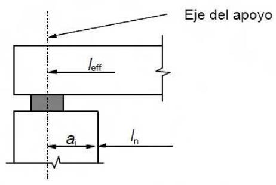

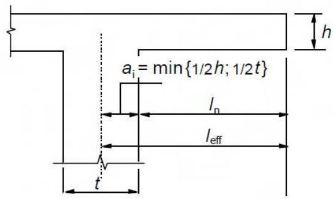
*(d) Disposición de un aparato de apoyo (e) Voladizo Figura A19.5.4 Luz efectiva ( $l_{eff}$ ) para diferentes condiciones de apoyo*

(2) Las losas y vigas continuas pueden calcularse, en general, suponiendo que los apoyos no restringen el giro.

(3) En el caso de vigas o losas monolíticas con sus apoyos, el momento crítico de cálculo en los apoyos debe tomarse igual al existente en la cara del apoyo. El momento de cálculo y las reacciones transferidas al elemento de apoyo (por ejemplo pilares, muros, etc.) deberán tomarse como el mayor entre los valores elásticos y los redistribuidos.

NOTA: El momento en la cara del apoyo no debe ser inferior a 0,65 veces el momento de empotramiento.

(4) Sin tener en cuenta el método de análisis utilizado, para el caso en el que una viga o losa sea continua sobre un apoyo, supuestamente sin coacción al giro (por ejemplo sobre muros), el momento de cálculo del apoyo, calculado para una luz de valor igual a la distancia entre los centros de los apoyos, se puede reducir en una cantidad $\Delta M_{Ed}$ , según establece la siguiente formulación:

Sec. I. Pág. 98334

> cve: BOE-A-2021-13681
Verificable en https://www.boe.es

<!-- pag 51 -->

$$
\Delta M _ {E d} = F _ {E d, s u p} t / 8\tag{5.9}
$$

donde:

$F_{Ed,sup}$ es la reacción de cálculo del apoyo

t es el ancho del soporte (véase la figura A19.5.4 b)).

NOTA: En el caso de utilizar aparatos de apoyo, t deberá tomarse como el ancho del aparato.

## 5.4 Análisis elástico lineal

(1) El cálculo de elementos en los Estados Límite de Servicio y en los Estados Límite Últimos, se puede realizar mediante un análisis basado en la teoría de la elasticidad.

(2) Para determinar los efectos de las acciones, el análisis lineal puede llevarse a cabo suponiendo:

(i) secciones no fisuradas,

(ii) un diagrama de tensión-deformación lineal y

(iii) valor medio del módulo de elasticidad.

(3) Para la evaluación de las acciones térmicas, asientos diferenciales y retracción en Estado Límite Último (ELU), se puede suponer una reducción de la rigidez correspondiente a las secciones fisuradas, despreciando la rigidización de tracción, pero incluyendo los efectos de la fluencia. Para los Estados Límite de Servicio (ELS) se considerará una evolución gradual de la fisuración.

## 5.5 Análisis elástico lineal con redistribución limitada

(1) En todos los aspectos del cálculo se deberá considerar la influencia de cualquier redistribución de momentos que pueda producirse.

(2) El análisis lineal con redistribución limitada se podrá aplicar en el análisis de los elementos estructurales para la comprobación del Estado Límite Último.

(3) El momento calculado en Estado Límite Último utilizando el análisis elástico lineal, puede redistribuirse, siempre que la distribución resultante de momentos permanezca en equilibrio con las cargas aplicadas.

(4) En vigas continuas o losas que:

a) estén principalmente sometidas a flexión, y

b) la relación de las luces de los vanos adyacentes esté comprendida entre 0,5 y 2,

la redistribución de los momentos flectores puede llevarse a cabo sin una comprobación explícita de la capacidad de giro, siempre que:

$$
\delta \geq k _ {1} + k _ {2} x _ {u} / d \quad \text {para} f c k \leq 5 0 N / m m 2\tag{5.10a}
$$

$$
\delta \geq k _ {3} + k _ {4} x _ {u} / d \quad \text {para} f c k > 5 0 N / m m 2\tag{5.10b}
$$

$$
\geq k _ {5} \quad \text {en el caso de utilizar armaduras tipo S o SD (véase tabla 34.2.a)}
$$

$\geq k_{6}$ en el caso de utilizar armadura de tipo T (véase la tabla 34.3). En este caso, los aceros tipo T tendrán que garantizar, además, las siguientes condiciones adicionales: relación fs/fy $\geq 1,05$ , $\varepsilon_{\text{máx}} \geq 2,5$ y las especificaciones a fatiga de la tabla 34.2.b,

Sec. I. Pág. 98335

> cve: BOE-A-2021-13681
Verificable en https://www.boe.es

<!-- pag 52 -->

donde:

$\delta$ es la relación entre el momento redistribuido y el momento flector elástico

$x_{u}$ es la profundidad de la fibra neutra en Estado Límite Último después de la redistribución

d es el canto útil de la sección

$$
k _ {1} = 0, 4 4
$$

$$
k _ {2} = 1, 2 5 (0, 6 + 0, 0 0 1 4 / \varepsilon_ {c u 2})
$$

$$
k _ {3} = 0, 5 4
$$

$$
k _ {4} = 1, 2 5 (0, 6 + 0, 0 0 1 4 / \varepsilon_ {c u 2})
$$

$$
k _ {5} = 0, 7
$$

$$
k _ {6} = 0, 8 \cdot \varepsilon_ {c u 2}
$$

$$
\varepsilon_ {c u 2}
$$

es la deformación ultima cuyo valor se obtendrá de la tabla A19. 3.1.

(5) La redistribución no debe llevarse a cabo en los casos en los que la capacidad de giro no pueda definirse con seguridad (por ejemplo en las esquinas de pórticos pretensados).

(6) Para el cálculo de pilares se usarán los momentos elásticos de la acción de la estructura sin redistribución alguna.

## 5.6 Análisis plástico

## 5.6.1 Generalidades

(1) Los métodos basados en el análisis plástico se usarán únicamente para la comprobación en Estado Límite Último.

(2) La ductilidad de las secciones críticas deberá ser suficiente para que se forme el mecanismo previsto.

(3) El análisis plástico se basará en el método del límite inferior (estático) o en el método del límite superior (cinemático).

(4) En general se podrán ignorar los efectos de aplicaciones previas de carga y suponerse un crecimiento monótono de la intensidad de las acciones.

## 5.6.2 Análisis plástico de vigas, estructuras y losas

(1) Podrá utilizarse el análisis plástico sin comprobación de la capacidad de giro para el Estado Límite Último, siempre que se cumplan las condiciones del apartado 5.6.1(2).

(2) Se considerará que se satisface la ductilidad requerida, sin comprobación alguna, si se cumplen las siguientes condiciones:

i) El área de la armadura de tracción se limita de forma que en cualquier sección:

$$
x_{u} / d\leq 0,25\text{ para } f_{ck}\leq 50\text{ N / mm}^{2}
$$

$$
x_{u} / d\leq 0,15\text{para} f_{\text{ck}}\geq 55\text{N / mm}^{2}
$$

ii) La armadura pasiva es tipo S o SD

iii) La relación de momentos en los apoyos intermedios respecto a los momentos en el vano se encuentran entre 0,5 y 2.

(3) Los pilares se comprobarán utilizando el máximo momento plástico que pueda transmitirse por los elementos de unión. Para las uniones con losas planas, este momento se incluirá en el cálculo de punzonamiento.

Sec. I. Pág. 98336

> cve: BOE-A-2021-13681
Verificable en https://www.boe.es

<!-- pag 53 -->

(4) Cuando se utilice el análisis plástico de losas, deberán tenerse en cuenta cualquier falta de uniformidad de la armadura, las fuerzas de tracción en las esquinas y la torsión en los bordes libres.

(5) El método plástico puede extenderse a losas aligeradas (nervadas, alveoladas, reticulares), si su respuesta es similar al de una losa maciza, especialmente en lo que se refiere a los efectos de la torsión.

## 5.6.3 Capacidad de giro

(1) El procedimiento simplificado para vigas y losas unidireccionales continuas se basa en la capacidad de giro existente en una longitud aproximadamente igual a 1,2 veces el canto de la sección. Se supondrá que estas zonas experimentan una deformación plástica (formación de rótulas plásticas) bajo la combinación de acciones correspondiente. La comprobación del giro plástico en Estado Límite Último se considerará correcta si, bajo la correspondiente combinación de acciones, el giro calculado, $\theta_{s}$ , es menor o igual al giro plástico permitido (véase figura A19.5.5).

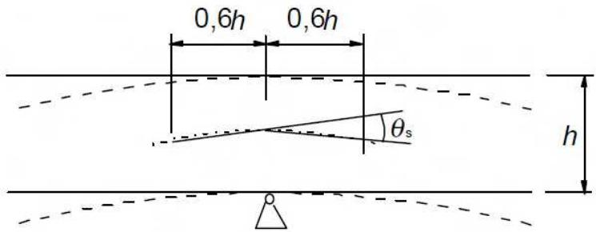
*Figura A19.5.5 Giro plástico $\theta_{s}$ de la sección de hormigón armado para vigas y losas unidireccionales continuas*

(2) En las regiones de rótulas plásticas, $x_{u}/d$ no excederá el valor 0,45 para hormigón con $f_{ck} \leq 50$ N/mm $^{2}$ , y 0,35 para hormigón con $f_{ck} \geq 55$ N/mm $^{2}$ .

(3) El giro $\theta_{s}$ debe determinarse basándose en los valores de cálculo de las acciones y materiales, así como en los valores medios del pretensado en el instante considerado.

(4) En el procedimiento simplificado, el giro plástico permitido puede determinarse multiplicando el valor del giro básico permitido $\theta_{pl,d}$ por un coeficiente de corrección $k_{\lambda}$ que depende de la esbeltez a cortante.

Para los aceros tipo S o SD se adoptan los valores de $\theta_{pl,d}$ , definidos en la figura A19.5.6. Para hormigones con resistencias $f_{ck}$ menores a 50 N/mm $^{2}$ se adoptarán los valores obtenidos de la gráfica correspondiente a $f_{ck}$ 50 N/mm $^{2}$ . En el caso de resistencias comprendidas entre 50 y 90 N/mm $^{2}$ se interpolará linealmente entre las dos gráficas que se presentan en la figura. En el caso de aceros de tipo T, no se podrá aplicar el cálculo plástico.

NOTA: Los valores se aplican para una esbeltez a cortante $\lambda = 3,0$ . Para otros valores de la esbeltez a cortante, $\theta_{\mathrm{pl,d}}$ podrá multiplicarse por $k_{\lambda}$ :

$$
k _ {\lambda} = \sqrt {\lambda / 3}\tag{5.11}
$$

donde λ es la relación entre la distancia comprendida entre los puntos de momento nulo y de momento máximo después de la redistribución y el canto útil, d.

Como simplificación, λ puede calcularse para los valores de cálculo concomitantes de momento flector y esfuerzo cortante:

$$
\lambda = M _ {S d} / (V _ {S d} \cdot d)\tag{5.12}
$$

Sec. I. Pág. 98337

> cve: BOE-A-2021-13681
Verificable en https://www.boe.es

<!-- pag 54 -->

## 5.6.4 Análisis mediante modelos de bielas y tirantes

(1) Los modelos de bielas y tirantes pueden utilizarse para el cálculo en Estado Límite Último de regiones continuas (estado fisurado de vigas y losas, véanse apartados 6.1 a 6.4), así como para el cálculo en Estado Límite Último y la definición de los detalles de armado de las regiones discontinuas (véase apartado 6.5). En general, estas regiones de discontinuidad se extienden hasta una distancia h (canto de la sección del elemento) desde la discontinuidad. Los modelos de bielas y tirantes pueden emplearse en aquellos elementos en los que se suponga una distribución lineal en la sección, por ejemplo, la deformación plana.

(2) Las comprobaciones en Estado Límite de Servicio pueden realizarse también mediante modelos de bielas y tirantes, por ejemplo, para la comprobación de las tensiones del acero y el control de la abertura de fisura, si se asegura una compatibilidad aproximada con estos modelos (en particular la posición y dirección de las bielas principales deberá establecerse de acuerdo con la teoría de la elasticidad lineal).

(3) Los modelos de bielas y tirantes consisten en bielas que representan las zonas de tensiones de compresión, tirantes que representan la armadura, además de los nudos de unión. Las fuerzas de los elementos de un modelo de bielas y tirantes deben determinarse manteniendo el equilibrio con las cargas aplicadas en el Estado Límite Último. Los elementos que conforman este modelo deben dimensionarse de acuerdo con las reglas establecidas en el apartado 6.5.

(4) Los tirantes de un modelo de bielas y tirantes deben coincidir en posición y dirección con la armadura pasiva correspondiente.

(5) Los medios posibles para el desarrollo de modelos adecuados de bielas y tirantes incluyen la adopción de trayectorias de tensiones, así como de las redistribuciones procedentes de la teoría elástico-lineal, o del método del incremento de carga. Todo modelo de bielas y tirantes puede optimizarse mediante la utilización de criterios energéticos.

Sec. I. Pág. 98338

> cve: BOE-A-2021-13681
Verificable en https://www.boe.es

<!-- pag 55 -->

## 5.7 Análisis no lineal

(1) Los métodos de análisis no lineal pueden utilizarse tanto para Estado Límite Último como para Estado Límite de Servicio, siempre que se cumpla el equilibrio y la compatibilidad, además de suponer un comportamiento no lineal adecuado de los materiales. El análisis puede ser de primer o de segundo orden.

(2) En el Estado Límite Último debe comprobarse la capacidad de las secciones críticas para resistir cualquier deformación anelástica derivada del cálculo teniendo en cuenta las incertidumbres de manera apropiada.

(3) En general, se pueden despreciar los efectos de aplicaciones previas de carga en estructuras sometidas a cargas estáticas pudiendo suponerse un incremento monótono de la intensidad de las acciones.

(4) Si se realiza un análisis no lineal deben emplearse las características del material que representan la rigidez de forma realista, pero que tengan en cuenta las incertidumbres de fallo. Solo se emplearán los formatos de cálculo válidos dentro del correspondiente campo de aplicación.

(5) En estructuras esbeltas, en las que no pueden despreciarse los efectos de segundo orden, se podrá utilizar el método de cálculo establecido en el apartado 5.8.6.

## 5.8 Análisis de los efectos de segundo orden con esfuerzo axil

## 5.8.1 Definiciones

Flexión esviada: flexión simultánea sobre dos ejes principales.

Elementos o sistemas arriostrados: elementos estructurales o subsistemas que, en el análisis y en el cálculo, se supone que no contribuyen a la estabilidad horizontal global de la estructura.

Elementos o sistemas de arriostramiento: elementos estructurales o subsistemas que, en el análisis y en el cálculo, se supone que contribuyen a la estabilidad horizontal global de la estructura.

Pandeo: fallo debido a la inestabilidad de un elemento o estructura sometido a compresión simple y sin carga transversal.

NOTA: El “pandeo puro” no es un estado límite relevante en las estructuras reales debido a las imperfecciones y a las cargas transversales, pero en algunos métodos puede emplearse como parámetro una carga nominal de pandeo para el análisis de segundo orden.

Carga de pandeo: carga que origina el pandeo. Para el caso de elementos elásticos aislados, es sinónimo de la carga crítica de Euler.

Longitud efectiva: Es la longitud utilizada para tener en cuenta la forma de la curva de desplazamiento del elemento, pudiéndose definir también como la longitud de pandeo, es decir, la longitud de un pilar biarticulado sometido a un esfuerzo normal constante, con la misma sección y carga de pandeo que el elemento real.

Efectos de primer orden: efectos de las acciones sin considerar el efecto de la deformación estructural, pero incluyendo las imperfecciones geométricas.

Elementos aislados: elementos que se encuentra aislados, o elementos de una estructura que se toman como aislados por razones de cálculo. La figura A19.5.7 muestra ejemplos de elementos aislados con diferentes condiciones de apoyo.

Momento nominal hiperestático: momento de segundo orden empleado en determinados métodos de cálculo, proporcionando un momento total compatible con la resistencia última de la sección (véase el apartado 5.8.5(2)).

Efectos de segundo orden: efectos adicionales causados por las deformaciones estructurales.

Sec. I. Pág. 98339

> cve: BOE-A-2021-13681
Verificable en https://www.boe.es

<!-- pag 56 -->

## 5.8.2 Generalidades

(1) Este apartado se refiere a elementos y estructuras en los que el comportamiento estructural se ve influido, de forma significativa, por efectos de segundo orden (por ejemplo pilares, muros, arcos y láminas). En estructuras con un sistema de arriostramiento elástico se pueden producir efectos globales de segundo orden.

(2) En el caso de que se tengan en cuenta los efectos de segundo orden, véase el punto (6), el equilibrio y la resistencia deben comprobarse en el estado deformado. Las deformaciones deben calcularse teniendo en cuenta los efectos correspondientes de fisuración, las propiedades no lineales de los materiales y la fluencia.

NOTA: En un análisis que suponga propiedades lineales de los materiales, esto puede tenerse en cuenta mediante la reducción de los valores de la rigidez, véase el apartado 5.8.7.

(3) Donde corresponda, el análisis deberá incluir los efectos de la flexibilidad de los elementos adyacentes y de las cimentaciones (interacción terreno-estructura).

(4) Debe considerarse el comportamiento estructural en la dirección en la que puedan producirse deformaciones y tener en cuenta la flexión esviada cuando sea necesario.

(5) Las incertidumbres en la geometría y posición de las cargas normales (axiles) se tendrán en cuenta como un efecto adicional de primer orden basado en las imperfecciones geométricas, véase el apartado 5.2.

(6) Los efectos de segundo orden pueden ignorarse si son inferiores al 10% de los efectos de primer orden correspondientes. En el apartado 5.8.3.1 se establece un criterio de simplificación para elementos aislados y en el apartado 5.8.3.3 para las estructuras.

## 5.8.3 Criterios de simplificación para los efectos de segundo orden

## 5.8.3.1 Criterio de esbeltez para elementos aislados

(1) Como alternativa al apartado 5.8.2(6) los efectos de segundo orden pueden ignorarse si la esbeltez $\lambda$ (como se define en el apartado 5.8.3.2) se encuentra por debajo del valor $\lambda_{lim}$ :

$$
\lambda_ {l i m} = 2 0 \cdot A \cdot B \cdot C / \sqrt {\mathrm{n}}\tag{5.13}
$$

donde:

$A = 1 / (1 + 0,2\varphi_{ef})$ (si $\varphi_{ef}$ no es conocido, se puede usar $A = 0,7$ )

$B = 1 + \sqrt{1 + 2\omega}$ (si $\omega$ no es conocido, se puede usar B=1,1)

C = 1,7 - $r_{m}$ (si $r_{m}$ no es conocido, se puede usar C=0,7)

$\varphi_{ef}$ = coeficiente de fluencia eficaz, véase el apartado 5.8.4

$\omega = A_{s}f_{yd} / (A_{c}f_{cd})$ ; cuantía mecánica de la armadura

$A_{s}$ = es el área total de la armadura pasiva longitudinal

$n = N_{Ed} / (A_{c}f_{cd})$ ; esfuerzo axil relativo

$r_{m} = M_{01} / M_{02};\text{relación entre momentos}$

$M_{01}, M_{02}$ son los momentos de empotramiento de primer orden, $|M_{02}| \geq |M_{01}|$ .

Si los momentos de empotramiento $M_{01}$ y $M_{02}$ producen tracciones en el mismo lado, $r_{m}$ se debería tomar como positivo (es decir $C \leq 1,7$ ), en otro caso como negativo (es decir C > 1,7).

Sec. I. Pág. 98340

> cve: BOE-A-2021-13681
Verificable en https://www.boe.es

<!-- pag 57 -->

En los siguientes casos, $r_{m}$ se debería tomar como 1,0 (es decir C = 0,7):

\- para elementos arriostrados en los cuales los momentos de primer orden surgen solo o predominantemente debido a imperfecciones o cargas transversales,

\- para elementos sin arriostrar en general.

(2) En los casos de flexión esviada, el criterio de esbeltez puede comprobarse por separado para cada dirección. Dependiendo de los resultados, los efectos de segundo orden (a) pueden despreciarse en ambas direcciones, (b) deben tenerse en cuenta en una dirección, o (c), deben tenerse en cuenta en ambas direcciones.

## 5.8.3.2 Esbeltez y longitud efectiva de elementos aislados

(1) La esbeltez se define como:

$$
\lambda = l_0 / i\tag{5.14}
$$

donde:

$$
l _ {0}
$$

es la longitud efectiva, véase del apartado 5.8.3.2(2) al 5.8.3.2(7)

es el radio de giro de la sección de hormigón no fisurada.

(2) Para la definición general de la longitud efectiva, véase el apartado 5.8.1. Los ejemplos de longitud efectiva, para elementos aislados con sección constante, se recogen en la figura A19.5.7.

(3) En elementos comprimidos en pórticos, el criterio de esbeltez (véase el apartado 5.8.3.1) debe comprobarse con una longitud efectiva $l_{0}$ determinada de la siguiente manera:

Elementos arriostrados (véase figura A19.5.7(f)):

$$
l _ {0} = 0, 5 l \cdot \sqrt {\left(1 + \frac {k _ {1}}{0 , 4 5 + k _ {1}}\right) \cdot \left(1 + \frac {k _ {2}}{0 , 4 5 + k _ {2}}\right)}\tag{5.15}
$$

Elementos no arriostrados (véase figura A19.5.7(g)):

$$
l _ {0} = l \cdot m a x \left\{\sqrt {1 + 1 0 \cdot \frac {k _ {1} \cdot k _ {2}}{k _ {1} + k _ {2}}}; \left(1 + \frac {k _ {1}}{1 + k _ {1}}\right) \cdot \left(1 + \frac {k _ {2}}{1 + k _ {2}}\right) \right\}\tag{5.16}
$$

donde:

$k_{1}$ y $k_{2}$ flexibilidades relativas de las coacciones al giro en los extremos 1 y 2 respectivamente:

$$
k \quad = (\theta / M) \cdot (E I / l)
$$

Sec. I. Pág. 98341

> cve: BOE-A-2021-13681
Verificable en https://www.boe.es

<!-- pag 58 -->

θ es el giro de los elementos coaccionados para el momento flector M (véanse también las figuras (5.7) f) y g))

EI es la rigidez a flexión de un elemento comprimido, véanse también los apartados 5.8.3.2 (4) y (5)

l es la altura libre entre coacciones extremas del elemento de compresión.

NOTA: k = 0 es el límite teórico para coacciones rígidas al giro, mientras $k = \infty$ representa el límite para el caso de no existir coacciones. Dado que en la práctica la coacción completa de la rigidez es difícil de encontrar, se recomienda un valor mínimo de 0,1 para $k_{1}$ y $k_{2}$ .

(4) Si en un nudo un elemento comprimido (pilar) adyacente puede contribuir al giro durante el pandeo pandeo, entonces) en la definición de $k$ ( $EI/l$ ) debe reemplazarse por $[(EI/l)_a + (EI/l)_b]$ , donde a y b representan el elemento comprimido por encima y por debajo del nudo.

(5) En la definición de la longitud efectiva, la rigidez de los elementos de coacción debe incluir el efecto de la fisuración, a menos que en Estado Límite Último se puedan presentar sin fisuras.

(6) Para casos distintos de los definidos en los puntos (2) y (3), como por ejemplo elementos con esfuerzos normales y/o sección variable, el criterio establecido en el apartado 5.8.3.1 debe comprobarse para una longitud efectiva basada en la carga de pandeo (calculado, por ejemplo, mediante un método numérico):

$$
l _ {0} = \pi \sqrt {E I / N _ {B}}\tag{5.17}
$$

donde:

EI es la rigidez a flexión representativa

$N_{B}$ es la carga de pandeo expresada en términos de esta rigidez EI, (en la expresión 5.14). De igual manera, i debe corresponderse con esta rigidez EI.

(7) Los efectos de coacción de los muros transversales puede tenerse en cuenta, para el cálculo de la longitud efectiva de los muros, mediante el coeficiente $\beta$ , establecido en el apartado 12.6.5.1. Para ello, en la expresión (12.9) y en la tabla A19.12.1, se sustituirá $l_{w}$ por $l_{0}$ , determinada de acuerdo con el apartado 5.8.3.2.

## 5.8.3.3 Efectos globales de segundo orden en edificación

(1) Como alternativa al apartado 5.8.2(6), los efectos de segundo orden pueden despreciarse en edificación si:

$$
F _ {V, E d} \leq k _ {1} \cdot \frac {n _ {s}}{n _ {s} + 1 , 6} \cdot \frac {\sum E _ {c d} I _ {c}}{L ^ {2}}\tag{5.18}
$$

donde:

$F_{V,Ed}$ es la carga vertical total (en elementos arriostrados y en elementos de arriostramiento)

$n_{s}$ es el número de plantas

L es la altura total del edificio sobre el nivel de coacción del momento

$E_{cd}$ es el valor de cálculo del módulo de elasticidad del hormigón, véase el apartado 5.8.6(3)

$$
k _ {1} = 0, 3 1
$$

$I_{c}$ es el momento de inercia (de la sección no fisurada de hormigón) del elemento de arriostramiento

Sec. I. Pág. 98342

> cve: BOE-A-2021-13681
Verificable en https://www.boe.es

<!-- pag 59 -->

La expresión (5.18) es válida únicamente si se cumplen todas las condiciones siguientes:

\- La inestabilidad a torsión no es predominante, es decir, la estructura es razonablemente simétrica,

\- Las deformaciones globales por cortante son despreciables (como en un sistema de arriostramiento que consiste principalmente en muros sin grandes aberturas),

\- Los elementos de arriostramiento estén fijados de forma rígida a la base, es decir, los giros son despreciables,

\- La rigidez de los elementos de arriostramiento es aproximadamente constante a lo largo de su altura.

\- El incremento de la carga vertical total es similar en cada una de las plantas.

(2) En la expresión (5.18), $k_{1}$ puede adoptar el valor de 0,62. si se puede verificar que los elementos de arriostramiento no están fisurados en el Estado Límite Último.

NOTA 1: Para los casos en los que el sistema de arriostramiento tenga deformaciones globales de cortante y/o giros en los extremos significativos, véase el Apéndice H (que también establece el marco para las reglas descritas anteriormente).

## 5.8.4 Fluencia

(1) En el análisis de segundo orden deberá tenerse en cuenta el efecto de la fluencia, considerando en la combinación de cargas que se analiza las condiciones generales de la fluencia (véase el apartado 3.1.4) y la duración de las diferentes cargas.

(2) La duración de las cargas se podrá tener en cuenta de forma simplificada, mediante un coeficiente de fluencia efectivo, $\varphi_{ef}$ , que, utilizado de forma conjunta con las cargas de proyecto, proporciona la deformación de fluencia (curvatura) correspondiente a cargas cuasi-permanentes.

$$
\varphi_ {e f} = \varphi (\infty , t _ {0}) \cdot M _ {0 E q p} / M _ {0 E d}\tag{5.19}
$$

donde:

$\varphi(\infty, t_{0})$ es el coeficiente de fluencia a tiempo infinito de acuerdo con el apartado 3.1.4

$M_{0Eqp}$ es el momento flector de primer orden en la combinación cuasi-permanente (Estado Límite de Servicio)

$M_{0Ed}$ es el momento flector de primer orden en la combinación de cálculo (Estado Límite Último).

NOTA: También es posible definir $\varphi_{ef}$ a partir de los momentos flectores $M_{Eqp}$ y $M_{Ed}$ , pero esto requiere la iteración y comprobación de la estabilidad, bajo cargas cuasi-permanentes con $\varphi_{ef} = \varphi(\infty, t_{0})$ .

(3) Si en un elemento de la estructura, el cociente $M_{0Eqp}/M_{0Ed}$ varía, dicha relación se puede calcular para la sección de momento máximo, o puede emplearse un valor medio representativo.

(4) El efecto de la fluencia puede ignorarse, es decir, se puede suponer $\varphi_{ef} = 0$ , si se cumplen las tres condiciones siguientes:

$$
- \varphi (\infty , t _ {0}) \leq 2
$$

$$
- \lambda \leq 7 5
$$

$$
- M _ {0 E d} / N _ {E d} \geq h
$$

Aquí $M_{0Ed}$ es el momento de primer orden y h es el canto de la sección en la dirección correspondiente.

NOTA: Si las condiciones para despreciar los efectos de segundo orden, de acuerdo con el apartado 5.8.2(6) o 5.8.3.3, se cumplen de manera muy ajustada, es muy poco conservador despreciar los efectos de segundo orden o la fluencia, a menos que la cuantía mecánica ( $\omega$ , véase el apartado 5.8.3.1(1)) sea como mínimo 0,25.

Sec. I. Pág. 98343

> cve: BOE-A-2021-13681
Verificable en https://www.boe.es

<!-- pag 60 -->

## 5.8.5 Métodos de cálculo

(1) Los métodos de cálculo incluyen un método general, basado en el análisis no lineal de segundo orden (véase el apartado 5.8.6) y en los dos métodos simplificados siguientes, pudiendo emplearse cualquiera de los dos:

(a) Método basado en la rigidez nominal, véase el apartado 5.8.7.

(b) Método basado en la curvatura nominal, véase el apartado 5.8.8.

NOTA: Los momentos nominales de segundo orden, proporcionados por los métodos simplificados (a) y (b), son, a veces, mayores que los momentos correspondientes a la inestabilidad. Esto es así para asegurar que el momento total sea compatible con la resistencia de la sección.

(2) El método (a) puede utilizarse para elementos aislados y para estructuras completas, si los valores de la rigidez nominal se estiman de forma apropiada; véase el apartado 5.8.7.

(3) El método (b) es más adecuado para elementos aislados; véase 5.8.8, pudiéndose emplear también para estructuras completas si se utilizan hipótesis realistas de la distribución de la curvatura.

## 5.8.6 Método general

(1) El método general se basa en el análisis no lineal, incluyendo la no linealidad de la geometría, es decir, los efectos de segundo orden. Se aplicarán las reglas generales para el análisis no lineal establecidas en el apartado 5.7.

(2) Se deberán utilizar los diagramas tensión-deformación adecuados para hormigón y acero, y tener en cuenta el efecto de la fluencia.

(3) Podrán utilizarse los diagramas tensión-deformación para hormigón del apartado 3.1.5, y en la expresión (3.14) y del acero en la figura A19.3.8 del apartado 3.2.7. Con diagramas tensión-deformación basados en valores de cálculo, el valor de cálculo de la carga última se obtiene directamente del análisis. En el valor de k de la expresión (3.14) se sustituye $f_{cm}$ por la resistencia a compresión de cálculo $f_{cd}$ y $E_{cm}$ por $E_{cd} = E_{cm} / \gamma_{CE}$ , tomando $\gamma_{CE} = 1, 2$ .

(4) En ausencia de modelos más precisos, puede tenerse en cuenta la fluencia multiplicando todos los valores de deformación del diagrama tensión-deformación del hormigón, de acuerdo con 5.8.6(3), por un coeficiente $(1 + \varphi_{ef})$ , donde $\varphi_{ef}$ es el coeficiente de fluencia efectivo de acuerdo con el apartado 5.8.4.

(5) Debe tenerse en cuenta el efecto favorable de la rigidez a tracción.

NOTA: Este efecto es favorable y, por simplicidad, puede ignorarse siempre.

(6) Normalmente, las condiciones de equilibrio y de compatibilidad de las deformaciones se cumplen en varias secciones. Una alternativa simplificada es considerar únicamente la sección o secciones críticas, así como una variación apropiada de la curvatura entre estas secciones, por ejemplo, similar al momento de primer orden u otro tipo de simplificacion adecuada.

## 5.8.7 Método basado en la rigidez nominal

## 5.8.7.1 Generalidades

(1) En un análisis de segundo orden basado en la rigidez, deben utilizarse los valores nominales de la rigidez a flexión, teniendo en cuenta los efectos de la fisuración, la no linealidad de los materiales y la fluencia sobre el comportamiento global. Esto también se aplica a los elementos adyacentes que intervienen en el análisis, como es el caso de vigas, losas y cimentaciones. Cuando corresponda, deberá tenerse en cuenta la interacción terreno-estructura.

Sec. I. Pág. 98344

> cve: BOE-A-2021-13681
Verificable en https://www.boe.es

<!-- pag 61 -->

(2) El momento de cálculo resultante se emplea para el dimensionamiento de las secciones con respecto al momento flector y al esfuerzo axil, siguiendo lo establecido en 6.1, en comparación con el apartado 5.8.5(1).

## 5.8.7.2 Rigidez nominal

(1) Para estimar la rigidez nominal de los elementos esbeltos comprimidos con sección transversal arbitraria deberá emplearse el siguiente modelo:

$$
E I = K _ {c} E _ {c d} I _ {c} + K _ {s} E _ {s} I _ {s}\tag{5.21}
$$

donde:

$E_{cd}$ es el valor de cálculo del módulo de elasticidad del hormigón, véase el apartado 5.8.6(3)

$I_{c}$ es el momento de inercia de la sección de hormigón

$E_{s}$ es el valor de cálculo del módulo de elasticidad de la armadura, véase el apartado 5.8.6(3)

$I_{s}$ es el momento de inercia de la sección de armadura, respecto al centro del área de hormigón

$K_{c}$ es el coeficiente que tiene en cuenta los efectos de fisuración, fluencia, etc., véase el apartado 5.8.7.2(2) o (3)

$K_{s}$ es el coeficiente que tiene en cuenta la contribución de la armadura, véase el apartado 5.8.7.2(2) o (3).

(2) En la expresión (5.21) pueden utilizarse los siguientes coeficientes, siempre que $\rho \geq 0,002$ :

$$
K _ {s} = 1
$$

$$
K _ {c} = k _ {1} k _ {2} / (1 + \varphi_ {e f})\tag{5.22}
$$

donde:

$\rho$ es la cuantía geométrica de armadura, $A_{s}/A_{c}$

$A_{s}$ es el área total de armadura

$A_{c}$ es el área de la sección de hormigón

$\varphi_{ef}$ es el coeficiente de fluencia efectivo, véase el apartado 5.8.4

$k_{1}$ es un coeficiente que depende la resistencia del hormigón $f_{ck}$ (expresión (5.23))

$k_{2}$ es un coeficiente que depende del esfuerzo axil y la esbeltez (expresión (5.24)).

$$
k _ {1} = \sqrt {f _ {c k} / 2 0} (N / m m ^ {2})
$$

$$
k _ {2} = n \cdot \frac {\lambda}{1 7 0} \leq 0, 2 0\tag{5.23}
$$

(5.24)

donde:

n es el axil reducido, $N_{Ed}/(A_{c} f_{cd})$

$\lambda$ es la esbeltez, véase el apartado 5.8.3

Si la esbeltez λ no está definida puede tomarse $k_{2}$ como:

$$
k _ {2} = n \cdot 0, 3 0 \leq 0, 2 0\tag{5.25}
$$

Sec. I. Pág. 98345

> cve: BOE-A-2021-13681
Verificable en https://www.boe.es

<!-- pag 62 -->

(3) Como alternativa simplificada, siempre que $\rho \geq 0,01$ , se utilizarán los siguientes coeficientes en la expresión (5.21):

$$
\begin{array}{l} {K _ {s} = 0} \\ {K _ {c} = 0, 3 / (1 + 0, 5 \varphi_ {e f})} \end{array}\tag{5.26}
$$

NOTA: La alternativa simplificada puede ser adecuada como paso preliminar para lograr un cálculo de mayor precisión de acuerdo con (2).

(4) En estructuras hiperestáticas, deben tenerse en cuenta los efectos desfavorables de la fisuración en los elementos adyacentes. Las expresiones (5.21 a 5.26) no son, por lo general, aplicables a estos elementos. Se podrán tener en cuenta la fisuración parcial y la rigidez a tracción del hormigón, por ejemplo de acuerdo con el apartado 7.4.3. Sin embargo, como simplificación, se puede admitir que las secciones están completamente fisuradas. La rigidez deberá basarse en un módulo efectivo del hormigón:

$$
E _ {c d, e f f} = E _ {c d} / (1 + \varphi_ {e f})\tag{5.27}
$$

donde:

$E_{cd}$ es el valor de cálculo del módulo de elasticidad de acuerdo con el apartado 5.8.6(3) $\varphi_{ef}$ es el coeficiente de fluencia efectivo, pudiendo emplearse el mismo valor que en pilares.

## 5.8.7.3 Coeficiente de mayoración de momentos

(1) El momento total de cálculo, incluido el momento de segundo orden, puede expresarse como un aumento de los momentos flectores resultantes de un análisis de primer orden, es decir:

$$
M _ {E d} = M _ {0 E d} \left[ 1 + \frac {\beta}{(N _ {B} / N _ {E d}) - 1} \right]\tag{5.28}
$$

donde:

$M_{0Ed}$ es el momento de primer orden, véase también el apartado 5.8.8.2(2)

β es un coeficiente que depende de la distribución de los momentos de primer y de segundo orden, véase los apartados 5.8.7.3(2) y (3)

$$
N _ {E d} \quad \text {es el valor de cálculo del esfuerzo axil}
$$

$$
N _ {B} \quad \text {es la carga de pandeo basada en la rigidez nominal.}
$$

(2) Para elementos aislados, con sección constante y carga axil, puede suponerse que el momento de segundo orden sigue una distribución sinusoidal.

$$
\beta = \pi^2 /c_0\tag{5.29}
$$

donde:

$c_{0}$ es un coeficiente que depende de la distribución del momento de primer orden (por ejemplo $c_{0}=8$ para una distribución constante, $c_{0}=9,6$ para una distribución parabólica y 12 para una distribución triangular simétrica, etc.).

(3) Para elementos sin carga transversal, los momentos extremos de primer orden $M_{01}$ y $M_{02}$ pueden sustituirse por un momento de primer orden equivalente y constante $M_{0e}$ , de acuerdo con el apartado 5.8.8.2(2). Siguiendo esta hipótesis de momento constante, deberá disponerse $c_{0} = 8$ .

NOTA: El valor de $c_{0}=8$ también es aplicable a elementos doblados con una doble curvatura. Debe indicarse que, en ciertos casos, dependiendo de la esbeltez y del esfuerzo axil, los momentos extremos pueden ser mayores que los momentos equivalentes mayorados.

Sec. I. Pág. 98346

> cve: BOE-A-2021-13681
Verificable en https://www.boe.es

<!-- pag 63 -->

(4) Donde no sean de aplicación los apartados 5.8.7.3(2) o (3), $\beta = 1$ es generalmente una simplificación razonable. La expresión (5.28) se puede reducir a la siguiente:

$$
M _ {E d} = \frac {M _ {0 E d}}{1 - (N _ {E d} / N _ {B})}\tag{5.30}
$$

NOTA: 5.8.7.3(4) es también aplicable al análisis global de ciertos tipos de estructuras, por ejemplo, estructuras arriostradas por pantallas de rigidización y similares, donde la acción principal es el momento flector en los elementos de arriostramiento. Para otros tipos de estructuras, se establece una aproximación más general en el apartado H.2 del Apéndice H.

## 5.8.8 Método basado en la curvatura nominal

## 5.8.8.1 Generalidades

(1) Este método es adecuado sobre todo para elementos aislados con esfuerzo normal constante y una longitud efectiva definida $l_{0}$ (véase el apartado 5.8.3.2). El método establece un momento nominal de segundo orden basado en una deformación, que a su vez se basa en la longitud efectiva y en la máxima curvatura estimada (véase también el apartado 5.8.5(3)).

(2) El momento de cálculo resultante se utiliza para el dimensionamiento de secciones, con respecto al momento flector y al esfuerzo axil, de acuerdo con lo establecido en el apartado 6.1.

## 5.8.8.2 Momentos flectores

(1) El momento de cálculo es:

$$
M _ {E d} = M _ {0 E d} + M _ {2}\tag{5.31}
$$

donde:

$M_{0Ed}$ es el momento de primer orden, incluyendo el efecto de las imperfecciones, véase también el apartado 5.8.8.2(2)

$M_{2}$ es el momento nominal de segundo orden, véase el apartado 5.8.8.2(3).

El valor máximo de $M_{Ed}$ se establece mediante las distribuciones de $M_{0Ed}$ y $M_{2}$ ; esta última, puede tomarse como distribución parabólica o sinusoidal respecto a la longitud efectiva.

NOTA: Para elementos hiperestáticos, $M_{0Ed}$ se determina para las condiciones de contorno reales, mientras $M_{2}$ dependerá de las condiciones de contorno a través de la longitud efectiva del apartado 5.8.8.1(1).

(2) En el caso de elementos sin cargas aplicadas en sus extremos, los momentos extremos de primer orden, $M_{01}$ y $M_{02}$ , pueden sustituirse por un momento equivalente de primer orden $M_{0e}$ :

$$
M _ {0 e} = 0, 6 M _ {0 2} + 0, 4 M _ {0 1} \geq 0, 4 M _ {0 2}\tag{5.32}
$$

Si $M_{01}$ y $M_{02}$ dan lugar a tensiones en el mismo lado de la sección, deben tener el mismo signo, en caso contrario, tendrán signos opuestos. Además, $|M_{02}| \geq |M_{01}|$ .

(3) El momento nominal de segundo orden en la expresión (5.31) es:

$$
M _ {2} = N _ {E d} e _ {2}\tag{5.33}
$$

donde:

$$
N _ {E d} \quad \text {es el valor de cálculo del esfuerzo axil}
$$

$$
e _ {2} \quad \text {es la flecha} = (1 / r) l _ {0} ^ {2} / c
$$

1/r es la curvatura, véase el apartado 5.8.8.3

$l_{0}$ es la longitud efectiva, véase el apartado 5.8.3.2

c es un coeficiente que depende de la distribución de la curvatura, véase el apartado 5.8.8.2(4).

Sec. I. Pág. 98347

> cve: BOE-A-2021-13681
Verificable en https://www.boe.es

<!-- pag 64 -->

(4) Para sección constante, es habitual la utilización de $c = 10(\approx \pi^{2})$ . Si el momento de primer orden es constante, debe considerarse un valor inferior (8 es el límite inferior correspondiente a un momento total constante).

NOTA: El valor $\pi^{2}$ corresponde a una distribución sinusoidal de la curvatura. Para curvatura constante el valor será 8. Debe observarse que c depende de la distribución total de la curvatura, mientras $c_{0}$ en el apartado 5.8.7.3(2) depende únicamente de la curvatura correspondiente al momento de primer orden.

## 5.8.8.3 Curvatura

(1) Para elementos con sección simétrica constante (incluida la armadura), se emplea la siguiente expresión:

$$
1 / r = K _ {r} \cdot K _ {\varphi} \cdot 1 / r _ {0}\tag{5.34}
$$

donde:

$K_{r}$ es un coeficiente de corrección que depende de la carga normal, véase el apartado 5.8.8.3(3),

$K_{\varphi}$ es un coeficiente que tiene en cuenta la fluencia, véase el apartado 5.8.8.3(4),

$$
1 / r _ {0} = \varepsilon_ {y d} / (0, 4 5 d)
$$

$$
\varepsilon_ {y d} = f _ {y d} / E _ {s}
$$

$$
d
$$

canto útil, véase también el apartado 5.8.8.3(2).

(2) Si la totalidad de la armadura no está concentrada en lados opuestos, sino que una parte está distribuida de forma paralela al plano de flexión, d se define como:

$$
d = (h / 2) + i _ {s}\tag{5.35}
$$

donde $i_{s}$ es el radio de giro del área total de armadura.

(3) $K_{r}$ , en la expresión (5.34), deberá tomarse como:

$$
K _ {r} = (n _ {u} - n) / (n _ {u} - n _ {b a l}) \leq 1\tag{5.36}
$$

donde:

$n = N_{Ed} / (A_{c}f_{cd})$ , es el axil reducido

$N_{Ed}$ es el valor de cálculo del esfuerzo axil

$$
n _ {u} = 1 + \omega
$$

$n_{bal}$ es el valor de n utilizando el momento máximo resistente; puede emplearse el valor 0,4

$$
\omega = A _ {s} f _ {y d} / (A _ {c} f _ {c d})
$$

$A_{s}$ es el área total de armadura

$A_{c}$ es el área de la sección de hormigón.

(4) Debe tenerse en cuenta el efecto de la fluencia mediante el siguiente coeficiente:

$$
K _ {\varphi} = 1 + \beta \varphi_ {e f} \geq 1\tag{5.37}
$$

donde:

$\varphi_{ef}$ es el coeficiente de fluencia efectivo, véase el apartado 5.8.4

$$
\beta = 0, 3 5 + f _ {c k} / 2 0 0 - \lambda / 1 5 0
$$

$\lambda$ es la esbeltez, véase el apartado 5.8.3.2.

Sec. I. Pág. 98348

> cve: BOE-A-2021-13681
Verificable en https://www.boe.es

<!-- pag 65 -->

## 5.8.9 Flexión esviada

(1) El método general descrito en el apartado 5.8.6 puede utilizarse también para la flexión esviada. Las siguientes disposiciones se aplican al utilizar métodos simplificados. Se debe tener especial cuidado a la hora de identificar la sección a lo largo del elemento con la combinación crítica de momentos.

(2) Como primer paso, debe realizarse un cálculo independiente en cada dirección principal sin tener en cuenta la flexión esviada, Únicamente habrá que tener en cuenta las imperfecciones en la dirección en la que se vaya a producir el efecto más desfavorable.

(3) No son necesarias comprobaciones adicionales si los coeficientes de esbeltez cumplen las dos condiciones siguientes:

$$
\lambda_ {y} / \lambda_ {z} \leq 2 \texttt {y} \lambda_ {z} / \lambda_ {y} \leq 2\tag{5.38a}
$$

y si las excentricidades relativas $e_{y}/h_{eq}$ y $e_{z}/b_{eq}$ (véase la figura A19.5.8) cumplen una de las siguientes condiciones:

$$
\frac {e _ {y} / h _ {e q}}{e _ {z} / b _ {e q}} \leq 0, 2 \text {ó} \frac {e _ {z} / b _ {e q}}{e _ {y} / h _ {e q}} \leq 0, 2\tag{5.38b}
$$

donde:

son el ancho y el canto de la sección

$$
b _ {e q} = i _ {y} \cdot \sqrt {1 2} \text {y} h _ {e q} = i _ {z} \cdot \sqrt {1 2} \text {para una sección rectangular equivalente}
$$

$\lambda_{y}, \lambda_{z}$ son los coeficientes de esbeltez $l_{0}/i$ con respecto a los ejes y y z respectivamente

$i_{y}, i_{z}$ son los radios de giro con respecto a los ejes y y z, respectivamente

$e_{z}=M_{Edy}/N_{Ed}$ es la excentricidad a lo largo del eje z

$e_y = M_{Edz} / N_{Ed}$ es la excentricidad a lo largo del eje y

$M_{Edy}$ es el momento de cálculo sobre el eje y, incluyendo el momento de segundo orden

$M_{Edz}$ es el momento de cálculo sobre el eje z, incluyendo el momento de segundo orden

$N_{Ed}$ es el valor de cálculo del esfuerzo axil con la combinación de cargas correspondiente.

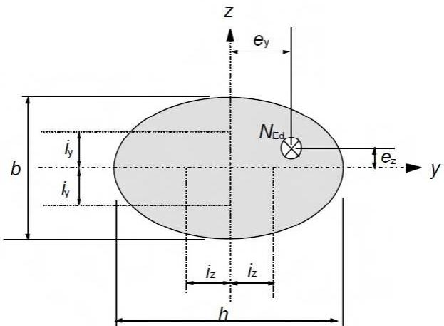
*Figura A19.5.8 Definición de las excentricidades $e_{y}$ y $e_{z}$*

Sec. I. Pág. 98349

> cve: BOE-A-2021-13681
Verificable en https://www.boe.es

<!-- pag 66 -->

(4) Si no se cumple la condición de la expresión (5.38), la flexión esviada debe tenerse en cuenta incluyendo los efectos de segundo orden en cada dirección (salvo que puedan ignorarse de acuerdo con lo establecido en el apartado 5.8.2(6) o 5.8.3). En ausencia de un cálculo más preciso de la sección para flexión esviada se podrá emplear el siguiente criterio de simplificación:

$$
\left(\frac {M _ {E d z}}{M _ {R d z}}\right) ^ {a} + \left(\frac {M _ {E d y}}{M _ {R d y}}\right) ^ {a} \leq 1, 0\tag{5.39}
$$

donde:

$M_{Edz/y}$ es el momento de cálculo alrededor de sus ejes correspondientes, incluyendo los momentos de segundo orden

$M_{Rdz/y}$ es el momento resistente en la dirección correspondiente

a es un exponente

para secciones circulares y elípticas: a = 2

para secciones rectangulares:

<table><tr><td> $N_{Ed}/N_{Rd}$ </td><td>0,1</td><td>0,7</td><td>1</td></tr><tr><td>a=</td><td>1</td><td>1,5</td><td>2</td></tr></table>

con interpolación lineal para valores intermedios

$N_{Ed}$ es el valor de cálculo del esfuerzo axil,

$N_{Rd} = A_{c}f_{cd} + A_{s}f_{yd}$ es el axil resistente de cálculo de la sección donde:

$A_{c}$ es el área bruta de la sección del hormigón

$A_{s}$ es el área de la armadura longitudinal.

## 5.9 Inestabilidad lateral de vigas esbeltas

(1) Se tendrá en cuenta, cuando sea necesario, la inestabilidad lateral de vigas esbeltas, por ejemplo durante el transporte y montaje de vigas prefabricadas, para vigas con un arriostramiento lateral insuficiente en la estructura final, etc. Las imperfecciones geométricas también se tendrán en cuenta.

(2) En la comprobación de las vigas sin arriostrar debe suponerse una deformación lateral de l/300 como imperfección geométrica, siendo l la longitud total de la viga. En estructuras terminadas, se tendrá en cuenta el arriostramiento de los elementos conectados.

(3) Los efectos de segundo orden relacionados con la inestabilidad lateral podrán ignorarse si se cumplen las siguientes condiciones:

-situaciones permanentes: $\frac{l_{0t}}{b} \leq \frac{50}{(h/b)^{1/3}}$ y $h/b \leq 2,5$

(5.40a)

$$
-\text{-situaciones transitorias:} \frac{l_{0t}}{b}\leq \frac{70}{(h / b)^{1 / 3}}\quad \text{y} h / b\leq 3,5\tag{5.40b}
$$

donde:

$l_{0t}$ es la distancia entre las coacciones a torsión

h es el canto total de la viga en la zona central de $l_{0t}$

b es el ancho del ala comprimida.

(4) En el cálculo de estructuras de soporte se tendrá en cuenta la torsión asociada a la inestabilidad lateral.

Sec. I. Pág. 98350

> cve: BOE-A-2021-13681
Verificable en https://www.boe.es

<!-- pag 67 -->

## 5.10 Elementos y estructuras pretensados

## 5.10.1 Generalidades

(1) El pretensado considerado en este anejo es el que se aplica al hormigón mediante armaduras activas.

(2) Los efectos del pretensado se pueden considerar como una acción o fuerza externa causada por la deformación y curvatura iniciales. Por ello, la capacidad portante del elemento debe calcularse teniéndolo en cuenta.

(3) En general, el pretensado se introduce en la combinación de acciones, definida de acuerdo con el Anejo 18 de este Código Estructural o en la reglamentación específica vigente, como parte de los casos de carga y sus efectos deben incluirse en el momento interno aplicado y en el esfuerzo axil.

(4) Siguiendo las hipótesis del apartado (3), la contribución de las armaduras activas a la resistencia de la sección debe limitarse a su resistencia adicional tras el pretensado. Esta contribución puede calcularse suponiendo que el origen del diagrama tensión-deformación de las armaduras activas se desplaza por los efectos del pretensado.

(5) Se debe evitar la rotura frágil del elemento causada por el fallo de las armaduras activas.

(6) Debe evitarse la rotura frágil mediante la aplicación de uno o varios de los siguientes métodos:

Método A: Disposición de la armadura mínima de acuerdo con el apartado 9.2.1.

Método B: Disposición de armaduras activas adherentes.

## 5.10.2 Fuerza de pretensado durante el tesado

## 5.10.2.1 Fuerza máxima de pretensado

(1) La fuerza aplicada a la armadura activa, $P_{max}$ (es decir, la fuerza aplicada al extremo activo durante el tesado), no deberá superar el siguiente valor:

$$
P _ {m a x} = A _ {p} \cdot \sigma_ {p, m a x}\tag{5.41}
$$

donde:

$$
A _ {p}
$$

## es el área de la sección transversal del pretensado

$\sigma_{p,max}$ es la tensión máxima aplicada a la armadura activa $\sigma_{p,max} = min\{k_1 \cdot f_{pk}; k_2 \cdot f_{p0,1k}\}$ . Se utilizarán los valores $k_1 = 0,80$ y $k_2 = 0,90$ . Dichos valores podrán incrementarse a $k_1 = 0,85$ y $k_2 = 0,95$ cuando tanto el acero para armaduras activas como el aplicador del pretensado o, en su caso, el prefabricador, estén en posesión de un distintivo de calidad oficialmente reconocido, conforme con el Artículo 18 del Código Estructural.

## 5.10.2.2 Limitación de las tensiones en el hormigón.

(1) Deberá evitarse la rotura y el hendimiento local del hormigón en los extremos de los elementos postesados y pretesados.

(2) Debe evitarse la rotura y el hendimiento local del hormigón tras los anclajes de postesado, de acuerdo con la correspondiente Evaluación Técnica Europea.

(3) La resistencia del hormigón, en el momento de aplicar o transferir el esfuerzo de pretensado, no debe ser inferior al valor mínimo establecido en la correspondiente Evaluación Técnica Europea.

(4) Si el pretensado se aplica por etapas, tendón a tendón, puede reducirse la resistencia requerida del hormigón. La resistencia mínima $(f_{cm}(t))$ , para un tiempo t, deberá ser el 50% $(k_{4})$ de la resistencia mínima requerida para el pretensado total que establezca la correspondiente Evaluación Técnica

Sec. I. Pág. 98351

> cve: BOE-A-2021-13681
Verificable en https://www.boe.es

<!-- pag 68 -->

Europea. Entre la resistencia mínima y la resistencia del hormigón requerida para el pretensado total, el pretensado puede interpolarse entre el 30% (k₅) y el 100% del pretensado total.

(5) La tensión a compresión del hormigón en la estructura, resultante del esfuerzo de pretensado y de otras cargas actuantes en el momento del tesado o de transferencia de la fuerza del pretensado, debe limitarse a:

$$
\sigma_ {c} \leq 0, 6 f _ {c k} (t)\tag{5.42}
$$

donde $f_{ck}(t)$ es la resistencia característica a compresión del hormigón para un tiempo t cuando está sometido a la fuerza de pretensado.

Para elementos con armaduras pretesas, la tensión en el momento de transferir el pretensado puede incrementarse hasta $k_{6} \cdot f_{ck}(t)$ siendo $k_{6} = 0,7$ , siempre que se pueda justificar, mediante ensayos o mediante la experiencia, que se evita la fisuración longitudinal.

Si la tensión de compresión es permanentemente mayor que $0,45f_{ck}(t)$ , se debe tener en cuenta el comportamiento no lineal de la fluencia.

## 5.10.2.3 Mediciones

(1) En el caso de postesado deberán comprobarse mediante mediciones la fuerza de pretensado y el alargamiento de la armadura, y controlarse las pérdidas reales debidas al rozamiento.

## 5.10.3 Fuerza de pretensado

(1) Para un tiempo t y a una distancia x (o longitud de arco) a partir del extremo activo de la armadura, el esfuerzo medio de pretensado $P_{m,t}(x)$ es igual a la máxima fuerza aplicada en el extremo activo, $P_{max}$ , menos las pérdidas instantáneas y diferidas (véanse las disposiciones de los párrafos siguientes). Se considerarán valores absolutos para todas las pérdidas.

(2) El valor del pretensado inicial $P_{m,0}(x)$ (para un tiempo $t = t_{0}$ ) aplicado al hormigón inmediatamente después del tesado y anclaje (postesado), o después de la transferencia del pretensado (pretesado), se obtiene restando al valor de $P_{max}$ las pérdidas instantáneas $\Delta P_{i}(x)$ y no debe sobrepasar el siguiente valor:

$$
P _ {m 0} (x) = A _ {p} \cdot \sigma_ {p m 0} (x)\tag{5.43}
$$

donde:

$\sigma_{pm0}(x)$ es la tensión de la armadura activa inmediatamente después del tesado o de la transferencia, $= \min\{k_7 \cdot f_{pk}; k_8 \cdot f_{p0,1k}\}$ , donde $k_7 = 0,70$ y $k_8 = 0,80$ . Dichos valores podrán incrementarse a $k_7 = 0,75$ y $k_8 = 0,85$ cuando tanto el acero para armaduras activas como el aplicador del pretensado o, en su caso, el prefabricador, estén en posesión de un distintivo de calidad oficialmente reconocido, conforme con el Artículo 18 del Código Estructural.

(3) Cuando se determinen las pérdidas instantáneas $\Delta P_{i}(x)$ , se tendrán en cuenta, según corresponda (véanse los apartados 5.10.4 y 5.10.5), los siguientes efectos inmediatos en las armaduras pretesas y postesas:

\- pérdidas por acortamiento elástico del hormigón $\Delta P_{el}$ ,

\- pérdidas por relajación a corto plazo $\Delta P_{r}$ ,

\- pérdidas por rozamiento $\Delta P_{\mu}(x)$ ,

\- pérdidas por penetración de cuñas $\Delta P_{sl}$ .

Sec. I. Pág. 98352

> cve: BOE-A-2021-13681
Verificable en https://www.boe.es

<!-- pag 69 -->

(4) El valor medio de la fuerza de pretensado, $P_{m,t}(x)$ , para un tiempo $t > t_{0}$ debe determinarse en función del método de pretensado empleado. Además de las pérdidas establecidas en el punto (3), deben considerarse las pérdidas diferidas $\Delta P_{c+s+r}(x)$ (véase el apartado 5.10.6) como resultado de la fluencia y la retracción del hormigón, así como de la relajación a largo plazo de la armadura activa, y $P_{m,t}(x) = P_{m0}(x) - \Delta P_{c+s+r}(x)$ .

## 5.10.4 Pérdidas instantáneas del pretensado con armaduras pretesas

(1) Para el pretensado con armaduras pretesas, deben tenerse en cuenta las siguientes pérdidas:

(i) Durante el proceso de tesado: pérdidas por rozamiento en los desviadores (en el caso de alambres o cordones curvos) y pérdidas por penetración de cuñas en los dispositivos de anclaje.

(ii) Antes de la transferencia del pretensado al hormigón: pérdidas debidas a la relajación de las armaduras pretesas durante el periodo comprendido entre el tesado de las armaduras y la transferencia del pretensado al hormigón.

NOTA: En el caso de curado al vapor, las pérdidas debidas a la retracción y relajación se modifican y deberán estimarse en consecuencia; además, deberán considerarse los efectos térmicos directos (véase el apartado 10.3.2.1 y el Apéndice D).

(iii) En el momento de transferencia del pretensado al hormigón: pérdidas debidas al acortamiento del hormigón como resultado de la acción de las armaduras pretesas al ser liberadas de sus anclajes.

## 5.10.5 Pérdidas instantáneas del pretensado con armaduras postesas

## 5.10.5.1 Pérdidas debidas a la deformación instantánea del hormigón

(1) Se tendrán en cuenta las pérdidas en la fuerza de pretensado debidas a la deformación del hormigón, considerando el orden en que son tesadas las armaduras.

(2) Esta pérdida, $\Delta P_{el}$ , puede suponerse como un valor medio para cada armadura activa:

$$
\Delta P _ {e l} = A _ {p} \cdot E _ {p} \cdot \sum \left[ \frac {j \cdot \Delta \sigma_ {c} (t)}{E _ {c m} (t)} \right]\tag{5.44}
$$

donde:

$\Delta\sigma_{c}(t)$ es la variación de la tensión en el centro de gravedad de la armadura activa para un tiempo t

es un coeficiente igual a:

$(n - 1)/2n$ donde n es el número de elementos de la armadura activa idénticos pretensados sucesivamente. Como aproximación j puede tomarse igual a 1/2

1 para las variaciones debidas a las acciones permanentes aplicadas tras el pretensado.

## 5.10.5.2 Pérdidas por rozamiento

(1) Las pérdidas por rozamiento $\Delta P_{\mu}(x)$ en la armadura activa postesa pueden estimarse con:

$$
\Delta P _ {\mu} (x) = P _ {m a x} (1 - e ^ {- \mu (\theta + k x)})\tag{5.45}
$$

donde:

θ es la suma de las desviaciones angulares sobre una distancia x (independientemente de la dirección y el signo)

Sec. I. Pág. 98353

> cve: BOE-A-2021-13681
Verificable en https://www.boe.es

<!-- pag 70 -->

μ es el coeficiente de rozamiento entre la armadura activa y la vaina

k es una deformación angular involuntaria para la armadura activa interior (por unidad de longitud)

x es la distancia, a lo largo de la armadura activa, desde el punto en el que la fuerza de pretensado es igual a $P_{max}$ (la fuerza en el extremo activo durante el tesado).

Los valores de $\mu$ y k se indican en la correspondiente Evaluación Técnica Europea. El valor de $\mu$ depende de las características superficiales de la armadura activa y la vaina, de la presencia o no de óxido, del alargamiento de la armadura y de su trazado.

El valor de k para la deformación angular involuntaria, depende de la calidad de la ejecución, de la distancia entre los puntos de apoyo de la armadura, del tipo de conducto o vaina empleada y del grado de vibración utilizado para la puesta en obra del hormigón.

(2) En ausencia de datos aportados por la correspondiente Evaluación Técnica Europea, en la expresión (5.45) pueden utilizarse los valores de $\mu$ indicados en la tabla A19. 5.1.

(3) En ausencia de datos en la correspondiente Evaluación Técnica Europea, los valores para las deformaciones involuntarias angulares en la armadura activa interior estarán dentro del intervalo 0,005 < k < 0,01 por metro.

(4) Para la armadura activa exterior, pueden ignorarse las pérdidas del pretensado ocasionadas por los ángulos involuntarios.

**Tabla A19. 5.1 Coeficientes de rozamiento $\mu$ para la armadura activa interior postesada y la exterior no adherente.**

<table><tr><td rowspan="2"></td><td rowspan="2"> $Armadura\ activa\ interior^{1)}$ </td><td colspan="4"> $Armadura\ activa\ exterior\ no\ adherente$ </td></tr><tr><td>Vaina de acero/sin lubricar</td><td>Vaina de PEAD/sin lubricar</td><td>Vaina de acero/con lubricación</td><td>Vaina de PEAD/con lubricación</td></tr><tr><td>Alambre trefilado en frío</td><td>0,17</td><td>0,25</td><td>0,14</td><td>0,18</td><td>0,12</td></tr><tr><td>Cordón</td><td>0,19</td><td>0,24</td><td>0,12</td><td>0,16</td><td>0,10</td></tr><tr><td>Barra deformada</td><td>0,65</td><td>-</td><td>-</td><td>-</td><td>-</td></tr><tr><td>Barra lisa</td><td>0,33</td><td>-</td><td>-</td><td>-</td><td>-</td></tr><tr><td colspan="6"> $^{1)}$  Para armaduras activas que ocupan aproximadamente la mitad de la vaina</td></tr></table>
> NOTA: PEAD- Polietileno de alta densidad.

## 5.10.5.3 Pérdidas en el anclaje

(1) Deben tenerse en cuenta las pérdidas debidas a la penetración de cuñas en los dispositivos de anclaje, durante la operación de anclaje tras el tesado, así como las debidas a la deformación del propio anclaje.

(2) Los valores de la penetración de cuñas se indican en la correspondiente Evaluación Técnica Europea.

## 5.10.6 Pérdidas diferidas del pretensado para armaduras pretesas y postesas

(1) Las pérdidas diferidas pueden calcularse considerando las dos reducciones de la tensión que se describen a continuación:

a) Pérdidas debidas a la reducción de la elongación de la armadura activa, causada por la acción de la fluencia y la retracción del hormigón bajo cargas permanentes.

Sec. I. Pág. 98354

> cve: BOE-A-2021-13681
Verificable en https://www.boe.es

<!-- pag 71 -->

b) La reducción de la tensión en el acero debida a su relajación.

NOTA: La relajación del acero depende de la deformación de fluencia y retracción del hormigón. Generalmente, y de forma aproximada, esta interacción puede tenerse en cuenta mediante un coeficiente reductor igual a 0,8.

(2) La expresión (5.46) establece un método simplificado para evaluar las pérdidas diferidas a una distancia x bajo cargas permanentes.

$$
\Delta P _ {c + s + r} = A _ {p} \Delta \sigma_ {p, c + s + r} = A _ {p} \frac {\varepsilon_ {c s} E _ {p} + 0 , 8 \Delta \sigma_ {p r} + \frac {E _ {p}}{E _ {c m}} \varphi (t , t _ {0}) \cdot \sigma_ {c , Q P}}{1 + \frac {E _ {p}}{E _ {c m}} \frac {A _ {p}}{A _ {c}} \left(1 + \frac {A _ {c}}{I _ {c}} z _ {c p} ^ {2}\right) [ 1 + 0 , 8 \varphi (t , t _ {0}) ]}\tag{5.46}
$$

donde:

$\Delta\sigma_{p,c+s+r}$ es el valor absoluto de la variación de tensiones en la armadura activa causada por la fluencia, la retracción y la relajación a la distancia x, para un tiempo t

$\varepsilon_{cs}$ es la deformación por retracción, en valor absoluto, estimada de acuerdo con el apartado 3.1.4(6)

$E_{p}$ es el módulo de elasticidad del acero de de la armadura activa, véase el apartado 3.3.6(2)

$E_{cm}$ es el módulo de elasticidad del hormigón (tabla A19.3.1)

$\Delta\sigma_{pr}$ es el valor absoluto de la variación de tensiones en la armadura activa a una distancia x y para un tiempo t, causada por la relajación del acero. Se determina para una tensión de $\sigma_{p} = \sigma_{p}(G + P_{m0} + \psi_{2}Q)$ ,

donde $\sigma_{p}=\sigma_{p}(G+P_{m0}+\psi_{2}Q)$ es la tensión inicial de la armadura activa debida al pretensado inicial y a las acciones cuasi-permanentes

$\varphi(t, t_{0})$ es el coeficiente de fluencia para un instante t, con cargas aplicadas en el instante $t_{0}$

$\sigma_{c,QP}$ es la tensión en el hormigón adyacente a la armadura activa, debida al por el peso propio, al pretensado inicial y a otras acciones cuasi-permanentes. El valor de $\sigma_{c,QP}$ puede tomarse como el efecto de parte del peso propio y del pretensado inicial, o bien el efecto de la combinación cuasi-permanente de acciones dispuesta en su totalidad ( $\sigma_{c}(G + P_{m0} + \psi_{2}Q)$ ), dependiendo de la etapa de la construcción considerada

$A_{p}$ es el área total de la armadura activa en la posición x considerada

$A_{c}$ es el área de la sección de hormigón

$I_{c}$ es el momento de inercia de la sección de hormigón

$z_{cp}$ es la distancia entre el centro de gravedad de la sección de hormigón y la armadura activa.

Las tensiones de compresión y sus correspondientes deformaciones en la expresión (5.46) deben utilizarse con signo positivo.

(2) La expresión (5.46) se aplica a la armadura activa adherente cuando se utilizan los valores locales de las tensiones y para la armadura activa no adherente cuando se utilizan los valores medios de las tensiones. Los valores medios deben calcularse entre secciones rectas limitadas por los puntos de inflexión teóricos de la armadura activa exterior, o sobre la totalidad de la longitud para la armadura activa interior.

Sec. I. Pág. 98355

> cve: BOE-A-2021-13681
Verificable en https://www.boe.es

<!-- pag 72 -->

## 5.10.7 Consideración del pretensado en el cálculo

(1) El pretensado exterior puede generar momentos de segundo orden.

(2) Los momentos hiperestáticos del pretensado se producen únicamente en estructuras hiperestáticas.

(3) Para el análisis lineal, se deben considerar los efectos de primer y segundo orden del pretensado antes de considerar cualquier redistribución de esfuerzos y momentos (véase el apartado 5.5).

(4) En el análisis plástico y en el análisis no lineal, el efecto hiperestático del pretensado puede tratarse como giros plásticos adicionales, que deben incluirse en la comprobación de la capacidad de giro.

(5) Se puede admitir la existencia de una adherencia total entre el acero y el hormigón tras inyectar las vainas de la armadura activa postesada. Sin embargo, antes de la inyección, la armadura activa debe considerarse como no adherente.

(6) La armadura activa exterior puede suponerse recta entre los desviadores.

## 5.10.8 Efectos del pretensado en el Estado Límite Último

(1) En general, el valor de cálculo de la fuerza de pretensado puede determinarse mediante la expresión $P_{d,t}(x) = \gamma_{P} \cdot P_{m,t}(x)$ (véase el apartado 5.10.3(4) para la definición de $P_{m,t}(x)$ y 2.4.2.2 para $\gamma_{P}$ ).

(2) Para elementos pretensados con armadura activa no adherente de forma permanente es necesario tener en cuenta la deformación del elemento completo al calcular el incremento de la tensión en la armadura activa. Si no se detalla en el cálculo, puede suponerse que el incremento de la tensión del pretensado desde el pretensado efectivo hasta la tensión correspondiente al Estado Límite Último es $\Delta\sigma_{p,ULS} = 100 N/mm^{2}$ .

(3) Si el incremento de la tensión se calcula utilizando el estado de deformación del elemento completo, se deben utilizar los valores medios de las propiedades del material. El valor de cálculo del incremento de tensión $\Delta\sigma_{pd} = \Delta\sigma_{p} \cdot \gamma_{\Delta P}$ debe determinarse aplicando los coeficientes parciales de seguridad $\gamma_{\Delta P,sup}$ y $\gamma_{\Delta P,inf}$ . Con carácter general, los valores a utilizar serán $\gamma_{\Delta P,sup} = 1,2$ y $\gamma_{\Delta P,inf} = 0,8$ . Si el cálculo de la deformación global de la estructura se realiza considerando un comportamiento lineal con rigidez no fisurada, se utilizarán los valores $\gamma_{\Delta P,sup} = \gamma_{\Delta P,inf} = 1,0$ .

## 5.10.9 Efectos del pretensado en el Estado Límite de Servicio y en el estado límite de fatiga

(1) Para los cálculos en servicio y fatiga se tendrán en cuenta las posibles variaciones del pretensado. Para el Estado Límite de Servicio se definen dos valores característicos de la fuerza de pretensado de acuerdo con las siguientes expresiones:

$$
P _ {k, s u p} = r _ {s u p} P _ {m, t} (x)\tag{5.47}
$$

$$
P _ {k, i n f} = r _ {i n f} P _ {m, t} (x)\tag{5.48}
$$

donde:

$P_{k,sup}$ es el valor característico superior

$P_{k,inf}$ es el valor característico inferior.

Se adoptan con carácter general los valores siguientes:

\- para armaduras pretesas o armaduras activas no adherentes $r_{sup} = 1,05$ y $r_{inf} = 0,95$ ,

\- para armaduras postesas con armaduras activas adherentes $r_{sup} = 1,10$ y $r_{inf} = 0,90$ .

Sec. I. Pág. 98356

> cve: BOE-A-2021-13681
Verificable en https://www.boe.es

<!-- pag 73 -->

Para situaciones transitorias y cuando los elementos estén sometidos a un control de ejecución intenso, podrán tomarse:

\- para armaduras pretesa, $r_{sup} = r_{inf} = 1,0$ .

## 5.11 Análisis de elementos estructurales particulares

(1) Las losas apoyadas en pilares se definen como losas planas.

(2) Las pantallas de rigidización son muros de hormigón en masa o armado, que contribuyen a la estabilidad lateral de la estructura.

NOTA: Véase el Apéndice I para consultar información acerca del análisis de losas planas y pantallas de rigidización.

