## 6 Estados Límite Últimos (ELU)

## 6.1 Flexión simple o compuesta

(1) Este apartado se aplica a las regiones sin discontinuidades de vigas, losas y otros elementos análogos, para los que las secciones se mantienen aproximadamente planas, antes y después de la carga. Las regiones de discontinuidad de vigas y otros elementos en los que las secciones no permanecen planas pueden dimensionarse y detallarse de acuerdo con el apartado 6.5.

(2) En la determinación del momento último resistente de las secciones de hormigón armado o pretensado, se asumen las siguientes hipótesis:

\- Las secciones planas permanecen planas,

\- La deformación en la armadura adherente (pasiva o activa) es la misma que en el hormigón que la rodea tanto en tracción como en compresión,

\- Se desprecia la resistencia a tracción del hormigón,

\- Las tensiones en el hormigón comprimido se derivan del diagrama de cálculo tensión-deformación indicado en el apartado 3.1.7,

\- Las tensiones en las armaduras activa y pasiva se derivan de los diagramas de cálculo indicados en el apartado 3.2 (figura A19.3.8) y en el apartado 3.3 (figura A19.3.10),

\- La deformación inicial de la armadura activa se considera al evaluar sus tensiones.

(3) La deformación a compresión en el hormigón deberá limitarse a $\varepsilon_{cu2}$ , o $\varepsilon_{cu3}$ , dependiendo del diagrama tensión-deformación empleado (véase el apartado 3.1.7 y la tabla A19.3.1). Las deformaciones en las armaduras pasiva y activa deberán limitarse a $\varepsilon_{ud}$ (donde sea aplicable); véanse apartados 3.2.7 (2) y 3.3.6 (7) respectivamente.

(4) En el caso de secciones sometidas a compresión, es necesario suponer una excentricidad mínima $e_{0} = h/30$ no inferior a 20 mm, siendo h el canto de la sección.

(5) En las partes de secciones sometidas a una carga aproximadamente centrada ( $e_d/h < 0,1$ ), tales como alas comprimidas de vigas cajón, la deformación media a compresión debe limitarse a $\varepsilon_{c2}$ (o $\varepsilon_{c3}$ si se utiliza el diagrama bilineal de la figura A19.3.4).

(6) La figura A19.6.1 muestra los valores límites admisibles para la distribución de deformaciones.

(7) Para elementos pretensados con armaduras activas permanentemente no adherentes, véase el apartado 5.10.8.

Sec. I. Pág. 98357

> cve: BOE-A-2021-13681
Verificable en https://www.boe.es

<!-- pag 74 -->

A - Deformación límite de la armadura pasiva sometida a tracción (8) Para armaduras activas externas, la deformación de la armadura activa entre dos puntos de contacto consecutivos (anclajes o desviadores) se supondrá constante. En este caso, se tomará la deformación de la armadura activa igual a la deformación inicial, obtenida al finalizar la operación de tesado, siendo incrementada por la deformación resultante de las deformaciones estructurales entre las áreas de contacto consideradas. Véase también el apartado 5.10.

## 6.2 Esfuerzo cortante

## 6.2.1 Procedimiento general de comprobación

(1) Para la comprobación de la resistencia a cortante se definen los siguientes parámetros:

$V_{Rd,C}$ es el valor de cálculo de la resistencia a cortante de un elemento sin armadura de cortante,

$V_{Rd,s}$ es el valor de cálculo del esfuerzo cortante que puede soportar un elemento con la armadura de cortante trabajando a su límite elástico,

$V_{Rd,max}$ es el valor de cálculo del esfuerzo cortante máximo que puede soportar el elemento, limitado por la rotura de las bielas de compresión.

En los elementos con cordones inclinados, se definen los siguientes valores (véase la figura A19.6.2):

$V_{ccd}$ es el valor de cálculo de la componente del esfuerzo cortante en la zona de compresión, en el caso del cordón inclinado comprimido

$V_{td}$ es el valor de cálculo de la componente del esfuerzo cortante en la zona de la armadura de tracción, en el caso del cordón inclinado traccionado.

Sec. I. Pág. 98358

> cve: BOE-A-2021-13681
Verificable en https://www.boe.es

<!-- pag 75 -->

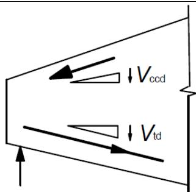
*Figura A19.6.2 Componentes del esfuerzo cortante en los elementos con cordones inclinados*

(2) La resistencia a cortante de un elemento con armadura de cortante es igual a:

$$
V _ {R d} = V _ {R d, s} + V _ {c c d} + V _ {t d}\tag{6.1}
$$

(3) En las zonas del elemento donde $V_{Ed} \leq V_{Rd,c}$ no se requiere armadura de cortante de cálculo. $V_{Ed}$ es el esfuerzo cortante de cálculo en la sección analizada resultante de la aplicación de las cargas externas y del pretensado (adherente o no).

(4) Se debe disponer una armadura mínima de cortante, conforme al apartado 9.2.2, aunque por cálculo no sea necesaria. Este armado mínimo puede suprimirse en elementos como losas (macizas, nervadas o alveolares), en las que es posible la redistribución transversal de las cargas. También puede suprimirse el armado mínimo en los elementos de importancia menor (por ejemplo, dinteles con una luz inferior a dos metros), que no contribuyan de forma significativa a la resistencia y estabilidad global de la estructura.

(5) En las zonas en las que $V_{Ed} > V_{Rd,c}$ (con $V_{Rd,c}$ de acuerdo con la expresión (6.2)) debe disponerse armadura de cortante suficiente de forma que $V_{Ed} \leq V_{Rd}$ (véase la expresión (6.1)).

(6) En cualquier parte del elemento, la suma del esfuerzo cortante de cálculo y la contribución de las alas, $V_{Ed} - V_{ccd} - V_{td}$ , no debe exceder el valor máximo permitido $V_{Rd,max}$ (véase el apartado 6.2.3).

(7) La armadura longitudinal de tracción debe ser capaz de soportar el esfuerzo adicional de tracción causado por el cortante (véase el apartado 6.2.3(7)).

(8) Para elementos sometidos principalmente a una carga uniformemente distribuida, no será necesaria la comprobación del esfuerzo cortante de cálculo para los puntos situados a una distancia inferior a d desde el borde del apoyo. Debe darse continuidad hasta el apoyo a toda la armadura de cortante necesaria. Además deberá comprobarse que el cortante en el apoyo no supera el valor $V_{Rd,max}$ (véanse los apartados 6.2.2(6) y 6.2.3(8)).

(9) Cuando se aplique una carga en la parte inferior de la sección, debe disponerse una armadura vertical de cortante capaz de transmitir la carga a la parte superior de la sección, además de las que fuesen necesarias para resistir el cortante

## 6.2.2 Elementos que no requieren armadura de cortante

(1) El valor de cálculo de la resistencia a cortante $V_{Rd,c}$ se establece mediante:

$$
V _ {R d, c} = \big [ C _ {R d, c} k (1 0 0 \rho_ {l} f _ {c k}) ^ {1 / 3} + k _ {1} \sigma_ {c p} \big ] b _ {w} d\tag{6.2.a}
$$

Con un mínimo de

$$
V _ {R d, c} = \big (v _ {m i n} + k _ {1} \sigma_ {c p} \big) b _ {w} d\tag{6.2.b}
$$

Sec. I. Pág. 98359

> cve: BOE-A-2021-13681
Verificable en https://www.boe.es

<!-- pag 76 -->

donde:

$f_{ck}$ viene dada en N/mm $^{2}$

$$
k = 1 + \sqrt {\frac {2 0 0}{d}} \leq 2, 0 \text {con} d \text {en} m m
$$

$$
\rho_ {l} = \frac {A _ {s l}}{b _ {w} d} \leq 0, 0 2
$$

$A_{sl}$ es el área de la armadura de tracción, la cual se extiende una longitud $\geq (l_{bd} + d)$ más allá de la sección considerada (véase la figura A19.6.3)

$b_{w}$ es el espesor mínimo de la sección en la zona de tracción[mm]

$$
\sigma_ {c p} = N _ {E d} / A _ {c} <   0, 2 f _ {c d} [ \mathrm{N/mm} ^ {2} ]
$$

$N_{Ed}$ es el esfuerzo axil en la sección debido a las cargas o al pretensado en [N]. $N_{Ed} > 0$ para compresión. La influencia de las deformaciones impuestas puede ignorarse en $N_{Ed}$

$A_{c}$ es el área de la sección de hormigón $[mm^{2}]$

$V_{Rd,c}$ se expresa en $N$

$$
C _ {R d, c} = 0, 1 8 / \gamma_ {C}
$$

$$
k _ {1} = 0, 1 5.
$$

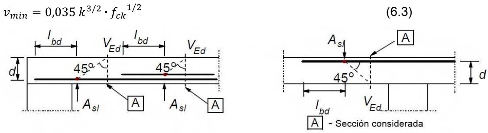
*Figura A19.6.3 Definición de $A_{sl}$ en la expresión (6.2)*

(2) En los elementos pretensados de un solo vano sin armadura de cortante, la resistencia a cortante de las zonas fisuradas por flexión puede calcularse utilizando la expresión (6.2a). En las zonas no fisuradas por flexión (donde la tensión de tracción por flexión es inferior a $f_{ctk,0,05}/\gamma_{c}$ ), la resistencia a cortante debe estar limitada por la resistencia a tracción del hormigón. En estas zonas, la resistencia a cortante se establece mediante:

$$
V _ {R d, c} = \frac {I \cdot b _ {w}}{S} \sqrt {(f _ {c t d}) ^ {2} + \alpha_ {l} \sigma_ {c p} f _ {c t d}}\tag{6.4}
$$

donde:

I es el momento de inercia

$b_{w}$ es el ancho de la sección en el eje baricéntrico, teniendo en cuenta la presencia de vainas de acuerdo con las expresiones (6.16) y (6.17)

S es el momento estático del área por encima del eje baricéntrico

$\alpha_{l}$ $= l_{x}/l_{pt2} \leq 1,0$ para armadura pretensada pretesa, = 1,0 para los otros tipos de pretensado

$l_{x}$ es la distancia comprendida entre la sección considerada y el punto de origen de la longitud de transmisión de tensiones

Sec. I. Pág. 98360

> cve: BOE-A-2021-13681
Verificable en https://www.boe.es

<!-- pag 77 -->

$$
l _ {p t 2}
$$

es el valor del límite superior de la longitud de transmisión de la armadura activa, de acuerdo con la expresión (8.18)

$$
\sigma_ {c p}
$$

es la tensión de compresión del hormigón en el eje baricéntrico debida a la carga axil y/o al pretensado ( $\sigma_{cp} = N_{Ed}/A_c$ en $N/mm^2$ , $N_{Ed} > 0$ en compresión).

Para las secciones en las que el ancho varía con la altura, la tensión principal máxima puede darse en un eje distinto del baricéntrico. En estos casos, el valor mínimo de la resistencia a cortante debe determinarse mediante el cálculo de $V_{Rd,c}$ en diferentes ejes de la sección.

(3) No es necesario el cálculo de la resistencia a cortante siguiendo la expresión (6.4), en el caso de que las secciones se encuentren situadas más cerca del apoyo que del punto correspondiente a la intersección entre el eje del centro de gravedad elástico y la línea inclinada que forma 45° desde el borde interior del apoyo.

(4) Para el caso general de elementos sometidos a flexión compuesta, en los que se pueda demostrar que no están fisurados en Estado Límite Último, debe consultarse el apartado 12.6.3.

(5) Para el cálculo de la armadura longitudinal en la región fisurada sometida a flexión, la envolvente de momentos se debe decalar una distancia $a_{l} = d$ en la dirección desfavorable (véase el apartado 9.2.1.3(2)).

(6) En el caso de que las cargas sean aplicadas sobre la cara superior del elemento, a una distancia $a_{v}$ del borde del apoyo (o centro del apoyo en el caso de apoyos flexibles) comprendida entre $0,5d \leq a_{v} \leq 2d$ , la contribución de esta carga al esfuerzo cortante $V_{Ed}$ puede multiplicarse por $\beta = a_{v}/2d$ . Esta reducción puede aplicarse en la comprobación de $V_{Rd,c}$ en la expresión (6.2.a). Esto es únicamente válido si se cumple que el armado longitudinal está completamente anclado en el apoyo. Para $a_{v} \leq 0,5d$ debe utilizarse el valor $a_{v} = 0,5d$ .

El esfuerzo cortante $V_{Ed}$ , calculado sin aplicar la reducción de $\beta$ , deberá cumplir la condición siguiente:

$$
V _ {E d} \leq 0, 5 b _ {w} d \nu f _ {c d}\tag{6.5}
$$

donde v es un coeficiente de reducción de la resistencia para el hormigón fisurado por cortante, cuyo valor es:

$$
\nu = 0, 6 \left[ 1 - \frac {f _ {c k}}{2 5 0} \right] \qquad \text {con} (f _ {c k} \text {en} N / m m ^ {2})\tag{6.6}
$$

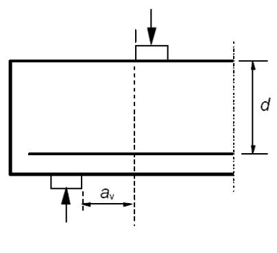
*a) Viga sobre apoyo directo*

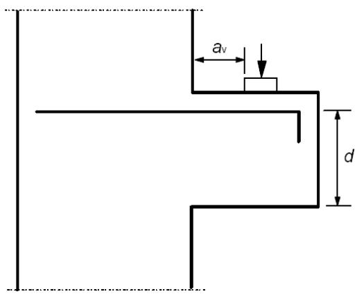
*b) Ménsula Figura A19.6.4 Cargas cercanas a los apoyos*

(7) Las vigas con cargas cercanas a los apoyos y ménsulas pueden calcularse, de forma alternativa, mediante modelos de bielas y tirantes. Se hace referencia a esta alternativa en el apartado 6.5.

Sec. I. Pág. 98361

> cve: BOE-A-2021-13681
Verificable en https://www.boe.es

<!-- pag 78 -->

## 6.2.3 Elementos que requieren armadura de cortante

(1) El cálculo de elementos con armadura de cortante se basa en un modelo de celosía (figura A19.6.5). Los valores límite de la inclinación $\theta$ de las bielas en el alma se establecen en el apartado 6.2.3(2).

En la figura A19.6.5 aparece la siguiente notación:

α es el ángulo entre las armaduras de cortante con el eje de la viga perpendicular al esfuerzo cortante (medida en positivo como se indica en la figura)

θ es el ángulo entre las bielas de compresión de hormigón y el eje de la viga perpendicular al esfuerzo cortante

$F_{td}$ es el valor de cálculo de la fuerza de tracción en la armadura longitudinal

$F_{cd}$ es el valor de cálculo de la fuerza de compresión del hormigón en la dirección del eje longitudinal del elemento

$b_{w}$ es el ancho mínimo entre los cordones de tracción y compresión

z para un elemento de canto constante, es el brazo mecánico de las fuerzas internas correspondiente al momento flector en el elemento considerado. En el análisis de cortante del hormigón armado sin esfuerzo axil, se emplea habitualmente el valor aproximado z = 0,9d.

En los elementos con armadura activa inclinada, el armado longitudinal en el cordón traccionado deberá disponerse de forma que soporte el esfuerzo de tracción longitudinal debido al cortante definido en el punto (7).

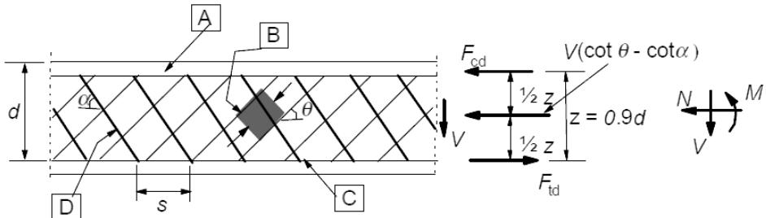
*A - Cordón comprimido B - Bielas C - Cordón traccionado D - Armadura de cortante*

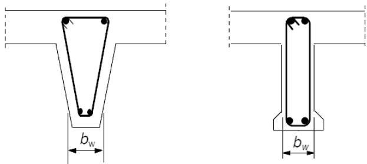

Figura A19.6.5 Modelo de celosía y notación para elementos con armadura de cortante

(2) El ángulo θ está limitado por el intervalo establecido en la expresión 6.7:

$$
0, 5 \leq \cot \theta \leq 2\tag{6.7}
$$

(3) Para elementos con armadura vertical de cortante, la resistencia a cortante, $V_{Rd}$ es el menor valor de:

$$
V _ {R d, s} = \frac {A _ {s w}}{s} z f _ {y w d} \cot \theta\tag{6.8}
$$

Sec. I. Pág. 98362

> cve: BOE-A-2021-13681
Verificable en https://www.boe.es

<!-- pag 79 -->

NOTA: Si se utiliza la expresión (6.10), el valor de $f_{ywd}$ deberá reducirse a $0,8f_{ywk}$ en la expresión (6.8).

$$
V _ {R d, m a x} = \alpha_ {c w} b _ {w} z \nu_ {1} f _ {c d} / (c o t \theta + t a n \theta)\tag{6.9}
$$

donde:

$A_{sw}$ es el área de la sección de la armadura de cortante

s es la separación de los cercos u horquillas

$f_{ywd}$ es el límite elástico de cálculo de la armadura de cortante

$\nu_{1}$ es un coeficiente de reducción de la resistencia del hormigón fisurado por el efecto del cortante

$$
\nu_ {1} = 0, 6 \left[ 1 - \frac {f _ {c k}}{2 5 0} \right] \qquad \text {con} (f _ {c k} \text {en N / mm} ^ {2}).
$$

Si el valor de cálculo de la armadura de cortante es menor 0,8 $f_{yk}$ , $v_{1}$ puede establecerse como:

$$
\nu_ {1} = 0, 6
$$

$$
\text {para} f_{ck} \leq 60 \text{ N/mm}^2\tag{6.10.a}
$$

$$
v _ {1} = 0, 9 - f _ {c k} / 2 0 0 > 0, 5 \quad \text {para} f _ {c k} > 6 0 \mathrm{N} / \mathrm{mm} ^ {2}\tag{6.10.b}
$$

$\alpha_{cw}$ es un coeficiente que tiene en cuenta el estado de tensiones en el cordón comprimido. Los valores a utilizar serán:

1 para estructuras sin pretensado

$$
\left(1 + \sigma_ {c p} / f _ {c d}\right) \qquad \text {para} 0 <   \sigma_ {c p} \leq 0, 2 5 f _ {c d}\tag{6.11.a}
$$

$$
1, 2 5 \quad \text {para} 0, 2 5 f _ {c d} <   \sigma_ {c p} \leq 0, 5 f _ {c d}\tag{6.11.b}
$$

$$
2, 5 \big (1 - \sigma_ {c p} / f _ {c d} \big) \quad \text {para} 0, 5 f _ {c d} <   \sigma_ {c p} <   1, 0 f _ {c d}\tag{6.11.c}
$$

donde $\sigma_{cp}$ es la tensión media de compresión en el hormigón, medida positiva, debida al esfuerzo axil de cálculo. Debe obtenerse mediante el promedio de toda la sección de hormigón teniendo en cuenta la armadura. No será necesario el cálculo del valor de $\sigma_{cp}$ para una distancia inferior a 0,5 d cot $\theta$ desde el borde del apoyo.

NOTA: El área máxima eficaz de la sección de la armadura de cortante, $A_{sw,max}$ , para $cot\theta = 1$ , se establece mediante:

$$
\frac {A _ {s w , m a x} f _ {y w d}}{b _ {w} s} \leq \frac {1}{2} \alpha_ {c w} \nu_ {1} f _ {c d}\tag{6.12}
$$

(4) Para elementos con armadura de cortante inclinada, la resistencia a cortante será el menor valor de:

$$
V _ {R d, s} = \frac {A _ {s w}}{s} z f _ {y w d} (c o t \theta + c o t \alpha) s e n \alpha\tag{6.13}
$$

y

$$
V _ {R d, m a x} = \alpha_ {c w} b _ {w} z v _ {1} f _ {c d} \left(c o t \theta + c o t \alpha\right) / (1 + c o t ^ {2} \theta)\tag{6.14}
$$

NOTA: El área máxima eficaz de la sección de la armadura de cortante, $A_{sw,max}$ , para $cot\theta = 1$ , se establece mediante:

$$
\frac {A _ {s w , m a x} f _ {y w d}}{b _ {w} s} \leq \frac {\frac {1}{2} \alpha_ {c w} \nu_ {1} f _ {c d}}{s e n \alpha}\tag{6.15}
$$

Sec. I. Pág. 98363

> cve: BOE-A-2021-13681
Verificable en https://www.boe.es

<!-- pag 80 -->

(5) En las regiones en las que no hay discontinuidad de $V_{Ed}$ (por ejemplo para el caso de cargas uniformemente distribuidas en la parte superior), la armadura de cortante en una longitud básica $l = z \cot \theta$ puede calcularse utilizando el menor valor de $V_{Ed}$ en dicha longitud.

(6) Para el caso de un alma que contiene vainas metálicas inyectadas, con un diámetro $\phi > b_{w}/8$ , la resistencia a cortante, $V_{Rd,max}$ , debe calcularse partiendo de un espesor nominal del alma, establecido mediante la siguiente expresión:

$$
b _ {w, n o m} = b _ {w} - 0, 5 \sum \phi\tag{6.16}
$$

donde $\phi$ es el diámetro exterior de la vaina y $\sum \phi$ se determina para el nivel más desfavorable.

Para vainas metálicas inyectadas con $\phi \leq b_{w}/8$ , $b_{w,nom} = b_{w}$ .

Para vainas no inyectadas, vainas plásticas inyectadas y armadura activa no adherente, el espesor nominal del alma es:

$$
b _ {w, n o m} = b _ {w} - 1, 2 \sum \phi\tag{6.17}
$$

En la expresión (6.17) se dispone el valor 1,2 para tener en cuenta el hendimiento de las bielas de hormigón debido a la tracción transversal. Si se dispone una armadura transversal adecuada, este valor puede reducirse a 1,0.

(7) El esfuerzo de tracción adicional, $\Delta F_{td}$ , en la armadura longitudinal debido al cortante $V_{Ed}$ puede calcularse mediante:

$$
\Delta F_{td} = 0,5V_{Ed}(cot\theta -cot\alpha)\tag{6.18}
$$

$(M_{Ed}/z) + \Delta F_{td}$ debe tomarse no mayor que $M_{Ed,max}/z$ , donde $M_{Ed,max}$ es el momento máximo a lo largo de la viga.

(8) Para elementos con cargas aplicadas en la cara superior, a una distancia $a_{v}$ de la cara del apoyo tal que $0,5d \leq a_{v} \leq 2,0d$ , la contribución de dicha carga al esfuerzo cortante $V_{Ed}$ puede reducirse en $\beta = a_{v}/2d$ . El esfuerzo cortante $V_{Ed}$ , calculado de esta manera deberá satisfacer la siguiente condición:

$$
V _ {E d} \leq A _ {s w} \cdot f _ {y w d} \cdot s e n \alpha\tag{6.19}
$$

donde $A_{sw} \cdot f_{ywd}$ es la resistencia de la armadura de cortante que atraviesa la fisura de cortante inclinada entre las áreas cargadas (véase la figura A19.6.6). Únicamente debe tenerse en cuenta la armadura de cortante situada en la parte central, a lo largo de una longitud igual a $0,75a_{v}$ . La reducción de $\beta$ debe aplicarse únicamente para el cálculo de la armadura de cortante. Será válida siempre que la armadura longitudinal esté completamente anclada en el apoyo.

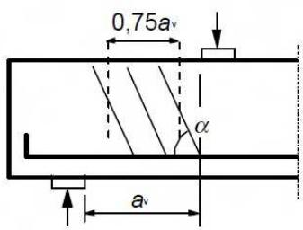

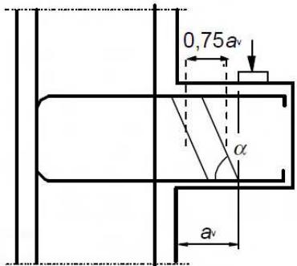
*Figura A19.6.6 Armadura de cortante para luces pequeñas con bielas de transmisión directa*

Para $a_{v} < 0,5d$ , deberá emplearse el valor $a_{v} = 0,5d$ .

El valor $V_{Ed}$ calculado sin la reducción de $\beta$ deberá ser siempre menor que $V_{Rd,max}$ (véase la expresión (6.9)).

Sec. I. Pág. 98364

> cve: BOE-A-2021-13681
Verificable en https://www.boe.es

<!-- pag 81 -->

## 6.2.4 Esfuerzo rasante entre el alma y las alas

(1) La resistencia a rasante del ala puede calcularse considerándola como un sistema de bielas de compresión combinado con tirantes que se corresponden con las armaduras traccionadas.

(2) Debe disponerse una armadura longitudinal mínima, tal y como se especifica en el apartado 9.3.1.

(3) La tensión de rasante, $v_{Ed}$ , desarrollada en la unión entre el alma y un lado del ala, se determina mediante la variación del esfuerzo normal (longitudinal) en la parte del ala considerada, de acuerdo con:

$$
v _ {E d} = \Delta F _ {d} / (h _ {f} \cdot \Delta x)\tag{6.20}
$$

donde:

$h_{f}$ es el espesor del ala en las uniones

$\Delta x$ es la longitud considerada, véase la figura A19.6.7

$\Delta F_{d}$ es la variación del esfuerzo normal en el ala a lo largo de la longitud $\Delta x$ .

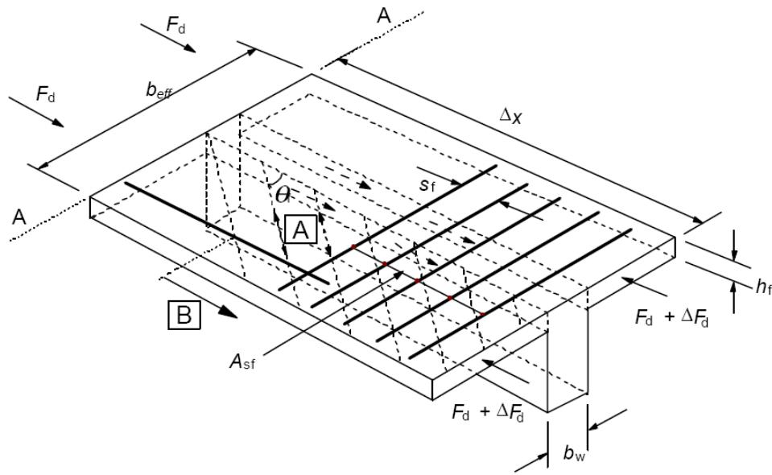
*A Bielas de compresión B Barra longitudinal anclada más allá de este punto proyectado (véase 6.2.4 (7))*

Figura A19.6.7 Notación para la conexión entre ala y alma

El valor máximo que puede admitirse para $\Delta x$ es la mitad de la distancia entre la sección de momento nulo y la sección de momento máximo. Donde se apliquen cargas puntuales, $\Delta x$ no debe superar la distancia entre dichas cargas.

(4) La armadura transversal por unidad de longitud, $A_{sf}/s_{f}$ puede determinarse como sigue:

$$
A _ {s f} f _ {y d} / s _ {f} \geq v _ {E d} \cdot h _ {f} / \cot \theta_ {f}\tag{6.21}
$$

Para prevenir la rotura de las bielas de compresión del ala, debe cumplirse la siguiente condición:

$$
v _ {E d} \leq v f _ {c d} s e n \theta_ {f} c o s \theta_ {f}\tag{6.22}
$$

El rango de valores permitido para $\cot\theta_{f}$ se establece mediante las siguientes disposiciones:

\- $1,0 \leq \cot \theta_f \leq 2,0$ para alas comprimidas $(45^\circ \geq \theta_f \geq 26,5^\circ)$ ,

\- $1,0 \leq \cot \theta_f \leq 1,25$ para alas traccionadas ( $45^\circ \geq \theta_f \geq 38,6^\circ$ ).

Sec. I. Pág. 98365

> cve: BOE-A-2021-13681
Verificable en https://www.boe.es

<!-- pag 82 -->

(5) En el caso de la combinación del rasante entre ala y alma y la flexión transversal, el área de las armaduras debe ser superior al mayor de los siguientes valores: el establecido por la expresión (6.21), o la mitad del mismo añadido al que se requiere por la flexión transversal.

(6) Si $v_{Ed}$ es menor o igual a $kf_{ctd}$ , no será necesaria la utilización de una armadura complementaria, adicional a la requerida por la flexión. Se empleará el valor k = 0,4.

(7) En la sección en la que se necesite armadura longitudinal de tracción en el ala esta se debe anclar más allá de la biela requerida para transmitir de nuevo el esfuerzo al alma (véase la sección (A-A) de la figura A19.6.7).

## 6.2.5 Esfuerzo rasante en el contacto entre hormigones de diferentes edades

(1) Además de los requisitos de los apartados 6.2.1 a 6.2.4, la tensión rasante en el contacto entre hormigones de diferentes edades, debe cumplir las siguientes condiciones:

$$
v _ {E d i} \leq v _ {R d i}\tag{6.23}
$$

$v_{Edi}$ es el valor de cálculo de la tensión rasante en el contacto y se establece mediante:

$$
v _ {E d i} = \beta V _ {E d} / (z b _ {i})\tag{6.24}
$$

donde:

β es el cociente entre esfuerzo longitudinal en el área nueva de hormigón y el esfuerzo longitudinal en la zona de compresión o tracción, ambos calculados para la sección considerada

$V_{Ed}$ es el esfuerzo cortante

z es el brazo mecánico de la sección compuesta

$b_{i}$ es el ancho de la zona de contacto (véase figura A19.6.8)

$v_{Rdi}$ es la resistencia de cálculo a rasante en la zona de contacto y se establece mediante la siguiente expresión:

$$
v _ {R d i} = c f _ {c t d} + \mu \sigma_ {n} + \rho f _ {y d} (\mu s e n \alpha + c o s \alpha) \leq 0, 5 \nu f _ {c d}\tag{6.25}
$$

donde:

c y μ son coeficientes que dependen de la rugosidad del contacto (véase el punto (2))

$f_{ctd}$ es como se define en el apartado 3.1.6(2),

$\sigma_{n}$ es la tensión originada por el esfuerzo mínimo normal exterior a través del contacto, que puede actuar de forma simultánea con el esfuerzo cortante, positivo para compresión, de tal manera que $\sigma_{n} < 0,6f_{cd}$ ; y negativo para tracción. Cuando $\sigma_{n}$ es de tracción, se debe tomar $c f_{cd} = 0$ .

$$
\rho = A _ {s} / A _ {i}
$$

Sec. I. Pág. 98366

> cve: BOE-A-2021-13681
Verificable en https://www.boe.es

<!-- pag 83 -->

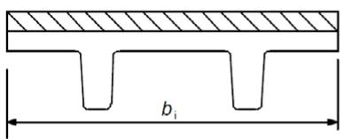

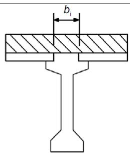

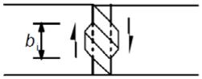
*Figura A19.6.8 Ejemplos de contactos*

$A_{s}$ es el área de la armadura que atraviesa la zona de contacto, incluyendo la armadura convencional de cortante (si existe), con el anclaje adecuado a ambos lados de la zona de contacto

$A_{i}$ es el área de la junta

$\alpha$ se define en la figura A19.6.9, y debe limitarse por el intervalo $45^{\circ} \leq \alpha \leq 90^{\circ}$

ν es un coeficiente reductor de la resistencia (véase el apartado 6.2.2(6)).

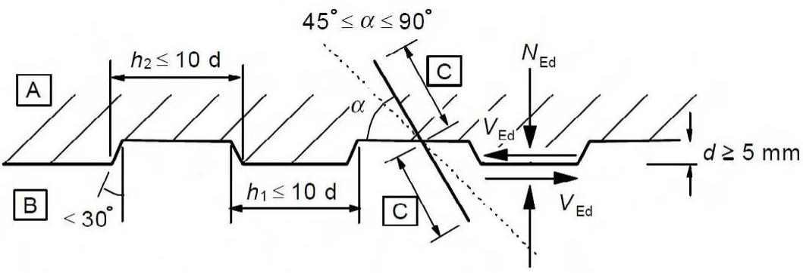
*Figura A19.6.9 Junta de construcción dentada*

(2) En ausencia de información más detallada, las superficies pueden clasificarse en muy lisa, lisa, rugosa o dentada, con los siguientes ejemplos:

\- Muy lisa: superficie con encofrado de acero, plástico, o encofrado de madera especialmente preparado: c = 0,025 a 0,10 y μ = 0,5.

\- Lisa: superficie con encofrado deslizante o extruida, superficie libre sin tratamiento posterior al vibrado: $c = 0,20$ y $\mu = 0,6$ .

\- Rugosa: superficie con asperezas de al menos 3 mm de altura separadas entre sí alrededor de 40 mm, conseguida mediante cepillado, exposición de los áridos u otros métodos que proporcionen un acabado similar: c = 0,40 y μ = 0,7.

\- Dentada: superficie con hendiduras como se muestra en la figura A19.6.9: c = 0,50 y μ = 0,9.

(3) Se puede emplear una distribución escalonada de la armadura transversal, tal y como se indica en la figura A19.6.10. En la zona en la que la conexión entre dos hormigones diferentes esté asegurada mediante la armadura (armaduras básicas en celosía), la contribución del acero a $V_{Rdi}$ se puede tomar como la resultante de las fuerzas de cada diagonal, siempre que $45^{\circ} \leq \alpha \leq 135^{\circ}$ .

Sec. I. Pág. 98367

> cve: BOE-A-2021-13681
Verificable en https://www.boe.es

<!-- pag 84 -->

(4) La resistencia a rasante de las juntas inyectadas entre los elementos de losas o muros se puede calcular de acuerdo con el apartado 6.2.5(1). Sin embargo, en los casos en los que la junta pueda fisurarse de forma significativa, c deberá ser nulo para juntas lisas y rugosas, pero se tomará c = 0,5 para juntas dentadas (véase también el apartado 10.9.3(12)).

(5) Bajo cargas de fatiga o cargas dinámicas, los valores de c, indicados en el apartado 6.2.5(1), deben reducirse a la mitad.

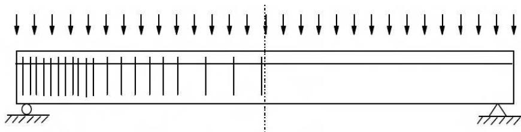

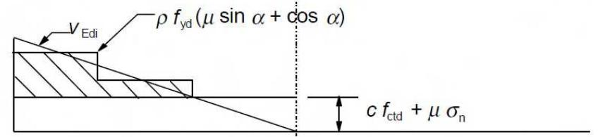
*Figura A19.6.10 Diagrama de cortante indicando la armadura de cosido requerida*

## 6.3 Torsión

## 6.3.1 Generalidades

(1) En los casos en los que el equilibrio estático de la estructura dependa de la resistencia a torsión de alguno de sus elementos, deberá realizarse un cálculo a torsión completo que contemple los Estados Límite Últimos y los Estados Límite de Servicio.

(2) No será necesario considerar la torsión en Estado Límite Último en estructuras hiperestáticas en las que la torsión se derive únicamente de la condiciones de compatibilidad y la estabilidad de la estructura no dependa de su resistencia torsional. En estos casos, debe disponerse una armadura mínima (establecida en los apartados 7.3 y 9.2), mediante cercos y barras longitudinales, para evitar una fisuración excesiva.

(3) La resistencia a torsión de una sección se puede calcular partiendo de una sección cerrada de pared delgada, en la que el equilibrio se cumple por medio de un flujo cerrado de cortante. Las secciones macizas se pueden modelizar mediante secciones cerradas de pared delgada equivalentes. Otras formas más complejas, como las secciones en T, pueden dividirse en una serie de subsecciones, cada una de las cuales se modeliza como una sección de pared delgada equivalente, siendo la resistencia a torsión total la suma de las capacidades de las subsecciones elementales.

(4) La distribución de los momentos de torsión actuantes sobre las subsecciones, debe ser proporcional a las rigideces de torsión en estado no fisurado. En el caso de secciones huecas, el espesor de la pared equivalente no debe superar su espesor real.

(5) Cada subsección elemental debe calcularse por separado.

## 6.3.2 Procedimiento de cálculo

(1) La tensión tangencial en la pared de una sección sometida a un momento de torsión puro se puede calcular mediante:

Sec. I. Pág. 98368

> cve: BOE-A-2021-13681
Verificable en https://www.boe.es

<!-- pag 85 -->

$$
\tau_ {t, i} t _ {e f, i} = \frac {T _ {E d}}{2 A _ {k}}\tag{6.26}
$$

El esfuerzo cortante $V_{Ed,i}$ en una pared i debido a la torsión se establece mediante la siguiente expresión:

$$
V _ {E d, i} = \tau_ {t, i} t _ {e f, i} z _ {i}\tag{6.27}
$$

donde:

$T_{Ed}$ es el momento torsor de cálculo aplicado (véase la figura A19.6.11)

$A_{k}$ es el área encerrada por la línea media de las paredes conectadas, incluyendo las áreas huecas interiores

$\tau_{t,i}$ es la tensión tangencial de torsión en la pared i

$t_{ef,i}$ es el espesor eficaz de la pared. Se puede tomar como A/u, pero no debe ser inferior al doble de la distancia entre el borde exterior y el eje de la armadura longitudinal. Para secciones huecas, estará limitado superiormente por el espesor real

A es el área total de la sección delimitada por el perímetro exterior, incluyendo las áreas huecas interiores

u es el perímetro exterior de la sección

$z_{i}$ es la longitud de la cara de la pared i, definida por la distancia entre los puntos de intersección con las paredes adyacentes.

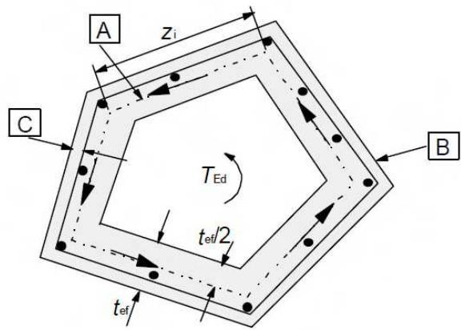
*Figura A19.6.11 Notación y definiciones empleadas en el apartado 6.3*

A - Perímetro medio

B - Borde exterior de la sección, perímetro u

C - Recubrimiento

(2) Para elementos de sección hueca o maciza, los efectos de torsión pueden superponerse a los de cortante, suponiendo la misma inclinación $\theta$ para las bielas. Los límites de $\theta$ establecidos en el apartado 6.2.3(2) son aplicables para el caso de la combinación de torsión y cortante.

La capacidad resistente máxima de un elemento sometido a cortante y a torsión se obtiene a partir de 6.3.2(4).

(3) El área requerida de armadura longitudinal de torsión $\Sigma A_{sl}$ puede calcularse mediante la expresión:

$$
\frac {\Sigma A _ {s l} f _ {y d}}{u _ {k}} = \frac {T _ {E d}}{2 A _ {k}} \cot \theta\tag{6.28}
$$

donde:

$u_{k}$ es el perímetro del área $A_{k}$

$f_{yd}$ es el límite elástico de la armadura longitudinal $A_{sl}$

Sec. I. Pág. 98369

> cve: BOE-A-2021-13681
Verificable en https://www.boe.es

<!-- pag 86 -->

es el ángulo de las bielas de compresión (véase la figura A19.6.5).

En cordones comprimidos, se puede reducir la armadura longitudinal de forma proporcional a la fuerza de compresión disponible. En cordones traccionados la armadura longitudinal de torsión deberá añadirse a las otras armaduras. La armadura longitudinal tendrá que distribuirse a lo largo de la longitud $z_{i}$ , pero para pequeñas secciones puede concentrarse en los extremos de su longitud.

(4) La resistencia máxima de un elemento sometido a torsión y cortante está limitada por la capacidad de las bielas de compresión. Para no exceder esta resistencia se tendrá que satisfacer la siguiente condición:

$$
T _ {E d} / T _ {R d, m a x} + V _ {E d} / V _ {R d, m a x} \leq 1, 0\tag{6.29}
$$

donde:

$T_{Ed}$ es el momento torsor de cálculo

$V_{Ed}$ es el esfuerzo cortante de cálculo

$T_{Rd,max}$ es el momento torsor resistente de cálculo, de acuerdo con:

$$
T _ {R d, m a x} = 2 \nu \alpha_ {c w} f _ {c d} A _ {k} t _ {e f, i} \sin \theta \cos \theta\tag{6.30}
$$

donde ν proviene del apartado 6.2.2(6) y $\alpha_{cw}$ de la expresión (6.9)

$V_{Rd,max}$ es la resistencia máxima a cortante, de acuerdo con las expresiones (6.9) o (6.14). En secciones macizas, puede utilizarse todo el ancho del alma para la obtención de $V_{Rd,max}$ .

(5) Para el caso de secciones macizas aproximadamente rectangulares, solo se requiere la armadura mínima (véase el apartado 9.2.1.1) si se cumple la siguiente condición:

$$
T _ {E d} / T _ {R d, c} + V _ {E d} / V _ {R d, c} \leq 1, 0\tag{6.31}
$$

donde:

$T_{Rd,c}$ es el momento torsor de fisuración, que puede determinarse estableciendo $\tau_{t,i} = f_{ctd}$

$V_{Rd,c}$ se establece siguiendo la expresión (6.2).

## 6.3.3 Alabeo producido por torsión

(1) El alabeo producido por la torsión pueden, en general, ignorarse en secciones cerradas de pared delgada y en secciones macizas.

(2) En elementos abiertos de pared delgada puede ser necesario considerar la torsión por alabeo. Para secciones muy esbeltas, el cálculo debe llevarse a cabo sobre la base de un modelo de entramado de vigas y en otros casos sobre un modelo de celosía. En todos ellos, el cálculo debe realizarse de acuerdo con las reglas de cálculo para la flexión compuesta y para el cortante.

## 6.4 Punzonamiento

## 6.4.1 Generalidades

(1) Las reglas dispuestas en este apartado complementan las establecidas en el apartado 6.2 y abarcan el punzonamiento en losas macizas, losas reticulares con áreas macizas en los pilaresy cimentaciones.

(2) El punzonamiento puede proceder de una carga o reacción concentrada, actuando sobre un área relativamente pequeña de una losa o de una cimentación llamada área cargada $A_{load}$ .

Sec. I. Pág. 98370

> cve: BOE-A-2021-13681
Verificable en https://www.boe.es

<!-- pag 87 -->

(3) En la figura A19.6.12 se muestra un modelo adecuado para la comprobación del punzonamiento en Estado Límite Último.

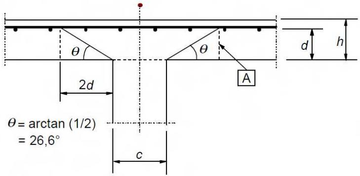
*a) Alzado*

A - Sección de control básica

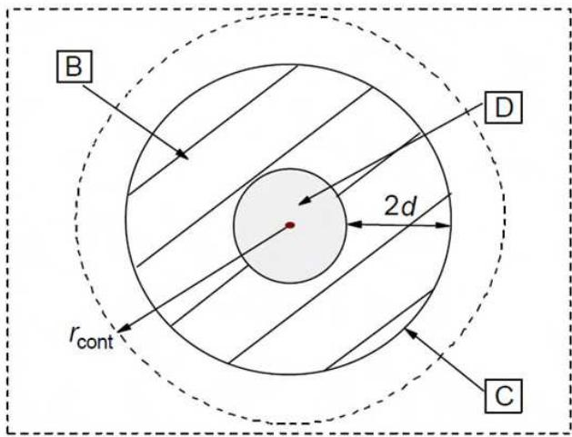
*b) Vista en planta*

B - Área de control básica $A_{\text{cont}}$

C - Perímetro crítico ${\mathrm{u}}_{1}$

D - Área cargada A $_{load}$

$r_{cont}$ : perímetro de control exterior

Figura A19.6.12 Modelo de comprobación del punzonamiento en Estado Límite Último

(4) Debe comprobarse la resistencia a punzonamiento en la cara del pilar y en el perímetro crítico $u_{1}$ Si se necesitan armaduras de punzonamiento, se debe encontrar un perímetro límite $u_{out,ef}$ , a partir del cual no se requiere más armadura.

(5) Las reglas establecidas en el apartado 6.4 se han formulado para el caso de cargas uniformemente distribuidas. En casos particulares, como las zapatas, la carga dentro del perímetro crítico contribuye a la resistencia del sistema estructural y puede sustraerse a la hora de determinar el valor de cálculo de la tensión a punzonamiento.

## 6.4.2 Distribución de cargas y perímetro crítico

(1) Debe tomarse como perímetro crítico $u_{1}$ el situado a una distancia 2d a partir del área cargada, dispuesto de forma que su longitud sea mínima (véase la figura A19.6.13).

Se supondrá una losa de canto útil constante que se establece mediante:

$$
d _ {e f f} = \frac {d _ {y} + d _ {z}}{2}\tag{6.32}
$$

donde $d_{y}$ y $d_{z}$ son los cantos útiles de las armaduras en dos direcciones perpendiculares.

Sec. I. Pág. 98371

> cve: BOE-A-2021-13681
Verificable en https://www.boe.es

<!-- pag 88 -->

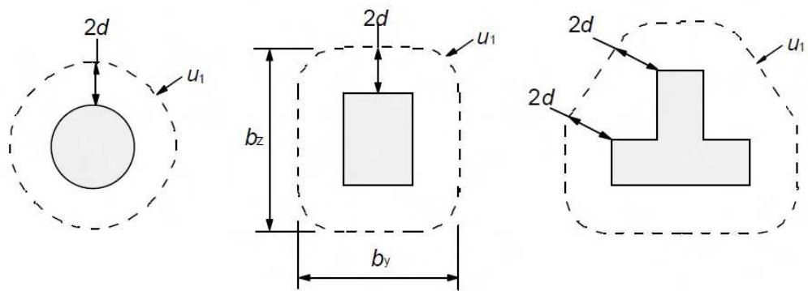
*Figura A19.6.13 Tipos de perímetros críticos alrededor de las zonas cargadas*

(2) Se deben considerar perímetros críticos situados a una distancia inferior a 2d en los casos en los que la carga concentrada esté equilibrada, por una presión elevada (por ejemplo, la presión sobre el terreno en una cimentación), o por los efectos de una carga o de una reacción situada a una distancia inferior o igual a 2d del contorno del área cargada.

(3) Para el caso de áreas cargadas situadas en zonas próximas a huecos, si la distancia más corta entre el perímetro del área cargada y el borde del hueco no supera la longitud 6d, la parte del perímetro crítico comprendida entre dos tangentes trazadas desde el centro de la zona cargada hasta el perímetro exterior del hueco, será considerada como no efectiva (véase figura A19.6.14).

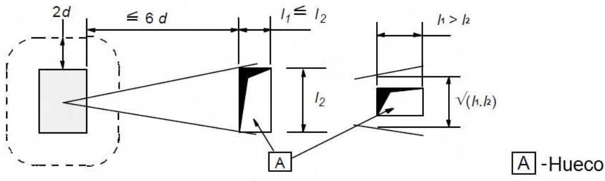
*Figura A19.6.14 Perímetro crítico próximo a un hueco*

(4) Para el caso de un área cargada situada cerca de un borde o una esquina, el perímetro crítico debe tomarse como se muestra en la figura A19.6.15, en la medida en que el perímetro resultante (excluyendo los bordes libres) sea inferior a los obtenidos de acuerdo con los puntos (1) y (2).

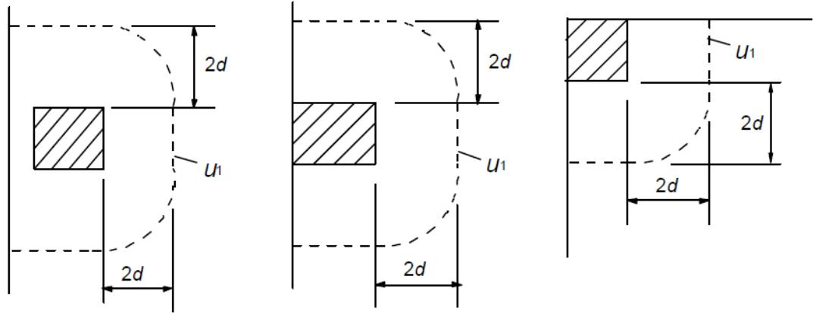
*Figura A19.6.15 Perímetros críticos para zonas cargadas cercanas a un borde o una esquina*

Sec. I. Pág. 98372

> cve: BOE-A-2021-13681
Verificable en https://www.boe.es

<!-- pag 89 -->

(5) Para áreas cargadas próximas a un borde o una esquina, es decir, a una distancia inferior a d, se debe disponer siempre una armadura adicional de borde, véase el apartado 9.3.1.4.

(6) La sección crítica es la definida por el trazado del perímetro crítico, extendiéndose a lo largo del canto útil d. Para losas de canto constante, la sección crítica será perpendicular al plano medio de la losa. Para losas o zapatas de canto variable, excepto para zapatas escalonadas, el canto útil puede suponerse igual al canto en el perímetro del área cargada, tal y como se muestra en la figura A19.6.16.

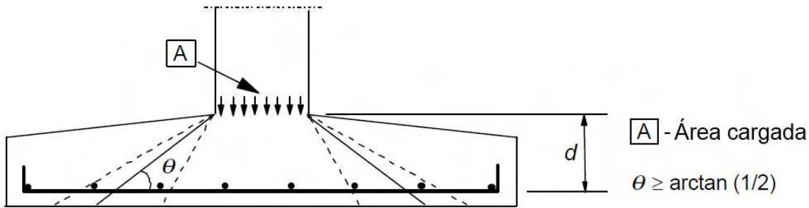
*Figura A19.6.16 canto de la sección crítica para una zapata de canto variable*

(7) Otros perímetros $u_{i}$ , dentro o fuera del área crítica, deben tener la misma forma que el perímetro crítico.

(8) Para losas con capiteles circulares en las que $l_{H} < 2h_{H}$ (véase la figura A19.6.17), solo se requiere una comprobación de las tensiones debidas al punzonamiento de acuerdo con el apartado 6.4.3, en la sección crítica, fuera de la zona del capitel. La distancia de esta sección respecto al centro de gravedad del pilar debe tomarse como:

$$
r _ {c o n t} = 2 d + l _ {H} + 0, 5 c\tag{6.33}
$$

donde:

$l_{H}$ es la distancia de la cara del pilar al borde del capitel

c es el diámetro del pilar circular.

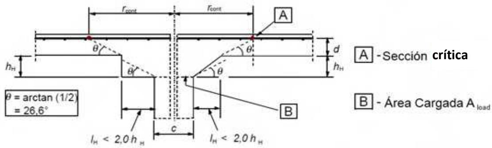
*Figura A19.6.17 Losa sobre capitel con $l_{H} < 2h_{H}$*

Para el caso de un pilar rectangular con capitel rectangular y $l_{H} < 2h_{H}$ (véase la figura A19.6.17), de dimensiones $l_{1}$ y $l_{2}$ ( $l_{1} = c_{1} + 2l_{H1}, l_{2} = c_{2} + 2l_{H2}, l_{1} \leq l_{2}$ ), el valor de $r_{cont}$ se puede tomar como el menor de :

$$
r _ {c o n t} = 2 d + 0, 5 6 \sqrt {l _ {1} l _ {2}}\tag{6.34}
$$

y

$$
r _ {c o n t} = 2 d + 0, 6 9 l _ {1}\tag{6.35}
$$

Sec. I. Pág. 98373

> cve: BOE-A-2021-13681
Verificable en https://www.boe.es

<!-- pag 90 -->

(9) Para el caso de losas con capitel en los que $l_{H} > 2h_{H}$ (véase la figura A19.6.18), deben comprobarse las secciones críticas tanto del capitel como de la losa.

(10) Las disposiciones de los apartados 6.4.2 y 6.4.3 también son de aplicación en las comprobaciones del capitel, tomando d igual a $d_{H}$ , de acuerdo con la figura A19.6.18.

(11) Para pilares circulares, las distancias desde el centro de gravedad del pilar a las secciones críticas de la figura A19.6.18 se pueden tomar como:

$$
r _ {c o n t, e x t} = l _ {H} + 2 d + 0, 5 c\tag{6.36}
$$

$$
r _ {c o n t, i n t} = 2 (d + h _ {H}) + 0, 5 c\tag{6.37}
$$

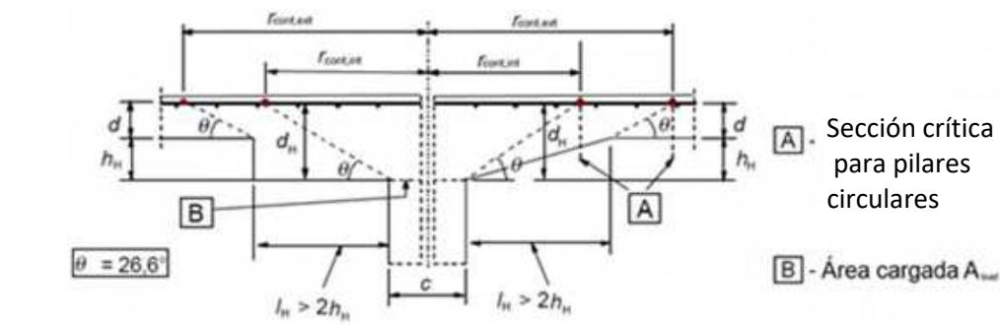
*Figura A19.6.18 Losa sobre capitel con $l_{H} > 2h_{H}$*

## 6.4.3 Cálculo de la resistencia a punzonamiento

(1) El procedimiento de cálculo del punzonamiento se basa en las comprobaciones sobre la cara del pilar y en el perímetro crítico $u_{1}$ . Si es necesaria la armadura de punzonamiento, deberá encontrarse un perímetro exterior $u_{out,ef}$ (véase la figura A19.6.22), a partir del cual no sea necesaria la utilización de armadura. A continuación se definen los valores de cálculo de la resistencia a punzonamiento, en N/mm2, a lo largo de las secciones de control:

$v_{Rd,c}$ es el valor de cálculo de la resistencia a punzonamiento de una losa sin armadura de punzonamiento en la sección crítica considerada,

$v_{Rd,cs}$ es el valor de cálculo de la resistencia a punzonamiento de una losa con armadura de punzonamiento en la sección crítica considerada,

$v_{Rd,max}$ es el valor de cálculo de la resistencia a punzonamiento máxima en la sección crítica considerada.

(2) Se realizarán las siguientes comprobaciones:

(a) No se supera el valor máximo de la de la resistencia a punzonamiento en el perímetro del pilar, o en el perímetro del área cargada:

$$
v _ {E d} \leq v _ {R d, m a x}
$$

(b) La armadura de punzonamiento no será necesaria si:

$$
v _ {E d} \leq v _ {R d, c}
$$

(c) Si $v_{Ed}$ es mayor que $v_{Rd,c}$ en la sección crítica considerada, se dispondrá la armadura de punzonamiento de acuerdo con lo establecido en el apartado 6.4.5.

Sec. I. Pág. 98374

> cve: BOE-A-2021-13681
Verificable en https://www.boe.es

<!-- pag 91 -->

(3) Si la reacción del apoyo es excéntrica con respecto al perímetro crítico, la tensión tangencial máxima de punzonamiento se tomará como:

$$
v _ {E d} = \beta \frac {V _ {E d}}{u _ {i} d}\tag{6.38}
$$

donde:

d es el canto útil medio de la losa, que debe tomarse como $(d_{y} + d_{z})/2$ donde:

$d_{y}, d_{z}$ son los cantos útiles en la dirección y y z de la sección de control

$$
u _ {i}
$$

es la longitud del perímetro de control considerado

β se establece mediante:

$$
\beta = 1 + k \frac {M _ {E d}}{V _ {E d}} \cdot \frac {u _ {1}}{W _ {1}}\tag{6.39}
$$

donde:

$u_{1}$ es la longitud perímetro crítico

k es un coeficiente que depende del cociente entre las dimensiones del pilar $c_{1}$ y $c_{2}$ : su valor es función de la proporción de momento no equilibrado transmitido por un cortante no uniforme, por la flexión y por la torsión (véase la tabla A19 6.1)

$W_{1}$ Corresponde a una distribución de cortante como la mostrada en la figura A19.6.19 y se dispone a lo largo del perímetro crítico

$$
W _ {1} = \int_ {0} ^ {u _ {i}} | e | d l\tag{6.40}
$$

dl es el diferencial de la longitud del perímetro

e es la distancia de dl al eje del momento actuante $M_{Ed}$ .

Tabla A19.6.1 Valores de k para áreas rectangulares cargadas.

<table><tr><td> $c_{1}/c_{2}$ </td><td> $\leq 0,5$ </td><td>1,0</td><td>2,0</td><td> $\geq 3,0$ </td></tr><tr><td>k</td><td>0,45</td><td>0,60</td><td>0,70</td><td>0,80</td></tr></table>

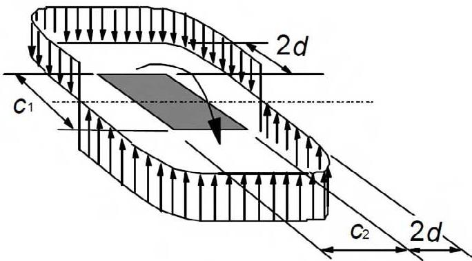
*Figura A19.6.19 Distribución del cortante debida a un momento desequilibrado en la unión de una losa y un pilar interior*

Para un pilar rectangular:

$$
W _ {1} = \frac {c _ {1} {} ^ {2}}{2} + c _ {1} c _ {2} + 4 c _ {2} d + 1 6 d ^ {2} + 2 \pi d c _ {1}\tag{6.41}
$$

Sec. I. Pág. 98375

> cve: BOE-A-2021-13681
Verificable en https://www.boe.es

<!-- pag 92 -->

donde:

$c_{1}$ es la dimensión del pilar, paralela a la excentricidad de la carga

$c_{2}$ es la dimensión del pilar, perpendicular a la excentricidad de la carga.

Para pilares circulares interiores, β se obtendrá mediante:

$$
\beta = 1 + 0, 6 \pi \frac {e}{D + 4 d}\tag{6.42}
$$

donde:

es el diámetro del pilar circular

es la excentricidad de la carga aplicada $e = M_{Ed}/V_{Ed}$ .

Para pilares rectangulares interiores en los que la carga es excéntrica en ambos ejes, se puede emplear la siguiente expresión aproximada:

$$
\beta = 1 + 1, 8 \sqrt {\left(\frac {e _ {y}}{b _ {z}}\right) ^ {2} + \left(\frac {e _ {z}}{b _ {y}}\right) ^ {2}}\tag{6.43}
$$

donde:

$e_{y}$ y $e_{z}$ son las excentricidades $M_{Ed}/V_{Ed}$ a lo largo del eje y y el eje z respectivamente

$b_{y}$ y $b_{z}$ son las dimensiones del perímetro crítico (véase la figura A19.6.13).

NOTA: $e_{y}$ resulta de un momento alrededor del eje z y $e_{z}$ de un momento alrededor del eje y.

(4) Para las uniones de pilares de borde, en las que la excentricidad perpendicular al borde de la losa (resultante de un momento alrededor de un eje paralelo al borde de la losa) se encuentra hacia el interior de la estructura y no hay excentricidad paralela al borde, el esfuerzo de punzonamiento puede considerarse como uniformemente distribuido a lo largo del perímetro crítico $u_{1*}$ , tal y como se indica en la figura A19.6.20(a).

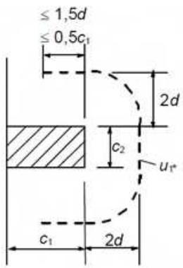
*b) Pilar de borde*

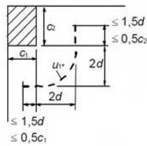
*a) Pilar de esquina Figura A19.6.20 Perímetro crítico reducido $u_{1*}$*

En el caso de que existan excentricidades en ambas direcciones ortogonales, $\beta$ se determinará utilizando la siguiente expresión:

$$
\beta = \frac {u _ {1}}{u _ {1 ^ {*}}} + k \frac {u _ {1}}{W _ {1}} e _ {p a r}\tag{6.44}
$$

donde:

$u_{1}$ es el perímetro crítico (véase la figura A19.6.15) $u_{1^{*}}$ es el perímetro crítico reducido (véase la figura A19.6.20(a))

Sec. I. Pág. 98376

> cve: BOE-A-2021-13681
Verificable en https://www.boe.es

<!-- pag 93 -->

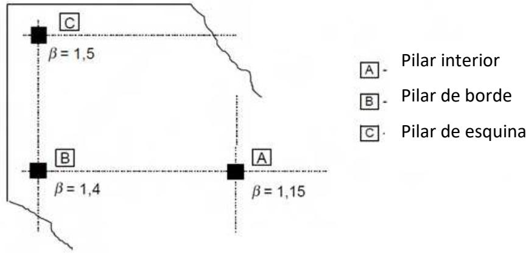

$e_{par}$ es la excentricidad paralela al borde de la losa resultante de un momento sobre el eje perpendicular a dicho borde

k puede determinarse mediante la tabla A19.6.1 sustituyendo el cociente $c_{1}/c_{2}$ por $c_{1}/2c_{2}$

$W_{1}$ se calcula para el perímetro crítico $u_{1}$ (véase la figura A19.6.13).

Para pilares rectangulares, tal y como se muestra en la figura A19.6.20(a):

$$
W _ {1} = \frac {c _ {2} ^ {2}}{4} + c _ {1} c _ {2} + 4 c _ {1} d + 8 d ^ {2} + \pi d c _ {2}\tag{6.45}
$$

Si la excentridad perpendicular al borde de la losa no se encuentra hacia el interior, se aplicará la expresión (6.39). Para el cálculo de $W_{1}$ , la excentricidad e debe medirse desde la fibra que pasa por el centro de gravedad del perímetro crítico.

(5) Para el caso de los pilares de esquina, en los que la excentridad se encuentre hacia el interior de la losa, se supondrá que el esfuerzo de punzonamiento está repartido uniformemente a lo largo del perímetro crítico reducido $u_{1*}$ , tal y como se muestra en la figura A19.6.20(b). El valor de $\beta$ puede considerarse como:

$$
\beta = \frac{u_1}{u_{1^*}}\tag{6.46}
$$

Si la excentricidad se encuentra hacia el exterior, se aplicará la expresión (6.39)

(6) Para estructuras en las que la estabilidad lateral no dependa de que la losas y pilares trabajen como pórticos y las luces de los vanos adyacentes no difieran más de un 25%, se pueden utilizar valores aproximados de $\beta$ . En la figura A19.6.21 se indican los valores a utilizar.

A - Pilar interior

B - Pilar de borde

C. Pilar de esquina

Figura A19.6.21 Valores de β recomendados

(7) En el caso que se aplique una carga concentrada en una losa de forjado cerca de un soporte, la reducción del esfuerzo cortante de acuerdo con lo establecido en los apartados 6.2.2(6) y 6.2.3(8) no es válida y no debe incluirse.

(8) El esfuerzo de punzonamiento $V_{Ed}$ en una losa de cimentación puede reducirse debido a la acción favorable de la presión sobre el terreno.

(9) La componente vertical $V_{pd}$ , resultante de las armaduras de pretensado inclinadas que atraviesan la sección crítica, puede tomarse como una acción favorable donde corresponda.

Sec. I. Pág. 98377

> cve: BOE-A-2021-13681
Verificable en https://www.boe.es

<!-- pag 94 -->

## 6.4.4 Resistencia a punzonamiento de losas y bases de pilares sin armadura de punzonamiento

(1) La resistencia a punzonamiento de una losa debe verificarse para la sección crítica de acuerdo con el apartado 6.4.2. El valor de cálculo de dicha resistencia en $N/mm^{2}$ puede obtenerse mediante la siguiente expresión:

$$
V _ {R d, c} = C _ {R d, c} k (1 0 0 \rho_ {l} f _ {c k}) ^ {1 / 3} + k _ {1} \sigma_ {c p} \geq \left(v _ {m i n} + k _ {1} \sigma_ {c p}\right)\tag{6.47}
$$

donde:

$$
f _ {c k}
$$

$$
\text {está en} N / m m ^ {2}
$$

$$
k = 1 + \sqrt {\frac {2 0 0}{d}} \leq 2, 0 \quad \text {con} d \text {en} m m
$$

$$
\rho_ {l} = \sqrt {\rho_ {l y} \cdot \rho_ {l z}} \leq 0, 0 2
$$

$\rho_{ly}, \rho_{lz}$ son las cuantías de armadura traccionadas adherentes en dos direcciones perpendiculares y y z respectivamente. En cada dirección, la cuantía a considerar es la existente en un ancho igual a la dimensión del pilar sumándole tres veces el canto útil de la losa, 3d, a cada lado

$$
\sigma_ {c p} = \big (\sigma_ {c y} + \sigma_ {c z} \big) / 2
$$

donde:

$\sigma_{cy}, \sigma_{cz}$ son las tensiones normales del hormigón en $N/mm^{2}$ en la sección crítica en las direcciones y y z respectivamente (considerando positivas las compresiones):

$$
\sigma_ {c, y} = \frac {N _ {E d , y}}{A _ {c y}} \mathsf {y} \sigma_ {c, z} = \frac {N _ {E d , z}}{A _ {c z}}
$$

$N_{Ed,y}, N_{Ed,z}$ son las fuerzas longitudinales existentes en el paño completo en los pilares interiores, o a través de la sección de control en el caso de pilares de borde. Estas fuerzas pueden deberse a una carga exterior o de la acción del pretensado

$A_{c}$ es el área de hormigón, de acuerdo con la definición de $N_{Ed}$ .

$$
C_{Rd,c} = 0,18 / \gamma_c
$$

$$
k _ {1} = 0, 1
$$

$$
v _ {m i n} = 0, 0 3 5 k ^ {3 / 2} \cdot f _ {c k} ^ {1 / 2}.
$$

(2) Se debe comprobar la resistencia a punzonamiento de la base de los pilares a lo largo de los perímetros críticos situados dentro de una distancia 2d del perímetro del pilar.

Para el caso de cargas centradas, el valor neto del esfuerzo aplicado será:

$$
V _ {E d, r e d} = V _ {E d} - \Delta V _ {E d}\tag{6.48}
$$

donde:

$V_{Ed}$ es el esfuerzo cortante aplicado

$\Delta V_{Ed}$ es el valor neto de la reacción vertical en el interior del perímetro crítico considerado, es decir, la reacción del terreno menos el peso propio del elemento de cimentación.

$$
v _ {E d} = V _ {E d, r e d} / u d\tag{6.49}
$$

$$
v _ {R d} = C _ {R d, c} k (1 0 0 \rho_ {l} f _ {c k}) ^ {1 / 3} \cdot 2 d / a \geq v _ {m i n} \cdot 2 d / a\tag{6.50}
$$

Sec. I. Pág. 98378

> cve: BOE-A-2021-13681
Verificable en https://www.boe.es

<!-- pag 95 -->

## donde:

a es la distancia del perímetro del pilar al perímetro crítico considerado

$C_{Rd,c}$ está definido en 6.4.4(1)

$v_{min}$ está definido en 6.4.4(1)

k está definido en 6.4.4(1).

Para el caso de carga excéntrica:

$$
v _ {E d} = \frac {V _ {E d , r e d}}{u d} \bigg [ 1 + k \frac {M _ {E d} u}{V _ {E d , r e d} W} \bigg ]\tag{6.51}
$$

donde k está definido en 6.4.3(3) o 6.4.3(4) según el caso considerado y W es similar a $W_{1}$ , pero considerando el perímetro u.

## 6.4.5 Resistencia a punzonamiento de losas y bases de pilares con armadura de punzonamiento

(1) En el caso de que se requiera armadura de punzonamiento, esta se calculará de acuerdo con la expresión (6.52):

$$
v _ {R d, c s} = 0, 7 5 v _ {R d, c} + 1, 5 (d / s _ {r}) A _ {s w} f _ {y w d, e f} (1 / (u _ {1} d)) s e n \alpha \leq k _ {m á x} \cdot v _ {R d, c}\tag{6.52}
$$

donde:

$A_{sw}$ es el área total de armadura de punzonamiento en un perímetro concéntrico al pilar $[mm^{2}]$

$s_{r}$ es la distancia en la dirección radial entre dos perímetros concéntricos de armadura de punzonamiento [mm]

$f_{ywd,ef}$ es la resistencia de cálculo efectiva de la armadura de punzonamiento de acuerdo

$$
f_{ywd,ef} = 250 + 0,25d\leq f_{ywd}[N / mm^2 ]
$$

d es la media de los cantos útiles en las direcciones ortogonales [mm]

α es el ángulo entre la armadura de punzonamiento y el plano de la losa

$v_{Rd,c}$ es un factor que limita la capacidad máxima que puede alcanzarse mediante la aplicación de la armadura de punzonamiento, según el apartado 6.4.4

$k_{máx}$ es un factor que limita la capacidad máxima que puede alcanzarse mediante la aplicación de la armadura de punzonamiento, cuyo valor es 1,5.

Si se dispone una única fila de barras dobladas hacia abajo, el cociente $d/s_{r}$ en la expresión (6.52) puede tomar el valor 0,67.

(2) Los requisitos sobre la definición de los detalles de armado de las armaduras de punzonamiento se indican en el apartado 9.4.3.

(3) En la zona más cercana al pilar, la resistencia a punzonamiento estará limitada por un valor máximo establecido mediante:

$$
v _ {E d} = \frac {\beta V _ {E d}}{u _ {0} d} \leq v _ {R d, m a x}\tag{6.53}
$$

donde:

$$
u _ {0}
$$

para pilar interior

$$
u _ {0} = \text {perímetro del pilar [mm]}
$$

para pilar de borde

$$
u _ {0} = c _ {2} + 3 d \leq c _ {2} + 2 c _ {1} [ m m ]
$$

para pilar de esquina

$$
u _ {0} = 3 d \leq c _ {1} + c _ {2} [ m m ]
$$

$c_{1}$ y $c_{2}$ son las dimensiones del pilar, tal y como se muestra en la figura A19.6.20

Sec. I. Pág. 98379

> cve: BOE-A-2021-13681
Verificable en https://www.boe.es

<!-- pag 96 -->

$$
\beta
$$

véanse los apartados 6.4.3 (3), (4) y (5).

$v_{Rd,max} = 0,4\nu f_{cd}$ , donde $\nu$ se obtiene mediante la expresión (6.6).

(4) Se debe determinar el perímetro crítico, $u_{out}$ (o $u_{out,ef}$ , véase la figura A19.6.22), para el cual no se requiere armadura de punzonamiento, mediante la expresión (6.54):

$$
u _ {o u t, e f} = \beta V _ {E d} / \big (v _ {R d, c} d \big)\tag{6.54}
$$

El perímetro de armadura de punzonamiento situado en la zona exterior, se debe situar a una distancia no mayor a $kd$ , dentro del perímetro $u_{out}$ (o $u_{out,ef}$ , véase la figura A19.6.22), donde $k = 1,5$ .

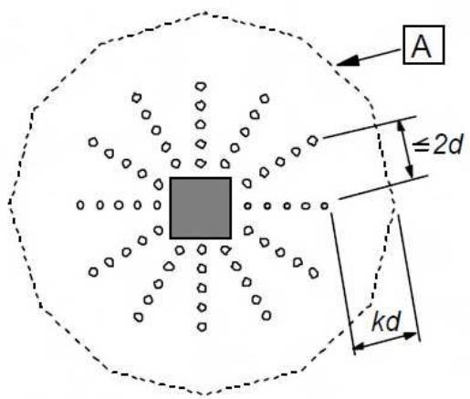
*A Perímetro u out*

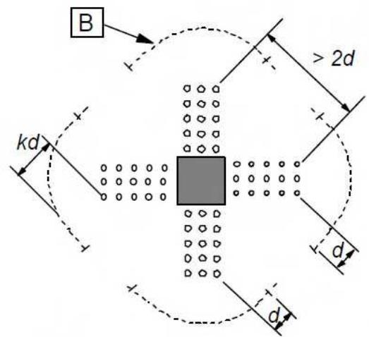
*B Perímetro u $_{out,ef}$ Figura A19.6.22 Perímetros críticos para pilares interiores*

(5) En el caso de utilizar productos patentados como armadura de punzonamiento, el valor de $V_{Rd,cs}$ debe determinarse mediante ensayos conforme con la correspondiente Evaluación Técnica Europea. Véase también el apartado 9.4.3.

## 6.5 Cálculo mediante modelos de bielas y tirantes

## 6.5.1 Generalidades

(1) Los modelos de bielas y tirantes (véase también el apartado 5.6.4) pueden utilizarse en las zonas donde exista una distribución no lineal de deformaciones (por ejemplo en apoyos, junto a zonas de concentración de cargas o tensiones planas).

## 6.5.2 Bielas

(1) La resistencia de cálculo de una biela de hormigón en una región con tensión transversal de compresión o en ausencia de tensiones transversales, puede calcularse utilizando la expresión (6.55) (véase la figura A19.6.23).

$$
\sigma_ {R d, m a x} = f _ {c d}\tag{6.55}
$$

En las zonas en las que existan compresiones multiaxiales puede ser adecuado suponer una resistencia de cálculo mayor.

Sec. I. Pág. 98380

> cve: BOE-A-2021-13681
Verificable en https://www.boe.es

<!-- pag 97 -->

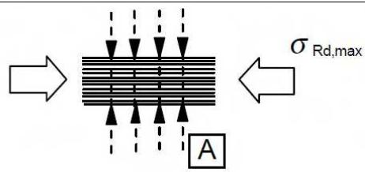

A Tensión transversal de compresión o ausencia de cualquier tipo de tensión transversal

Figura A19.6.23 Resistencia de cálculo de las bielas de hormigón sin tracción transversal

(2) La resistencia de cálculo de las bielas de hormigón debe reducirse en las zonas fisuradas sometidas a compresión y puede calcularse mediante la expresión (6.56) (véase la figura A19.6.24) salvo que se utilice una aproximación más rigurosa.

$$
\sigma_ {R d, m a x} = 0, 6 \nu^ {\prime} f _ {c d}\tag{6.56}
$$

El valor de $v'$ viene dado por la ecuación 6.57.

$$
\nu^ {\prime} = 1 - f _ {c k} / 2 5 0\tag{6.57}
$$

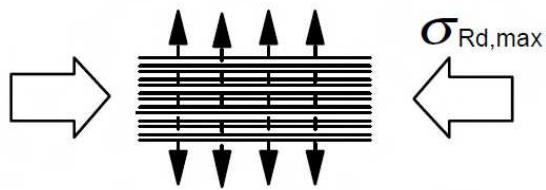
*Figura A19.6.24 Resistencia de cálculo de las bielas de hormigón con tracción transversal*

(3) En los apartados 6.2.2 y 6.2.3 se proporcionan métodos de cálculo alternativos para bielas entre áreas directamente cargadas como ménsulas o vigas cortas.

## 6.5.3 Tirantes

(1) La resistencia de cálculo de los tirantes transversales y de las armaduras debe limitarse de acuerdo con lo dispuesto en los apartados 3.2 y 3.3.

(2) La armadura debe anclarse adecuadamente en los nudos.

(3) La armadura necesaria para resistir las fuerzas en los nudos de concentración de esfuerzos puede repartirse sobre una cierta longitud (véase la figura A19.6.25 a) y b)). Cuando las armaduras de la zona del nudo se extiendan sobre una longitud importante del elemento, deben repartirse sobre la longitud en la que las trayectorias de las tensiones de compresión sean curvas (tirantes y bielas). La fuerza de tracción T puede obtenerse mediante:

a) Para regiones de discontinuidad parcial $\left(b \leq \frac{H}{2}\right)$ , véase la figura A19.6.25a:

$$
T = \frac {1}{4} \frac {b - a}{b} F\tag{6.58}
$$

b) Para regiones de discontinuidad total $\left(b > \frac{H}{2}\right)$ , véase la figura A19.6.25b:

$$
T = \frac {1}{4} \Big (1 - 0, 7 \frac {a}{h} \Big) F\tag{6.59}
$$

Sec. I. Pág. 98381

> cve: BOE-A-2021-13681
Verificable en https://www.boe.es

<!-- pag 98 -->

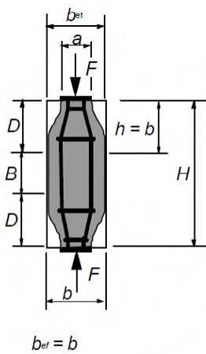
*a) Discontinuidad parcial*

*B región de continuidad
D región de discontinuidad b) Discontinuidad total Figura A19.6.25 Parámetros para la obtención de los esfuerzos transversales de tracción en un campo de tensiones de compresión con armaduras repartidas*

## 6.5.4 Nudos

(1) Las reglas para nudos son también aplicables para las zonas en las que las fuerzas concentradas se transmiten a un elemento y que no han sido calculadas mediante el método de bielas y tirantes.

(2) Las fuerzas actuantes en los nudos deben estar en equilibrio. Se deberán tener en cuenta los esfuerzos transversales de tracción perpendiculares al plano del nudo.

(3) El dimensionamiento y el armado de los nudos de concentración de esfuerzos son cruciales a la hora de determinar su capacidad resistente. Los nudos de concentración de esfuerzos pueden aparecer, por ejemplo, en zonas de aplicación de cargas puntuales, como los apoyos; en zonas de anclaje con concentración de armaduras o tendones de pretensado; en las zonas de doblado de las armaduras; y en las uniones y esquinas de los elementos.

(4) Los valores de cálculo de las tensiones de comprensión en el interior de los nudos se pueden obtener:

a) En los nudos sometidos a compresión en los que no existen tirantes anclados (véase la figura A19.6.26),

$$
\sigma_ {R d, m a x} = k _ {1} \nu^ {\prime} f _ {c d}\tag{6.60}
$$

donde $\sigma_{Rd,max}$ es la tensión máxima que puede aplicarse en los bordes del nudo. Véase el apartado 6.5.2(2) para la definición de $v'$ . Se utilizará el valor $k_{1}=1,0$ .

Sec. I. Pág. 98382

> cve: BOE-A-2021-13681
Verificable en https://www.boe.es

<!-- pag 99 -->

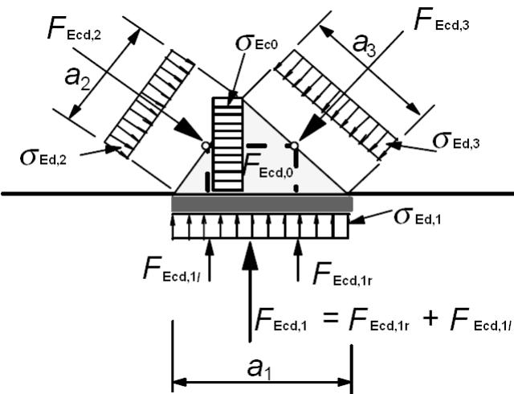
*Figura A19.6.26 Nudo sin tirantes sometido a compresión*

b) En los nudos sometidos a compresión y tracción con tirantes anclados en una dirección (véase la figura A19.6.27),

$$
\sigma_ {R d, m a x} = k _ {2} \nu^ {\prime} f _ {c d}\tag{6.61}
$$

donde $\sigma_{Rd,max}$ es la tensión máxima de $\sigma_{Ed,1}$ y $\sigma_{Ed,2}$ . Véase 6.5.2(2) para la definición de $\nu'$ . Se utilizará el valor $k_{2}=0,85$ .

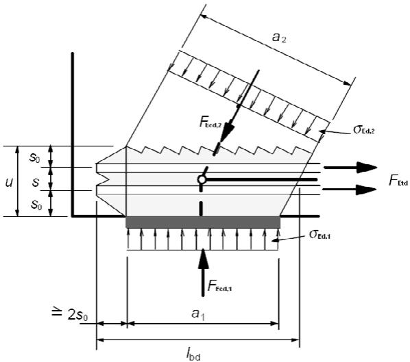
*Figura A19.6.27 Nudo sometido a compresión y tracción con armadura en una dirección*

c) En los nudos sometidos a compresión y tracción con tirantes anclados en más de una dirección (véase la figura A19.6.28).

$$
\sigma_ {R d, m a x} = k _ {3} \nu^ {\prime} f _ {c d}\tag{6.62}
$$

donde $\sigma_{Rd,max}$ es la tensión máxima de compresión que se puede aplicar a los bordes de los nudos. Véase el apartado 6.5.2(2) para la definición de $\nu'$ . Se utilizará el valor $k_{3}=0,75$ .

Sec. I. Pág. 98383

> cve: BOE-A-2021-13681
Verificable en https://www.boe.es

<!-- pag 100 -->

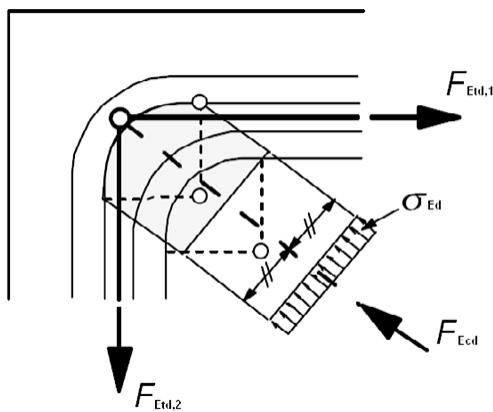
*Figura A19.6.28 Nudo sometido a tracción y compresión con armaduras en dos direcciones*

(5) Bajo las condiciones que se indican a continuación, los valores de cálculo de la tensión de compresión establecidos en el apartado 6.5.4(4) pueden incrementarse hasta un 10% cuando se produzca alguna de las siguientes circunstancias:

\- la existencia de compresión triaxial está asegurada,

\- los ángulos entre bielas y tirantes son ≥ 55°,

\- las tensiones aplicadas en apoyos o en zonas de carga puntual son uniformes y el nudo se encuentra confinado por armadura transversal,

\- la armadura está dispuesta en múltiples capas,

\- el nudo está confinado de forma segura mediante una disposición particular del apoyo o por rozamiento.

(6) Los nudos sometidos a compresión triaxial pueden comprobarse mediante las expresiones (3.24) y (3.25), tomando como límite superior $\sigma_{Rd,max} \leq k_{4}v'f_{cd}$ , si se conoce la distribución de la carga en las tres direcciones de las bielas. Se utilizará el valor $k_{4} = 3,00$ .

(7) El anclaje de la armadura en los nudos sometidos a tracción y compresión comienza en el inicio del nudo: por ejemplo, en el caso de un soporte, el anclaje comienza en su cara interior (véase la figura A19.6.27). La longitud del anclaje debe disponerse sobre toda la extensión del nudo. En ciertos casos, la armadura puede anclarse detrás del nudo. Con respecto al anclaje de las armaduras y la flexión de las mismas, véanse los apartados 8.4 a 8.6.

(8) Los nudos comprimidos en la unión de tres bielas coplanarias, pueden verificarse de acuerdo con la figura A19.6.26. Se deben comprobar los valores máximos de las tensiones principales medias en el nudo ( $\sigma_{c0}$ , $\sigma_{c1}$ , $\sigma_{c2}$ , $\sigma_{c3}$ ) conforme al apartado 6.5.4(4) a). En general se supondrá que:

$$
F _ {c d, 1} / a _ {1} = F _ {c d, 2} / a _ {2} = F _ {c d, 3} / a _ {3} \text {dando lugar a} \sigma_ {c d, 1} = \sigma_ {c d, 2} = \sigma_ {c d, 3} = \sigma_ {c d, 0}
$$

(9) Los nudos correspondientes a las zonas de doblado de las armaduras pueden analizarse de acuerdo con la figura A19.6.28. Deberá comprobarse la tensión media de las bielas conforme a lo establecido en el apartado 6.5.4(5). El diámetro del mandril deberá comprobarse de acuerdo con lo establecido en el apartado 8.3.

## 6.6 Anclajes y solapes

(1) La tensión de cálculo de adherencia está limitada a un valor que depende de las características de la superficie de las armaduras, de la resistencia a tracción del hormigón y del confinamiento del hormigón entre las armaduras. Esto depende del recubrimiento, de la armadura transversal y de la presión transversal.

Sec. I. Pág. 98384

> cve: BOE-A-2021-13681
Verificable en https://www.boe.es

<!-- pag 101 -->

(2) La longitud necesaria para desarrollar el esfuerzo de tracción requerido en un anclaje o solape, se calcula admitiendo una tensión de adherencia constante.

(3) Las reglas de aplicación relativas al dimensionamiento de los anclajes y los solapes, así como la definición de los detalles de proyecto correspondientes, se establecen en los apartados comprendidos entre el 8.4 y el 8.8, ambos inclusive.

## 6.7 Zonas parcialmente cargadas

(1) Para zonas parcialmente cargadas, deberán considerarse el aplastamiento local (véase posteriormente) y los esfuerzos transversales de tracción que se generan (véase el apartado 6.5).

(2) Para una distribución uniforme de carga en un área $A_{c0}$ (véase la figura A19.6.29), el esfuerzo resistente concentrado puede determinarse mediante la siguiente expresión:

$$
F _ {R d u} = A _ {c 0} \cdot f _ {c d} \cdot \sqrt {A _ {c 1} / A _ {c 0}} \leq 3, 0 \cdot f _ {c d} \cdot A _ {c 0}\tag{6.63}
$$

donde:

$$
A _ {c 0}
$$

$$
\text {es el área cargada}
$$

$$
A _ {c 1}
$$

es el área de distribución máxima para el cálculo, con una forma similar a $A_{c0}$ .

(3) El área de distribución $A_{c1}$ requerida por el esfuerzo resistente $F_{Rdu}$ debe cumplir las siguientes condiciones:

\- La altura de la distribución de la carga en la dirección de dicha carga se debe corresponder con la establecida en la figura A19.6.29,

\- el centro del área de distribución de cálculo, $A_{c1}$ , debe situarse sobre la línea de acción pasando por el dentro del área cargada $A_{c0}$ ,

\- en el caso de que exista más de una fuerza de compresión actuando en la sección de hormigón, las áreas de distribución calculadas no podrán superponerse.

El valor de $F_{Rdu}$ deberá reducirse si la carga no está uniformemente distribuida en el área $A_{c0}$ , o si existen esfuerzos cortantes elevados.

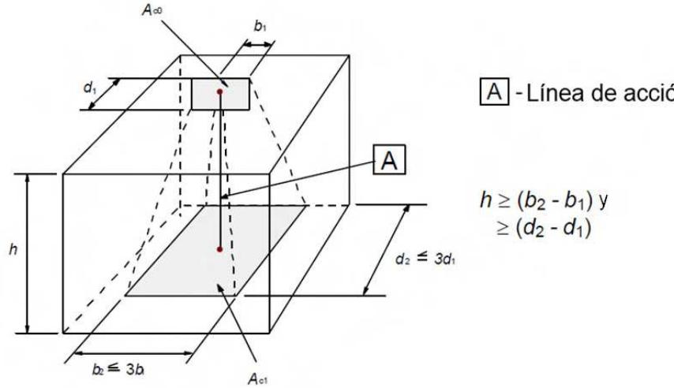
> A - Línea de acción

Figura A19.6.29 Distribución de cálculo para zonas parcialmente cargadas

(4) Se deberán disponer las armaduras necesarias para soportar el esfuerzo de tracción ocasionado por el efecto de la acción.

Sec. I. Pág. 98385

> cve: BOE-A-2021-13681
Verificable en https://www.boe.es

<!-- pag 102 -->

## 6.8 Fatiga

## 6.8.1 Condiciones de comprobación

(1) La resistencia a fatiga de las estructuras debe comprobarse en casos especiales. Esta comprobación se realizará por para el hormigón y el acero.

(2) La comprobación de fatiga debe realizarse en estructuras y elementos estructurales que vayan a estar sometidos a ciclos de carga de forma regular (por ejemplo, vigas carril para grúas o puentes expuestos a cargas elevadas de tráfico).

## 6.8.2 Esfuerzos y tensiones para la comprobación en fatiga

(1) El cálculo de las tensiones se basa en la hipótesis de secciones fisuradas, despreciando la resistencia a tracción del hormigón pero cumpliendo la compatibilidad de deformaciones.

(2) El efecto del distinto comportamiento adherente entre la armadura activa y la pasiva se tendrá en cuenta incrementando el rango de tensiones en la armadura pasiva, calculada bajo la hipótesis de adherencia perfecta mediante la aplicación de un coeficiente $\eta$ dado por:

$$
\eta = \frac {A _ {s} + A _ {p}}{A _ {s} + A _ {p} \sqrt {\xi (\phi_ {s} / \phi_ {p})}}\tag{6.64}
$$

donde:

$A_{s}$ es el área de la armadura pasiva

$A_{p}$ es el área de la armadura activa

$\phi_{s}$ es el mayor diámetro de la armadura pasiva

$\phi_{p}$ es el diámetro o diámetro equivalente de la armadura activa:

$\phi_{p} = 1,6\sqrt{A_{p}}$ para grupos de barras

$\phi_{p}=1,75\ \phi_{wire}$ para cordones de 7 alambres, donde $\phi_{wire}$ es el diámetro del alambre

$\phi_{p}=1,20\ \phi_{wire}$ para cordones de 3 alambres, donde $\phi_{wire}$ es el diámetro del alambre

$\xi$ es el cociente entre la capacidad de adherencia de la armadura activa adherente y la armadura pasiva del hormigón. El valor será el indicado en la correspondiente Evaluación Técnica Europea. En ausencia de dicho documento, se podrán utilizar los valores de la tabla A19.6.2.

Tabla A19.6.2 Relación entre la capacidad de adherencia de la armadura activa adherente y la armadura pasiva, $\xi$ .

<table><tr><td rowspan="3">Armaduras activa</td><td colspan="3"> $\xi$ </td></tr><tr><td rowspan="2">Pretesado</td><td colspan="2">postesado, adherente</td></tr><tr><td> $f_{ck} \leq 50$  $N/mm^{2}$ </td><td> $f_{ck} \geq 70$  $N/mm^{2}$ </td></tr><tr><td>Barras y alambres lisos</td><td>No aplicable</td><td>0,30</td><td>0,15</td></tr><tr><td>Cordones</td><td>0,60</td><td>0,50</td><td>0,25</td></tr><tr><td>Alambres grafilados</td><td>0,70</td><td>0,60</td><td>0,30</td></tr><tr><td>Barras corrugadas</td><td>0,80</td><td>0,70</td><td>0,35</td></tr><tr><td colspan="4">NOTA: Los valores intermedios entre  $f_{ck}$  50 y 70 pueden interpolarse.</td></tr></table>

Sec. I. Pág. 98386

> cve: BOE-A-2021-13681
Verificable en https://www.boe.es

<!-- pag 103 -->

(3) Para el cálculo de la armadura de cortante, la inclinación de las bielas de compresión, $\theta_{fat}$ , podrá determinarse utilizando un modelo de bielas y tirantes, o bien mediante la expresión (6.65).

$$
\tan {\theta_ {f a t}} = \sqrt {\tan {\theta}} \leq 1, 0\tag{6.65}
$$

donde:

θ es el ángulo que forma la biela de compresión con el eje de la viga, supuesto en el cálculo en Estado Límite Último (véase el apartado 6.2.3).

## 6.8.3 Combinación de acciones

(1) Para el cálculo del rango de tensiones se deberá distinguir entre las acciones no cíclicas y las acciones cíclicas generadoras de fatiga (cargas cuya aplicación se repite un determinado número de veces).

(2) La combinación básica para cargas no cíclicas es similar a la definición de la combinación frecuente en Estado Límite de Servicio:

$$
E _ {d} = E \bigl \{G _ {k, j}; P; \psi_ {1, 1} Q _ {k, 1}; \psi_ {2, i} Q _ {k, i} \bigr \} j \geq 1; i > 1\tag{6.66}
$$

La combinación de acciones entre llaves { } (llamada combinación básica) se puede expresar como:

$$
\sum_ {j \geq 1} G _ {k, j} \mathrm{"+"} P \mathrm{"+"} \psi_ {1, 1} Q _ {k, 1} \mathrm{"+"} \sum_ {i \geq 1} \psi_ {2, i} Q _ {k, i}\tag{6.67}
$$

NOTA: $Q_{k,1}$ y $Q_{k,i}$ son acciones no cíclicas y acciones no permanentes.

(3) Las acciones cíclicas deberán combinarse con la combinación básica desfavorable:

$$
E _ {d} = E \left\{\left\{G _ {k, j}; P; \psi_ {1, 1} Q _ {k, 1}; \psi_ {2, i} Q _ {k, i} \right\}; Q _ {f a t} \right\} j \geq 1; i > 1\tag{6.68}
$$

La combinación de acciones entre llaves { } (llamada combinación básica añadiendo las acciones cíclicas) se puede expresar como:

$$
\left(\sum_ {j \geq 1} G _ {k, j}" +" P" +" \psi_ {1, 1} Q _ {k, 1}" +" \sum_ {i \geq 1} \psi_ {2, i} Q _ {k, i}\right)" +" Q _ {f a t}\tag{6.69}
$$

donde:

$Q_{fat}$ es la carga de fatiga correspondiente (por ejemplo la carga de tráfico tal y como establece la reglamentación específica vigente u otras cargas cíclicas).

## 6.8.4 Procedimiento de comprobación para armaduras pasivas y activas

(1) El daño producido por la aplicación de un ciclo de tensiones, $\Delta\sigma$ , puede determinarse mediante la utilización de los correspondientes diagramas S-N (figura A19.6.30), tanto para la armadura pasiva como para la activa. La carga aplicada debe multiplicarse por el coeficiente $\gamma_{F,fat}$ . Además, el intervalo de tensiones resistentes para $N^{*}$ ciclos con una amplitud $\Delta\sigma_{Rsk}$ deberá dividirse entre el coeficiente de seguridad $\gamma_{S,fat} = 1,0$ .

Sec. I. Pág. 98387

> cve: BOE-A-2021-13681
Verificable en https://www.boe.es

<!-- pag 104 -->

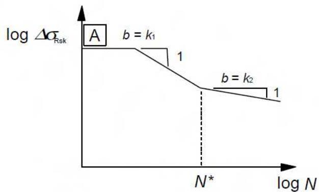

A Armadura correspondiente al límite elástico

**Figura A19.6.30 Forma del diagrama de la resistencia característica a la fatiga (diagrama S-N para armaduras pasivas y activas) Los valores de los parámetros de los diagramas S-N para armaduras pasivas y activas a utilizar se dan en las tablas A19.6.3 y A19.6.4 respectivamente. Tabla A19.6.3 Parámetros para diagramas S-N de armaduras pasivas Tabla A19.6.4 Parámetros para diagramas S-N de armaduras activas**

<table><tr><td rowspan="2">Tipo de armadura</td><td rowspan="2"> $N^{*}$ </td><td colspan="2">Exponente de las tensiones</td><td rowspan="2"> $\Delta\sigma_{Rsk}$  (N/mm2) para  $N^{*}$  ciclos</td></tr><tr><td> $k_{1}$ </td><td> $k_{2}$ </td></tr><tr><td>Barras rectas y dobladas1</td><td> $10^{6}$ </td><td>5</td><td>9</td><td>162,5</td></tr><tr><td>Barras y mallas electrosoldadas</td><td> $10^{7}$ </td><td>3</td><td>5</td><td>58,5</td></tr><tr><td>Dispositivos de empalme</td><td> $10^{7}$ </td><td>3</td><td>5</td><td>35</td></tr><tr><td colspan="5">1 Los valores de  $\Delta\sigma_{Rsk}$  son relativos a las barras rectas. Los valores para las barras dobladas deberán obtenerse utilizando un coeficiente reductor  $\zeta = 0,35 + 0,026 D/\phi$ ,donde: $D$  es el diámetro del mandril $\phi$  es el diámetro de la barra.</td></tr></table>

<table><tr><td rowspan="2">Diagramas S-N para la armadura activa</td><td rowspan="2"> $N^*$ </td><td colspan="2">Exponente de las tensiones</td><td rowspan="2"> $\Delta\sigma_{Rsk}$  (N/mm2) para  $N^*$  ciclos</td></tr><tr><td> $k_1$ </td><td> $k_2$ </td></tr><tr><td>Armadura pretesa</td><td> $10^6$ </td><td>5</td><td>9</td><td>185</td></tr><tr><td>Armadura postesa</td><td></td><td></td><td></td><td></td></tr><tr><td>Monocordones en vainas de plástico</td><td> $10^6$ </td><td>5</td><td>9</td><td>185</td></tr><tr><td>Tendones rectos o curvos en vainas de plástico</td><td> $10^6$ </td><td>5</td><td>10</td><td>150</td></tr><tr><td>Tendones curvos en vainas de acero</td><td> $10^6$ </td><td>5</td><td>7</td><td>120</td></tr><tr><td>Dispositivos de empalme</td><td> $10^6$ </td><td>5</td><td>5</td><td>80</td></tr></table>

Sec. I. Pág. 98388

> cve: BOE-A-2021-13681
Verificable en https://www.boe.es

<!-- pag 105 -->

(2) Para ciclos múltiples con amplitudes variables, el daño se puede sumar utilizando la regla de Palmgren-Miner. Por tanto, el coeficiente de daño por fatiga del acero, $D_{Ed}$ , ocasionado por las cargas de fatiga correspondientes, debe cumplir la siguiente condición:

$$
D _ {E d} = \sum_ {i} \frac {n (\Delta \sigma_ {i})}{N (\Delta \sigma_ {i})} <   1\tag{6.70}
$$

donde:

$n(\Delta\sigma_{i})$ es el número de ciclos aplicado para un rango de tensiones $\Delta\sigma_{i}$

$N(\Delta\sigma_{i})$ es el número de ciclos que es capaz de resistir para un rango de tensiones $\Delta\sigma_{i}$ .

(3) Si las armaduras, activas o pasivas, están expuestas a cargas de fatiga, las tensiones calculadas no deberán superar el límite elástico de cálculo del acero.

(4) El límite elástico se comprobará mediante ensayos de tracción del acero a emplear.

(5) En el caso de utilizar los criterios del apartado 6.8 para la comprobación de la vida útil residual de las estructuras existentes, o la comprobación de la necesidad de armaduras una vez que ha comenzado el proceso de corrosión, el rango de tensiones puede determinarse reduciendo el exponente de la tensión $k_{2}=5,0$ para barras rectas y dobladas.

(6) El rango de tensiones de las barras soldadas nunca podrá superar el correspondiente a las barras rectas y dobladas.

## 6.8.5 Comprobaciones utilizando el rango de tensiones de daño equivalente

(1) En lugar de una comprobación explícita de la resistencia al daño, conforme al apartado 6.8.4, la comprobación de fatiga para casos estándar con cargas conocidas (puentes de carretera o de ferrocarril) puede realizarse mediante:

\- El rango de tensiones de daño equivalente para el acero, de acuerdo con el apartado 6.8.5(3).

\- Las tensiones de compresión de daño equivalente para el hormigón, tal y como se indica en el apartado 6.8.7.

(2) El método del rango de tensiones de daño equivalente consiste en representar el espectro real de cargas correspondiente a la aplicación de $N^{*}$ ciclos de un rango de tensiones determinado. El Anejo 21 de este Código Estructural contiene los modelos de carga de fatiga y procedimientos de cálculo del rango equivalente de tensiones, $\Delta\sigma_{S,equ}$ , para las superestructuras de puentes de carretera y de ferrocarril.

(3) En las armaduras pasivas y activas, así como en los dispositivos de empalme, puede suponerse una resistencia a fatiga adecuada, en el caso de cumplirse la expresión (6.71):

$$
\gamma_ {F, f a t} \cdot \Delta \sigma_ {S, e q u} (N ^ {*}) \leq \frac {\Delta \sigma_ {R s k} (N ^ {*})}{\gamma_ {s , f a t}}\tag{6.71}
$$

donde:

$\Delta\sigma_{Rsk}(N^{*})$ es el rango de tensiones para $N^{*}$ ciclos, de los diagramas S-N correspondientes (véase la figura A19.6.30).

NOTA: Véase también las tablas A19.6.3 y A19.6.4.

$\Delta\sigma_{S,equ}(N^{*})$ es el rango de tensiones de daño equivalente para diferentes tipos de armadura, considerando $N^{*}$ ciclos de carga. Para edificación, $\Delta\sigma_{S,equ}(N^{*})$ es aproximadamente igual a $\Delta\sigma_{S,max}$

$\Delta\sigma_{S,max}$ es el rango máximo de tensiones del acero bajo las combinaciones de carga correspondientes.

Sec. I. Pág. 98389

> cve: BOE-A-2021-13681
Verificable en https://www.boe.es

<!-- pag 106 -->

## 6.8.6 Otras comprobaciones

(1) Se puede suponer una resistencia a la fatiga adecuada para barras sin soldar en tracción si el intervalo de tensiones bajo carga cíclica frecuente asociada a la combinación básica es $\Delta\sigma_{S} \leq k_{1}$ , siendo $k_{1} = 70 \, N/mm^{2}$ .

Para barras soldadas trabajando a tracción, se supondrá una resistencia a fatiga adecuada si el intervalo de tensiones bajo una carga cíclica frecuente asociada a la combinación básicaes $\Delta\sigma_{S} \leq k_{2}$ , siendo $k_{2} = 35 \, N/mm^{2}$ .

(2) Como simplificación del punto (1), la comprobación puede realizarse utilizando la combinación frecuente de cargas. Si se cumple dicha comprobación no será necesaria la realización de más comprobaciones.

(3) Donde se utilicen uniones soldadas o dispositivos de empalme en el hormigón pretensado, no deben existir tracciones en la sección de hormigón en un entorno de 200 mm de las armaduras (pasiva o activa), bajo una combinación frecuente de cargas, junto con un coeficiente reductor $k_{3}=0,9$ para el valor medio de la fuerza de pretensado, $P_{m}$ .

## 6.8.7 Comprobación del hormigón sometido a compresión o a cortante

(1) Se puede suponer una resistencia adecuada a fatiga para el hormigón en comprimido si se cumple la siguiente condición:

$$
E _ {c d, m a x, e q u} + 0, 4 3 \sqrt {1 - R _ {e q u}} \leq 1\tag{6.72}
$$

donde:

$$
R _ {e q u} = \frac {E _ {c d , m i n , e q u}}{E _ {c d , m a x , e q u}}\tag{6.73}
$$

$$
E _ {c d, m i n, e q u} = \frac {\sigma_ {c d , m i n , e q u}}{f _ {c d , f a t}}\tag{6.74}
$$

$$
E _ {c d, m a x, e q u} = \frac {\sigma_ {c d , m a x , e q u}}{f _ {c d , f a t}}\tag{6.75}
$$

donde:

$$
R _ {e q u} \quad \text {es la relación de tensiones}
$$

$E_{cd,min,equ}$ es el nivel mínimo de tensiones de compresión

$E_{cd,max,equ}$ es el nivel máximo de tensiones de compresión

$\sigma_{cd,max,equ}$ es la tensión máxima del rango de tensiones último para N ciclos

$\sigma_{cd,min,equ}$ es la tensión mínima del rango de tensiones último para N ciclos

$N = \text{número de ciclos} = 10^{6} \text{ ciclos}$

$f_{cd,fat}$ es el valor de cálculo de la resistencia a fatiga del hormigón, de acuerdo con (6.76)

$$
f _ {c d, f a t} = k _ {1} \beta_ {c c} (t _ {0}) f _ {c d} \left(1 - \frac {f _ {c k}}{2 5 0}\right)\tag{6.76}
$$

donde:

$\beta_{cc}(t_{0})$ es un coeficiente para la resistencia del hormigón la primera puesta en carga (véase el apartado 3.1.2(6)),

$$
t _ {0}
$$

$$
k _ {1} = 0, 8 5.
$$

es el tiempo de comienzo, en días, de la carga cíclica en el hormigón (2) Se puede admitir que la resistencia a fatiga del hormigón comprimido es adecuada si se cumple la siguiente condición:

Sec. I. Pág. 98390

> cve: BOE-A-2021-13681
Verificable en https://www.boe.es

<!-- pag 107 -->

$$
\frac {\sigma_ {c , m a x}}{f _ {c d , f a t}} \leq 0, 5 + 0, 4 5 \frac {\sigma_ {c , m i n}}{f _ {c d , f a t}}\tag{6.77}
$$

$$
\leq 0, 9 \text {para} f _ {c k} \leq 5 0 \text {mm}^2
$$

$$
\leq 0, 8 \text {para} f _ {c k} > 5 0 \mathrm{N} / \mathrm{mm} ^ {2}
$$

donde:

$\sigma_{c,max}$ es la tensión en la fibra más comprimida bajo la combinación frecuente de cargas (con la compresión medida como positiva)

$\sigma_{c,min}$ es la tensión mínima de compresión en la misma fibra en la que se produce $\sigma_{c,max}$ . Si $\sigma_{c,min}$ es una tensión de tracción se tomará $\sigma_{c,min} = 0$ .

(3) La expresión (6.77) se aplica también a las bielas de compresión de los elementos sometidos a cortante. En este caso, la resistencia del hormigón $f_{cd,fat}$ deberá reducirse mediante el coeficiente reductor de la resistencia (véase el apartado 6.2.2(6)).

(4) Para elementos que no requieren armadura de cortante de cálculo para el Estado Límite Último, se puede suponer que el hormigón es resistente a la fatiga debid0 a los efectos del cortante, si se cumple:

$$
- \text {Para} \frac {V _ {E d , m i n}}{V _ {E d , m a x}} \geq 0:
$$

$$
\frac {\left| V _ {E d , m a x} \right|}{\left| V _ {R d , c} \right|} \leq 0, 5 + 0, 4 5 \frac {\left| V _ {E d , m i n} \right|}{\left| V _ {R d , c} \right|} \leq 0, 9 \text {para} \mathrm{f} _ {\mathrm{ck}} \leq 5 0 \mathrm{N} / \mathrm{mm} ^ {2} \leq 0, 8 \text {para} \mathrm{f} _ {\mathrm{ck}} \geq 5 5 \mathrm{N} / \mathrm{mm} ^ {2}.
$$

$$
- \mathrm{Para} \frac {V _ {E d , m i n}}{V _ {E d , m a x}} <   0:\tag{6.78}
$$

$$
\frac {\left| V _ {E d , m a x} \right|}{\left| V _ {R d , c} \right|} \leq 0, 5 \frac {\left| V _ {E d , m i n} \right|}{\left| V _ {R d , c} \right|}\tag{6.79}
$$

donde:

$V_{Ed,max}$ es el valor de cálculo del esfuerzo cortante máximo aplicado bajo la combinación frecuente de cargas

$V_{Ed,min}$ es el valor de cálculo del esfuerzo cortante mínimo aplicado bajo la combinación frecuente de cargas, en la sección en la que se produce $V_{Ed,max}$

$V_{Rd,c}$ es el valor de cálculo de la resistencia a cortante de acuerdo con la expresión (6.2.a).

