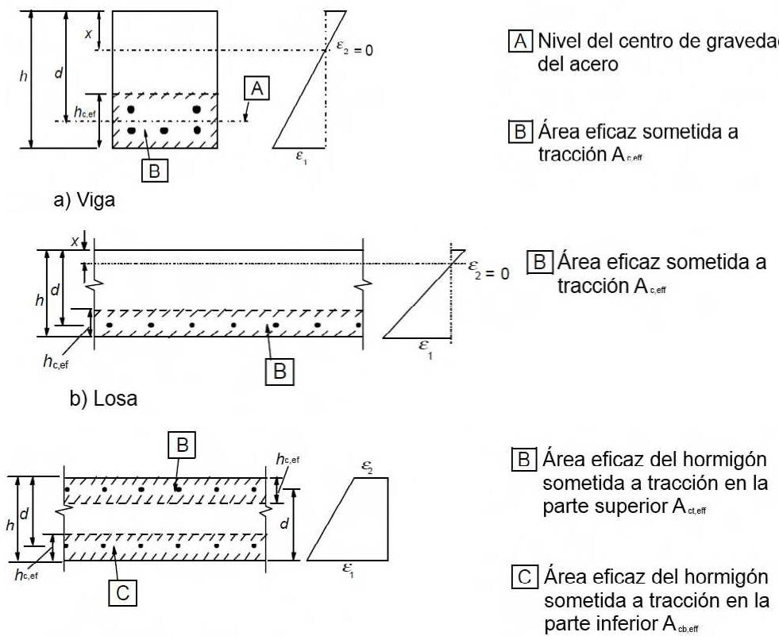
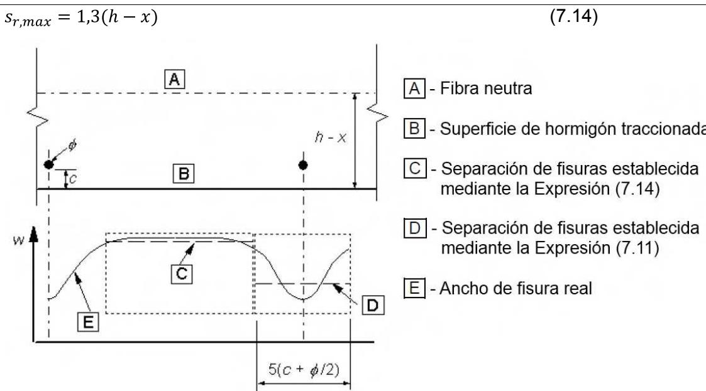

## 7 Estados Límite de Servicio (ELS)

## 7.1 Generalidades

(1) Este apartado se centra en los Estados Límites de Servicio más comunes:

\- Limitación de tensiones (véase el apartado 7.2).

\- Control de la fisuración (véase el apartado 7.3).

\- Control de las deformaciones (véase el apartado 7.4).

Sec. I. Pág. 98391

> cve: BOE-A-2021-13681
Verificable en https://www.boe.es

<!-- pag 108 -->

Otros estados límite (como el de vibración) pueden ser importantes en determinadas estructuras, pero no se tratan en este anejo.

(2) En el cálculo de tensiones y deformaciones se supone que las secciones no están fisuradas siempre que la tensión de flexotracción no supere $f_{ct,eff}$ . El valor de $f_{ct,eff}$ puede tomarse como $f_{ctm}$ o $f_{ctm,fl}$ siempre que el cálculo de la armadura mínima de tracción se base en ese mismo valor. Para el cálculo de la abertura de fisura y la rigidez a tracción, se deberá emplear $f_{ctm}$ .

## 7.2 Limitación de tensiones

(1) Se limitará la tensión de compresión en el hormigón para evitar la fisuración longitudinal, la microfisuración o altos niveles de fluencia, que podrían producir efectos inadmisibles para la funcionalidad de la estructura.

(2) La fisuración longitudinal puede aparecer si el nivel de tensiones bajo la combinación característica de cargas supera un valor crítico. Esta fisuración puede dar lugar a una reducción de la durabilidad. En ausencia de otras medidas, como aumentar el recubrimiento de la armadura de compresión o el confinamiento del hormigón mediante armaduras transversales, puede ser apropiado limitar la tensión de compresión a un valor $k_{1}f_{ck}$ en las zonas expuestas a clases de exposición XD, XF y XS (véase la tabla 27.1.a de este Código Estructural). El valor de $k_{1}$ a utilizar será $k_{1}=0,6$ .

(3) Si la tensión en el hormigón bajo cargas cuasi-permanentes es menor que $k_{2}f_{ck}$ , se puede suponer una fluencia lineal. Si la tensión supera ese valor, se debe considerar una fluencia no lineal (véase el apartado 3.1.4). El valor de $k_{2}$ a utilizar será $k_{2}=0,45$ .

(4) Se limitarán las tensiones de tracción en la armadura para evitar deformaciones anelásticas, así como niveles de fisuración y deformación inadmisibles.

(5) Si bajo la combinación característica de cargas la tensión de tracción en la armadura no supera el valor de $k_{3}f_{yk}$ puede suponerse que es posible evitar una fisuración y deformación inadmisibles. En el caso de que la tensión se produzca por una deformación impuesta su valor no deberá superar $k_{4}f_{yk}$ . El valor medio de las tensiones en las armaduras de pretensado no superará el valor $k_{5}f_{pk}$ . Los valores de $k_{3}$ , $k_{4}$ y $k_{5}$ a utilizar son 0,8, 1 y 0,75 respectivamente.

## 7.3 Control de la fisuración

## 7.3.1 Consideraciones generales

(1) La fisuración debe limitarse de manera que no perjudique la propia funcionalidad o durabilidad de la estructura o produzca una apariencia inaceptable.

(2) La fisuración es normal en las estructuras de hormigón armado sometidas a flexión, cortante, torsión o tracción resultantes de la carga directa, deformaciones impuestas o coacciones.

(3) Las fisuras pueden aparecer por otras causas como la retracción plástica o las reacciones químicas expansivas en el hormigón endurecido. Estas fisuras pueden alcanzar tamaños inadmisibles, pero su prevención y control se encuentran fuera del ámbito de esta sección.

(4) Se puede admitir que se formen las fisuras sin intentar controlar su abertura, siempre que no se perjudique al funcionamiento de la estructura.

(5) Se debe definir un valor límite para la abertura de fisura calculado ( $w_{max}$ ), teniendo en cuenta la naturaleza y el funcionamiento de la estructura, así como el coste de limitar la fisuración.

Los valores de $w_{max}$ a utilizar para las distintas clases de exposición se indican en la tabla 27.2 del apartado 27.2 de este Código Estructural.

Sec. I. Pág. 98392

> cve: BOE-A-2021-13681
Verificable en https://www.boe.es

<!-- pag 109 -->

**Tabla 27.2 Abertura máxima de la fisura**

<table><tr><td rowspan="2">Clase de exposición</td><td colspan="2"> $w_{max}$  (mm)</td></tr><tr><td>Hormigón armado(para la combinación cuasi-permanente de acciones)</td><td>Hormigón pretensado(para la combinación frecuente de acciones)</td></tr><tr><td> $X0^{(2)}, XC1^{(2)}$ </td><td>0,4</td><td>0,2</td></tr><tr><td>XC2, XC3,XF1, XF3,XC4</td><td>0,3</td><td> $0,2^{(1)}$ </td></tr><tr><td>XS1, XS2,XD1, XD2, XD3,XF2, XF4,  $XA1^{(3)}$ </td><td>0,2</td><td rowspan="2">Descompresión</td></tr><tr><td>XS3,  $XA2^{(3)}, XA3^{(3)}$ </td><td>0,1</td></tr></table>
> (1) Adicionalmente deberá comprobarse que las armaduras activas se encuentran en la zona comprimida de la sección, bajo la combinación cuasi-permanente de acciones,
> (2) Para las clases de exposición X0 y XC1, la abertura de fisura no influye normalmente en la durabilidad. Los valores recogidos en la tabla para estos casos se establecen para garantizar un aspecto aceptable,
> (3) La limitación relativa a las clases XA1, XA2 y XA3 solo será de aplicación en el caso de que el ataque químico pueda afectar a la armadura.

En ausencia de exigencias más específicas (por ejemplo, la impermeabilidad frente al agua), se puede suponer que será apropiada la limitación de la abertura de fisura a los valores de $w_{max}$ , establecidos en la tabla 27.2, en lo que se refiere al aspecto y la durabilidad en los elementos de hormigón armado de las edificaciones, bajo la combinación cuasi-permanente de cargas.

La durabilidad de los elementos pretensados puede verse afectada por la fisuración de forma crítica. En ausencia de requisitos más detallados, se puede asumir que la limitación de la abertura de fisura calculada a los valores de $w_{max}$ , establecidos en la tabla 27.2, será admisible para elementos de hormigón pretensado bajo la combinación frecuente de cargas. El límite de descompresión requiere que todas las partes de las armaduras activas adherentes o las vainas sean introducidas al menos 25 mm en el hormigón sometido a compresión.

(6) Para los elementos que únicamente tienen armadura activa no adherente, se aplicarán los mismos requisitos que para los elementos de hormigón armado. Para los elementos con una combinación de armadura activa adherente y no adherente, se aplicarán los mismos requisitos que para elementos de hormigón armado con armadura activa adherente.

(7) Es necesario tomar medidas especiales para los elementos sometidos a una clase de exposición XD3. La elección de las medidas apropiadas dependerá de la naturaleza del agente agresivo en cuestión.

(8) En el caso de utilizar modelos de bielas y tirantes con las bielas orientadas siguiendo las trayectorias de las tensiones de compresión en el estado no fisurado, es posible utilizar los esfuerzos en los tirantes para obtener las tensiones del acero y estimar asíla abertura de fisura (véase 5.6.4(2)).

Sec. I. Pág. 98393

> cve: BOE-A-2021-13681
Verificable en https://www.boe.es

<!-- pag 110 -->

(9) La abertura de fisura puede calcularse de acuerdo con el apartado 7.3.4. Una alternativa simplificada consiste en limitar el diámetro o la separación de las barras como se indica en el apartado 7.3.3.

## 7.3.2 Áreas mínimas de armadura

(1) Si es necesario controlar la fisuración deberá disponerse de una cantidad mínima de armadura adherente en las zonas sometidas a tracción. Esta cantidad puede estimarse a partir del equilibrio entre el esfuerzo de tracción del hormigón justo antes de fisurarse y el esfuerzo de tracción en la armadura sometida al límite elástico, o a una tensión menor, en el caso de que sea necesario limitar la abertura de fisura.

(2) Sin un cálculo más riguroso que demuestre que sea adecuada la utilización de una sección inferior, el área mínima de armadura se puede calcular como se indica a continuación. En secciones como vigas en T y vigas cajón, la armadura mínima debe determinarse para cada parte de la sección por separado (almas, alas).

$$
A _ {s, m i n} \sigma_ {s} = k _ {c} k f _ {c t, e f f} A _ {c t}\tag{7.1}
$$

donde:

## $A_{s,min}$ es el área mínima de armadura pasiva en la zona traccionada

$A_{ct}$ es el área de hormigón en la zona traccionada. Esta zona es la parte de la sección calculada para estar traccionada justo antes de que se forme la primera fisura

$\sigma_{s}$ es el valor absoluto de la tensión máxima permitida en la armadura inmediatamente después de que se produzca la fisura. Puede tomarse igual al límite elástico de la armadura $f_{yk}$ . Sin embargo, puede necesitarse un valor inferior que satisfaga los límites de la abertura de fisura, en función del diámetro máximo de las barras o de la separación máxima entre las mismas (véase el apartado 7.3.3(2))

$f_{ct,eff}$ es el valor medio de la resistencia a tracción del hormigón en el momento en el que se supone que aparecerán las primeras fisuras: $f_{ct,eff} = f_{ctm}$ o menor, $f_{ctm}(t)$ , si se espera la fisuración antes de 28 días

k es un coeficiente que tiene en cuenta el efecto de las tensiones no uniformes autoequilibradas, conduciendo a una reducción de los esfuerzos de coacción:

= 1,0 para almas con $h \leq 300$ mm o alas con anchos inferiores a 300 mm

= 0,65 para almas con $h \geq 800$ mm o alas con anchos superiores a 800 mm

$k_{c}$ es un coeficiente que tiene en cuenta la distribución de tensiones en la sección, inmediatamente después de la fisuración y de la modificación del brazo mecánico: para tracción pura $k_{c} = 1$ ,

para flexión pura y compuesta:

\- para secciones rectangulares y almas de secciones cajón y secciones en T:

$$
k _ {c} = 0, 4 \cdot \left[ 1 - \frac {\sigma_ {c}}{k _ {1} (h / h ^ {*}) f _ {c t , e f f}} \right] \leq 1\tag{7.2}
$$

\- para alas de secciones cajón y secciones en T:

$$
k _ {c} = 0, 9 \cdot \left[ \frac {F _ {c r}}{A _ {c t} f _ {c t , e f f}} \right] \geq 0, 5\tag{7.3}
$$

Sec. I. Pág. 98394

> cve: BOE-A-2021-13681
Verificable en https://www.boe.es

<!-- pag 111 -->

donde:

$\sigma_{c}$ es la tensión media del hormigón que actúa en la parte de la sección considerada

$$
\sigma_ {c} = \frac {N _ {E d}}{b h}\tag{7.4}
$$

$N_{Ed}$ es el esfuerzo axil en Estado Límite de Servicio en la parte de la sección considerada (esfuerzo de compresión tomado como positivo). $N_{Ed}$ deberá determinarse considerando los valores característicos de los esfuerzos axiles y de pretensado bajo la combinación de cargas correspondiente

$$
h ^ {*} \quad h ^ {*} = h \quad \text {para} h <   1, 0 m
$$

$$
h ^ {*} = 1, 0 m \quad \text {para} h \geq 1, 0 m
$$

$k_{1}$ es un coeficiente que tiene en cuenta los efectos de los esfuerzos axiles sobre la distribución de tensiones:

$k_{1} = 1,5$ si $N_{Ed}$ es un esfuerzo de compresión

$k_{1} = \frac{2h^{*}}{3h}$ si $N_{Ed}$ es un esfuerzo de tracción

$F_{cr}$ es el valor absoluto de la fuerza de tracción en el ala inmediatamente antes de producirse la primera fisura, debida al momento de fisuración calculado con $f_{ct,eff}$ .

(3) Se puede suponer que la armadura activa adherente en la zona de tracción contribuye al control de la fisuración en una distancia inferior a 150 mm desde el centro de la armadura activa. Se puede tener en cuenta sumando el término $\xi_{1}A_{p}^{\prime}\Delta\sigma_{p}$ a la expresión (7.1) donde:

$A_{p'}$ es el área de armadura activa postesa o pretesa en $A_{c,eff}$

$A_{c,eff}$ es el área eficaz del hormigón traccionado que rodea la armadura pasiva y activa con un canto $h_{c,ef}$ , donde $h_{c,ef}$ es el mínimo de 2,5(h - d), (h - x)/3 ó h/2 (véase la figura A19.7.1)

$\xi_{1}$ es el coeficiente de ajuste de la capacidad adherente, teniendo en cuenta los diferentes diámetros de la armadura activa y pasiva:

$$
\xi_ {1} = \sqrt {\xi \cdot \frac {\phi_ {s}}{\phi_ {p}}}\tag{7.5}
$$

$\xi$ es el cociente entre la capacidad adherente de la armadura activa y pasiva, de acuerdo con la tabla A19.6.2 del apartado 6.8.2

$\phi_{s}$ es el mayor diámetro de las barras de la armadura pasiva

$\phi_{p}$ es el diámetro equivalente de la armadura activa de acuerdo con el apartado 6.8.2.

Si únicamente se emplea armadura activa para el control de fisuración, $\xi_{1}=\sqrt{\xi}$

$\Delta\sigma_{p}$ es la variación de tensiones en las armaduras activas a partir del estado de deformación cero del hormigón situado en el mismo nivel.

(4) En elementos pretensados no se requiere una armadura mínima en secciones donde, bajo la combinación característica de carga y el valor característico del pretensado, el hormigón se encuentre comprimido o el valor absoluto de la tensión de tracción en el hormigón sea inferior a $\sigma_{ct,p} = f_{ct,eff}$ , establecido en el apartado 7.3.2(2).

Sec. I. Pág. 98395

> cve: BOE-A-2021-13681
Verificable en https://www.boe.es

<!-- pag 112 -->

A Nivel del centro de gravedad del acero

c) Elemento traccionado

B Área eficaz del hormigón sometida a tracción en la parte superior $A_{ct,eff}$

Figura A19.7.1 Área eficaz sometida a tracción (casos tipo)

## 7.3.3 Control de la fisuración sin cálculo directo

(1) En el caso de losas de hormigón armado y pretensado en edificación sometidas a flexión sin esfuerzos axiles de tracción significativos, no necesitan medidas específicas para el control de la fisuración si el canto total no supera los 200 mm y se aplican las disposiciones del apartado 9.3.

(2) Como simplificación, las reglas establecidas en el apartado 7.3.4 pueden presentarse en forma de tabla, limitando el diámetro o la separación de las armaduras.

NOTA: En el caso de disponer la armadura mínima establecida en el apartado 7.3.2, no es probable que la abertura de fisura sea excesiva si:

\- Para fisuras debidas fundamentalmente a coacciones no se superan los diámetros de las barras indicados en la tabla A19.7.2 cuando la tensión del acero sea el valor obtenido inmediatamente después de la fisuración (es decir, $\sigma_{s}$ en la expresión (7.1)).

\- Para fisuras debidas fundamentalmente a cargas, se satisfacen los requisidos de la tabla A19.7.2 o de la tabla A19.7.3. La tensión del acero deberá calcularse suponiendo que la sección está fisurada, bajo la combinación de cargas correspondiente.

Para hormigón con armadura pretesa, en el que se controle la fisuración fundamentalmente mediante armadura activa adherente, se pueden utilizar las tablas A19.7.2 y A19.7.3 con una tensión igual al total de las tensiones menos la tensión del pretensado. Para hormigón con armadura postesa en el que se controle la fisuración fundamentalmente con armadura pasiva, las tablas podrán utilizarse con la tensión en esta armadura, pero calculada incluyendo el efecto de las fuerzas del pretensado.

Sec. I. Pág. 98396

> cve: BOE-A-2021-13681
Verificable en https://www.boe.es

<!-- pag 113 -->

**Tabla A19.7.2 Diámetro máximo de las barras $\phi_{s}^{*}$ para el control de la fisuación $^{1}$**

<table><tr><td rowspan="2">Tensión del acero2[N/mm2]</td><td colspan="3">Diámetro máximo de la barra [mm]</td></tr><tr><td> $w_k = 0,4 \text{ mm}$ </td><td> $w_k = 0,3 \text{ mm}$ </td><td> $w_k = 0,2 \text{ mm}$ </td></tr><tr><td>160</td><td>40</td><td>32</td><td>25</td></tr><tr><td>200</td><td>32</td><td>25</td><td>16</td></tr><tr><td>240</td><td>20</td><td>16</td><td>12</td></tr><tr><td>280</td><td>16</td><td>12</td><td>8</td></tr><tr><td>320</td><td>12</td><td>10</td><td>6</td></tr><tr><td>360</td><td>10</td><td>8</td><td>5</td></tr><tr><td>400</td><td>8</td><td>6</td><td>4</td></tr><tr><td>450</td><td>6</td><td>5</td><td>-</td></tr></table>
> NOTA 1: Los valores de la tabla están basados en las siguientes condiciones:

$$
c = 2 5 \text {mm}; f _ {c t, e f f} = 2, 9 \text {N / mm} ^ {2}; h _ {c r} = 0, 5 \text {h}; (h - d) = 0, 1 h; k _ {1} = 0, 8; k _ {2} = 0, 5; k _ {c} = 0, 4; k = 1, 0; k _ {t} = 0, 4
$$

$$
\mathrm{y} k _ {4} = 1, 0.
$$

NOTA 2: Bajo la correspondiente combinación de acciones.

**Tabla A19.7.3 Separación máxima de las barras para el control de la fisuración¹**

<table><tr><td rowspan="2">Tensión del acero2[N/mm2]</td><td colspan="3">Diámetro máximo de la barra [mm]</td></tr><tr><td> $w_k = 0,4 \text{ mm}$ </td><td> $w_k = 0,3 \text{ mm}$ </td><td> $w_k = 0,2 \text{ mm}$ </td></tr><tr><td>160</td><td>300</td><td>300</td><td>200</td></tr><tr><td>200</td><td>300</td><td>250</td><td>150</td></tr><tr><td>240</td><td>250</td><td>200</td><td>100</td></tr><tr><td>280</td><td>200</td><td>150</td><td>50</td></tr><tr><td>320</td><td>150</td><td>100</td><td>-</td></tr><tr><td>360</td><td>100</td><td>50</td><td>-</td></tr></table>
> \* Para las notas véase la tabla A19.7.2

El diámetro máximo de la barra debe modificarse con el siguiente criterio:

\- Flexión (al menos una parte de la sección está comprimida):

$$
\phi_ {s} = \phi_ {s} ^ {*} (f _ {c t, e f f} / 2, 9) \frac {k _ {c} h _ {c r}}{2 (h - d)}\tag{7.6N}
$$

\- Tracción (Tracción simple):

$$
\phi_ {s} = \phi_ {s} ^ {*} (f _ {c t, e f f} / 2, 9) \frac {h _ {c r}}{8 (h - d)}\tag{7.7N}
$$

donde:

$\phi_{s}$ es el diámetro máximo modificado de la barra

$\phi_{s}^{*}$ es el diámetro máximo de la barra indicado en la tabla A19.7.2

h es el canto total de la sección

Sec. I. Pág. 98397

> cve: BOE-A-2021-13681
Verificable en https://www.boe.es

<!-- pag 114 -->

$h_{cr}$ es el canto de la zona de tracción en el momento anterior a la fisuración, considerando los valores característicos del pretensado y los esfuerzos axiles, bajo la combinación cuasi-permanente de acciones

d es la profundidad efectiva del centro de gravedad de la capa exterior de la armadura.

En el caso de que toda la sección esté traccionada, h - d será la mínima distancia desde el centro de gravedad de la capa de armadura al paramento de hormigón (si las barras no son simétricas, se considerarán ambos paramentos).

(3) En las vigas con un canto total mayor o igual a 1000 mm, en las que la armadura principal se concentra en una pequeña parte del canto, se debe disponer una armadura de piel adicional para controlar la fisuración en las caras de la viga. Esta armadura debe distribuirse de forma uniforme entre el nivel del acero en tracción y la fibra neutra, siempre dentro de los cercos. El área de la armadura de piel no debe ser inferior a la cuantía obtenida en el apartado 7.3.2(2), tomando k = 0,5 y $\sigma_{s}=f_{yk}$ . La separación y el diámetro de las barras se puede obtener del apartado 7.3.4, o empleando la simplificación de suponer tracción pura y una tensión del acero igual a la mitad del valor asignado para la armadura principal de tracción.

(4) Debe tenerse en cuenta la existencia de riesgos de aparición de grandes fisuras en aquellas secciones en las que haya cambios bruscos de tensión, como por ejemplo:

\- en cambios de sección,

\- en las zonas cercanas a cargas concentradas,

\- en las zonas en las que se han reducido las barras,

\- en zonas de tensión de adherencia elevada, particularmente en los extremos de los solapes.

Se debe procurar, siempre que sea posible, minimizar los cambios de tensión en estas secciones. Las reglas para el control de la fisuración establecidas anteriormente aseguran un control adecuado en dichas zonas, siempre que se apliquen las reglas para la definición de los detalles de armadp indicadas en los apartados 8 y 9.

(5) Se puede suponer que la fisuración debida a los efectos de las acciones tangenciales puede controlarse de forma adecuada si se cumplen las reglas para la definición de los detalles de proyecto establecidas en los apartados 9.2.2, 9.2.3, 9.3.2 y 9.4.3.

## 7.3.4 Cálculo de la abertura de fisura

(1) La abertura de fisura, $w_{k}$ , puede calcularse mediante la expresión (7.8):

$$
w _ {k} = s _ {r, m a x} (\varepsilon_ {s m} - \varepsilon_ {c m})\tag{7.8}
$$

donde:

$s_{r,max}$ es la separación máxima entre fisuras

$\varepsilon_{sm}$ es la deformación media en la armadura bajo la correspondiente combinación de cargas, incluyendo el efecto de las deformaciones impuestas y teniendo en cuenta los efectos de la rigidez a tracción. Únicamente se considera la deformación adicional producida respecto al estado de deformación cero en el hormigón situado al mismo nivel

$\varepsilon_{cm}$ es la deformación media en el hormigón entre las fisuras.

(2) $\varepsilon_{sm} - \varepsilon_{cm}$ puede calcularse mediante la siguiente expresión:

$$
\varepsilon_ {s m} - \varepsilon_ {c m} = \frac {\sigma_ {s} - k _ {t} \frac {f _ {c t , e f f}}{\rho_ {p , e f f}} (1 + \alpha_ {e} \rho_ {p , e f f})}{E _ {s}} \geq 0, 6 \frac {\sigma_ {s}}{E _ {s}}\tag{7.9}
$$

Sec. I. Pág. 98398

> cve: BOE-A-2021-13681
Verificable en https://www.boe.es

<!-- pag 115 -->

donde:

$\sigma_{s}$ es la tensión en la armadura de tracción suponiendo que la sección está fisurada. En el caso de hormigón pretensado, $\sigma_{s}$ puede sustituirse por $\Delta\sigma_{p}$ , que será la variación de tensiones en las armaduras activas a partir del estado de deformación cero en el hormigón situado al mismo nivel

\$ \alpha\_{e} \$ es el cociente \$ E\_{s}/E\_{cm} \$

$$
\rho_ {p, e f f} = \left(A _ {s} + \xi_ {1} A _ {p} ^ {\prime}\right) / A _ {c, e f f}\tag{7.10}
$$

$A_{p}$ y $A_{c,eff}$ se definen en el apartado 7.3.2 (3)

$$
\xi_ {1}
$$

de acuerdo con la expresión (7.5)

$k_{t}$ es un coeficiente que depende de la duración de la carga:

$k_{t}=0,6$ para cargas de poca duración

$k_{t}=0,4$ para cargas de mucha duración.

(3) En las situaciones en las que se dispongan armaduras adherentes, cuyos centros están muy cercanos en la zona traccionada (separación ≤ 5(c + φ/2), la separación final máxima entre fisuras puede calcularse mediante la expresión (7.11) (véase la figura A19.7.2):

$$
s _ {r, m a x} = k _ {3} c + k _ {1} k _ {2} k _ {4} \phi / \rho_ {p, e f f}\tag{7.11}
$$

donde:

$\phi$ es el diámetro de las barras. En el caso de existir varios diámetros en una sección, se empleará un diámetro equivalente $\phi_{eq}$ . Para una sección con $n_{1}$ barras de diámetro $\phi_{1}$ y $n_{2}$ barras de diámetro $\phi_{2}$ , se deberá emplear la siguiente expresión:

$$
\phi_ {e q} = \frac {n _ {1} \phi_ {1} ^ {2} + n _ {2} \phi_ {2} ^ {2}}{n _ {1} \phi_ {1} + n _ {2} \phi_ {2}}\tag{7.12}
$$

c es el recubrimiento de la armadura longitudinal

$k_{1}$ es un coeficiente que tiene en cuenta las propiedades adherentes de la armadura:

$k_{1}=0,8$ para barras de adherencia elevada

$k_{1}=1,6$ para barras con superficie eficaz lisa (por ejemplo, las armaduras de pretensado)

$k_{2}$ es un coeficiente que tiene en cuenta la distribución de deformaciones:

$k_{2}=0,5$ para flexión

$k_{2}=1,0$ para tracción pura.

Para casos de tracción excéntrica o para zonas localizadas, se podrán utilizar los valores intermedios de $k_{2}$ , obtenidos mediante la siguiente expresión:

$$
k _ {2} = (\varepsilon_ {1} + \varepsilon_ {2}) / (2 \varepsilon_ {1})\tag{7.13}
$$

donde $\varepsilon_{1}$ es la mayor deformación y $\varepsilon_{2}$ la menor deformación de tracción en las fibras extremas de la sección considerada, partiendo de la base de que la sección está fisurada

$$
k _ {3} = 3, 4
$$

$$
k _ {4} = 0, 4 2 5.
$$

En el caso de que la separación de la armadura adherente supere el valor $5(c + \phi/2)$ (véase la figura A19.7.2), o si no existe armadura adherente en la zona traccionada, se podrá disponer un límite superior para la abertura de fisura, suponiendo una separación máxima de:

Sec. I. Pág. 98399

> cve: BOE-A-2021-13681
Verificable en https://www.boe.es

<!-- pag 116 -->

(7.14)

*Figura A19.7.2 Abertura de fisura, w, en la superficie del hormigón, en función de la distancia a las armaduras*

(4) Si en elementos armados en dos direcciones ortogonales el ángulo entre los ejes de las tensiones principales y la dirección de la armadura es significativo ( $>15^{\circ}$ ), la separación entre fisuras $s_{r,max}$ se calculará mediante la siguiente expresión:

$$
s _ {r, m a x} = \frac {1}{\frac {\cos \theta}{s _ {r , m a x , y}} + \frac {\sin \theta}{s _ {r , m a x , z}}}\tag{7.15}
$$

donde:

$\theta$

es el ángulo entre la armadura en la dirección y y la dirección de la tensión de tracción principal

$s_{r,max,y}$ y $s_{r,max,z}$ es la separación entre fisuras calculada en la dirección y y la dirección z respectivamente, de acuerdo con el apartado 7.3.4 (3).

(5) Para muros sometidos a retracción térmica a edad temprana, en los que el área horizontal de acero $A_{s}$ no cumpla los requisitos establecidos en el apartado 7.3.2 y en los que el pie del muro esté coaccionado por una base previamente ejecutada, $s_{r,max}$ podrá suponerse igual a 1,3 veces la altura del muro.

NOTA: En el caso de utilizar métodos simplificados para el cálculo de la abertura de fisura, estos deberán basarse en las propiedades establecidas en este anejo, o bien justificarse mediante ensayos.

## 7.4 Control de deformaciones

## 7.4.1 Consideraciones generales

(1) La deformación de un elemento o estructura no deberá ser perjudicial para su funcionalidad y aspecto.

(2) Deben establecerse valores límite apropiados para la deformación, teniendo en cuenta la naturaleza de la estructura, los acabados, los tabiques y otros elementos estructurales, así como su función principal.

(3) Las deformaciones deben limitarse a valores compatibles con las deformaciones del resto de los elementos ligados a la estructura, como los tabiques, acristalamientos, revestimientos, servicios y acabados. En algunos casos, la limitación puede ser necesaria para asegurar la propia funcionalidad de la maquinaria o equipos soportados por la estructura, o para evitar el embalsamiento de aguas en cubiertas planas.

Sec. I. Pág. 98400

> cve: BOE-A-2021-13681
Verificable en https://www.boe.es

<!-- pag 117 -->

NOTA: Las deformaciones límite establecidas en los puntos (4) y (5) provienen de la norma ISO 4356 y, en general, aseguran un comportamiento correcto en edificios de viviendas, oficinas, edificios públicos o fábricas. Se debe comprobar que los límites sean los apropiados para la estructura considerada y que no existen requisitos especiales. La norma ISO 4356 contiene más información sobre deformaciones y valores límite.

(4) La apariencia y funcionalidad general de la estructura pueden verse afectadas en el caso de que la flecha de una viga, losa o voladizo, bajo una combinación cuasi-permanente de cargas, supere el valor longitud del vano/250. La flecha será evaluada en relación a los apoyos. Se puede utilizar una contra flecha para compensar una parte o la totalidad de la deformación pero su valor no podrá exceder de longitud del vano/250.

(5) Se deben limitar las deformaciones que pudieran dañar las partes adyacentes de la estructura. Las deformaciones diferidas para la combinación cuasi-permanente de cargas no debe superar, en general, el valor de longitud del vano/500. Pueden considerarse otros límites, dependiendo de la sensibilidad de los elementos adyacentes.

(6) El estado límite de deformaciones puede comprobarse:

\- limitando la relación luz-canto, de acuerdo con el apartado 7.4.2 o

\- comparando una deformación calculada, de acuerdo con el apartado 7.4.3, con un valor límite.

NOTA: Las deformaciones reales pueden ser diferentes de los valores estimados, particularmente si los valores de los momentos aplicados se encuentran próximos al momento de fisuración. Las diferencias dependerán de la dispersión de las propiedades del material, de las condiciones ambientales, de la historia de cargas, de las coacciones en los apoyos, de las condiciones del suelo, etc.

## 7.4.2 Casos en lo que se pueden omitir los cálculos

(1) Generalmente, no es necesario calcular las deformaciones de forma explícita, pudiéndose utilizar reglas simplificadas, como por ejemplo la limitación de la relación luz-canto, para evitar problemas de deformaciones en circunstancias normales,. Será necesario realizar comprobaciones más rigurosas en el caso de elementos que se encuentran fuera de estos límites o en aquellos otros en los que sean adecuados otros límites de deformación distintos a los implícitos en los métodos simplificados.

(2) Siempre que las vigas y losas de hormigón armado en edificación se dimensionen de manera que cumplan con la limitación luz-canto establecida en este apartado, se puede considerar que las deformaciones no van a superar los límites establecidos en el apartado 7.4.1(4) y (5). Los límites de la relación luz-canto pueden estimarse utilizando las expresiones (7.16.a) y (7.16.b), multiplicándolas por los coeficientes de corrección que tienen en cuenta el tipo de armadura y otras variables. No se han tenido en cuenta las contraflechas en la obtención de las siguientes expresiones:

$$
\frac {l}{d} = K \left[ 1 1 + 1, 5 \sqrt {f _ {c k}} \frac {\rho_ {0}}{\rho} + 3, 2 \sqrt {f _ {c k}} \left(\frac {\rho_ {0}}{\rho} - 1\right) ^ {3 / 2} \right] \quad \mathbf {s i} \rho \leq \rho_ {0}\tag{7.16.a}
$$

$$
\frac {l}{d} = K \left[ 1 1 + 1, 5 \sqrt {f _ {c k}} \frac {\rho_ {0}}{\rho - \rho^ {\prime}} + \frac {1}{1 2} \sqrt {f _ {c k}} \sqrt {\frac {\rho^ {\prime}}{\rho_ {0}}} \right] \qquad \mathbf {s i} \rho > \rho_ {0}\tag{7.16.b}
$$

donde:

$\frac{l}{d}$ es la relación luz-canto

K es el coeficiente que tiene en cuenta los diferentes sistemas estructurales, ver tabla A19.7.4

$$
\rho_ {0} \quad \text {es la cuantía geométrica de referencia de valor} 1 0 ^ {- 3} \cdot \sqrt {f _ {c k}}
$$

Sec. I. Pág. 98401

> cve: BOE-A-2021-13681
Verificable en https://www.boe.es

<!-- pag 118 -->

ρ es la cuantía geométrica de la armadura de tracción en el centro de vano necesaria para resistir las acciones de cálculo (en voladizos se utiliza la sección de arranque)

ρ' es la cuantía geométrica de la armadura de compresión en el centro de vano necesaria para resistir las acciones de cálculo (en voladizos se utiliza la sección de arranque)

$f_{ck}$ está en $N / mm^{2}$ .

Las expresiones (7.16.a) y (7.16.b) se han obtenido suponiendo una tensión en el acero de 310 N/mm $^{2}$ (se corresponde aproximadamente con $f_{yk} = 500$ N/mm $^{2}$ ), bajo la carga de cálculo apropiada en Estado Límite de Servicio y con la sección fisurada en el centro de vano de la viga o losa, o en la sección de arranque en los voladizos.

En el caso de utilizar niveles de tensión diferentes, los valores obtenidos utilizando la expresión (7.16) deberán multiplicarse por $310/\sigma_{S}$ . Normalmente se estará del lado de la seguridad al suponer que:

$$
310 / \sigma_S = 500 / (f_{yk} A_{s,req} / A_{s,prov})\tag{7.17}
$$

donde:

$\sigma_{S}$ es la tensión de tracción del acero en el centro de vano (en voladizos se utiliza la sección de arranque), bajo la carga de cálculo en Estado Límite de Servicio

$A_{s,prov}$ es el área del acero dispuesta en esta sección

$A_{s,req}$ es el área del acero necesaria en esta sección para el Estado Límite Último.

Para secciones en T o en cajón en las que la relación entre el ancho del ala y el ancho del alma sea superior a 3, los valores de l/d establecidos en la expresión (7.16) deberán multiplicarse por 0,8.

Para vigas y losas, distintas de las losas planas, con luces mayores de 7 metros, que soporten tabiques susceptibles de ser dañados por deformaciones excesivas, los valores de l/d indicados en la expresión (7.16) deberán multiplicarse por $7/l_{eff}$ (con $l_{eff}$ en metros, véase el apartado 5.3.2.2(1)).

Para losas planas en las que la luz mayor supera los 8,5 m, que soporten tabiques susceptibles de ser dañados por deformaciones excesivas, los valores de l/d indicados en la expresión (7.16) deberán multiplicarse por 8.5/ $l_{eff}$ (con $l_{eff}$ en metros).

Los valores K para su utilización se establecen en la tabla A19.7.4.

**Tabla A19.7.4 Relación luz/canto útil para elementos de hormigón armado sin esfuerzo axil de compresión.**

<table><tr><td>Sistema estructural</td><td>K</td><td>Hormigón sometido a tensión elevada $\rho = 1,5\%$ </td><td>Hormigón sometido a baja tensión $\rho = 0,5\%$ </td></tr><tr><td>Viga simplemente apoyada; losa unidireccional o bidireccional simplemente apoyada</td><td>1,0</td><td>14</td><td>20</td></tr><tr><td>Extremo del vano de una viga continua,losa unidireccional continua o losa bidireccional continua en una dirección</td><td>1,3</td><td>18</td><td>26</td></tr><tr><td>Vano interior de viga, losa unidireccional o losa bidireccional</td><td>1,5</td><td>20</td><td>30</td></tr><tr><td>Losa apoyada en pilares sin vigas (losa plana) (para grandes longitudes)</td><td>1,2</td><td>17</td><td>24</td></tr><tr><td>Voladizo</td><td>0,4</td><td>6</td><td>8</td></tr><tr><td colspan="4">NOTA 1: Los valores indicados se han seleccionado para quedar, en general, del lado de la seguridad. Por ello, el cálculo puede indicar la posibilidad de utilizar elementos más esbeltos.NOTA 2: Para losas bidireccionales, la comprobación deberá llevarse a cabo partiendo de la luz más pequeña. Para losas planas, se deberá tomar la mayor luz.NOTA 3: Los límites indicados para losas planas corresponden a un límite menos severo que el establecido para la flecha obtenida en el centro del vano luz/250. La experiencia ha demostrado que esto resulta satisfactorio.</td></tr></table>

Sec. I. Pág. 98402

> cve: BOE-A-2021-13681
Verificable en https://www.boe.es

<!-- pag 119 -->

Los valores indicados en la expresión (7.16) y en la tabla A19.7.4 proceden de los resultados de un estudio paramétrico realizado para una serie de vigas o losas simplemente apoyadas con sección rectangular, utilizando el planteamiento general del apartado 7.4.3. Se consideraron diferentes resistencias del hormigón y un límite elástico característico de 500 N/mm². Se calculó el momento último para el área de armadura de tracción considerada y la combinación cuasi-permanente de cargas se supuso igual al 50% de la carga total de cálculo correspondiente. Los límites luz/canto así obtenidos satisfacen la limitación de deformación indicada en el apartado 7.4.1 (5).

## 7.4.3 Comprobación de las deformaciones mediante el cálculo

(1) En el caso de que se considere necesario, las deformaciones deberán calcularse bajo condiciones de carga apropiadas para el propósito de la comprobación.

(2) El método de cálculo deberá representar el comportamiento real de la estructura bajo las acciones correspondientes con una precisión adecuada para los objetivos del cálculo.

(3) Los elementos que se considere que no van a recibir cargas que puedan rebasar la resistencia a tracción del hormigón se considerarán no fisurados. Aquellos otros que puedan fisurarse pero no de manera completa se considerarán en un estado intermedio entre no fisurado y totalmente fisurado, y en los elementos sometidos parcialmente a flexión su comportamiento puede estimarse a través de la expresión (7.18):

$$
\alpha = \zeta \alpha_ {I I} + (1 - \zeta) \alpha_ {I}\tag{7.18}
$$

donde:

α es el parámetro de deformación considerado que puede ser, por ejemplo, una deformación, una curvatura o un giro (Como simplificación, α puede tomarse como una flecha, véase apartado (6))

$\alpha_{I}$ y $\alpha_{II}$ son, respectivamente, los valores del parámetro calculados para una sección no fisurada y para una completamente fisurada

$\zeta$ es un coeficiente de distribución (tiene en cuenta la participación del hormigón traccionado en la sección) y y que se obtiene de la expresión (7.19):

$$
\zeta = 1 - \beta \left(\frac {\sigma_ {s r}}{\sigma_ {s}}\right) ^ {2}\tag{7.19}
$$

$\zeta = 0$ para secciones no fisuradas

Sec. I. Pág. 98403

> cve: BOE-A-2021-13681
Verificable en https://www.boe.es

<!-- pag 120 -->

β es un coeficiente que tiene en cuenta la influencia de la duración de la carga o de la repetición de una carga sobre la deformación media

= 1,0 en el caso de una carga única de corta duración

= 0,5 en el caso de una carga prolongada o de un gran número de ciclos de carga

$\sigma_{s}$ es la tensión en la armadura de tracción calculada considerando la sección como fisurada

$\sigma_{sr}$ es la tensión en la armadura de tracción calculada considerando la sección fisurada, bajo las condiciones de carga que producen la primera fisura.

NOTA: $\sigma_{sr}/\sigma_{s}$ puede cambiarse por $M_{cr}/M$ para flexión o $N_{cr}/N$ para tracción pura, donde $M_{cr}$ es el momento de fisuración y $N_{cr}$ es el esfuerzo axil de fisuración.

(4) Las deformaciones debidas a la carga pueden evaluarse utilizando la resistencia a tracción y el módulo de elasticidad efectivo del hormigón (véase (5)).

La tabla A19.3.1 indica el intervalo de valores probables para la resistencia a tracción. Como regla general, la mejor estimación del comportamiento se obtendrá si se utiliza $f_{ctm}$ . En el caso de que pueda demostrarse que no existen tensiones de tracción por esfuerzos axiles (por ejemplo causadas por la retracción o los efectos térmicos), se podrá utilizar la resistencia a tracción por flexión $f_{ctm,fl}$ (véase el apartado 3.1.8).

(5) En el caso de cargas con una duración suficiente como para dar lugar a la aparición del fenómeno de fluencia, la deformación total, incluida la de fluencia, puede calcularse utilizando de un módulo de elasticidad efectivo del hormigón, de acuerdo con la expresión (7.20):

$$
E _ {c, e f f} = \frac {E _ {c m}}{1 + \varphi (\infty , t _ {0})}\tag{7.20}
$$

donde:

$$
\varphi (\infty , t _ {0})
$$

es el coeficiente de fluencia para la carga y el intervalo de tiempo considerados (véase el apartado 3.1.4).

(6) La curvatura debida a la retracción puede evaluarse utilizando la expresión (7.21):

$$
\frac {1}{r _ {c s}} = \varepsilon_ {c s} \alpha_ {e} \frac {S}{I}\tag{7.21}
$$

donde:

$\frac{1}{r_{cs}}$ es la curvatura debida a la retracción

$\varepsilon_{cs}$ es la deformación libre de retracción (véase el apartado 3.1.4)

S es el momento estático de la sección de armadura respecto al centro de gravedad de la sección

I es el momento de inercia de la sección

$\alpha_{e}$ es el coeficiente de homogeneización efectivo, $\alpha_{e}=E_{s}/E_{c,eff}$

S e I deberán calcularse para la sección no fisurada y para la sección completamente fisurada. La estimación de la curvatura final se realizará mediante la expresión (7.18).

(7) El método más riguroso para la evaluación de las flechas, utilizando el método establecido en el punto (3), consiste en calcular la curvatura en un gran número de secciones a lo largo de la estructura para, posteriormente, calcular la deformación por integración numérica. En la mayoría de los casos, se acepta la realización del cálculo de la deformación dos veces, el primero suponiendo el elemento sin fisurar y el segundo suponiendo el elemento completamente fisurado, para posteriormente interpolar utilizando la expresión (7.18).

Sec. I. Pág. 98404

> cve: BOE-A-2021-13681
Verificable en https://www.boe.es

<!-- pag 121 -->

NOTA: En el caso de utilizar métodos simplificados para el cálculo de las deformaciones, deberán basarse en las propiedades establecidas en este anejo, además de estar justificados mediante ensayos.

