## 8 Detalles de armado para armaduras pasivas y activas. Generalidades

## 8.1 Generalidades

(1) Las reglas establecidas en este apartado se aplican armaduras pasivas (barras corrugadas, mallas electrosoldadas) y armaduras activas sometidas principalmente a cargas estáticas. Son aplicables a edificios y puentes convencionales, pero pueden no ser suficientes para:

\- elementos sometidos a cargas dinámicas de origen sísmico, vibración de máquinas o cargas de impacto,

\- elementos que incorporan armaduras con recubrimientos especiales de pinturas, epoxi o galvanizados.

Se incluyen reglas adicionales para barras de gran diámetro.

(2) Deben cumplirse los requisitos de recubrimiento mínimo de hormigón (véase apartado 43.4.1 de este Código Estructural).

(3) En el apartado 11 se incluyen reglas adicionales para el hormigón con áridos ligeros.

(4) Las reglas para las estructuras sometidas a cargas de fatiga se describen en el apartado 6.8.

## 8.2 Separación entre barras

(1) La separación entre barras deberá permitir el correcto vertido y compactación del hormigón y el desarrollo de una adherencia adecuada.

(2) La distancia libre (horizontal y vertical) entre barras paralelas, o entre capas horizontales de barras paralelas, no deberá ser inferior al mayor de los siguiente valores: $k_{1}$ veces el diámetro de la barra, $(d_{g} + k_{2} \, mm)$ , o 20 mm, donde $d_{g}$ es el tamaño máximo del árido, $k_{1} = 1 \, y \, k_{2} = 5 \, mm$ .

(3) En el caso de que las barras se dispongan en capas horizontales separadas, las barras de cada capa deberán colocarse en la misma vertical que las barras del resto de capas, de forma que exista espacio suficiente entre las columnas de barras resultantes para permitir el acceso de vibradores y la correcta compactación del hormigón.

(4) Se permitirá que las barras solapadas entren en contacto en la longitud de solape. Para más detalles véase el apartado 8.7.

## 8.3 Diámetros admisible de los mandriles para el doblado de barras

Se adoptará lo establecido en el apartado 49.3.4 de este Código Estructural, así como los criterios que se recogen a continuación.

(1) El diámetro mínimo para el doblado de una barra debe ser tal que evite la aparición de fisuras en la barra, así como la rotura del hormigón situado en el interior de la parte doblada de la barra.

(2) Para evitar daños en la armadura, el diámetro de doblado de una barra (diámetro del mandril) no deberá ser inferior a $\phi_{m,min}$ . Con carácter general, se adoptan los valores indicados en la tabla A19.8.1.

Sec. I. Pág. 98405

> cve: BOE-A-2021-13681
Verificable en https://www.boe.es

<!-- pag 122 -->

## Tabla A19.8.1 Diámetros mínimos de doblado

**Para barras y alambres**

<table><tr><td>Diámetro de la barra, en mm</td><td>Diámetro mínimo para patillas, ganchos y ganchos en U</td></tr><tr><td> $\varnothing \leq 16$ </td><td>4 $\varnothing$ </td></tr><tr><td> $\varnothing > 16$ </td><td>7 $\varnothing$ </td></tr></table>

para armadura soldada y mallazo soldado doblados después de la soldadura

<table><tr><td colspan="2">Diámetro mínimo</td></tr><tr><td></td><td></td></tr><tr><td>5ø</td><td>d ≥ 3ø 5ød &lt; 3ø o soldadura en la zona curva20ø</td></tr><tr><td colspan="2">NOTA: El tamaño del mandril para soldadura dentro de la zona curva se puede reducir a 5ø si la soldadura se realiza conforme a la norma UNE-EN ISO 17660</td></tr></table>

(3) No será necesario comprobar el diámetro del mandril para evitar el fallo del hormigónsi se cumplen las siguientes condiciones:

\- El anclaje de la barra no requiere una longitud mayor que $5\phi$ tras el final de la patilla, o bien la barra no está colocada en el borde (plano de la patilla próximo al paramento) y existe una barra transversal con un diámetro $\geq \phi$ dentro de la patilla;

\- El diámetro del mandril es mayor o igual a los valores establecidos en la tabla A19.8.1.

En otro caso, el diámetro del mandril $\phi_{m,min}$ . deberá incrementarse de acuerdo con la expresión (8.1):

$$
\phi_ {m, m i n} \geq F _ {b t} \left((1 / a _ {b}) + 1 / (2 \phi)\right) / f _ {c d}\tag{8.1}
$$

donde:

$F_{bt}$ es la fuerza de tracción procedente de las cargas últimas en una barra o grupos de barras en contacto, en el inicio de una patilla

$a_{b}$ para una barra dada (o grupos de barras en contacto), es la mitad de la distancia entre los centros de las barras (o grupos de barras), de forma perpendicular al plano de la patilla. Para una barra o grupo de barras contiguas al paramento de un elemento, $a_{b}$ puede tomarse igual al recubrimiento más $\phi/2$ .

El valor de $f_{cd}$ no deberá ser superior al valor correspondiente para un hormigón de $f_{ck} = 55 \, N/mm^{2}$ .

## 8.4 Anclaje de la armadura longitudinal

## 8.4.1 Generalidades

(3) Las patillas y los ganchos no contribuyen a los anclajes en compresión.

(4) Se debe prevenir el fallo del hormigón en las patillas mediante el cumplimiento de 8.3(3).

(5) En el caso de utilizar dispositivos mecánicos, los requisitos de los ensayos deben estar de acuerdo con la norma del producto o con la correspondiente Evaluación Técnica Europea.

(6) Para la transmisión de los esfuerzos de pretensado al hormigón véase el apartado 8.10.

Sec. I. Pág. 98406

> cve: BOE-A-2021-13681
Verificable en https://www.boe.es

<!-- pag 123 -->

## 8.4.2 Tensión última de adherencia

(1) La resistencia última de adherencia deberá ser suficiente para evitar el fallo por adherencia.

(2) El valor de cálculo de la tensión última de adherencia, $f_{bd}$ , para barras corrugadas se puede tomar como:

$$
f _ {b d} = 2, 2 5 \eta_ {1} \eta_ {2} f _ {c t d}\tag{8.2}
$$

donde:

$f_{ctd}$ es el valor de cálculo de la resistencia a tracción del hormigón de acuerdo con 3.1.6(2). Debido al aumento de la fragilidad del hormigón conforme aumenta su resistencia, $f_{ctk,0,05}$ deberá limitarse al valor correspondiente a un hormigón de $f_{ck} = 60 \, \text{N/mm}^2$ , a menos que se pueda comprobar que la resistencia de adherencia media aumenta por encima de este límite

$\eta_{1}$ es un coeficiente relacionado con las condiciones de adherencia y la posición de la barra durante el hormigonado (véase la figura A19.8.2):

$\eta_{1}=1,0$ cuando se tiene condiciones de adherencia“buenas”

$\eta_{1}=0,7$ para el resto de casos y para las barras de los elementos estructurales ejecutados mediante encofrados deslizantes, a menos que se pueda demostrar que existen condiciones de adherencia “buenas”

$\eta_{2}$ es un coeficiente relacionado con el diámetro de la barra:

$$
\begin{array}{l l} \eta_ {2} = 1, 0 & \text {para} \phi \leq 3 2 m m \\ \eta_ {2} = (1 3 2 - \phi) / 1 0 0 & \text {para} \phi > 3 2 m m. \end{array}
$$

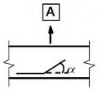

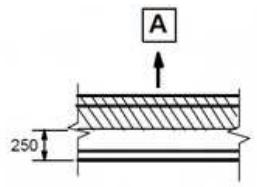
> A Dirección de hormigonado

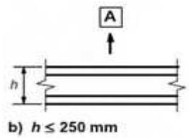

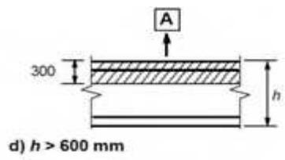

a) y b) Condiciones de adherencia “buena” para todas las barras

c) y d) Zona no sombreada - Condiciones de adherencia “buena”
Zona sombreada - Condiciones de adherencia “mala”

Figura A19.8.2 Descripción de las condiciones de adherencia

## 8.4.3 Longitud básica de anclaje

(1) El cálculo de la longitud de anclaje deberá considerar el tipo de acero y las propiedades adherentes de las barras.

(2) Suponiendo una tensión de adherencia constante igual a $f_{bd}$ , la longitud básica de anclaje, $l_{b,rqd}$ , necesaria para anclar una fuerza $A_{s}\sigma_{sd}$ en una barra recta se establece mediante:

Sec. I. Pág. 98407

> cve: BOE-A-2021-13681
Verificable en https://www.boe.es

<!-- pag 124 -->

$C_{d}=C$

$$
l _ {b, r q d} = (\phi / 4) (\sigma_ {s d} / f _ {b d})\tag{8.3}
$$

donde $\sigma_{sd}$ es la tensión de cálculo de la barra en la sección desde la que se mide el anclaje.

Los valores de $f_{bd}$ se indican en el apartado 8.4.2.

(3) Para las patillas, la longitud básica de anclaje necesaria, $l_{b,rqd}$ , y la longitud neta de anclaje, $l_{bd}$ , deben medirse a lo largo del eje de la barra (véase la figura A19.8.1a).

(4) En el caso de mallas electrosoldadas formadas por pares de alambres o barras, se debe cambiar el diámetro $\phi$ de la expresión (8.3) por el diámetro equivalente $\phi_{n} = \phi \sqrt{2}$ .

## 8.4.4 Longitud neta de anclaje

(1) La longitud neta de anclaje, $l_{bd}$ , será:

$$
l _ {b d} = \alpha_ {1} \alpha_ {2} \alpha_ {3} \alpha_ {4} \alpha_ {5} l _ {b, r q d} \geq l _ {b, m i n}\tag{8.4}
$$

donde $\alpha_{1}$ , $\alpha_{2}$ , $\alpha_{3}$ , $\alpha_{4}$ y $\alpha_{5}$ son coeficientes indicados en la tabla A19.8.2:

$\alpha_{1}$ es un coeficiente que tiene en cuenta el efecto de la forma de las barras suponiendo un recubrimiento adecuado (véase la figura A19.8.1)

$\alpha_{2}$ es un coeficiente que tiene en cuenta el efecto del recubrimiento mínimo de hormigón (véase la figura A19.8.3)

$\alpha_{3}$ es un coeficiente que tiene en cuenta el efecto del confinamiento debido a la armadura transversal

$\alpha_{4}$ es un coeficiente que tiene en cuenta la influencia de una o más barras transversales soldadas ( $\phi_{t} > 0,6\phi$ ) a lo largo de la longitud neta de anclaje $l_{bd}$ (véase también el apartado 8.6)

$\alpha_{5}$ es un coeficiente que tiene en cuenta el efecto de la presión perpendicular al plano de rotura, a lo largo de la longitud neta de anclaje

El producto $\alpha_{2}\alpha_{3}\alpha_{5}\geq0,7$

(8.5)

$l_{b,rqd}$ se toma a partir de la expresión (8.3)

$l_{b,min}$ es la longitud mínima de anclaje si no se aplica ninguna limitación:

\- Para anclajes en tracción, $l_{b,min} \geq \max\{0, 3l_{b,rqd}; 10\phi; 100\ mm\}$

\- Para anclajes en compresión, $l_{b,min} \geq \max\{0, 6l_{b,rqd}; 10\phi; 100\ mm\}$ .

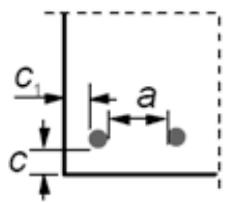
*a) Barras rectas*

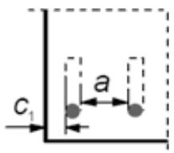
*b) Patillas o ganchos*

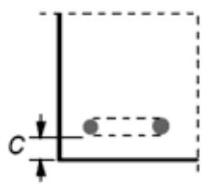
*c) Ganchos en U*

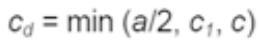
*Figura A19.8.3 Valores de $c_{d}$ para vigas y losas*

(2) Una alternativa simplificada a 8.4.4(1) consiste en considerar, en lugar de las longitudes contempladas en los procedimientos de anclaje de la figura 49.5.1.1 del Artículo 49.5 de este Código Estructural, una longitud de anclaje equivalente, $l_{b,eq}$ , con los siguientes valores:

Sec. I. Pág. 98408

> cve: BOE-A-2021-13681
Verificable en https://www.boe.es

<!-- pag 125 -->

\- $\alpha_{1}l_{b,rqd}$ para las imágenes mostradas en las figuras 49.5.1.1(b), (c) y (d) de este Código Estructural (véase la tabla A19.8.2 para los valores de $\alpha_{1}$ ),

\- $\alpha_{4}l_{b,rqd}$ para las imágenes mostradas en la figura 49.5.1.1(e) de este Código Estructural (véase la tabla A19.8.2 para los valores de $\alpha_{4}$ ),

donde:

$\alpha_{1}$ y $\alpha_{4}$ están definidos en el punto (1)

$l_{b,rqd}$ se calcula mediante la expresión (8.3).

**Tabla A19.8.2 Valores de los coeficientes $\alpha_{1}, \alpha_{2}, \alpha_{3}, \alpha_{4}$ y $\alpha_{5}$**

<table><tr><td rowspan="2">Factor de influencia</td><td rowspan="2">Tipo de anclaje</td><td colspan="2">Barra de armadura</td></tr><tr><td>Traccionada</td><td>Comprimida</td></tr><tr><td rowspan="2">Forma de las barras</td><td>Prolongación recta</td><td> $\alpha_{1} = 1,0$ </td><td> $\alpha_{1} = 1,0$ </td></tr><tr><td>Otras distintas de la prolongación recta (véase la figura 49.5.1.1(b), (c) y (d) de este Código Estructural)</td><td> $\alpha_{1} = 0,7$  si  $c_{d} > 3\phi$ ,de lo contrario, $\alpha_{1} = 1,0$  (véase figura A19.8.3 para valores de  $c_{d}$ )</td><td> $\alpha_{1} = 1,0$ </td></tr><tr><td rowspan="2">Recubrimiento de hormigón</td><td>Prolongación recta</td><td> $\alpha_{2} = 1 - 0,15 (c_{d} - \phi)/\phi$  $0,7 \leq \alpha_{2} \leq 1,0$ </td><td> $\alpha_{2} = 1,0$ </td></tr><tr><td>Otras distintas de la prolongación recta (véase la figura 49.5.1.1(b), (c) y (d) de este Código Estructural)</td><td> $\alpha_{2} = 1 - 0,15 (c_{d} - 3\phi)/\phi$  $0,7 \leq \alpha_{2} \leq 1,0$ (véase figura A19.8.3 para valores de  $c_{d}$ )</td><td> $\alpha_{2} = 1,0$ </td></tr><tr><td>Confinamiento debido a armadura transversal no soldada a la armadura principal</td><td>Todos los tipos</td><td> $\alpha_{3} = 1 - K\lambda$  $0,7 \leq \alpha_{3} \leq 1,0$ </td><td> $\alpha_{3} = 1,0$ </td></tr><tr><td>Confinamiento debido a armadura transversal soldada*</td><td>Todos los tipos, la posición y el tamaño se especifican en la figura 49.5.1.1(e) de este Código Estructural</td><td> $\alpha_{4} = 0,7$ </td><td> $\alpha_{4} = 0,7$ </td></tr><tr><td>Confinamiento debido a la presión transversal</td><td>Todos los tipos</td><td> $\alpha_{5} = 1 - 0,04p$  $0,7 \leq \alpha_{5} \leq 1,0$ </td><td>-</td></tr><tr><td colspan="4">donde: $\lambda = \left( \sum A_{st} - \sum A_{st,min} \right)/A_{s}$  $\sum A_{st}$  área de la sección de armadura transversal a lo largo de la longitud básica de anclaje  $l_{bd}$ . $\sum A_{st,min}$  área de la armadura transversal mínima. Para vigas y losas será igual a  $0,25A_{s}$ . $A_{s}$  área de una barra individual anclada de diámetro máximo. $K$  valores mostrados en la figura A19.8.4. $p$  presión transversal [ $N/mm^{2}$ ] para el Estado Límite Último a lo largo de  $l_{bd}$ .</td></tr><tr><td>*</td><td colspan="3">Véase también 8.6: Para apoyos directos  $l_{bd}$  puede tomar valores menores que  $l_{b,min}$  en el caso de que exista al menos un alambre transversal soldado en el interior del apoyo. Dicho alambre deberá ubicarse al menos a 15  $mm$  desde la cara del apoyo.</td></tr></table>

Sec. I. Pág. 98409

> cve: BOE-A-2021-13681
Verificable en https://www.boe.es

<!-- pag 126 -->

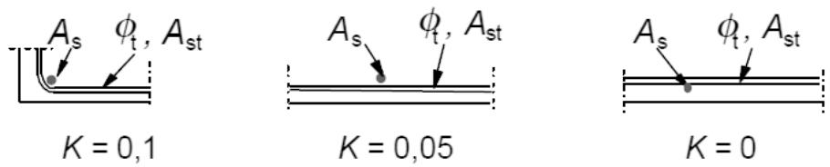
*Figura A19.8.4 Valores de K para vigas y losas*

## 8.5 Anclaje de cercos y armaduras de cortante

(1) El anclaje de cercos y armaduras de cortante debe realizarse mediante patillas y ganchos, o mediante armadura transversal soldada. Debe disponerse una barra dentro del gancho o patilla.

(2) El anclaje debe cumplir con lo indicado en la figura A19.8.5. Las soldaduras se realizarán conforme a la norma UNE-EN ISO 17660, además de presentar una capacidad de soldadura conforme a lo establecido en el apartado 8.6 (2).

NOTA: Para la definición de los ángulos de doblado véase la figura 49.5.1.1 de este Código Estructural.

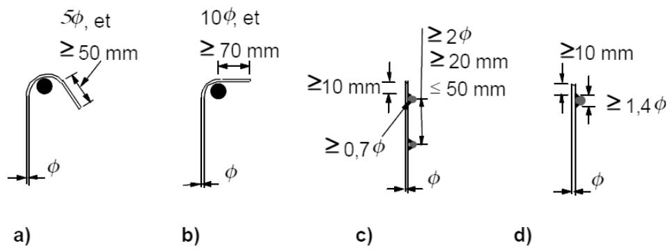
*NOTA: Para c) y d) el recubrimiento no deberá ser inferior a 3∅ o 50 mm. Figura A19.8.5 Anclaje de las armaduras transversales*

## 8.6 Anclaje mediante barras soldadas

(1) Además de los anclajes indicados en los apartados 8.4 y 8.5, se puede realizar un anclaje mediante la utilización de barras transversales soldadas (véase la figura A19.8.6) embebidas en el hormigón. Se deberá demostrar que la calidad de las uniones soldadas es la adecuada.

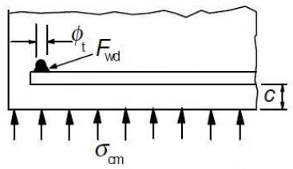
*Figura A19.8.6 Barra transversal soldada utilizada como dispositivo de anclaje*

(2) La capacidad de anclaje de una barra transversal (con un diámetro comprendido entre 14 mm y 32 mm), soldada en la cara interior de la barra principal, será $F_{btd}$ . Por ello, en la expresión (8.3) se podrá reducir $\sigma_{sd}$ mediante $F_{btd}/A_{s}$ , donde $A_{s}$ es el área de la sección de la barra y $F_{btd}$ se define mediante la expresión (8.8).

$$
F _ {b t d} = l _ {t d} \phi_ {t} \sigma_ {t d} \sin \text {superar el valor de} F _ {w d}\tag{8.8}
$$

Sec. I. Pág. 98410

> cve: BOE-A-2021-13681
Verificable en https://www.boe.es

<!-- pag 127 -->

## donde:

$F_{wd}$ es el valor de cálculo de la resistencia a cortante de la soldadura (definido como $A_{s}f_{yd}$ multiplicado por un coeficiente, por ejemplo $0,5A_{s}f_{yd}$ , donde $A_{s}$ es el área de la sección de la barra anclada y $f_{yd}$ es el límite de elasticidad de cálculo)

$l_{td}$ es la longitud de cálculo de la barra transversal:

$$
l _ {t d} = 1, 1 6 \phi_ {t} \big (f _ {y d} / \sigma_ {t d} \big) ^ {0, 5} \leq l _ {t}
$$

$l_{t}$ es la longitud de la barra transversal. No deberá ser mayor que la separación de las barras que van a anclarse

$\sigma_{td}$ es la tensión del hormigón; $\sigma_{td} = (f_{ctd} + \sigma_{cm}) / y \leq 3f_{cd}$

$\sigma_{cm}$ es la tensión de compresión en el hormigón perpendicular a las dos barras (valor medio, tomando la compresión positiva)

y es una función: $y = 0,015 + 0,14e^{(-0,18x)}$

x es una función que tiene en cuenta la geometría: $x = 2(c/\phi_{t}) + 1$

c es el recubrimiento de hormigón perpendicular a las dos barras.

(3) Si dos barras del mismo diámetro se sueldan, cada una en un lado opuesto de la barra que va a ser anclada, la capacidad calculada en el apartado 8.6(2) puede duplicarse siempre que el recubrimiento de la barra exterior cumpla lo establecido en el Capítulo 9 de este Código Estructural.

(4) Si se sueldan dos barras en el mismo lado, con una separación de $3\phi$ , la capacidad de anclaje debe multiplicarse por un coeficiente de valor 1,41.

(5) Para barras de diámetro nominal menor o igual a 12 mm, la capacidad de anclaje de la barra transversal soldada depende principalmente de la resistencia de cálculo de la unión soldada. Esta se podrá calcular mediante la siguiente expresión:

$$
F _ {b t d} = F _ {w d} \leq 1 6 A _ {s} f _ {c d} \phi_ {t} / \phi_ {l}\tag{8.9}
$$

donde:

$F_{wd}$ es la resistencia de cálculo a cortante de la soldadura (véase el apartado 8.6(2))

$\phi_{t}$ es el diámetro nominal de la barra transversal: $\phi_{t} \leq 12$ mm

$\phi_{l}$ es el diámetro nominal de la barra que se va a anclar: $\phi_{l} \leq 12$ mm.

En el caso de utilizar dos barras transversales soldadas con una separación mínima de $\phi_{t}$ , se debe multiplicar la capacidad de anclaje (establecida mediante la expresión (8.9)) por un coeficiente igual a 1,41.

## 8.7 Solapes y empalmes mecánicos

## 8.7.1 Generalidades

(1) Los esfuerzos se transmiten de una barra a otra mediante:

\- solape de barras, con o sin patillas o ganchos,

\- soldaduras,

\- dispositivos mecánicos que aseguran la transferencia de la carga en tracción y compresión, o únicamente en compresión.

Sec. I. Pág. 98411

> cve: BOE-A-2021-13681
Verificable en https://www.boe.es

<!-- pag 128 -->

## 8.7.2 Solapes

(1) La definición de los detalles de proyecto de los solapes de las barras deberán ser tales que:

\- se asegure la transmisión de esfuerzos de una barra a otra,

\- no se produzca el desconchamiento del hormigón en las zonas próximas a las uniones,

\- no se produzcan grandes fisuras que puedan afectar al comportamiento de la estructura.

(2) Los solapes deben:

\- estar escalonados entre las barras y no estar localizados en las zonas de solicitaciones elevadas (por ejemplo, en rótulas plásticas). Las excepciones se establecen en el apartado (4) posterior,

\- estar dispuestos de forma simétrica en cualquier sección.

(3) La disposición de las barras solapadas debe ser tal que cumpla lo establecido en la figura A19.8.7:

\- la distancia libre entre barras solapadas no debe ser mayor que $4\phi$ , de acuerdo a lo establecido en el apartado 49.5.2.2 de este Código Estructural. Si no se cumple esta condición, la longitud de solape deberá incrementarse en una longitud igual a la distancia libre entre barras,

\- la distancia longitudinal entre dos solapes adyacentes no deberá ser inferior a 0,3 veces la longitud de solape, $l_{0}$ ,

\- en el caso de dos solapes adyacentes, la distancia libre entre las barras adyacentes no deberá ser inferior a 2φ o 20 mm.

(4) Si se cumple lo indicado en el punto (3), la proporción admisible de barras solapadas traccionadas será del 100% en el caso de que las barras se encuentren en una capa. Si las barras están dispuestas en varias capas, esta proporción se reducirá al 50 %.

Todas las barras comprimidas y la armadura secundaria (de distribución) pueden solaparse en una sección.

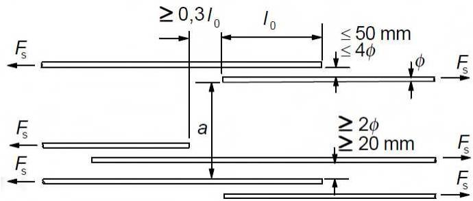
*Figura A19.8.7 Solapes adyacentes*

## 8.7.3 Longitud de solape

(1) La longitud de solape de cálculo será:

$$
l _ {0} = \alpha_ {1} \alpha_ {2} \alpha_ {3} \alpha_ {5} \alpha_ {6} l _ {b, r q d} \geq l _ {0, m i n}\tag{8.10}
$$

donde:

$l_{b,rqd}$ se calcula mediante la expresión (8.3),

$$
l _ {0, m i n} \geq m a x \{0, 3 \alpha_ {6} l _ {b, r q d}; 1 5 \phi ; 2 0 0 m m \}\tag{8.11}
$$

Los valores de $\alpha_{1}$ , $\alpha_{2}$ , $\alpha_{3}$ y $\alpha_{5}$ pueden tomarse de la tabla A19.8.2; sin embargo, para el cálculo de $\alpha_{3}$ , se tomará $\sum A_{st,min} = 1,0 A_{s}(\sigma_{sd}/f_{yd})$ , donde $A_{s}$ es el área de la barra solapada.

Sec. I. Pág. 98412

> cve: BOE-A-2021-13681
Verificable en https://www.boe.es

<!-- pag 129 -->

$\alpha_{6} = (\rho_{1}/25)^{0,5}$ (siempre dentro del intervalo comprendido entre 1,0 y 1,5), donde $\rho_{1}$ es el porcentaje de armadura solapada en una longitud igual o inferior a 0,65 $l_{0}$ desde el centro de la longitud de solape considerada (véase la figura A19.8.8). Los valores de $\alpha_{6}$ se indican en la tabla A19.8.3.

**Tabla A19.8.3 Valores del coeficiente $\alpha_{6}$**

<table><tr><td>Porcentaje de barras solapadas con respecto al total del área de la sección,  $\rho_{1}$ </td><td>&lt; 25%</td><td>33%</td><td>50%</td><td>&gt; 50%</td></tr><tr><td> $\alpha_{6}$ </td><td>1</td><td>1,15</td><td>1,4</td><td>1,5</td></tr><tr><td colspan="5">NOTA: Los valores intermedios podrán determinarse mediante interpolación.</td></tr></table>

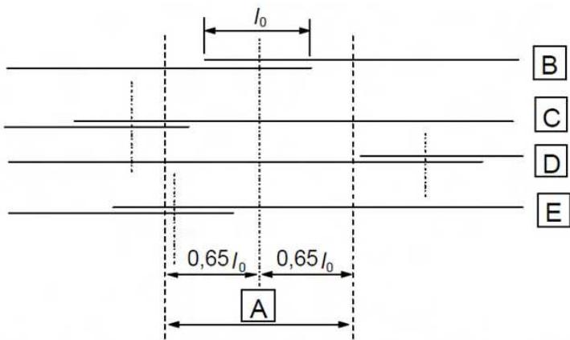
*Ejemplo: Las barras II y III están fuera de la sección considerada: $\rho_{1} = 50\%$ y $\alpha_{6} = 1,4$ Figura A19.8.8 Porcentaje de barras solapadas en una sección respecto al total de barras*

## 8.7.4 Armadura transversal en la zona de solape

## 8.7.4.1 Armadura transversal para barras sometidas a tracción

(1) Para resistir los esfuerzos transversales de tracción será necesaria la disposición de una armadura transversal en la zona de solape.

(2) En el caso de que el diámetro, $\phi$ , de las barras solapadas sea inferior a 20 mm, o el porcentaje de barras solapadas en alguna sección sea inferior al 25 %, se considerará, sin más justificaciones, que cualquier armadura transversal necesaria por otras razones puede ser suficiente para equilibrar los esfuerzos transversales de tracción.

(3) En el caso de que el diámetro, $\phi$ , de las barras solapadas sea mayor o igual a 20 mm la armadura transversal debe tener un área total $A_{st}$ (suma de todas las ramas paralelas a la capa empalmada de la armadura), no inferior al área $A_{s}$ de la barra solapada ( $\sum A_{st} \geq 1,0 A_{s}$ ). Las barras transversales deben disponerse de forma perpendicular a la dirección de la armadura solapada.

Si más del 50% de la armadura está solapada en un punto y la distancia a entre los solapes adyacentes en una sección es ≤ 10φ (véase la figura A19.8.7), la armadura transversal deberá estar formada por cercos o barras en U ancladas en la sección.

(4) Se deben disponer las armaduras transversales previstas en el punto (3) en las secciones extremas del solape, tal y como se muestra en la figura A19.8.9(a).

Sec. I. Pág. 98413

> cve: BOE-A-2021-13681
Verificable en https://www.boe.es

<!-- pag 130 -->

## 8.7.4.2 Armadura transversal para barras sometidas permanentemente a compresión

(1) Además de las reglas para las barras traccionadas, debe disponerse una barra transversal fuera de la longitud del solape y en cada uno de sus lados, a una distancia inferior a $4\phi$ de los extremos de dicha longitud (figura A19.8.9b).

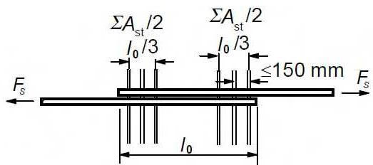
*a) Barras traccionadas*

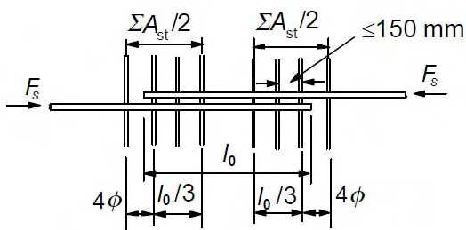
*b) Barras comprimidas Figura A19.8.9 Armadura transversal para uniones solapadas*

## 8.7.5 Solapes para mallas electrosoldadas

## 8.7.5.1 Solape de la armadura principal

(1) Los solapes pueden realizarse mediante mallas acopladas o mediante mallas superpuestas (figura A19.8.10).

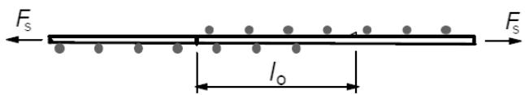
*a) Mallas acopladas (sección longitudinal)*

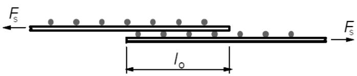
*b) Mallas superpuestas (sección longitudinal)*

Figura A19.8.10 Solape de mallas electrosoldadas

(2) Se debe emplear la disposición de mallas acopladas en el caso de que existan cargas de fatiga.

(3) Para mallas acopladas, las disposiciones de solape relativas a las barras longitudinales principales deben ajustarse a lo establecido en el apartado 8.7.2. Se ignorará cualquier efecto favorable de las barras transversales, tomando así $\alpha_{3}=1,0$ .

(4) Para mallas superpuestas, los solapes de la armadura principal deben estar situados en zonas en las que las tensiones calculadas en la armadura, para el Estado Límite Último, no sean superiores al 80% de la resistencia de cálculo.

Sec. I. Pág. 98414

> cve: BOE-A-2021-13681
Verificable en https://www.boe.es

<!-- pag 131 -->

(5) En el caso de que la condición (4) anterior no se cumpla, el canto útil del acero para el cálculo de la resistencia a flexión, de acuerdo con el apartado 6.1, debe aplicarse a la capa más alejada de la cara traccionada. Además, cuando se lleve a cabo la comprobación de la fisuración en las zonas cercanas al extremo del solape, la tensión del acero utilizada en las tablas A19.7.2 y A19.7.3 deberá incrementarse en un 25 %, debido a la discontinuidad en dichos extremos.

(6) El porcentaje de la armadura principal, que puede solaparse en una sección cualquiera, debe cumplir con lo siguiente:

Para mallas acopladas, se pueden aplicar los valores establecidos en la tabla A19.8.3.

Para mallas superpuestas, el porcentaje admisible de la armadura principal que puede solaparse en una sección cualquiera, dependerá del área específica de la sección de la malla soldada dispuesta $(A_{s}/s)_{prov}$ , donde s es la separación de los elementos de la malla:

$$
- 100\% \text{si} (A_s / s)_{prov} \leq 1200 \text{mm}^2 / m,
$$

$$
- 60\% \text{ si } (A_s / s)_{prov} > 1200 \text{ mm}^2 / m.
$$

Para el caso de múltiples capas, la distancia entre las uniones deberá ser al menos $1,3l_{0}$ ( $l_{0}$ se determina mediante el apartado 8.7.3).

(7) No será necesaria la utilización de armadura transversal adicional en la zona del solape.

## 8.7.5.2 Solape de armadura secundaria o de reparto

(1) Toda la armadura secundaria debe solaparse en el mismo punto.

Los valores mínimos para la longitud de solape $l_{0}$ se indican en la tabla A19.8.4. En el caso de dos barras de armadura secundaria, esta longitud de solape deberá ser suficiente como para poder abarcar, al menos, dos barras de la armadura principal.

**Tabla A19.8.4 Longitudes de solape requeridas para los elementos secundarios de las mallas**

<table><tr><td>Diámetro de los elementos secundarios (mm)</td><td>Longitudes de solape</td></tr><tr><td> $\phi \leq 6$ </td><td> $\geq 150 \text{ mm}$ ; al menos 1 hueco de malla (2 soldaduras) en la longitud de solape</td></tr><tr><td> $6 < \phi \leq 8,5$ </td><td> $\geq 250 \text{ mm}$ ; al menos 2 huecos de malla (3 soldaduras)</td></tr><tr><td> $8,5 < \phi \leq 12$ </td><td> $\geq 350 \text{mm}$ ; al menos 2 huecos de malla (3 soldaduras)</td></tr></table>

## 8.8 Reglas adicionales para barras de gran diámetro

(1) En el caso de utilizar barras con un diámetro superior a $\phi_{large} = 32 \, mm$ , las reglas que se establecen en los siguientes apartados sustituyen a las establecidas en los apartados 8.4 y 8.7.

(2) Cuando se utilicen barras de gran diámetro, el control de la fisuración puede realizarse mediante la utilización de armadura de piel (véase el apartado 9.2.4) o mediante el cálculo (véase el apartado 7.3.4).

(3) En el caso de utilizar barras de gran diámetro, los esfuerzos de rotura del recubrimiento y el efecto pasador serán mayores. Estas barras deberán anclarse mediante dispositivos mecánicos. Como alternativa, podrán anclarse mediante barras rectas, pero deberán disponerse cercos a modo de armadura de confinamiento.

Sec. I. Pág. 98415

> cve: BOE-A-2021-13681
Verificable en https://www.boe.es

<!-- pag 132 -->

(4) No se deben realizar uniones por solape en barras de gran diámetro, salvo en los casos de secciones con una dimensión mínima de 1,0 m, o si la tensión en la armadura no supera el 80% de la resistencia última de cálculo.

(5) En las zonas de anclaje en las que no exista compresión transversal, debe disponerse una armadura transversal adicional a la de cortante.

(6) Para longitudes rectas de anclaje (véase la figura A19.8.11 para la notación utilizada), la armadura adicional prevista en el apartado (5) no debe ser inferior a las siguientes:

\- En dirección paralela a la cara traccionada:

$$
A _ {s h} = 0, 2 5 A _ {s} n _ {1}\tag{8.12}
$$

\- En dirección perpendicular a la cara traccionada:

$$
A _ {s v} = 0, 2 5 A _ {s} n _ {2}\tag{8.13}
$$

donde:

$A_{s}$ es el área de la sección de la armadura anclada

$n_{1}$ es el número de capas con barras ancladas en el mismo punto del elemento

$n_{2}$ es el número de barras ancladas en cada capa.

(7) La armadura transversal adicional debe distribuirse de forma uniforme en la zona del anclaje. Además la separación de las barras no debe ser superior a 5 veces el diámetro de la armadura longitudinal.

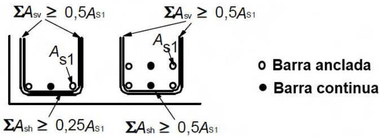

Ejemplo: En el caso de la izquierda $n_1 = 1$ , $n_2 = 2$ ; en el caso de la derecha $n_1 = 2$ , $n_2 = 2$

Figura A19.8.11 Armadura adicional en un anclaje para barras de gran diámetro en ausencia de compresión transversal

(8) En el caso de armaduras de piel se aplica lo establecido en el apartado 9.2.4, pero el área de esta armadura no debe ser inferior a 0,01 $A_{ct,ext}$ en la dirección perpendicular a las barras de gran diámetro; y 0,02 $A_{ct,ext}$ en la dirección paralela a estas barras.

## 8.9 Grupo de barras

## 8.9.1 Generalidades

1) A menos que se indique lo contrario, las reglas para barras aisladas también son de aplicación para grupos de barras. En un grupo, todas las barras deben tener las mismas características (tipo y calidad). Las barras de distintos tamaños podrán agruparse siempre que la relación entre los diámetros no supere el valor 1,7.

(2) En el cálculo el grupo de barras se reemplaza por una barra teórica con la misma área y el mismo centro de gravedad. El diámetro equivalente, $\phi_{n}$ , de esta barra teórica debe ser tal que cumpla:

$$
\phi_ {n} = \phi \sqrt {n _ {b}} \leq 5 5 m m\tag{8.14}
$$

Sec. I. Pág. 98416

> cve: BOE-A-2021-13681
Verificable en https://www.boe.es

<!-- pag 133 -->

donde:

$$
n _ {b}
$$

es el número de barras del grupo, que estará limitado a:

$n_{b} \leq 4$ para barras verticales comprimidas y barras en una unión por solape

$n_{b} \leq 3$ para el resto de casos.

(3) Para los grupos de barras se aplicarán las reglas establecidas en el apartado 8.2 sobre la separación entre barras. Deberá utilizarse el diámetro equivalente, $\phi_{n}$ , midiendo la distancia libre entre grupos de barras desde el contorno real exterior del conjunto. El recubrimiento de hormigón tendrá que medirse igualmente desde el contorno real exterior del grupo de barras y no ser inferior a $\phi_{n}$ .

(4) Si dos barras en contacto se disponen una encima de la otra, bajo unas condiciones de adherencia "buenas", dichas barras no serán consideradas como un grupo.

## 8.9.2 Anclaje de grupos de barras

(1) Los grupos de barras sometidas a tracción pueden reducirse sobre los apoyos extremos e intermedios. Aquellos con un diámetro equivalente < 32 mm pueden reducirse cerca de un soporte, sin necesidad de llevar a cabo una transición de las barras. Los conjuntos con un diámetro equivalente ≥ 32 mm, que están anclados cerca de un soporte, deben disponerse con una transición de las barras como la mostrada en la figura A19.8.12.

(2) En el caso de barras individuales, ancladas y con una longitud de transición superior a $1,3l_{b,rqd}$ (donde $l_{b,rqd}$ se determina a partir del diámetro de la barra), se podrá utilizar el diámetro de la barra para la obtención de $l_{bd}$ (véase la figura A19.8.12). Si las condiciones anteriormente descritas no son suficientes, se deberá utilizar el diámetro equivalente del grupo, $\phi_{n}$ .

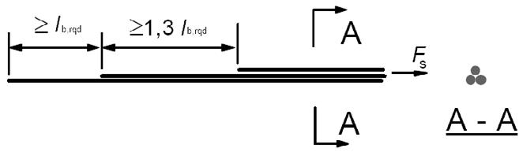
*Figura A19.8.12 Anclaje de barras escalonadas de un grupo con una longitud de transición importante*

(2) No será necesaria la transición de los grupos de barras para el caso de anclajes comprimidos. Para aquellos grupos cuyo diámetro equivalente sea ≥ 32 mm, se deberán disponer al menos cuatro cercos con un diámetro ≥ 12 mm, en el extremo final del grupo. Deberá disponerse un cerco adicional justo después del final de la transición de barras.

## 8.9.3 Solape de grupos de barras

(1) La longitud de solape debe calcularse de acuerdo con el apartado 8.7.3, utilizando $\phi_{n}$ (a partir del apartado 8.9.1(2)) como el diámetro equivalente de la barra.

(2) Para grupos de dos barras con diámetro equivalente < 32 mm, las barras pueden solaparse sin necesidad de escalonar barras. En este caso, deberá utilizarse el tamaño de la barra equivalente para el cálculo de $l_{0}$ .

(3) Para grupos de dos barras con diámetro equivalente $\geq 32$ mm, o de tres barras, las barras individuales se deberán escalonar en la dirección longitudinal al menos $1,3l_{0}$ , como se muestra en la figura A19.8.13, en la que la longitud del solape se calcula a partir del diámetro de una barra aislada. Para este caso, la barra número 4 se utiliza como barra de solape. Se debe tener especial cuidado a la hora de asegurar que no se dispongan más de cuatro barras en las secciones solapadas. Los grupos de más de tres barras no deberán solaparse.

Sec. I. Pág. 98417

> cve: BOE-A-2021-13681
Verificable en https://www.boe.es

<!-- pag 134 -->

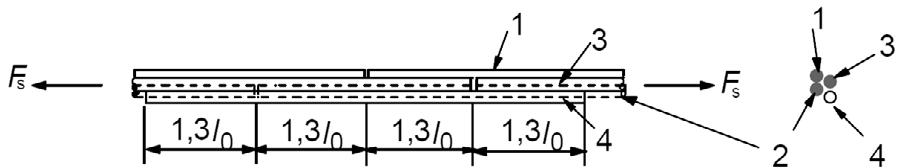
*Figura A19.8.13 Unión mediante solape de barras traccionadas, incluyendo una cuarta barra*

## 8.10 Armaduras activas

8.10.1 Disposición de las armaduras de pretensado y de las vainas

## 8.10.1.1 Generalidades

(1) La separación entre vainas de armaduras activas pretesas deberá ser tal que se asegure un correcto vertido y compactación del hormigón además de una adherencia suficiente entre el hormigón y la armadura activa.

## 8.10.1.2 Armadura activa pretesa

(1) La separación mínima entre armaduras activas pretesas, tanto en horizontal como en vertical, debe estar de acuerdo con lo establecido en la figura A19.8.14. Se pueden adoptar otras disposiciones siempre que los resultados de los ensayos muestren un comportamiento final satisfactorio en lo que se refiere a:

\- el hormigón comprimido en el anclaje,

\- el desconchamiento del hormigón,

\- el anclaje de la armadura activa pretesa,

\- el vertido del hormigón entre las armaduras activas.

Se debe tener presente también la durabilidad y al daño por corrosión de la armadura pretesa en los extremos de los elementos.

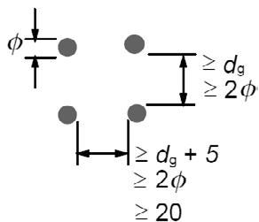

NOTA: Donde $\phi$ es el diámetro de la armadura pretesa y $d_{g}$ el tamaño máximo del árido.

Figura A19.8.14 Distancias libres mínimas entre los tendones de la armadura pretesa

(2) No deben agruparse armaduras activas en las zonas de anclaje a menos que el vertido y compactación del hormigón pueda llevarse a cabo correctamente y se pueda conseguir una adherencia suficiente entre el hormigón y la armadura activa.

## 8.10.1.3 Vainas de postesado

(1) Las vainas de la armadura activa postesa deberán situarse y ejecutarse de forma que:

\- el hormigón se pueda verter de forma segura sin dañar las vainas,

\- el hormigón pueda absorber los esfuerzos de las vainas en las zonas curvas durante y después del tesado,

Sec. I. Pág. 98418

> cve: BOE-A-2021-13681
Verificable en https://www.boe.es

<!-- pag 135 -->

\- no se filtre la lechada en otras vainas durante el proceso de inyección.

(2) Las vainas para elementos postesados no deben agruparse, salvo en el caso de pares de vainas dispuestas en la misma vertical.

(3) La distancia libre mínima entre las vainas deberá cumplir con lo establecido en la figura A19.8.15.

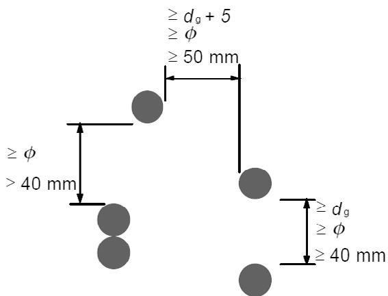
*NOTA: Donde $\phi$ es el diámetro de la vaina para la armadura postesa y $d_{g}$ el tamaño máximo del árido. Figura A19.8.15 Distancia libre mínima entre vainas*

## 8.10.2 Anclaje de la armadura activa pretesa

## 8.10.2.1 Generalidades

(1) En las zonas de anclaje de la armadura activa pretesa, se deben considerar los siguientes parámetros de la longitud de anclaje (véase la figura A19.8.16):

a) Longitud de transmisión, $l_{pt}$ , en la que se transmite completamente la fuerza de pretensado ( $P_{0}$ ) al hormigón; véase el apartado 8.10.2.2(2),

b) Longitud de dispersión, $l_{disp}$ , en la que las tensiones del hormigón pasan gradualmente a una distribución lineal en la sección de hormigón; véase el apartado 8.10.2.2(4),

c) Longitud de anclaje, $l_{bpd}$ , en la que la fuerza de la armadura activa, $F_{pd}$ , en Estado Límite Último, se encuentra completamente anclada en el hormigón(véanse los apartados 8.10.2.3(4)y (5)).

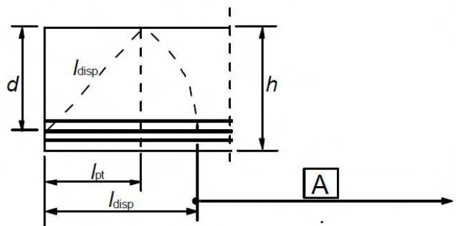

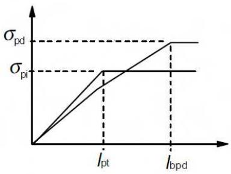
*A Distribución lineal de tensiones en la sección de un elemento Figura A19.8.16 Transferencia del pretensado en elementos pretesos; definición de los parámetros de longitud a considerar*

Sec. I. Pág. 98419

> cve: BOE-A-2021-13681
Verificable en https://www.boe.es

<!-- pag 136 -->

## 8.10.2.2 Transferencia de los esfuerzos de pretensado

(1) Se puede suponer que al liberar la armadura activa el pretensado se transfiere al hormigón mediante una tensión de adherencia constante $f_{bpt}$ :

$$
f _ {b p t} = \eta_ {p 1} \eta_ {1} f _ {c t d} (t)\tag{8.15}
$$

donde:

$\eta_{p1}$ es un coeficiente que tiene en cuenta el tipo de armaduraactiva y la situación adherente en el momento de la transferencia

$$
\eta_ {p 1} = 2, 7 \text {para alambres grafilados}
$$

$$
\eta_ {p 1} = 3, 2
$$

$$
\eta_ {1}
$$

= 0,7 para el resto de casos, a menos que pueda justificarse un valor superior con respecto a unas circunstancias particulares de ejecución

$f_{ctd}(t)$ es la resistencia de cálculo a tracción del hormigón en el momento de transferencia del pretensado; $f_{ctd}(t) = \alpha_{ct} \cdot 0,7 \cdot f_{ctm}(t)/\gamma_{C}$ (véanse también los apartados 3.1.2(9) y 3.1.6(2)).

NOTA: Podrán emplearse los valores de $\eta_{p1}$ para otros tipos de armadura activa, diferentes a las indicadas anteriormente, siempre que estén respaldados por un Documento de Idoneidad Técnica Europeo.

(2) El valor básico de la longitud de transmisión, $l_{pt}$ , se establece mediante:

$$
l _ {p t} = \alpha_ {1} \alpha_ {2} \phi \sigma_ {p m 0} / f _ {b p t}\tag{8.16}
$$

donde:

$\alpha_{1}$ = 1,0 para una transmisión del pretensado gradual

$$
\alpha_ {2}
$$

$$
\phi
$$

$\sigma_{pm0}$ es la tensión de la armadura activa justo después de la transmisión del pretensado.

(3) El valor de cálculo de la longitud de transmisión debe tomarse igual al valor menos favorable de los siguientes, dependiendo de la situación de cálculo:

$$
l _ {p t 1} = 0, 8 l _ {p t}\tag{8.17}
$$

0

$$
l _ {p t 2} = 1, 2 l _ {p t}\tag{8.18}
$$

NOTA: Normalmente, se emplea el menor valor para las comprobaciones de tensiones locales en el momento de la transferencia del pretensado y el mayor valor para los Estados Límite Últimos (cortante, anclaje, etc.).

(4) Puede suponerse que las tensiones en el hormigón seguirán una distribución lineal fuera de la longitud de dispersión (véase la figura A19.8.16):

$$
l _ {d i s p} = \sqrt {l _ {p t} ^ {2} + d ^ {2}}\tag{8.19}
$$

Sec. I. Pág. 98420

> cve: BOE-A-2021-13681
Verificable en https://www.boe.es

<!-- pag 137 -->

(5) Se puede suponer una composición alternativa del pretensado, si está debidamente justificada y si la longitud de transmisión se modifica en consecuencia.

## 8.10.2.3 Anclaje de la armadura activa en el Estado Límite Último

(1) Debe comprobarse el anclaje de las armaduras activas en las secciones en las que la tensión de tracción del hormigón supere $f_{ctk,0,05}$ . El esfuerzo de la armadura activa debe calcularse suponiendo una sección fisurada, incluyendo el efecto del cortante de acuerdo con el apartado 6.2.3(7); véase también el apartado 9.2.1.3. En el caso de que la tensión de tracción del hormigón sea inferior a $f_{ctk,0,05}$ , no será necesaria la comprobación del anclaje.

(2) La resistencia de adherencia del anclaje en el Estado Límite Último es:

$$
f _ {b p d} = \eta_ {p 2} \eta_ {1} f _ {c t d}\tag{8.20}
$$

donde:

$\eta_{p2}$ es un coeficiente que tiene en cuenta el tipo de armadura activa y la situación adherente en el anclaje

$$
\eta_ {p 2} = 1, 4 \text {para alambres grafilados}
$$

$$
\eta_ {p 2} = 1, 2 \text {para cordones de 7 alambres}
$$

$\eta_{1}$ conforme a lo indicado en el apartado 8.10.2.2(1).

NOTA: Podrán emplearse los valores de $\eta_{p2}$ para otros tipos de armaduras activas, diferentes a las indicadas anteriormente, siempre que estén respaldados por un Documento de Idoneidad Técnica Europeo.

(3) Debido al incremento de la fragilidad del hormigón a medida que aumenta su resistencia del hormigón, $f_{ctk,0,05}$ deberá limitarse al valor correspondiente a $f_{ck} = 60 \, N/mm^{2}$ , a menos que se pueda comprobar que la capacidad de adherencia media se encuentre por encima de este valor límite.

(4) La longitud total de anclaje para anclar la armadura activa sometida a una tensión $\sigma_{pd}$ será:

$$
l _ {b p d} = l _ {p t 2} + \alpha_ {2} \phi (\sigma_ {p d} - \sigma_ {p m \infty}) / f _ {b p d}\tag{8.21}
$$

donde:

$l_{pt2}$ es el valor superior de cálculo de la longitud de transmisión, véase el apartado 8.10.2.2(3)

$\alpha_{2}$ se define en el apartado 8.10.2.2(2)

$\sigma_{pd}$ es la tensión de la armadura activa correspondiente al esfuerzo descrito en el punto (1)

$\sigma_{pm\infty}$ es la tensión del pretensado después de todas las pérdidas.

(5) En la figura A19.8.17 se muestran las tensiones del pretensado en la zona del anclaje.

Sec. I. Pág. 98421

> cve: BOE-A-2021-13681
Verificable en https://www.boe.es

<!-- pag 138 -->

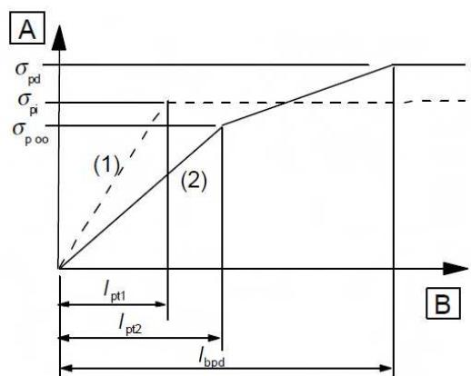
*Figura A19.8.17 Tensiones en la zona del anclaje de elementos pretesos: (1) en el momento de transferencia del pretensado, (2) en el Estado Límite Último*

A Tensión en la armadura de pretensado

B Distancia desde el extremo

(6) En el caso de combinar armaduras pasivas con armaduras activas pretesas, se podrán sumar las capacidades de anclaje de cada una.

## 8.10.3 Zonas de anclaje de elementos postesos

(1) El cálculo de las zonas de anclaje debe realizarse de acuerdo con las reglas establecidas en este apartado y las que se recogen en el apartado 6.5.3.

(2) Al considerar los efectos del pretensado como una fuerza concentrada en la zona de anclaje, el valor de cálculo del pretensado deberá ser conforme con el apartado 2.4.2.2(3) y deberá utilizarse la resistencia característica inferior a tracción del hormigón.

(3) Deberán comprobarse las tensiones tras las placas de anclaje conforme a la correspondiente Evaluación Técnica Europea.

(4) Los esfuerzos de tracción debidos a cargas concentradas deben evaluarse mediante un modelo de bielas y tirantes, o a través de otras representaciones adecuadas (véase el apartado 6.5). La armadura debe disponerse suponiendo que trabajará con la resistencia de cálculo. Si la tensión en esta armadura está limitada a 300 N/mm², no será necesaria la realización de la comprobación de la abertura de fisura.

(5) Para simplificar, se puede admitir que el ángulo de dispersión de la fuerza de pretensado comienza a partir del extremo del dispositivo de anclaje y es igual a $2\beta$ , suponiendo $\beta = \arctan 2/3$ .

Vista en planta de las alas

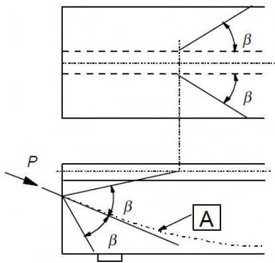
*Figura A19.8.18 Dispersión del pretensado*

$$
\beta = \arctan (2 / 3) = 3 3, 7 ^ {\circ}
$$

A Armadura de pretensado

Sec. I. Pág. 98422

> cve: BOE-A-2021-13681
Verificable en https://www.boe.es

<!-- pag 139 -->

## 8.10.4 Anclajes y acopladores para armaduras de pretensado

(1) Los dispositivos de anclaje utilizados en armadura postesas deben ser conformes con lo especificado para el sistema de pretensado utilizado. Las longitudes de anclaje de las armaduras pretesas deberán permitir el desarrollo completo de la resistencia de cálculo de la armadura activa, teniendo en cuenta los efectos de cualquier acción repetitiva de variación rápida.

(2) En el caso de utilizar acopladores, estos deberán ajustarse a las especificaciones de los dispositivos para el sistema de pretensado empleado. Debido a la interferencia causada por estos dispositivos, se deberán colocar de manera que no afecten a la capacidad portante del elemento, además de permitir la correcta introducción de los anclajes provisionales que puedan ser necesarios durante la construcción.

(3) Los cálculos para los efectos locales en el hormigón y para la armadura transversal deben realizarse de acuerdo con lo establecido en los apartados 6.5 y 8.10.3.

(4) Los acopladores deben situarse lejos de los apoyos intermedios.

(5) Debe evitarse la disposición de acopladores en el 50% o más de la armadura activa en una misma sección, a menos que se pueda demostrar que un porcentaje superior no supone un riesgo mayor para la seguridad de la estructura.

## 8.10.5 Desviadores

(1) Un desviador deberá satisfacer los siguientes requisitos:

\- resistir los esfuerzos longitudinales y transversales procedentes de la armadura activa y transmitirlos a la estructura,

\- asegurar que el radio de curvatura de la armadura no le produzca una sobretensión o daño.

(2) En las zonas de desviación, los tubos que constituyen las vainas deben ser capaces de soportar la presión radial y el movimiento longitudinal de la armadura activa, sin sufrir daños y sin perjudicar su buen funcionamiento.

(3) El radio de curvatura de la armadura activa en la zona de desviación deberá ser conforme con la correspondiente Evaluación Técnica Europea.

(4) Son admisibles desviaciones de cálculo de la armadura activa de hasta 0,01 radianes sin que sea necesaria la utilización de un desviador. Los esfuerzos generados por la variación angular ocasionada por la utilización de un desviador, conforme con la correspondiente Evaluación Técnica Europea, deberán tenerse en cuenta en los cálculos para el dimensionamiento.

