## 9 Detalles de armado de elementos y reglas particulares

## 9.1 Generalidades

(1) Los requisitos de seguridad, capacidad de servicio y durabilidad se satisfacen mediante el cumplimiento de las reglas contenidas en este capítulo y las reglas generales indicadas en otros apartados.

(2) La definición de los detalles de armado de los elementos debe ser coherente con los modelos de cálculo adoptados.

(3) Las cuantías mínimas de armadura se establecen para evitar la rotura frágil, las fisuras de gran tamaño y también para resistir las fuerzas procedentes de acciones coaccionadas.

NOTA: Las reglas contenidas en este apartado se refieren, fundamentalmente, a edificios de hormigón armado.

Sec. I. Pág. 98423

> cve: BOE-A-2021-13681
Verificable en https://www.boe.es

<!-- pag 140 -->

## 9.2 Vigas

## 9.2.1 Armadura longitudinal

## 9.2.1.1 Cuantías máximas y mínimas de armadura

(1) El área de la armadura longitudinal de tracción no debe ser inferior a $A_{s,min}$ .

NOTA: Véase también el apartado 7.3 para el área de la armadura longitudinal de tracción con el fin de controlar la fisuración.

El valor a utilizar de $A_{s,min}$ se establece mediante la expresión (9.1)

$$
A _ {s, m i n} = \frac {\mathrm{W}}{z} \frac {f _ {c t m , f l}}{f _ {y d}}\tag{9.1}
$$

donde:

z es el brazo mecánico en las sección en Estado Límite Último, que puede calcularse de forma aproximada como z = 0,8h

W es el módulo resistente de la sección bruta relativo a la fibra más traccionada

$f_{ctm,fl}$ es la resistencia media a flexotracción

$f_{yd}$ es la resistencia de cálculo de las armaduras pasivas en tracción.

De forma alternativa, y en el caso de elementos secundarios en los que sea admisible un cierto riesgo de rotura frágil, $A_{s,min}$ se podrá tomar igual a 1,2 veces el área necesaria en la comprobación en Estado Límite Último.

(2) Las secciones que contengan una cuantía de armadura inferior a $A_{s,min}$ se considerarán como secciones sin armar (véase el apartado 12).

(3) El área de la sección de la armadura de tracción o de compresión no debe superar $A_{s,max} = 0,04 A_{c}$ fuera de las zonas de solape.

(4) Para elementos pretensados con armaduras activas no adherentes de forma permanente, o con cables exteriores de pretensado, se debe comprobar que el momento último resistente es superior al momento de fisuración a flexión. Será suficiente un momento resistente de 1,15 veces el momento de fisuración.

## 9.2.1.2 Otros detalles de armado

(1) En construcción monolítica, incluso cuando en proyecto se han considerado apoyos simples, la sección en los apoyos se debe dimensionar para el momento flector resultante de un empotramiento parcial, con un valor de al menos $\beta_{1}$ veces el máximo momento flector en el vano. El valor de $\beta_{1}$ a utilizar será 0,15.

NOTA: Se aplica el área mínima de la sección de armadura longitudinal definida en el apartado 9.2.1.1(1).

(2) En los apoyos intermedios de las vigas continuas, el área total de la armadura de tracción $A_{s}$ de las secciones en T o en cajón debe repartirse sobre el ancho eficaz del ala (véase el apartado 5.3.2). Una parte de esta armadura puede estar concentrada en el ancho del alma (véase la figura A19.9.1).

Sec. I. Pág. 98424

> cve: BOE-A-2021-13681
Verificable en https://www.boe.es

<!-- pag 141 -->

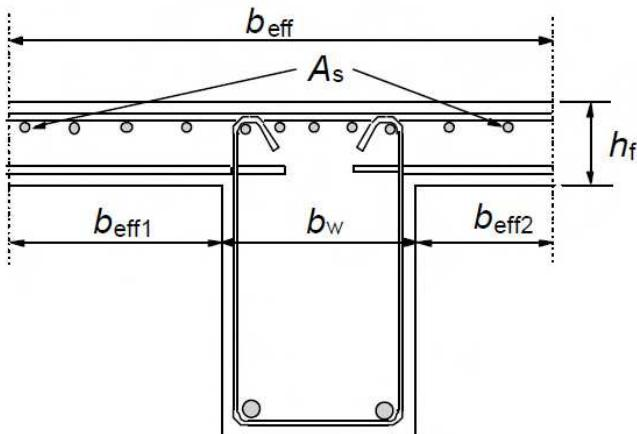
*Figura A19.9.1 Disposición de la armadura de tracción en secciones en T o en cajón*

(3) Las armaduras longitudinales de compresión (de diámetro $\phi$ ) incluidas en el cálculo de la resistencia, deben sujetarse mediante una armadura transversal con una separación no mayor de $15\phi$ .

## 9.2.1.3 Decalaje de la armadura longitudinal de tracción

(1) En todas las secciones se debe disponer la armadura suficiente para resistir la envolvente de las fuerzas de tracción actuantes, incluyendo el efecto de las fisuras inclinadas en almas y alas.

(2) Para los elementos con armadura de cortante, la fuerza adicional de tracción, $\Delta F_{td}$ , debe calcularse de acuerdo con el apartado 6.2.3(7). Para los elementos sin esta armadura de cortante, $\Delta F_{td}$ se puede estimar desplazando la ley de momentos una distancia $a_{l} = d$ de acuerdo con el apartado 6.2.2(5). Esta “regla de decalaje” puede emplearse como alternativa para los elementos con armadura de cortante donde:

$$
a _ {l} = z (\cot \theta - \cot \alpha) / 2 \quad \text {(notación definida en el apartado 6.2.3)} \tag {9.2}
$$

La fuerza de tracción adicional se muestra en la figura A19.9.2.

(3) La resistencia de las barras, en la zona correspondiente a la longitud de anclaje, puede tenerse en cuenta considerando una variación lineal de la fuerza, véase la figura 9.2. Como simplificación del lado de la seguridad, se podrá ignorar esta contribución.

(4) La longitud de anclaje de una barra levantada que contribuye a la resistencia a cortante, no debe ser inferior a $1,3l_{bd}$ en la zona traccionada y $0,7l_{bd}$ en la zona comprimida. Se medirá desde el punto de intersección de los ejes de la barra levantada y la armadura longitudinal.

Sec. I. Pág. 98425

> cve: BOE-A-2021-13681
Verificable en https://www.boe.es

<!-- pag 142 -->

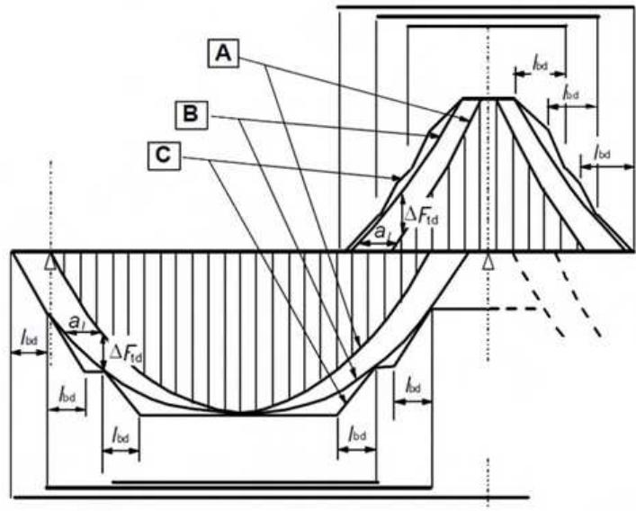
*A -Envolvente de $M_{Ed}/z + N_{Ed}$ B - Fuerza de tracción actuante $F_{s}$ C - Fuerza de tracción resistente $F_{\mathrm{Rs}}$*

Figura A19.9.2 Imagen del decalaje de la armadura longitudinal, teniendo en cuenta el efecto de las fisuras inclinadas y la resistencia de la armadura en la longitud de anclaje

## 9.2.1.4 Anclaje de la armadura inferior en los apoyos extremos

(1) El área de la armadura inferior dispuesta en los apoyos extremos, suponiendo un empotramiento leve o nulo en el cálculo, deberá ser al menos $\beta_{2}$ veces el área de las armaduras dispuestas en el vano. El valor de $\beta_{2}$ a utilizar será 0,25.

(2) La fuerza de tracción que se debe anclar, se puede determinar de acuerdo con el apartado 6.2.3(7) (elementos con armadura de cortante), incluyendo la contribución del esfuerzo axil si existe, o aplicando la regla de decalaje:

$$
F _ {E d} = | V _ {E d} | \cdot a _ {l} / z + N _ {E d}\tag{9.3}
$$

donde $N_{Ed}$ es el esfuerzo axil a añadir o quitar al esfuerzo de tracción; para $a_{l}$ véase el apartado 9.2.1.3(2).

(3) La longitud de anclaje es $l_{bd}$ , de acuerdo con el apartado 8.4.4, medida desde la línea de contacto entre la viga y el apoyo. Se puede tener en cuenta la presión transversal en los apoyos directos. Véase la figura A19.9.3.

Sec. I. Pág. 98426

> cve: BOE-A-2021-13681
Verificable en https://www.boe.es

<!-- pag 143 -->

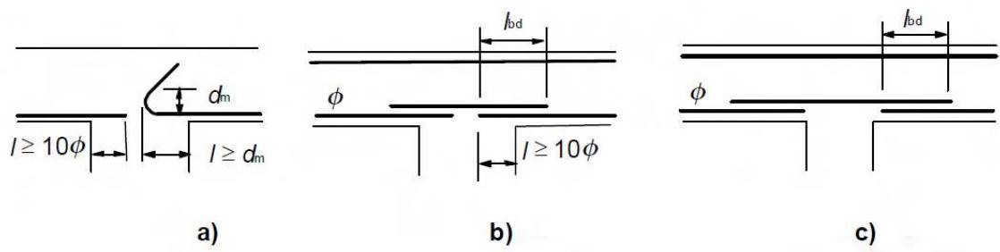
*Figura A19.9.4 Anclaje de armadura inferior en apoyos intermedios*

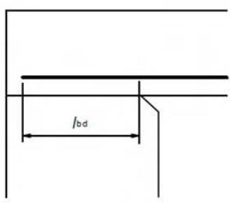
*a) Apoyo directo: Viga apoyada en muro o pilar*

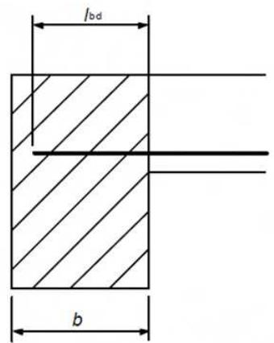
*b) Apoyo indirecto: Viga apoyada en otra viga Figura A19.9.3 Anclaje de la armadura inferior en los apoyos extremos*

## 9.2.1.5 Anclaje de la armadura inferior en los apoyos intermedios

(1) Se aplica el área de armadura que se establece en el apartado 9.2.1.4(1).

(2) La longitud de anclaje no debe ser inferior a $10\phi$ (para barras rectas) o al diámetro del mandril (para ganchos y patillas con diámetros mayores o iguales a 16 mm), o a dos veces el diámetro del mandril (para otros casos) (véase la figura A19.9.4(a)). Estos valores mínimos son normalmente válidos, pero puede llevarse a cabo un análisis más preciso de acuerdo con el apartado 6.6.

(3) En el proyecto se debe especificar la armadura necesaria para resistir los posibles momentos positivos (por ejemplo en el asiento del apoyo, explosión, etc.). Esta armadura deberá ser continua, lo que se puede conseguir mediante el solape de barras (véase la figura A19.9.4(b) o (c)).

## 9.2.2 Armadura de cortante

(1) La armadura de cortante debe formar un ángulo $\alpha$ comprendido entre $45^{\circ}$ y $90^{\circ}$ con el eje longitudinal del elemento estructural.

(2) La armadura de cortante pueden estar compuesta por una combinación de:

\- Cercos que envuelven la armadura longitudinal de tracción y la zona de compresión (véase la figura A19.9.5),

\- Barras levantadas,

\- Jaulas, escaleras, etc. que se hormigonan sin envolver la armadura longitudinal, pero se anclan debidamente en las zonas de tracción y compresión.

Sec. I. Pág. 98427

> cve: BOE-A-2021-13681
Verificable en https://www.boe.es

<!-- pag 144 -->

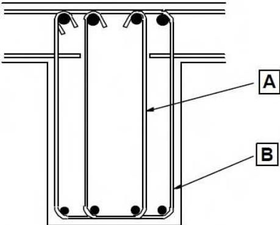

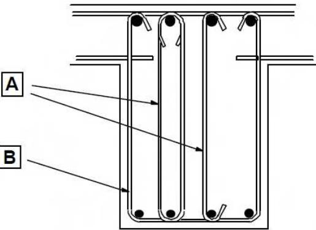
*A Alternativas de cercos interiores B Cerco envolvente Figura A19.9.5 Ejemplo de armaduras de cortante*

(3) Los cercos deben anclarse de forma efectiva. Será admisible un empalme por solape en la barra cerca de la superficie del alma siempre que el cerco no se requiera para resistir la torsión.

(4) La armadura de cortante debe disponerse con una cantidad de cercos igual o superior a $\beta_{3}$ veces la armadura de cortante necesaria. Con carácter general, el valor de $\beta_{3}$ a utilizar será 0,5. En el caso de forjados unidireccionales nervados de canto no superior a 40 cm, puede utilizarse armadura básica en celosía como armadura de cortante tanto si se dispone una zapatilla prefabricada como si el nervio es totalmente hormigonado in situ.

(5) La cuantía de armadura de cortante se establece mediante la expresión (9.4):

$$
\rho_ {w} = A _ {s w} / (s \cdot b _ {w} \cdot s e n \alpha)\tag{9.4}
$$

donde:

$\rho_{w}$ es la cuantía de armadura de cortante; $\rho_{w}$ no debe ser inferior a $\rho_{w,min}$ ,

$$
\rho_ {w, m i n} = \frac {0 , 0 8 \sqrt {f _ {c k}}}{f _ {y k}}\tag{9.5}
$$

$A_{sw}$ es el área de la armadura de cortante en la longitud s

s es la separación entre las armaduras de cortante medidas a lo largo del eje longitudinal del elemento

$$
b _ {w} \quad \text {es el ancho del alma del elemento}
$$

α es el ángulo entre la armadura de cortante y el eje longitudinal (véase el apartado 9.2.2(1)).

(6) La separación longitudinal máxima entre los diferentes tipos de armaduras de cortante no debe exceder $s_{l,max}$

$$
s _ {l, m a x} = 0, 7 5 d (1 + c o t g \alpha)\tag{9.6}
$$

donde α es la inclinación de la armadura de cortante respecto al eje longitudinal de la viga.

(7) La separación longitudinal máxima de las barras levantadas no debe exceder el valor de $s_{b,max}$

$$
s _ {b, m a x} = 0, 6 d (1 + \cot \alpha)\tag{9.7}
$$

(8) La separación transversal de las ramas en una serie de cercos no debe exceder el valor $s_{t,max}$

$$
s _ {t, m a x} = 0, 7 5 d \leq 6 0 0 m m\tag{9.8}
$$

Sec. I. Pág. 98428

> cve: BOE-A-2021-13681
Verificable en https://www.boe.es

<!-- pag 145 -->

## 9.2.3 Armadura de torsión

(1) Los cercos de torsión deben ser cerrados y estar anclados mediante solapes o ganchos (véase la figura A19.9.6), además de ser perpendiculares al eje del elemento estructural.

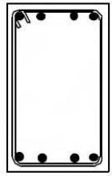

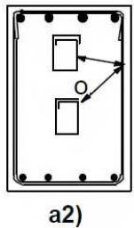

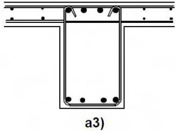
*a) Disposiciones recomendadas*

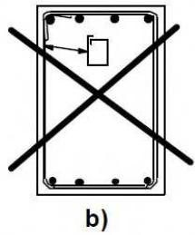
*b) Disposición no recomendada*

NOTA: La segunda alternativa de a2) (croquis inferior) debe tener una longitud de solape que abarque completamente la parte superior.

Figura A19.9.6 Ejemplos de la disposición de los cercos de torsión

(2) Las disposiciones del apartado 9.2.2(5) y (6) son, en general, suficientes para disponer los cercos mínimos de torsión necesarios.

(3) La separación longitudinal de los cercos de torsión no debe superar el valor u/8 (para la notación véase en el apartado 6.3.2 la figura A19.6.11), el límite establecido en el apartado 9.2.2(6) o la menor dimensión de la sección de la viga.

(4) Las barras longitudinales deben disponerse de forma que exista al menos una barra en cada esquina, distribuyendo el resto de manera uniforme por el perímetro interior del cerco, con una separación máxima de 350 mm.

## 9.2.4 Armadura de piel

(1) Puede ser necesario disponer una armadura de piel, bien para el control de la fisuración, o bien para asegurar una resistencia adecuada al desconchamiento del recubrimiento.

NOTA: Las reglas para la definición de los detalles de armado de las armaduras de piel se recogen en el Apéndice J.

## 9.2.5 Apoyos indirectos

(1) En el caso de que una viga se apoye en otra viga, en lugar de en un muro o pilar, se debe disponer la armadura necesaria para resistir la reacción mutua. Esta armadura se añadirá a la necesaria por otros motivos. Esta regla también es aplicable a losas no apoyadas en la parte superior de una viga.

(2) La armadura de soporte en la intersección de dos vigas debe consistir en cercos que envuelvan la armadura principal del elemento de apoyo. Algunos de estos cercos pueden distribuirse fuera del volumen de hormigón común a ambas vigas (véase la figura A19.9.7).

Sec. I. Pág. 98429

> cve: BOE-A-2021-13681
Verificable en https://www.boe.es

<!-- pag 146 -->

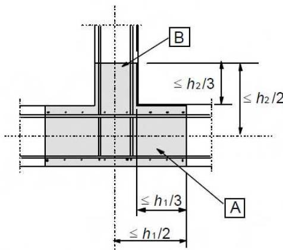
*A Viga de apoyo de canto $h_1$ B Viga apoyada de canto $h_2$ $(h_1 \geq h_2)$*

Figura A19.9.7 Disposición de la armadura de soporte en la zona de intersección de dos vigas (vista en planta)

## 9.3 Losas macizas

(1) Este apartado se centra en losas unidireccionales y bidireccionales para las que los valores de b y $l_{eff}$ no son inferiores a 5h (véase el apartado 5.3.1).

## 9.3.1 Armaduras de flexión

## 9.3.1.1 Generalidades

(1) Para los porcentajes de acero mínimo y máximo en la dirección principal, se aplican los apartados 9.2.1.1(1) y (3).

NOTA: Además de lo establecido en la nota 2 del apartado 9.2.1.1 (1), para losas en las que el riesgo de fallo por rotura frágil es pequeño, $A_{s,min}$ podrá tomarse como 1,2 veces el área necesaria en la comprobación en Estado Límite Último.

(2) En las losas unidirecionales se debe disponer una armadura transversal secundaria no inferior al 20% de la armadura principal. En las zonas cercanas a los apoyos no será necesario disponer de armadura transversal a las barras principales superiores si no existe flexión transversal.

(3) La separación entre barras no debe superar $s_{max,slabs}$ , cuyos límites se establecen a continuación:

$$
s_{max,slabs} <   300 \text{ mm},
$$

$s_{max,slabs} <$ tres veces el espesor bruto de la parte de la sección del elemento (3h), alma o alas, en las que vayan situadas.

(4) Las reglas indicadas en los apartados 9.2.1.3(1) a (3), 9.2.1.4(1) a (3) y 9.2.1.5(1) a (2) también serán de aplicación, pero tomando $a_{l} = d$ .

## 9.3.1.2 Armadura de losas en las zonas cercanas a los apoyos

(1) En losas simplemente apoyadas, la mitad de la armadura calculada en el centro de vano se debe prolongar hasta el soporte y debe anclarse conforme al apartado 8.4.4.

NOTA: El decalaje y el anclaje de la armadura debe llevarse a cabo de acuerdo con los apartados 9.2.1.3, 9.2.1.4 y 9.2.1.5.

Sec. I. Pág. 98430

> cve: BOE-A-2021-13681
Verificable en https://www.boe.es

<!-- pag 147 -->

(2) En el caso de producirse un empotramiento parcial a lo largo de un borde de la losa, pero que no es tenido en cuenta en el cálculo, la armadura superior deberá ser capaz de resistir, al menos, el 25 % del momento máximo del vano adyacente. Esta armadura deberá extenderse al menos 0,2 veces la longitud del vano adyacente, medida desde la cara del soporte. Además, deberá ser continua en los apoyos intermedios y anclarse en los apoyos extremos. En estos últimos, el momento a resistir se puede reducir al 15% del momento máximo en el vano adyacente.

## 9.3.1.3 Armadura de las esquinas

(1) Si los detalles de armado previstos sobre un apoyo son tales que restringen el levantamiento de la losa en las esquinas, deberá disponerse la armadura apropiada.

## 9.3.1.4 Armadura de los bordes libres de la losa

(1) A lo largo de los bordes libres (no apoyados) la losa deberá contener armadura transversal y longitudinal dispuesta como se muestra en la figura A19.9.8.

(2) La armadura dispuesta en una losa puede actuar como armadura de borde.

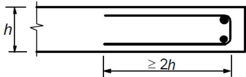
*Figura A19.9.8 Armaduras de borde para una losa*

## 9.3.2 Armadura de cortante

(1) Una losa en la que se dispone armadura de cortante debe tener un canto de al menos 200 mm.

(2) En los detalles de armado de las armaduras de cortante, se aplicarán el valor mínimo y la definición de la cuantía de armadura establecidos en el apartado 9.2.2, a menos que se vean modificados por los siguientes apartados.

(3) En las losas, si $|V_{Ed}| \leq 1/3 V_{Rd,max}$ (véase el apartado 6.2), la armadura de cortante puede consistir en su totalidad en barras levantadas o armaduras de cortante.

(4) La separación longitudinal máxima de series sucesivas de cercos se establece mediante:

$$
s _ {m a x} = 0, 7 5 d (1 + \cot \alpha)\tag{9.9}
$$

donde α es la inclinación de la armadura de cortante.

La separación longitudinal máxima entre barras levantadas viene dada por:

$$
s _ {m a x} = d\tag{9.10}
$$

(5) La separación transversal máxima de la armadura de cortante no debe exceder el valor 1,5d.

## 9.4 Losas planas

## 9.4.1 Losa en pilares interiores

(1) La disposición de las armaduras en la construcción de losas planas debe reflejar el comportamiento en condiciones de trabajo. En general, esto dará lugar a una concentración de la armadura sobre los pilares.

(2) En los pilares interiores, a menos que se lleven a cabo cálculos en servicio más rigurosos, se deberá disponer una armadura superior de área 0,5 $A_{t}$ en un ancho igual a la suma de 0,125 veces el ancho del paño a ambos lados del pilar. $A_{t}$ representa el área de la armadura necesaria para resistir el momento negativo total, procedente de la suma de las dos mitades del paño a cada lado del pilar.

Sec. I. Pág. 98431

> cve: BOE-A-2021-13681
Verificable en https://www.boe.es

<!-- pag 148 -->

(3) En pilares interiores debe disponerse una armadura inferior ( $\geq$ 2 barras) que atraviese el pilar en las dos direcciones principales (ortogonales).

## 9.4.2 Losa en pilares de borde y de esquina

(1) La armadura perpendicular a un borde libre necesaria para transmitir los momentos flectores de la losa a los pilares de borde o de esquina, debe disponerse a lo largo del ancho eficaz $b_{e}$ mostrado en la figura A19.9.9.

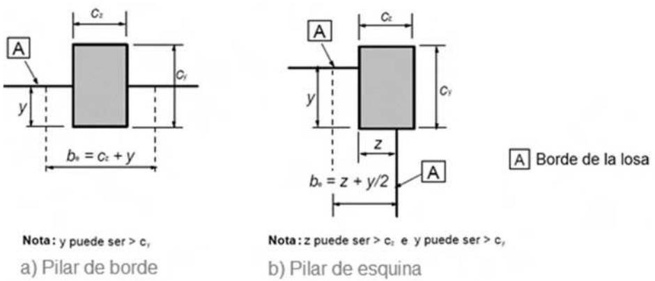
*NOTA: y es la distancia desde el borde de la losa a la cara interna del pilar. Figura A19.9.9 Ancho eficaz, $b_{e}$ , de una losa plana*

## 9.4.3 Armadura de punzonamiento

(1) Donde sea necesaria la armadura de punzonamiento (véase el apartado 6.4), deberá disponerse entre el área o pilar cargado y un punto situado a una distancia $kd$ , situado dentro del perímetro crítico en el que deja de ser necesaria la armadura de punzonamiento. Como mínimo, deberán disponerse dos perímetros de cercos (véase la figura A19.9.10), cuya separación no superará 0,75d.

La separación de las ramas de los cercos a lo largo de un perímetro no debe superar el valor 1,5d dentro del perímetro crítico (2d a partir del área cargada). En el caso de necesitar más armadura de punzonamiento, fuera del perímetro crítico, las ramas de los cercos no deberán tener una separación superior a 2d (véase la figura A19.6.22).

Para las barras dobladas dispuestas como se muestra en la figura A19.9.10 b), se considerará suficiente la utilización de un único perímetro de cercos.

Sec. I. Pág. 98432

> cve: BOE-A-2021-13681
Verificable en https://www.boe.es

<!-- pag 149 -->

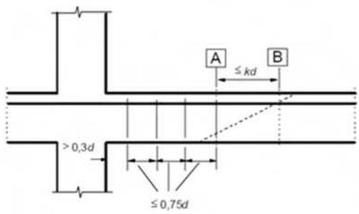

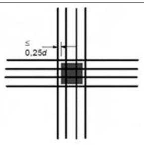

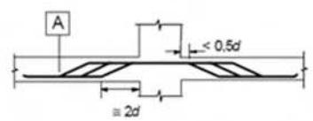
*b) Separación entre las barras dobladas NOTA: El valor de k se establece en 6.4.5 (4). Figura A19.9.10 Armadura de punzonamiento*

(2) Cuando se requiera armadura de punzonamiento, el área de una rama del cerco (o equivalente), $A_{sw,min}$ , viene dada por la expresión (9.11).

$$
A _ {s w, m i n} \cdot (1, 5 \cdot s e n \alpha + \cos \alpha) / (s _ {r} \cdot s _ {t}) \geq 0, 0 8 \sqrt {(f _ {c k}) / f _ {y k}}\tag{9.11}
$$

donde:

$\alpha$ es el ángulo entre la armadura de punzonamiento y la armadura principal (es decir, para cercos verticales $\alpha = 90^{\circ}$ y sen $\alpha = 1$ )

$s_{r}$ es la separación de los cercos de punzonamiento en la dirección radial

$s_{t}$ es la separación de los cercos de punzonamiento en la dirección tangencial

$f_{ck}$ se expresa en $N / mm^{2}$ .

En el cálculo del punzonamiento solo se puede incluir la componente vertical de las armaduras activas que pasen a una distancia no superior a 0,5d del pilar.

(3) Las barras levantadas que atraviesan la zona cargada, o pasan a una distancia inferior a 0,25d de la misma, pueden utilizarse como armadura de punzonamiento (véase la figura A19.9.10 b) superior).

(4) La distancia entre la cara del soporte o el perímetro del área cargada y la armadura de cortante más cercana tenida en cuenta en el cálculo, no debe superar d/2. Esta distancia debe tomarse en el nivel de la armadura de tracción. Si se dispone una única línea de barras levantadas su pendiente podrá reducirse a 30°.

## 9.5 Pilares

## 9.5.1 Generalidades

(1) Este apartado hace referencia a los pilares cuya mayor dimensión h no es superior a 4 veces la menor dimensión b.

## 9.5.2 Armadura longitudinal

(1) Las barras longitudinales deben tener un diámetro superior a $\phi_{min} = 12$ mm.

(2) La cantidad total de armadura longitudinal no debe ser inferior a $A_{s,min}$ .

Sec. I. Pág. 98433

> cve: BOE-A-2021-13681
Verificable en https://www.boe.es

<!-- pag 150 -->

En el caso general, para las secciones sometidas a compresión simple o compuesta, se adoptan unas cuantías mínimas para las armaduras principales a compresión en cada cara que cumplan las expresiones siguientes y cuyo esquema está representado en la figura A19.9.11.

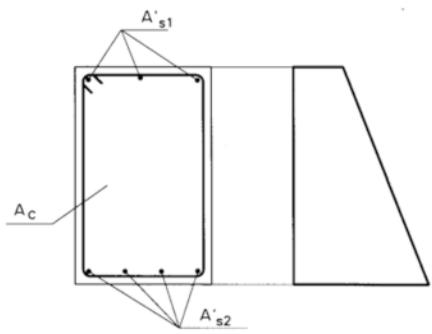
*Figura A19.9.11 Armaduras longitudinales en pilares*

$$
A _ {s 1, m i n} ^ {\prime} = \frac {0 , 0 5 N _ {E d}}{f _ {y c , d}}
$$

$$
A _ {s 2, m i n} ^ {\prime} = \frac {0 , 0 5 N _ {E d}}{f _ {y c , d}}
$$

donde:

$f_{yc,d}$ resistencia de cálculo del acero a compresión $f_{yc,d} = f_{yd} \gg 400 \, N/mm^{2}$

$N_{Ed}$ esfuerzo axil de cálculo de compresión

$f_{cd}$ resistencia de cálculo del hormigón en compresión

$A_{C}$ área de la sección total de hormigón.

Cuando se trate de secciones sometidas a compresión simple armadas simétricamente, se adopta el siguiente valor de cuantía mínima:

$$
A _ {s, m i n.} = \frac {0 , 1 0 N _ {E d}}{f _ {y d}}\tag{9.12}
$$

(3) El área de la armadura longitudinal no debe superar $A_{s,max} = 0,04Ac$ , fuera de las zonas de solape, ni 0,08 $A_{c}$ dentro de las mismas.

(4) Para pilares con sección poligonal se debe disponer, como mínimo, una barra en cada esquina. El número de barras longitudinales en un pilar circular no debe ser inferior a cuatro.

## 9.5.3 Armadura transversal

(1) El diámetro de la armadura transversal (cercos, ganchos en U, o armadura helicoidal) no debe ser inferior a 6 mm o a un cuarto del diámetro máximo de las barras longitudinales. El diámetro de los elementos de las mallas electrosoldadas para la armadura transversal no debe ser inferior a 5 mm.

(2) La armadura transversal debe anclarse adecuadamente.

(3) La separación de la armadura transversal a lo largo del pilar no debe superar $s_{cl,tmax}$ , cuyo valor viene definido por la siguiente expresión:

$$
S _ {c l, m a x} \leq (1 5 \phi_ {m i n}; 3 0 0 m m; \min (G, h))
$$

Sec. I. Pág. 98434

> cve: BOE-A-2021-13681
Verificable en https://www.boe.es

<!-- pag 151 -->

donde $\phi_{min}$ es el diámetro mínimo de la armadura.

(4) La separación máxima necesaria que se establece en el punto (3) debe reducirse mediante un coeficiente de valor 0,6:

(i) en las secciones dispuestas a lo largo de una distancia menor o igual a la mayor dimensión de la sección del pilar, tanto encima como debajo de la viga o losa,

(ii) en las proximidades de las zonas de solape de las armaduras, en el caso en el que el diámetro máximo de las barras longitudinales sea superior a 14 mm. Además, será necesaria la disposición de un mínimo de 3 barras transversales, colocadas de forma uniforme a lo largo de toda la longitud del solape.

(5) En el caso de que cambie la dirección de las barras longitudinales, (por ejemplo en los cambios de las dimensiones de los pilares), la separación de las barras transversales debe calcularse teniendo en cuenta los esfuerzos transversales asociados. Estos efectos se pueden ignorar si el cambio de dirección tiene una pendiente inferior o igual a 1/12.

(6) Toda barra o grupos de barras longitudinales colocadas en una esquina deben estar sujetas mediante una armadura transversal. Ninguna barra de la zona de compresión debe estar a una distancia superior a 150 mm de otra que se encuentre sujeta.

## 9.6 Muros

## 9.6.1 Generalidades

(1) Este apartado hace referencia a muros de hormigón armado con una relación longitud-espesor mayor o igual a 4 y en los que se tiene en cuenta la armadura en el cálculo de la resistencia. La cantidad de armadura y los detalles de armado pueden obtenerse a partir de un modelo de bielas y tirantes (véase el apartado 6.5). Para muros sometidos principalmente a una flexión fuera de su plano, se aplicarán las reglas establecidas para las losas (véase el apartado 9.3).

## 9.6.2 Armadura vertical

(1) El área de la armadura vertical debe estar comprendida entre $A_{s,vmin}$ y $A_{s,vmax}$ .

Para la cuantía mínima de armadura vertical en muros, se adopta $A_{s,vmin} = 0,002A_{c}$ (colocando un 60% de la misma en la cara traccionada).

Para la cuantía máxima de armadura vertical en muros, se adopta $A_{s,vmax} = 0,04 A_{c}$ .

(2) En el caso de que el cálculo obligue a disponer un valor de área mínima de armadura $A_{s,vmin}$ , deberá disponerse la mitad de esta área en cada cara.

(3) La distancia entre dos barras verticales contiguas no debe ser mayor que el menor valor entre 400 mm y 3 veces el espesor del muro.

## 9.6.3 Armadura horizontal

(1) En cada cara del muro debe disponerse armadura horizontal en sentido longitudinal, paralela a las caras (y a los bordes libres). El área de estas armaduras no deberá ser inferior a $A_{s,hmin}$ , cuyos valores se establecen a continuación.

$$
A _ {s, h m i n} = 0, 0 0 4 A _ {c}
$$

$$
A _ {s, h m i n} = 0, 0 0 3 2 A _ {c}
$$

$$
\begin{array}{l} \mathrm{si} f _ {y k} = 4 0 0 \mathrm{N/mm} ^ {2} \\ \mathrm{si} f _ {y k} = 5 0 0 \mathrm{N/mm} ^ {2} \end{array}
$$

La armadura horizontal deberá repartirse en las dos caras. Además, se adoptan las siguientes reglas sobre colocación:

Sec. I. Pág. 98435

> cve: BOE-A-2021-13681
Verificable en https://www.boe.es

<!-- pag 152 -->

\- en el caso de muros vistos por ambas caras, deberá disponerse la mitad de la armadura en cada cara,

\- en caso de muros con espesores superiores a 50 cm, se considerará un área efectiva de espesor máximo 50 cm, distribuidos en dos zonas de 25 cm en cada cara e ignorando la zona central que queda entre ambas zonas.

La cuantía mínima horizontal podrá reducirse a $A_{s,hmin} = 0,002 A_{c}$ , en cualquiera de los siguientes casos:

\- cuando la altura del fuste del muro sea superior a 2,5 m, y siempre que esta distancia no sea menor que la mitad de la altura del muro,

\- cuando se dispongan juntas verticales de contracción a distancias inferiores a 7,5 m.

(2) Las separación entre dos barras horizontales adyacentes no debe ser mayor de 400 mm.

## 9.6.4 Armadura transversal

(1) En cualquier parte del muro en la que el área total de la armadura vertical de ambas caras sea mayor que $0,02 A_{c}$ , se deberá disponer armadura transversal en forma de cercos, de acuerdo con los requisitos para pilares (véase el apartado 9.5.3). La mayor dimensión a la que se hace referencia en el apartado 9.5.3(4)(i) no deberá tomarse superior a 4 veces el espesor del muro.

(2) En el caso de que la armadura principal esté cercana a las caras del muro, la armadura transversal debe disponerse en forma de cercos, situando al menos 4 por $m^{2}$ de superficie de muro.

NOTA: No será necesario disponer armadura transversal donde se utilicen mallas electrosoldadas y barras de diámetro $\phi \leq 16$ mm con un recubrimiento de hormigón superior a $2\phi$ .

## 9.7 Vigas de gran canto

(1) En vigas de gran canto (para su definición véase el apartado 5.3.1(3)) se debe disponer una malla de armadura ortogonal cerca de cada cara, con un valor mínimo de $A_{s,dbmin} = 0,001 A_{c}$ , pero que no debe ser inferior a $150 mm^{2}/m$ en cada cara y dirección de la armadura.

(2) La distancia entre dos barras adyacentes de la malla no debe superar el menor valor entre 300 mm y dos veces el espesor de la viga.

(3) Para lograr el equilibrio en el nudo (véase el apartado 6.5.4), la armadura correspondiente a los tirantes considerados en el modelo de cálculo deberá anclarse completamente mediante el doblado de barras, el empleo de cercos en U o de dispositivos de anclaje, a menos que se disponga una longitud suficiente, entre el nudo y el extremo de la viga, que permita una longitud de anclaje igual a $l_{bd}$ .

## 9.8 Cimentaciones

## 9.8.1 Encepados

Las cimentaciones profundas quedan fuera del ámbito de este Código Estructural.

## 9.8.2 Zapatas de pilares y muros

## 9.8.2.1 Generalidades

(1) La armadura principal debe anclarse de acuerdo con los requisitos establecidos en 8.4 y 8.5. Se debe disponer un diámetro mínimo de barra $\phi_{min} = 12 \, mm$ . En zapatas, se puede emplear el modelo de cálculo que se indica en el apartado 9.8.2.2.

(2) La armadura principal de las zapatas circulares puede ser ortogonal y concentrarse en la parte central de la misma, para un ancho del 50 % ± 10 % del diámetro de la zapata (véase la figura

Sec. I. Pág. 98436

> cve: BOE-A-2021-13681
Verificable en https://www.boe.es

<!-- pag 153 -->

A19.9.12). En este caso y con el fin de llevar a cabo el cálculo, las zonas sin armar del elemento deben considerarse como zonas de hormigón en masa.

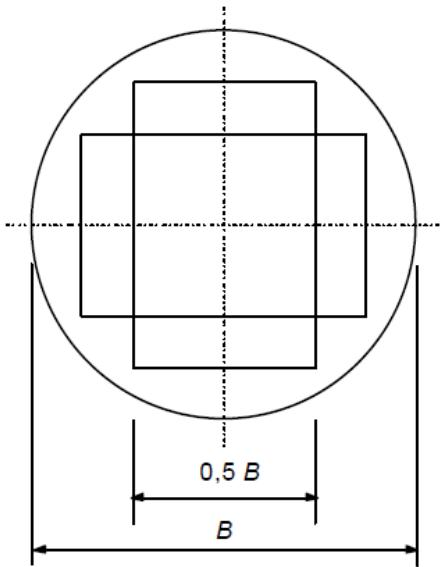
*Figura A19.9.12 Armadura ortogonal en una zapata circular sobre el suelo*

(3) Si los efectos de las acciones producen tracciones sobre la superficie superior de la zapata, deberán comprobarse las tensiones de tracción resultantes y armarse en consecuencia.

## 9.8.2.2 Anclaje de barras

(1) El esfuerzo de tracción en la armadura se determina a partir de las condiciones de equilibrio, teniendo en cuenta el efecto de las fisuras inclinadas (véase la figura A19.9.13). La fuerza de tracción, $F_{s}$ , en un punto x, debe anclarse en el hormigón a lo largo de la misma distancia x desde el borde de la zapata.

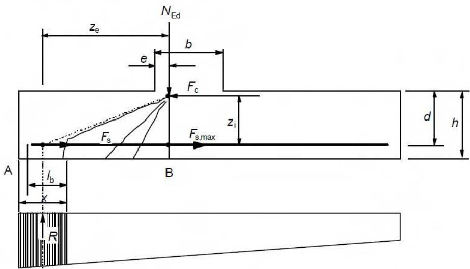
*Figura A19.9.13 Modelo de fuerza de tracción con respecto a las fisuras inclinadas*

$$
F _ {s} = R \cdot z _ {e} / z _ {i}
$$

(2) La fuerza de tracción a anclar viene dada por:

(9.13)

Sec. I. Pág. 98437

> cve: BOE-A-2021-13681
Verificable en https://www.boe.es

<!-- pag 154 -->

donde:

R es la resultante de la presión del terreno dentro de la distancia x

$z_{e}$ es el brazo mecánico externo, es decir, la distancia entre R y el esfuerzo vertical $N_{Ed}$

$N_{Ed}$ es el esfuerzo vertical correspondiente a la presión total del suelo entre las secciones A y B

$z_{i}$ es el brazo mecánico interno, es decir, la distancia entre la armadura y la fuerza horizontal $F_{c}$

$F_{c}$ es la fuerza de compresión correspondiente al máximo esfuerzo de tracción $F_{s,max}$ .

(3) Los brazos mecánicos $z_{e}$ y $z_{i}$ se pueden determinar en relación con las zonas de compresión necesarias para $N_{Ed}$ y $F_{c}$ respectivamente. Como simplificación, $z_{e}$ puede determinarse suponiendo e = 0,15b (véase la figura A19.9.13) y $z_{i}$ se puede tomar igual a 0,9d.

(4) La longitud de anclaje disponible para las barras rectas viene indicada como $l_{b}$ en la figura A19.9.13. Si esta longitud no es suficiente para anclar $F_{s}$ , las barras podrán doblarse para incrementar la longitud disponible, o podrán disponerse dispositivos de anclaje en sus extremos.

(5) Para las barras rectas sin anclaje en los extremos, el valor mínimo de x es el más crítico. Como simplificación, se puede adoptar $x_{min} = h/2$ . Para otros tipos de anclaje, valores mayores de x pueden ser aún más críticos.

## 9.8.3 Vigas de atado

(1) Las vigas de atado pueden utilizarse para suprimir la excentricidad de la carga en las cimentaciones. Las vigas deben proyectarse para resistir los momentos flectores y los esfuerzos cortantes resultantes. Se deberá disponer un diámetro mínimo de barra, $\phi_{min} = 12 \, mm$ , para la armadura que resiste los momentos flectores.

(2) En el caso de que la actuación de la maquinaria de compactación pudiera dar lugar a efectos sobre las vigas de atado, estas deben calcularse para una carga mínima descendente de valor $q_{1} = 10 \, kN/m$ .

## 9.8.4 Zapatas de pilares sobre roca

(1) Se debe disponer una armadura transversal adecuada para resistir los esfuerzos de hendimiento de la zapata que aparecen cuando la presión sobre el suelo en Estados Límite Últimos es mayor que $q_{2}=5 N/mm^{2}$ . Esta armadura puede distribuirse uniformemente en la dirección de la fuerza de hendimiento sobre la altura h (véase la figura A19.9.14). Se deberá disponer un diámetro mínimo de barra, $\phi_{min}=12 mm$ .

(2) La fuerza de hendimiento, $F_{s}$ , puede calcularse como se indica (véase la figura A19.9.14):

$$
F _ {s} = 0, 2 5 (1 - c / h) N _ {E d}\tag{9.14}
$$

donde h es el menor valor entre b y H.

Sec. I. Pág. 98438

> cve: BOE-A-2021-13681
Verificable en https://www.boe.es

<!-- pag 155 -->

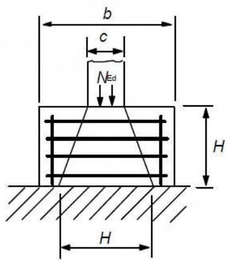
*a) Zapata con $h \geq  H$*

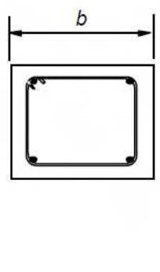
*b) Sección*

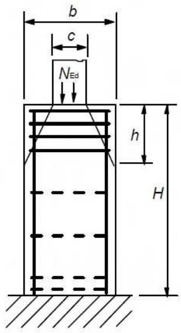
*c) Zapata con $h < H$ Figura A19.9.14 Armadura de hendimiento en zapatas sobre roca*

## 9.9 Regiones con discontinuidad en la geometría o en las acciones

(1) Las regiones tipo D deben calcularse mediante modelos de bielas y tirantes de acuerdo con el apartado 6.5 y disponer los detalles de armado indicados en el apartado 8.

NOTA: Para más información, se deberá consultar el Apéndice J.

(2) La armadura correspondiente a los tirantes debe estar completamente anclada mediante un anclaje de longitud $l_{bd}$ , de acuerdo con el apartado 8.4.

## 9.10 Armaduras de atado

## 9.10.1 Generalidades

(1) Las estructuras que no estén calculadas para resistir situaciones accidentales deberán tener un sistema de atado adecuado, destinado a prevenir un agotamiento progresivo mediante la disposición de trayectorias alternativas para las cargas después de que se produzcan los daños. Para satisfacer este requisito, se establecen una serie de sencillas reglas expuestas a continuación.

(2) Se deben disponer las siguientes armaduras de atado:

\- armaduras de atado perimetrales,

\- armaduras de atado interiores,

\- armaduras de atado horizontales de pilares o muros,

\- si es necesario, armaduras de atado verticales, en particular en los edificios construidos con paneles prefabricados.

(3) En el caso de un edificio dividido en partes estructuralmente independientes mediante juntas de dilatación, cada parte deberá contar con un sistema de atado independiente.

Sec. I. Pág. 98439

> cve: BOE-A-2021-13681
Verificable en https://www.boe.es

<!-- pag 156 -->

(4) En el cálculo de las armaduras de atado, puede suponerse que la armadura actúa con su resistencia característica y es capaz de transmitir los esfuerzos de tracción definidos en los siguientes apartados.

(5) En pilares, muros, vigas y forjados con armadura dispuesta para otros propósitos, podrá considerarse que esta proporciona una parte o la totalidad de la correspondiente al atado.

## 9.10.2 Dimensionamiento de las armaduras de atado

## 9.10.2.1 Generalidades

(1) Las armaduras de atado se dispondrán como una armadura mínima y no como una adicional a la exigida por el cálculo estructural.

## 9.10.2.2 Armaduras de atado perimetrales

(1) En todos los forjados, incluida la cubierta, debe disponerse una armadura de atado perimetral continua a menos de 1,2 m del borde. Esta puede incluir la armadura utilizada como parte del atado interno.

(2) La armadura de atado perimetral debe ser capaz de resistir una fuerza de tracción:

$$
F _ {t i e, p e r} = l _ {i} \cdot q _ {1} \geq Q _ {2}\tag{9.15}
$$

donde:

$F_{tie,per}$ es la fuerza en el elemento de atado (en este caso de tracción)

longitud del vano extremo

$$
\begin{array}{l} q _ {1} = 1 0 k N / m \\ Q _ {2} = 7 0 k N. \end{array}
$$

(3) Las estructuras con bordes interiores (por ejemplo, atrios, patios, etc.) deben tener una armadura de atado perimetral como la dispuesta en los bordes exteriores, que debe anclarse completamente.

## 9.10.2.3 Armaduras de atado interiores

(1) Estas armaduras de atado deben disponerse en cada forjado, incluida la cubierta, en dos direcciones aproximadamente perpendiculares. Deberán ser continuas a lo largo de toda su longitud y estar ancladas a la armadura de atado perimetral en cada extremo, a menos que continúen como armaduras de atado horizontal para pilares y muros.

(2) Las armaduras de atado interiores pueden, parcial o completamente, repartirse uniformemente en las losas, o pueden agruparse en las vigas, muros y otras posiciones adecuadas. En los muros, deberá estar a menos de 0,5 m de la parte superior o inferior de las losas de forjado (véase la figura A19.9.15).

(3) En cada dirección, las armaduras de atado interiores deben ser capaces de resistir el valor de cálculo de la fuerza de tracción $F_{tie,int} = 20 \, kN/m$ (en kN por metro de ancho).

(4) En los forjados sin capa de compresión, en los que no es posible repartir las armaduras de atado a lo largo de la dirección del vano, las armaduras de atado transversales pueden agruparse a lo largo de las líneas de las vigas. En este caso, la fuerza mínima sobre una línea interna de la viga será:

$$
F _ {t i e} = q _ {3} \cdot (l _ {1} + l _ {2}) / 2 \geq Q _ {4}\tag{9.16}
$$

donde:

$l_{1}, l_{2}$ son las longitudes de los vanos (en m) del forjado a cada lado de la viga (véase la figura A19.9.15)

$$
q_ {3} = 2 0 \text {kN / m}
$$

Sec. I. Pág. 98440

> cve: BOE-A-2021-13681
Verificable en https://www.boe.es

<!-- pag 157 -->

$$
Q _ {4} = 7 0 \mathrm{kN}.
$$

(5 Las armaduras de atado interiores deben estar conectadas a las armaduras de atado perimetrales, de forma que se asegure la transferencia de esfuerzos.

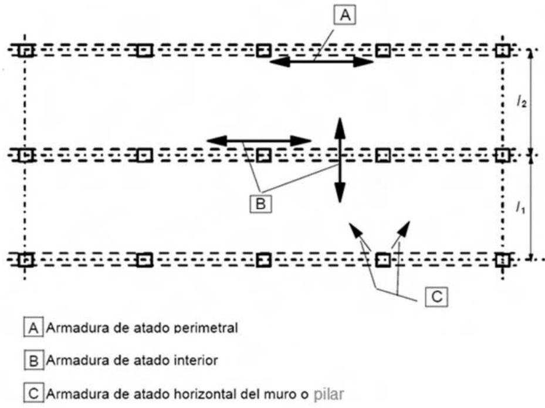
*Figura A19.9.15 Esquema de atado para situaciones accidentales*

## 9.10.2.4 Armaduras de atado horizontales de pilares y/o muros

(1) Los pilares y muros de borde deberán atarse horizontalmente a la estructura en cada forjado, incluida la cubierta.

(2) Las armaduras de atado deben ser capaces de resistir una fuerza de tracción $f_{tie,fac} = 20 \, kN/m$ (por metro de fachada). Para pilares, es necesario que la fuerza sea inferior a $F_{tie,col} = 150 \, kN$ .

(3) Los pilares de esquina deben atarse en dos direcciones. En este caso, el acero dispuesto para la armadura de atado perimetral puede utilizarse como armadura de atado horizontal.

## 9.10.2.5 Armaduras de atado verticales

(1) En los edificios construidos con paneles de 5 o más plantas, deberá disponerse una armadura de atado vertical en los pilares y/o muros para limitar el daño ocasionado por el colapso de una planta, debido a la pérdida accidental del pilar o muro inferior. Estas ataduras deben formar parte de un sistema puente para salvar la zona dañada.

(2) Se deben disponer armaduras de atado verticales y continuas desde el nivel inferior hasta el superior, de forma que sean capaces de trasladar la carga en la situación accidental de cálculo que actúa en el piso que se encuentra sobre el pilar o muro que accidentalmente se ha perdido. Se podrán utilizar otras soluciones, como por ejemplo las basadas en el efecto diafragma de los elementos del muro que se mantienen y/o en el efecto membrana del forjado, si se puede comprobar que se cumple la condición de equilibrio y que la capacidad de deformación es suficiente.

(3) En el caso de que un pilar o muro se apoye en su parte inferior mediante un elemento diferente a una cimentación (por ejemplo vigas o losas planas), deberá considerarse en el cálculo la pérdida accidental de este elemento y se deberá disponer una trayectoria alternativa y adecuada para las cargas.

Sec. I. Pág. 98441

> cve: BOE-A-2021-13681
Verificable en https://www.boe.es

<!-- pag 158 -->

## 9.10.3 Continuidad y anclaje de las armaduras de atado

(1) Las armaduras de atado en dos direcciones horizontales deberán ser continuas y estar ancladas en el perímetro de la estructura.

(2) La armadura de atado puede disponerse totalmente embebida en la capa de compresión vertida in situ o en la unión de los elementos prefabricados. En el caso de que la armadura de atado no sea continua en un plano, deberán considerarse los efectos de flexión debidos a las excentricidades.

(3) Las armaduras de atado no deben solaparse en las juntas estrechas entre elementos prefabricados. En estos casos se deben emplear anclajes mecánicos.

