## 10 Reglas adicionales para elementos y estructuras prefabricadas de hormigón

## 10.1 Generalidades

Este apartado complementa los aspectos recogidos en el Artículo 54 de este Código Estructural.

(1) Las reglas de este apartado se aplican a edificios construidos parcial o totalmente con elementos prefabricados de hormigón y son complementarias a las reglas establecidas en otros capítulos. Los aspectos relativos a la definición de los detalles de armado, la fabricación se recogen en las correspondientes normas de producto.

## 10.1.1 Términos específicos utilizados en este capítulo

Elemento prefabricado: elemento elaborado en una planta de prefabricados o en un lugar diferente al de su emplazamiento final en la estructura, protegido de las condiciones meteorológicas adversas.

Producto prefabricado: elemento prefabricado elaborado de conformidad con la norma UNE-EN o UNE específica de producto.

Elemento mixto: elemento compuesto por hormigón in situ y prefabricado, con o sin armadura de conexión.

Forjado de viguetas y bovedillas: consiste en nervios prefabricados (o vigas) cuya separación se rellena con bloques, bovedillas cerámicas u otras formas de encofrado perdido, con o sin capa de compresión in situ.

Diafragma: elemento plano sometido a esfuerzos en su plano; puede estar constituido por varios elementos prefabricados conectados entre si.

Tirante (atado): en el contexto de los elementos prefabricados, un tirante es un elemento sometido a tracción, efectivamente continuo, dispuesto en el forjado, muro o pilar.

Elemento prefabricado aislado: elemento que en caso de rotura no puede transferir sus cargas a otros elementos.

Situación transitoria: en lo que se refiere a la construcción con prefabricados de hormigón, las situaciones transitorias incluyen:

\- desencofrado,

\- transporte al área de almacenamiento.

\- almacenamiento (condiciones de carga y apoyo),

\- transporte a obra,

\- colocación en su posición definitiva (izado),

\- montaje (ensamblaje).

Sec. I. Pág. 98442

> cve: BOE-A-2021-13681
Verificable en https://www.boe.es

<!-- pag 159 -->

## 10.2 Bases del cálculo, requisitos fundamentales

(1) Los puntos a tener en cuenta de manera específica en el dimensionamiento y diseño de los detalles de proyecto para los elementos y estructuras prefabricadas de hormigón serán los siguientes:

\- situaciones transitorias (véase el apartado 10.1.1),

\- dispositivos de apoyo, tanto provisionales como permanentes,

\- uniones y juntas entre los elementos.

(2) Cuando sea pertinente deben tenerse en cuenta los efectos dinámicos en las situaciones transitorias. En ausencia de un cálculo más preciso, los efectos estáticos se pueden multiplicar por un coeficiente adecuado (véanse también las normas específicas para cada producto prefabricado).

(3) En el caso de que sea necesario en proyecto deben definirse los detalles de los dispositivos mecánicos para permitir un montaje, inspección y sustitución sencillos.

## 10.3 Materiales

## 10.3.1 Hormigón

## 10.3.1.1 Resistencia

(1) Para productos prefabricados con producción continua, sometidos a un sistema de control apropiado, siguiendo las normas del producto, incluido el ensayo de la resistencia a tracción del hormigón, puede utilizarse un análisis estadístico de los resultados de los ensayos para la evaluación de la resistencia a tracción utilizada en las comprobaciones de los Estados Límite de Servicio, como alternativa a los valores establecidos en la tabla A19.3.1.

(2) Se podrán emplear las clases intermedias de resistencia de la tabla A19.3.1.

(3) En el caso de utilizar el curado al vapor en elementos prefabricados de hormigón, la resistencia a compresión media $(f_{cm}(t))$ del hormigón a una edad t anterior a los 28 días puede estimarse utilizando la expresión (3.1), en la que se sustituye la edad del hormigón, t, por la edad del hormigón corregida en función de la temperatura, obtenida de la expresión (B.10) del Apéndice B.

NOTA: El coeficiente $\beta_{cc}(t)$ se debe limitar a 1.

Para determinar el efecto del curado al vapor se podrá emplear la expresión (10.1):

$$
f _ {c m} (t) = f _ {c m p} + \frac {f _ {c m} - f _ {c m p}}{\log (2 8 - t _ {p} + 1)} \log (t - t _ {p} + 1)\tag{10.1}
$$

donde $f_{cmp}$ es la resistencia media a compresión tras el curado al vapor (es decir, en el momento de la transferencia del pretensado), medida en un tiempo $t_{p}$ ( $t_{p} < t$ ) sobre muestras que han sido sometidas a las mismas condiciones y tratamiento que el prefabricado de hormigón.

## 10.3.1.2 Fluencia y retracción

(1) En elementos prefabricados de hormigón curados al vapor, es admisible estimar los valores de las deformaciones de fluencia de acuerdo con la función de madurez (expresión (B.10) del Apéndice B).

(2) Para calcular las deformaciones de fluencia, en la expresión (B.5) la edad del hormigón en el momento de la carga $t_{0}$ (en días) debe reemplazarse por la edad equivalente del hormigón obtenida mediante las expresiones (B.9) y (B.10) del Apéndice B.

(3) En los elementos prefabricados sometidos a un curado al vapor se podrá suponer que:

\- la deformación por retracción no es significativa durante el curado al vapor y

\- la deformación por retracción autógena es insignificante.

Sec. I. Pág. 98443

> cve: BOE-A-2021-13681
Verificable en https://www.boe.es

<!-- pag 160 -->

## 10.3.2 Armadura activa

## 10.3.2.1 Propiedades mecánicas de la armadura activa

(1) En elementos pretensados deberá considerarse el efecto del incremento de temperatura durante el proceso de curado para el cálculo de las pérdidas por relajación.

NOTA: La relajación se acelera durante la aplicación del curado al vapor si se introduce una variación térmica al mismo tiempo. La velocidad de relajación se reduce al final del tratamiento.

(2) En las funciones de relajación variables con el tiempo e indicadas en el apartado 3.3.2(7), debe incrementarse el tiempo posterior al tesado (t) en un tiempo equivalente, $t_{eq}$ . Con ello se tendrá en cuenta los efectos del tratamiento térmico en las pérdidas del pretensado debidas a la relajación de la armadura activa. El tiempo equivalente se podrá estimar mediante la expresión (10.2):

$$
t _ {e q} = \frac {1 , 1 4 ^ {T _ {m a x} - 2 0}}{T _ {m a x} - 2 0} \sum_ {i = 1} ^ {n} \big (T _ {(\Delta t _ {i})} - 2 0 \big) \Delta t _ {i}\tag{10.2}
$$

donde:

$t_{eq}$ es el tiempo equivalente (en horas)

$T_{(\Delta t_{i})}$ es la temperatura (en °C) durante el intervalo de tiempo $\Delta t_{i}$

$T_{max}$ es la temperatura máxima (en °C) durante el tratamiento térmico.

## 10.5 Análisis estructural

## 10.5.1 Generalidades

(1) El cálculo deberá tener en cuenta los siguientes aspectos:

\- el comportamiento de las unidades estructurales en todas las fases de la construcción, utilizando la geometría apropiada para cada etapa, además de su interacción con otros elementos (por ejemplo, la acción mixta con hormigón in situ u otras unidades prefabricadas),

\- el comportamiento del sistema estructural considerando el comportamiento de las uniones entre elementos, con especial atención a las deformaciones reales y la resistencia de las conexiones,

\- las incertidumbres producidas por las desviaciones en la geometría, en el posicionamiento de los elementos y apoyos, influyen en la coacción y transmisión de esfuerzos entre los diferentes elementos.

(2) El efecto favorable de la coacción horizontal originada por el rozamiento debido al peso de los elementos apoyados, puede utilizarse únicamente en zonas que carezcan de riesgo sísmico (utilizando $\gamma_{G,inf}$ ) y donde:

\- La estabilidad global de la estructura no solo dependa del rozamiento,

\- la disposición de los apoyos evite la posibilidad de acumular un deslizamiento irreversible de los elementos, tales como el causado por un comportamiento desigual bajo acciones alternas (por ejemplo, los efectos térmicos cíclicos en los bordes de contacto de elementos simplemente apoyados),

\- se elimine la posibilidad de que se den cargas de impacto significativas.

(3) Se deberán considerar los efectos de los desplazamientos horizontales en el cálculo de la resistencia de la estructura y la integridad de las uniones.

Sec. I. Pág. 98444

> cve: BOE-A-2021-13681
Verificable en https://www.boe.es

<!-- pag 161 -->

## 10.5.2 Pérdidas del pretensado

(1) El procedimiento de curado al vapor en elementos prefabricados de hormigón provoca la aparición de una pérdida térmica específica, $\Delta P_{\theta}$ , como consecuencia de la reducción de la tensión de tracción en las armaduras activas y de la dilatación coartada del hormigón debida al incremento de temperatura. Esta pérdida puede estimarse mediante la expresión (10.3)

$$
\Delta P _ {\theta} = 0, 5 A _ {p} E _ {p} \alpha_ {c} (T _ {m a x} - T _ {0})\tag{10.3}
$$

donde:

$$
A _ {p} \quad \text {es el área de las armaduras activas}
$$

$$
E _ {p} \quad \text {es el módulo de elasticidad de las armaduras activas}
$$

$\alpha_{c}$ es el coeficiente de dilatación térmica del hormigón (véase el apartado 3.1.3(5))

$T_{max} - T_{0}$ es la diferencia entre la temperatura máxima y la inicial en el hormigón próximo a las armaduras activas, en °C.

NOTA: Cualquier pérdida del pretensado $\Delta P_{\theta}$ producida por el alargamiento debido al curado al vapor, puede despreciarse si se aplica un precalentamiento a las armaduras activas.

## 10.9 Reglas particulares para el cálculo y definición de los detalles de proyecto

## 10.9.1 Momentos de empotramiento en losas

(1) Los momentos de empotramiento pueden ser resistidos mediante la armadura superior dispuesta en la capa de compresión o bien en el macizado de los alveolos. En el primer caso, el esfuerzo rasante en la unión debe comprobarse de acuerdo con el apartado 6.2.5. En el segundo caso, la transferencia de los esfuerzos entre el macizado de hormigón in situ y la losa alveolar deberá comprobarse de acuerdo con el apartado 6.2.5. La longitud de la armadura superior deberá cumplir lo establecido en el apartado 9.2.1.3.

(2) Se debe disponer una armadura y/o establecer una definición particularizada de los detalles de proyecto, con el fin de tener en cuenta los efectos no previstos y causados por las coacciones en los apoyos de losas simplemente apoyadas.

## 10.9.2 Unión de muro con forjado

(1) En los elementos de muro dispuestos sobre un forjado de losas la armadura debe disponerse con el fin de tener en cuenta las posibles excentricidades y concentraciones de cargas verticales en los extremos del muro. Para los elementos de forjado véase el apartado 10.9.1(2).

(2) No es necesaria una armadura específica siempre que la carga vertical por unidad de longitud sea $\leq 0,5 h \cdot f_{cd}$ , donde h es el espesor del muro (véase la figura A19.10.1). La carga puede incrementarse hasta $0,6 h \cdot f_{cd}$ , si se dispone de armadura de acuerdo con la figura A19.10.1, con un diámetro $\phi \geq 6 mm$ y una separación, s, no superior al menor valor entre h y 200 mm. Para cargas mayores la armadura debe calcularse de acuerdo con el punto (1). Se debe realizar una comprobación independiente para el muro inferior.

Sec. I. Pág. 98445

> cve: BOE-A-2021-13681
Verificable en https://www.boe.es

<!-- pag 162 -->

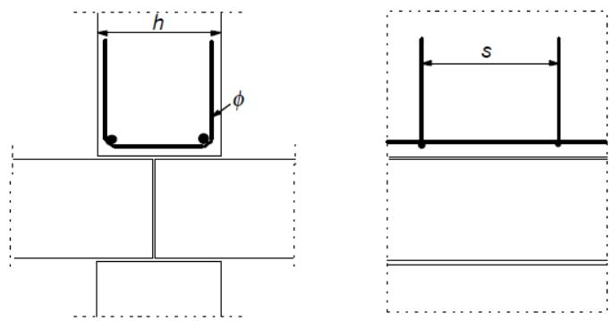
*Figura A19.10.1 Ejemplo de armadura en un muro sobre la conexión entre dos losas de forjado*

## 10.9.3 Sistemas de forjados

(1) Las definiciones de los detalles de proyecto relativas a los sistemas de forjados deberán ser coherentes con las hipótesis de cálculo y de dimensionamiento, además de tener en cuenta las normas del producto correspondientes.

(2) En el caso de tener en cuenta un reparto transversal de cargas entre las unidades adyacentes, se debe disponer una unión de cortante adecuada.

(3) Deberán considerarse los efectos de las posibles coacciones de elementos prefabricados, incluso si se han supuesto apoyos simples en el cálculo.

(4) La transferencia del cortante en las uniones puede alcanzarse de diferentes formas. En la figura A19.10.2 se muestran los tres tipos principales de uniones.

(5) La distribución transversal de cargas debe basarse en los cálculos o ensayos, teniendo en cuenta las posibles variaciones de carga existentes entre los elementos prefabricados. El esfuerzo de cortante resultante entre las unidades de forjado debe considerarse en el cálculo de las uniones y las partes adyacentes de los elementos (por ejemplo, nervios y almas exteriores).

Para forjados con una distribución uniforme de cargas, y en ausencia de un análisis más preciso, el esfuerzo de cortante por unidad de longitud se podrá tomar como:

$$
v _ {E d} = q _ {E d} \cdot b _ {e} / 3\tag{10.4}
$$

donde:

$q_{Ed}$ es el valor de cálculo de la carga variable $(kN / m^2)$ $b_{e}$ es el ancho del elemento.

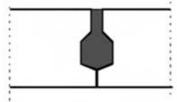

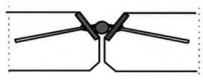
*a) Unión con hormigón o lechada*

*b) Unión sodada o atornillada (aquí se muestra un tipo de conexión soldada como ejemplo) c) Armadura de la capa de compresión (pueden ser necesarios los conectores verticales para la capa de compresión, con el fin de asegurar la transferencia del cortante en ELU) Figura A19.10.2 Ejemplos de uniones para la transferencia del cortante*

Sec. I. Pág. 98446

> cve: BOE-A-2021-13681
Verificable en https://www.boe.es

<!-- pag 163 -->

(6) En el caso de suponer que los forjados prefabricados trabajan como diafragmas para transferir las cargas horizontales a los elementos de arriostramiento, se debe considerar lo siguiente:

\- el diafragma debe formar parte de un modelo estructural realista, teniendo en cuenta la compatibilidad de las deformaciones con los elementos de arriostramiento,

\- se deben tener en cuenta los efectos de la deformación horizontal en todas las partes de la estructura debidas a la transferencia de las cargas horizontales,

\- se debe armar el diafragma para los esfuerzos de tracción supuestos en el modelo estructural,

\- debe tenerse en cuenta la concentración de tensiones en los huecos y uniones a la hora de establecer la definición de los detalles de armado.

(7) La armadura transversal para la transferencia del cortante a través del diafragma, puede concentrarse a lo largo de los apoyos, formando sistemas de atado coherentes con el modelo estructural. Esta armadura puede disponerse en la capa de compresión, si existe.

(8) Las piezas prefabricadas con una capa de compresión de al menos 40 mm pueden calcularse como elementos mixtos si se comprueba el rasante en la superficie de contacto, de Acuerdo con el apartado 6.2.5. El elemento prefabricado deberá comprobarse en todas las fases de la construcción, antes y después de que la acción mixta se haga efectiva.

(9) La armadura transversal de flexión y otros esfuerzos, puede disponerse completamente en la capa de compresión. La definición de los detalles de proyecto debe ser coherente con el modelo estructural (por ejemplo si se supone un forjado bidireccional).

(10) Las almas o nervios independientes de la losa (es decir, elementos no conectados para la transferencia del cortante) deben disponerse con una armadura de cortante igual a la correspondiente a las vigas.

(11) Los forjados de vigueta y bovedilla sin capa de compresión pueden analizarse como losas macizas en el caso de que las viguetas transversales ejecutadas in situ se contengan con una armadura continua, a través de las viguetas longitudinales prefabricadas y con una separación $s_{T}$ acorde con la tabla A19.10.1.

(12) Para la función de diafragma entre los elementos de la losa prefabricada con las uniones hormigonadas o rellenas de mortero, la tensión de rasante media $v_{Rdi}$ deberá limitarse a 0,1 N/mm $^{2}$ para las superficies muy lisas. En cambio, para las superficies lisas y rugosas se limitará a 0,15 N/mm $^{2}$ (véase el apartado 6.2.5 para la definición de las superficies).

Tabla A19.10.1 Separación máxima de viguetas transversales, $s_{T}$ , para el análisis de forjados de vigueta y bovedilla como losas macizas, $s_{L}$ es la separación de las viguetas longitudinales, $l_{L}$ es la longitud (luz)

**de las viguetas longitudinales y h es el espesor del forjado nervado.**

<table><tr><td>Tipo de cargas impuestas</td><td> $s_L \le l_L/8$ </td><td> $s_L > l_L/8$ </td></tr><tr><td>Residencial, nieve</td><td>No necesaria</td><td> $s_T \le 12h$ </td></tr><tr><td>Otras</td><td> $s_T \le 10h$ </td><td> $s_T \le 8h$ </td></tr></table>

## 10.9.4 Uniones y apoyos de los elementos prefabricados

## 10.9.4.1 Materiales

(1) Los materiales utilizados para las uniones deberán:

\- ser estables y durables durante la vida útil de proyecto de la estructura,

Sec. I. Pág. 98447

> cve: BOE-A-2021-13681
Verificable en https://www.boe.es

<!-- pag 164 -->

\- ser química y físicamente compatibles,

\- estar protegidos contra las agresiones químicas y físicas,

\- tener una resistencia al fuego coherente con la de la estructura.

(2) Las placas de apoyo deberán tener unas propiedades de resistencia y deformación conformes con las hipótesis de cálculo.

(3) Las sujeciones metálicas para los revestimientos, destinadas a clases de exposicion distintas de X0 y XC1 (véase la tabla 27.1.a de este Código Estructural) y no protegidas frente al ambiente, deberán ser de un material resistente a la corrosión. También podrán utilizarse recubrimientos protectores si es posible la inspección de estos elementos.

(4) Deberá comprobarse la idoneidad del material antes de llevar a cabo la soldadura, el templado o la conformación en frío de los elementos.

## 10.9.4.2 Reglas generales para el dimensionamiento y definición de los detalles relativos a las uniones

(1) Las uniones deberán ser capaces de resistir los efectos de las acciones, en coherencia con las hipótesis de cálculo, para ajustarse a las deformaciones necesarias y asegurar un comportamiento robusto de la estructura.

(2) Deberá evitarse la rotura y el desconchamiento prematuro del hormigón en los extremos de los elementos teniendo en cuenta:

\- los desplazamientos relativos entre los elementos,

\- las imperfecciones,

\- los requisitos de montaje,

\- la facilidad de ejecución,

\- la facilidad de inspección.

(3) La comprobación de la resistencia y la rigidez de las uniones debe basarse en el cálculo, posiblemente asistido por ensayos (para el dimensionamiento asistido por ensayos, véase el Apéndice D del Anejo 18 del Código Estructural). Las imperfecciones deben tenerse en cuenta. En los valores obtenidos de los ensayos, deben tenerse en cuenta las desviaciones desfavorables derivadas de las condiciones de los ensayos.

## 10.9.4.3 Uniones que transmiten esfuerzos de compresión

(1) Se pueden ignorar los esfuerzos de cortante en las uniones comprimidas si el cortante es inferior al 10 % del esfuerzo de compresión.

(2) Para las uniones con materiales de apoyo como mortero, hormigón o polímeros, debe impedirse el movimiento relativo entre las superficies en contacto durante el proceso de endurecimiento del hormigón.

(3) Las uniones sin material de apoyo (uniones secas) únicamente deben utilizarse en los casos en los que se garantice una buena calidad en la ejecución. La tensión media en apoyos con superficies planas no deberá superar el valor $0,3f_{cd}$ . Las uniones secas, incluidas las superficies curvas (convexas), deben calcularse con la debida consideración de la geometría.

(4) Se deben considerar las tensiones transversales de tracción en los elementos adyacentes. Estas pueden deberse a una concentración de cargas de compresión de acuerdo con la figura A19.10.3 a), o a la deformación transversal de los apoyos de neopreno conforme a la figura A19.10.3 b). En el caso a), la armadura puede calcularse y disponerse de acuerdo con el apartado 6.5. En el caso b) la armadura debe disponerse cerca de las superficies de los elementos adyacentes.

Sec. I. Pág. 98448

> cve: BOE-A-2021-13681
Verificable en https://www.boe.es

<!-- pag 165 -->

(5) En ausencia de modelos más precisos, la armadura en el caso b) puede calcularse de acuerdo con la expresión (10.5):

$$
A _ {s} = 0, 2 5 (t / h) F _ {E d} / f _ {y d}\tag{10.5}
$$

donde:

$A_{s}$ es el área de armadura en cada superficie

t es el espesor de la placa de apoyo

h es la dimensión de la placa de apoyo en la dirección de la armadura

$F_{Ed}$ es el esfuerzo de compresión en la conexión.

(6) La capacidad máxima de las uniones sometidas a compresión se puede determinar de acuerdo con el apartado 6.7, o puede basarse en los resultados de los ensayos (para el cálculo asistido por ensayos véase el Anejo 18 de este Código Estructural).

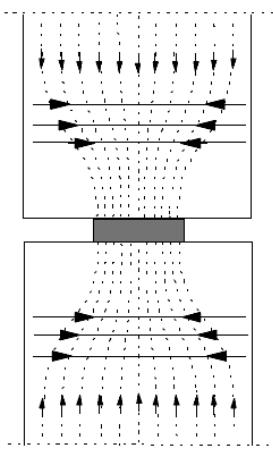

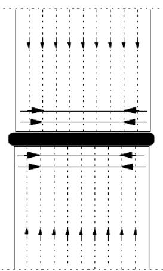
*a) Aparatos de apoyo concentrados b) deformación transversal de los apoyos de neopreno*

Figura A19.10.3 Tensiones transversales de tracción en uniones sometidas a compresión

## 10.9.4.4 Uniones que transmiten los esfuerzos cortantes

(1) Para la transferencia del cortante entre las caras enfrentadas de dos hormigones (por ejemplo, un elemento prefabricado y hormigón in situ) véase el apartado 6.2.5.

## 10.9.4.5 Uniones que transmiten momentos flectores o esfuerzos de tracción.

(1) La armadura deberá ser continua a lo largo de la unión y estar anclada en los elementos adyacentes.

(2) La continuidad puede obtenerse mediante:

\- solape de barras,

\- inyección de lechada en las vainas,

\- solape de los ganchos de la armadura,

\- soldadura de barras o chapas de acero,

\- pretensado,

\- dispositivos mecánicos (manguitos roscados o por adherencia),

\- conectores embutidos (empalmes a compresión).

Sec. I. Pág. 98449

> cve: BOE-A-2021-13681
Verificable en https://www.boe.es

<!-- pag 166 -->

## 10.9.4.6 Juntas a media madera

(1) Las juntas a media madera pueden calcularse utilizando un modelo de bielas y tirantes de acuerdo con el apartado 6.5. En la figura A19.10.4 se indican dos modelos alternativos y sus armaduras. Ambos modelos pueden combinarse.

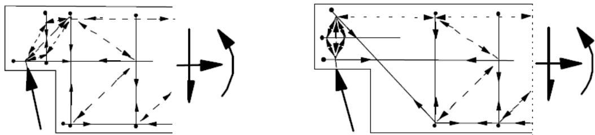
*NOTA: La figura muestra únicamente los elementos principales del modelo de bielas y tirantes. Figura A19.10.4 Modelos indicativos de la armadura en juntas a media madera*

## 10.9.4.7 Anclaje de las armaduras en los apoyos

(1) La armadura en los apoyos y los elementos de apoyo deben tener una configuración definida en los detalles de proyecto, de forma que permitan asegurar el anclaje en cada nudo, teniendo en cuenta las posibles desviaciones eventuales. En la figura A19.10.5 se muestra un ejemplo de ello.

La longitud de apoyo efectiva $a_{1}$ es controlada por la distancia d (véase la figura A19.10.5) desde el borde de los respectivos elementos donde:

$d_{i}=c_{i}+\Delta a_{i}$ con ganchos horizontales u otros tipos de barras ancladas

$d_{i} = c_{i} + \Delta a_{i} + r_{i}$ con barras verticales dobladas

donde:

$c_{i}$ es el recubrimiento de hormigón

$\Delta a_{i}$ es el margen de tolerancia para la imperfección (véase el apartado 10.5.5.2(1))

$r_{i}$ es el radio de doblado.

Véase la figura A19.10.5 y el apartado 10.5.5.2(1) para las definiciones de $\Delta a_{2}$ y $\Delta a_{3}$ .

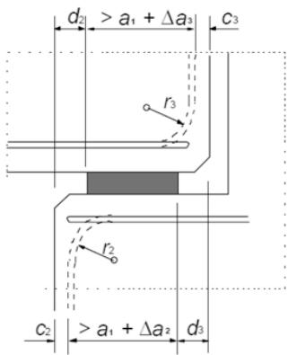
*Figura A19.10.5 Ejemplo de la definición de los detalles de proyecto de la armadura en un apoyo*

Sec. I. Pág. 98450

> cve: BOE-A-2021-13681
Verificable en https://www.boe.es

<!-- pag 167 -->

## 10.9.5 Apoyos

## 10.9.5.1 Generalidades

(1) Deberá asegurarse el buen funcionamiento de los apoyos mediante la disposición de armadura en los elementos adyacentes, la limitación de las tensiones de los apoyos, así como las disposiciones específicas que permiten tener en cuenta los movimientos o restricciones.

(2) En el cálculo de los elementos adyacentes a apoyos que no permiten el deslizamiento o el giro deben tenerse en cuenta las acciones debidas a la fluencia, retracción, temperatura, falta de alineación, falta de verticalidad, etc.

(3) Los efectos del punto (2) pueden requerir la utilización de una armadura transversal en los apoyos y en los elementos apoyados, y/o armaduras de continuidad para el atado de los elementos entre sí. Además, dichos efectos pueden tener influencia en el cálculo de la armadura principal de estos elementos.

(4) El dimensionamiento de los apoyos, así como la definición de los detalles correspondientes, deberán asegurar un posicionamiento correcto, teniendo en cuenta las desviaciones de la fabricación y el montaje.

(5) Deberán tenerse en cuenta los posibles efectos de los anclajes de pretensado y sus huecos.

## 10.9.5.2 Apoyos para elementos conectados (no aislados)

(1) La longitud nominal de un apoyo simple, como el que se muestra en la figura A19.10.6, se podrá calcular como:

$$
a = a _ {1} + a _ {2} + a _ {3} + \sqrt {\Delta a _ {2} ^ {2} + \Delta a _ {3} ^ {2}}\tag{10.6}
$$

donde:

$a_{1}$ es la longitud neta de apoyo que está relacionada con la tensión admisible en el apoyo, $a_{1}=F_{Ed}/(b_{1}f_{Rd})$ , pero no inferior a los valores mínimos de la tabla A19.10.2

$F_{Ed}$ es el valor de cálculo de la reacción del apoyo

$b_{1}$ es el ancho neto del apoyo (véase el punto (3))

$f_{Rd}$ es el valor de cálculo de la tensión admisible en el apoyo (véase el punto (2))

$a_{2}$ es la distancia considerada como ineficaz más allá del límite exterior del elemento de apoyo (véase la figura A19.10.6 y la tabla A19.10.3)

$a_{3}$ es la distancia considerada como ineficaz más allá del límite exterior del elemento apoyado (véase la figura A19.10.6 y la tabla A19.10.4)

$\Delta a_{2}$ es el margen de tolerancia para la distancia entre los elementos de apoyo (véase la tabla A19.10.5)

$\Delta a_{3}$ es el margen de tolerancia para la longitud de los elementos apoyados, $\Delta a_{3} = l_{n}/2500$ , donde $l_{n}$ es la longitud del elemento.

Sec. I. Pág. 98451

> cve: BOE-A-2021-13681
Verificable en https://www.boe.es

<!-- pag 168 -->

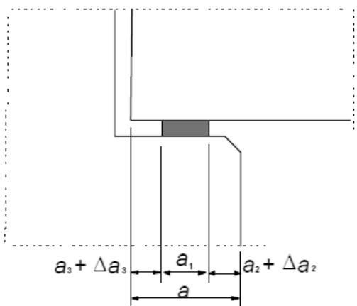

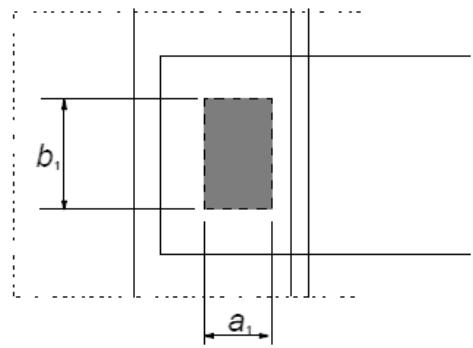

**Figura A19.10.6 Ejemplo de apoyo con sus definiciones Tabla A19.10.2 Valor mínimo de $a_{1}$ en mm**

<table><tr><td>Tensión relativa en el apoyo  $\sigma_{Ed}/f_{cd}$ </td><td> $\leq 0,15$ </td><td> $0,15 - 0,4$ </td><td> $>0,4$ </td></tr><tr><td>Apoyos lineales (forjados, cubiertas)</td><td>25</td><td>30</td><td>40</td></tr><tr><td>Forjados de vigas y viguetas</td><td>55</td><td>70</td><td>80</td></tr><tr><td>Apoyos concentrados (vigas)</td><td>90</td><td>110</td><td>140</td></tr></table>

**Tabla A19.10.3 Distancia $a_{2}(mm)$ considerada como ineficaz más allá del límite exterior del elemento de apoyo. En los casos (-) se deben utilizar bloques de hormigón Tabla A19.10.4 Distancia $a_{3}(mm)$ considerada como ineficaz más allá del límite exterior del elemento apoyado**

<table><tr><td>Material y tipo de apoyo</td><td> $\sigma_{Ed}/f_{cd}$ </td><td> $\leq 0,15$ </td><td>0,15-0,4</td><td>&gt;0,4</td></tr><tr><td rowspan="2">Acero</td><td>lineal</td><td>0</td><td>0</td><td>10</td></tr><tr><td>concentrado</td><td>5</td><td>10</td><td>15</td></tr><tr><td rowspan="2">Hormigón armado  $f_{ck} \geq 30 N/mm^{2}$ </td><td>lineal</td><td>5</td><td>10</td><td>15</td></tr><tr><td>concentrado</td><td>10</td><td>15</td><td>25</td></tr><tr><td rowspan="2">Hormigón en masa y hormigón armado  $f_{ck} < 30 N/mm^{2}$ </td><td>lineal</td><td>10</td><td>15</td><td>25</td></tr><tr><td>concentrado</td><td>20</td><td>25</td><td>35</td></tr><tr><td rowspan="2">Fábrica de ladrillo</td><td>lineal</td><td>10</td><td>15</td><td>(-)</td></tr><tr><td>concentrado</td><td>20</td><td>25</td><td>(-)</td></tr></table>

<table><tr><td rowspan="2">Definición de los detalles de armado</td><td colspan="2">Apoyo</td></tr><tr><td>Lineal</td><td>Concentrado</td></tr><tr><td>Barras continuas sobre el apoyo (con empotramiento o no en la viga)</td><td>0</td><td>0</td></tr><tr><td>Barras rectas, ganchos horizontales, próximos al extremo del elemento</td><td>5</td><td>15, pero no inferior al recubrimiento en el extremo</td></tr><tr><td>Armaduras activas o barras rectas expuestas en el extremo del elemento</td><td>5</td><td>15</td></tr><tr><td>Ganchos en U verticales</td><td>15</td><td>Recubrimiento en el extremo + radio interior de doblado</td></tr></table>

Sec. I. Pág. 98452

> cve: BOE-A-2021-13681
Verificable en https://www.boe.es

<!-- pag 169 -->

Tabla A19.10.5 Margen de tolerancia $\Delta a_{2}$ para las la distancia libre entre las caras de los apoyos.

**Considerando l como la luz del vano**

<table><tr><td>Material del apoyo</td><td> $\Delta a_{2}$ </td></tr><tr><td>Acero u hormigón prefabricado</td><td> $10 \le l/1200 \le 30 \text{ mm}$ </td></tr><tr><td>Fábrica de ladrillo u hormigón in situ</td><td> $15 \le l/1200 + 5 \le 40 \text{ mm}$ </td></tr></table>

(2) En ausencia de otras especificaciones, se podrán utilizar los siguientes valores para la tensión admisible en el apoyo:

$f_{Rd} = 0,4 \ f_{cd}$ para uniones secas (véase el apartado 10.9.4.3(3) para su definición)

$$
f _ {R d} = f _ {b e d} \leq 0, 8 5 f _ {c d} \quad \text {para el resto de casos}
$$

donde:

$f_{cd}$ es la menor de las resistencias de cálculo del apoyo y del elemento apoyado

$f_{bed}$ es la resistencia de cálculo del material de apoyo.

(3) Si se toman medidas para obtener una distribución uniforme de la presión en el apoyo (por ejemplo mortero, neoprenos o dispositivos similares), el ancho de cálculo del apoyo, $b_{1}$ , se puede tomar igual al ancho real del apoyo. Si este no es el caso, el valor de $b_{1}$ no debe ser mayor de 600 mm, salvo que exista un cálculo más preciso.

## 10.9.5.3 Apoyos para elementos aislados

(1) La longitud nominal deberá ser 20 mm mayor que la de los elementos no aislados.

(2) Si el apoyo permite los desplazamientos en el soporte, la longitud neta de apoyo, $a_{1}$ , deberá incrementarse de forma que permita dichos movimientos.

(3) Si un elemento está vinculado o coaccionado en un nivel diferente al de su apoyo, la longitud neta de apoyo, $a_{1}$ , deberá aumentarse para soportar los efectos de los posibles giros alrededor del elemento de vinculación o coacción.

## 10.9.6 Cimentaciones en cáliz

## 10.9.6.1 Generalidades

(1) Los cálices de hormigón deberán ser capaces de transferir las acciones verticales, los momentos flectores y los cortantes horizontales de los pilares al terreno. El cáliz debe ser lo suficientemente grande como para permitir un hormigonado correcto por debajo y alrededor del pilar.

## 10.9.6.2 Cáliz con llaves en su superficie

(1) Se puede considerar que los cálices que han sido expresamente fabricados con paredes dentadas o con llaves en su superficie, actúan de forma monolítica con el pilar.

Sec. I. Pág. 98453

> cve: BOE-A-2021-13681
Verificable en https://www.boe.es

<!-- pag 170 -->

(2) Cuando la transmisión del momento genere esfuerzos verticales de tracción es necesario cuidar la definición de los detalles de armado, como del solape de las armaduras en los pilares y en las cimentaciones, teniendo en cuenta que la separación entre barras solapadas sea la adecuada. La longitud de solape, acorde con el apartado 8.7, debe incrementarse como mínimo en la distancia horizontal entre las barras del pilar y la cimentación (véase la figura A19.10.7(a)). Además, se debe disponer una armadura horizontal adecuada en el solape.

(3) El cálculo de la armadura de punzonamiento debe realizarse como en el caso de pilares y cimentaciones monolíticas, de acuerdo con el apartado 6.4 (véase la figura A19.10.7(a)), siempre que se compruebe la transferencia del cortante entre el pilar y la cimentación. Si esta condición no se cumple, el cálculo del punzonamiento debe realizarse de forma similar al de los cálices de superficies lisas.

## 10.9.6.3 Cálices con superficies lisas

(1) Puede suponerse que las fuerzas y momentos se transfieren del pilar a la cimentación mediante los esfuerzos de compresión, $F_{1}$ , $F_{2}$ y $F_{3}$ , a través del hormigón de relleno y de los correspondientes esfuerzos de rozamiento, tal y como se muestra en la figura A19.10.7(b). Este modelo requiere que $l \geq 1,2h$ .

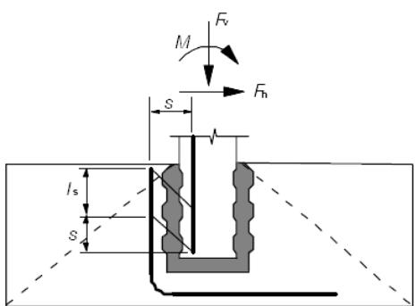
*a) Cáliz con llaves en su superficie*

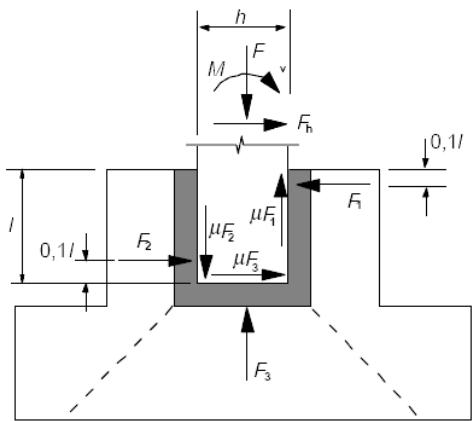
*b) Cáliz de pared lisa Figura A19.10.7 Cimentaciones en cáliz*

(2) El coeficiente de rozamiento no debe tomarse superior a $\mu = 0,3$ .

(3) Se debe prestar una atención especial a:

\- la definición de la armadura de refuerzo para resistir $F_{1}$ , en la parte superior de las paredes del cáliz,

\- la transferencia de $F_{1}$ a lo largo de las paredes laterales hasta la zapata,

\- el anclaje de la armadura principal en el pilar y en las paredes del cáliz,

\- la resistencia a cortante del pilar en el cáliz,

\- la resistencia al punzonamiento de la cimentación del cáliz bajo el esfuerzo del pilar, cuyo cálculo debe tener en cuenta el hormigón estructural in situ situado bajo el elemento prefabricado.

Sec. I. Pág. 98454

> cve: BOE-A-2021-13681
Verificable en https://www.boe.es

<!-- pag 171 -->

## 10.9.7 Sistemas de atado

(1) Para los elementos tipo placa cargados o solicitados en su plano, por ejemplo muros y forjados actuando como diafragmas, la interacción necesaria puede obtenerse mediante el atado del conjunto de la estructura con armaduras de atado perimetrales y/o interiores.

Los mismos elementos de atado pueden actuar también para prevenir el colapso progresivo, como se indica en el apartado 9.10.

