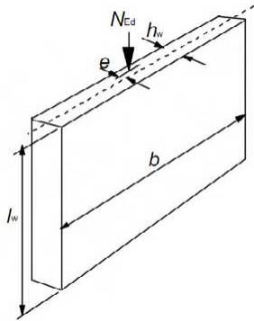
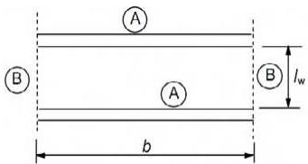
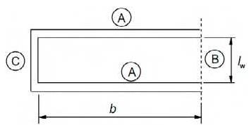
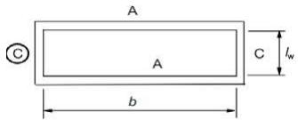
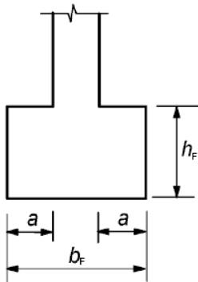

## 12 Estructuras de hormigón en masa y ligeramente armado

## 12.1 Generalidades

(1) Este apartado proporciona reglas adicionales para estructuras de hormigón en masa o en las que la armadura pasiva dispuesta sea inferior a la mínima requerida para hormigón armado.

(2) Este apartado es de aplicación a elementos en los que se puede despreciar el efecto de las acciones dinámicas. No es de aplicación cuando estos efectos son producidos por máquinas giratorias o cargas de tráfico. Algunos ejemplos en los que este capítulo sería de aplicación:

\- elementos sometidos principalmente a compresión que no sea producida por pretensado, por ejemplo, muros, pilares, arcos y bóvedas,

\- zapatas corridas y zapatas aisladas para cimentaciones,

\- muros de contención.

Sec. I. Pág. 98461

> cve: BOE-A-2021-13681
Verificable en https://www.boe.es

<!-- pag 178 -->

(3) Cuando los elementos se hayan fabricado con un hormigón con áridos ligeros de estructura cerrada y conforme con el apartado 11, o para elementos prefabricados de hormigón y estructuras contempladas en este anejo, las reglas de cálculo deben modificarse según corresponda.

(4) Los elementos que empleen hormigón en masa no están exentos de disponer la armadura de acero necesaria para satisfacer los requisitos de comportamiento en servicio y/o durabilidad, ni la armadura pasiva en ciertas partes del elemento. Esta armadura puede tenerse en cuenta en la comprobación local de los Estados Límite Últimos, así como en la comprobación de los Estados Límite de Servicio.

## 12.3 Materiales

## 12.3.1 Hormigón: hipótesis de cálculo adicionales

(1) Debido a la baja ductilidad del hormigón en masa, los valores de $\alpha_{cc,pl}$ y $\alpha_{ct,pl}$ deben suponerse menores que los $\alpha_{cc}$ y $\alpha_{ct}$ del hormigón armado. De esta forma se utilizará el valor $\alpha_{cc,pl} = \alpha_{ct,pl} = 0,80$ .

(2) Cuando las tensiones de tracción se consideren en la resistencia de cálculo de los elementos de hormigón en masa, el diagrama tensión-deformación (véase el apartado 3.1.7) puede ampliarse para la resistencia de cálculo a tracción, empleando la expresión (3.16) o una relación lineal:

$$
f _ {c t d, p l} = \alpha_ {c t, p l} f _ {c t k, 0, 0 5} / \gamma_ {C}\tag{12.1}
$$

(3) Pueden emplearse métodos propios de la mecánica de fractura siempre que se demuestre que conducen al nivel de seguridad requerido.

## 12.5 Análisis estructural: Estados Límite Últimos

(1) Puesto que los elementos de hormigón en masa tienen una ductilidad limitada no deben emplearse, a menos que se justifique, procedimientos de análisis lineal con redistribución o de análisis plástico o aproximadamente plástico, como por ejemplo métodos sin una comprobación explícita de la capacidad de deformación).

(2) El análisis estructural puede basarse en la teoría elástica lineal o no lineal. En el caso de que se utilice un análisis no lineal (por ejemplo, mecanismos de fractura), debe realizarse una comprobación de la capacidad de deformación.

## 12.6 Estados Límite Últimos

## 12.6.1 Resistencia de cálculo a flexión y a esfuerzo axil

(1) En el caso de muros con un curado y detalles constructivos adecuados pueden despreciarse las deformaciones impuestas debidas a la temperatura o a la retracción.

(2) Las relaciones entre la tensión y la deformación para hormigón en masa pueden establecerse a partir del apartado 3.1.7.

(3) El axil resistente, $N_{Rd}$ , de una sección rectangular con una excentricidad uniaxial, e, en la dirección de $h_{w}$ , puede tomarse como:

$$
N _ {R d} = \eta f _ {c d, p l} x b x h _ {w} x (1 - 2 e / h _ {w})\tag{12.2}
$$

donde:

$\eta f_{cd,pl}$ es la resistencia efectiva de cálculo a compresión (véase el apartado 3.1.7(3))

b es el ancho total de la sección (véase la figura A19.12.1)

$h_{w}$ es el canto total de la sección

e es la excentricidad de $N_{Ed}$ en la dirección de $h_{w}$ .

Sec. I. Pág. 98462

> cve: BOE-A-2021-13681
Verificable en https://www.boe.es

<!-- pag 179 -->

NOTA:

En el caso de emplear otros métodos simplificados, estos deberán quedar del lado de la seguridad respecto a un método riguroso que emplee la relación tensión-deformación que se establece en el apartado 3.1.7.

*Figura A19.12.1 Notación para muros de hormigón en masa*

## 12.6.2 Fallo local

(1) Salvo que se hayan tomado medidas para evitar el fallo local a tracción de la sección, la excentricidad máxima de la fuerza axil $N_{Ed}$ en una sección debe limitarse para evitar grandes fisuras.

## 12.6.3 Cortante

(1) En elementos de hormigón en masa puede considerarse la resistencia a tracción del hormigón en Estado Límite Último de cortante, siempre que pueda descartarse la rotura frágil y asegurarse una resistencia adecuada, bien mediante cálculos o mediante la experiencia.

(2) Para una sección solicitada a esfuerzo cortante $V_{Ed}$ y a una fuerza normal $N_{Ed}$ sobre un área comprimida $A_{cc}$ , el valor absoluto de las componentes de la tensión de cálculo deben tomarse como:

$$
\sigma_ {c p} = N _ {E d} / A _ {c c}\tag{12.3}
$$

$$
\tau_ {c p} = k V _ {E d} / A _ {c c}\tag{12.4}
$$

donde k = 1,5, y debe comprobarse lo siguiente:

$$
\tau_ {c p} \leq f _ {c v d}
$$

donde:

$$
\mathsf {s i} \sigma_ {c p} \leq \sigma_ {c, l i m}
$$

$$
f _ {c v d} = \sqrt {f _ {c t d , p l} ^ {2} + \sigma_ {c p} f _ {c t d , p l}}\tag{12.5}
$$

0

$$
\mathsf {s i} \sigma_ {c p} > \sigma_ {c, l i m}
$$

$$
f _ {c v d} = \sqrt {f _ {c t d , p l} ^ {2} + \sigma_ {c p} f _ {c t d , p l} - (\frac {\sigma_ {c p} - \sigma_ {c , l i m}}{2}) ^ {2}}\tag{12.6}
$$

$$
\sigma_ {c, l i m} = f _ {c d, p l} - 2 \sqrt {f _ {c t d , p l} (f _ {c t d , p l} + f _ {c d , p l})}\tag{12.7}
$$

donde:

$f_{cvd}$ es la resistencia de cálculo a cortante y a compresión del hormigón

$f_{cd,pl}$ es la resistencia de cálculo a compresión del hormigón

$f_{ctd,pl}$ es la resistencia de cálculo del hormigón a tracción.

Sec. I. Pág. 98463

> cve: BOE-A-2021-13681
Verificable en https://www.boe.es

<!-- pag 180 -->

(3) Puede considerarse que un elemento de hormigón no está fisurado en Estado Límite Último si está completamente comprimido o si el valor absoluto de la tensión de tracción principal $\sigma_{ct1}$ no supera $f_{ctd,pl}$ .

## 12.6.4 Torsión

(1) No deben proyectarse elementos fisurados para resistir momentos torsores manera menos que se pueda justificar.

## 12.6.5 Estados Límite Últimos inducidos por deformación estructural (pandeo)

## 12.6.5.1 Esbeltez de pilares y muros

(1) La esbeltez de un pilar o muro se define como:

**Tabla A19.12.1 Valores de β para distintas condiciones de contorno**

<table><tr><td>Coacción lateral</td><td>Croquis</td><td>Expresión</td><td colspan="2">Coeficiente  $\beta$ </td></tr><tr><td>A lo largo de doslados</td><td></td><td></td><td colspan="2"> $\beta = 1,0$  para cualquier relación $I_w/b$ </td></tr><tr><td rowspan="9">A lo largo de treslados</td><td rowspan="9"></td><td rowspan="9"> $\beta = \frac{1}{1 + (\frac{l_w}{3b})^2}$ </td><td> $b/I_w$ </td><td> $\beta$ </td></tr><tr><td>0,2</td><td>0,26</td></tr><tr><td>0,4</td><td>0,59</td></tr><tr><td>0,6</td><td>0,76</td></tr><tr><td>0,8</td><td>0,85</td></tr><tr><td>1,0</td><td>0,90</td></tr><tr><td>1,5</td><td>0,95</td></tr><tr><td>2,0</td><td>0,97</td></tr><tr><td>5,0</td><td>1,00</td></tr><tr><td rowspan="9">A lo largo de cuatro lados</td><td rowspan="9"></td><td rowspan="9"> $Si \, b \geq l_w$  $\beta = \frac{1}{1 + (\frac{l_w}{b})^2}$  $Si \, b < l_w$  $\beta = \frac{b}{2I_w}$ </td><td> $b/I_w$ </td><td> $\beta$ </td></tr><tr><td>0,2</td><td>0,10</td></tr><tr><td>0,4</td><td>0,20</td></tr><tr><td>0,6</td><td>0,30</td></tr><tr><td>0,8</td><td>0,40</td></tr><tr><td>1,0</td><td>0,50</td></tr><tr><td>1,5</td><td>0,69</td></tr><tr><td>2,0</td><td>0,80</td></tr><tr><td>5,0</td><td>0,96</td></tr></table>

Sec. I. Pág. 98464

> cve: BOE-A-2021-13681
Verificable en https://www.boe.es

<!-- pag 181 -->

NOTA: La información de la tabla A19.12.1 supone que el muro no tiene huecos de altura superior a 1/3 de la altura del muro $l_{w}$ o con un área superior a 1/10 del área del muro. En muros arriostrados lateralmente a lo largo de 3 o 4 lados con aberturas que superen estos límites, las partes entre aberturas deben considerarse como arriostradas lateralmente únicamente a lo largo de dos lados y ser calculadas de acuerdo con ello.

(2) Los valores de $\beta$ deben aumentarse de forma adecuada si la capacidad portante transversal se ve afectada por salientes y entrantes.

(3) Un muro transversal puede considerarse como muro de arriostramiento si:

\- su espesor total no es inferior a $0,5h_{w}$ , donde $h_{w}$ es el espesor total del muro arriostrado,

\- tiene la misma altura $l_w$ que el muro arriostrado considerado,

\- su longitud $l_{ht}$ es, al menos, igual a $l_w/5$ , donde $l_w$ se refiere a la altura libre del muro arriostrado,

\- el muro transversal no tiene aberturas en la longitud $l_w/5$ .

(4) En el caso de un muro con conexión rígida a flexión a lo largo de su lado superior y su lado inferior, de forma que los momentos extremos se resistan completamente con hormigón in situ y armadura, los valores de $\beta$ recogidos en la tabla A19.12.1 pueden multiplicarse por 0,85.

(5) La esbeltez de los muros de hormigón en masa ejecutados in situ no debe ser mayor de $\lambda = 86$ (por ejemplo, $I_{0}/h_{w} = 25$ ).

## 12.6.5.2 Método simplificado de cálculo para muros y pilares

(1) En ausencia de un planteamiento más riguroso, el valor de cálculo de la resistencia axil para un pilar o un muro delgado de hormigón en masa, puede calcularse mediante:

$$
N _ {R d} = b h _ {w} f _ {c d, p l} \varPhi\tag{12.10}
$$

donde:

$$
N _ {R d}
$$

b es el ancho total de la sección

$h_{w}$ es el canto total de la sección

$$
\phi
$$

Sec. I. Pág. 98465

> cve: BOE-A-2021-13681
Verificable en https://www.boe.es

<!-- pag 182 -->

Para elementos arriostrados, el coeficiente $\Phi$ puede tomarse como:

$$
\varPhi = 1, 1 4 \left(1 - \frac {2 e _ {t o t}}{h _ {w}}\right) - 0, 0 2 l _ {0} / h _ {w} \leq 1 - \frac {2 e _ {t o t}}{h _ {w}}\tag{12.11}
$$

donde:

$$
e _ {t o t} = e _ {0} + e _ {i} + e _ {\varphi}\tag{12.12}
$$

$e_{0}$ es la excentricidad de primer orden incluyendo, cuando corresponda, los efectos de los forjados (por ejemplo, posibles momentos transmitidos al muro desde la losa) y las acciones horizontales. En la determinación de $e_{0}$ se puede utilizar un momento de primer orden equivalente $M_{oe}$ , véase el punto (2) del apartado 5.8.8.2

$e_{i}$ es la excentricidad adicional que considera los efectos de las imperfecciones geométricas, véase el apartado 5.2

$e_{\varphi}$ es la excentricidad debida a la fluencia.

En algunos casos, dependiendo de la esbeltez, el momento en alguno de los extremos o en ambos puede ser más crítico para la estructura que el momento de primer orden equivalente $M_{oe}$ . En tales casos, se debería utilizar la expresión (12.2).

(2) Pueden emplearse otros métodos simplificados siempre que queden del lado de la seguridad respecto a un método riguroso acorde con el apartado 5.8.

## 12.7 Estados Límite de Servicio

(1) Deben comprobarse las tensiones donde se espere que se produzcan coacciones en la estructura.

(2) Para asegurar unas condiciones de servicio adecuadas deben considerarse las siguientes medidas:

a) respecto a la formación de fisuras:

\- limitación de las tensiones de tracción en el hormigón a valores admisibles,

\- colocación de armadura pasiva estructural auxiliar (armadura de piel, sistemas de atado donde sea necesario),

\- disposición de juntas,

\- elección de las propiedades tecnológicas del hormigón (por ejemplo, composición adecuada del hormigón, curado),

\- elección de un método adecuado de construcción.

b) respecto a la limitación de deformaciones:

\- un tamaño mínimo de la sección (véase el apartado 12.9),

\- limitación de la esbeltez en caso de elementos comprimidos.

(3) Cualquier armadura dispuesta en elementos de hormigón en masa, aunque no se tenga en cuenta en la comprobación de la resistencia, debe cumplir con lo indicado en el Capítulo 9 de este Código Estructural.

## 12.9 Definición de los detalles de proyecto de los elementos y reglas particulares

## 12.9.1 Elementos estructurales

(1) El canto total $h_{w}$ de un muro de hormigón ejecutados in situ no debe ser inferior a 120 mm.

(2) Cuando se incluyan salientes y entrantes deben realizarse comprobaciones para asegurar una resistencia y estabilidad del elemento adecuadas.

Sec. I. Pág. 98466

> cve: BOE-A-2021-13681
Verificable en https://www.boe.es

<!-- pag 183 -->

## 12.9.2 Juntas de construcción

(1) Debe disponerse una armadura adecuada para controlar la fisuración cuando se espere que surjan tensiones de tracción en el hormigón.

## 12.9.3 Zapatas corridas y aisladas

(1) En ausencia de datos más precisos, las zapatas corridas y aisladas cargadas a axil, pueden calcularse y construirse con hormigón en masa, siempre que:

$$
\frac {0 , 8 5 h _ {f}}{a} \geq \sqrt {3 \sigma_ {g d} / f _ {c t d , p l}}\tag{12.3}
$$

donde:

$h_{f}$ es el espesor de la cimentación

a es la proyección desde la cara del pilar (véase la figura A19.12.2)

$\sigma_{gd}$ es el valor de cálculo de la presión del terreno

$f_{ctd,pl}$ es el valor de cálculo de la resistencia a tracción del hormigón (en las mismas unidades que $\sigma_{gd}$ ).

Como simplificación, puede emplearse la relación $\frac{h_{f}}{a} \geq 2$ .

*Figura A19.12.2 Zapatas aisladas sin armadura; notación*

Sec. I. Pág. 98467

> cve: BOE-A-2021-13681
Verificable en https://www.boe.es

<!-- pag 184 -->

