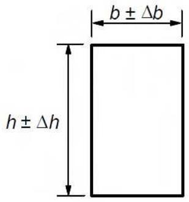

## Apéndice A Recomendaciones para la modificación de los coeficientes parciales de los materiales

## A.1 Generalidades

(1) Los coeficientes parciales para los materiales que se establecen en el apartado 2.4.2.4 corresponden a imperfecciones geométricas para un control de ejecución normal, (de acuerdo al apartado 14.3 de este Código Estructural).

(2) Las recomendaciones sobre los coeficientes parciales reducidos de los materiales se encuentran en este apéndice. Para los elementos prefabricados se pueden encontrar más detalles sobre los procedimientos de control en las normas de producto.

NOTA: Para más información véase el Apéndice B del Anejo 18 de este Código Estructural.

## A.2 Estructuras de hormigón in situ

## A.2.1 Reducción basada en el control de calidad e imperfecciones reducidas

(1) Si la ejecución se somete a un sistema de control de calidad que asegure que las desviaciones desfavorables de las dimensiones de la sección quedan dentro de los límites que establece la tabla A19.A.1, se puede reducir el coeficiente parcial de seguridad para la armadura a $\gamma_{S,red1}=1,1$ .

**Tabla A19. A.1 Imperfecciones reducidas**

<table><tr><td rowspan="2">h o b (mm)</td><td colspan="2">Imperfecciones reducidas (mm)</td></tr><tr><td>Dimensión de la sección ±Δh, Δb (mm)</td><td>Posición de la armadura +Δc (mm)</td></tr><tr><td>≤ 150</td><td>5</td><td>5</td></tr><tr><td>400</td><td>10</td><td>10</td></tr><tr><td>≥ 2500</td><td>30</td><td>20</td></tr><tr><td colspan="3">NOTA 1: Se puede utilizar la interpolación lineal para valores intermedios.NOTA 2: +Δc se refiere al valor medio de las armaduras pasivas o activas en la sección o sobre un ancho de un metro (por ejemplo en losas y muros)</td></tr></table>

(2) Bajo la condición que se establece en el apartado A.2.1(1) y siempre que el coeficiente de variación de la resistencia del hormigón no sea superior al 10%, el coeficiente parcial de seguridad para el hormigón se puede reducir a $\gamma_{C,red1}=1,4$ .

## A.2.2 Reducción basada en la utilización de datos geométricos reducidos o medidos en el cálculo

(1) Si la obtención de la resistencia de cálculo se basa en datos geométricos críticos, incluyendo el canto útil (véase la figura A19.A.1), que estén:

\- reducidos por las desviaciones, o

\- medidos en la estructura finalizada,

entonces, los coeficientes parciales de seguridad se pueden reducir a $\gamma_{S,red2} = 1,05$ y $\gamma_{C,red2} = 1,45$ .

Sec. I. Pág. 98468

> cve: BOE-A-2021-13681
Verificable en https://www.boe.es

<!-- pag 185 -->

*a) Sección*

*b) Posición de la armadura
(dirección desfavorable para el canto útil) Figura A19.A.1 Imperfecciones de la sección*

(2) Bajo las condiciones que se establecen en el apartado A.2.2(1), siempre y cuando el coeficiente de variación de la resistencia del hormigón no sea superior al 10%, el coeficiente parcial para el hormigón se puede reducir a $\gamma_{C,red3} = 1,35$ .

## A.2.3 Reducción basada en la evaluación de la resistencia del hormigón en la estructura finalizada

(1) Para los valores de la resistencia del hormigón basados en ensayos sobre la estructura o elemento finalizado el valor de $\gamma_{c}$ se puede reducir mediante el coeficiente de conversión $\eta$ , que deberá justificarse documentalmente y que nunca será inferior a $\eta = 0,85$ .

El valor de $\gamma_{C}$ para el que se aplica esta reducción puede además reducirse de acuerdo con A.2.1 o A.2.2.

El valor resultante del coeficiente parcial no deberá tomarse inferior a $\gamma_{C,red4}=1,30$ .

## A.3 Productos prefabricados

## A.3.1 Generalidades

(1) Estas disposiciones son de aplicación a productos prefabricados, como los descritos en el apartado 10, asociados a sistemas que aseguren la calidad y con certificado de conformidad.

NOTA: El control de producción en fábrica de los productos prefabricados con marcado CE está certificado por un organismo notificado (Nivel de Certificado 2+).

## A.3.2 Coeficientes parciales para los materiales

(1) Los coeficientes parciales reducidos para los materiales, $\gamma_{C,pcred}$ y $\gamma_{S,pcred}$ , se pueden utilizar de acuerdo con las reglas dispuestas en el apartado A.2, siempre que se justifique mediante los procedimientos de control adecuados.

(2) Las recomendaciones para el control de producción necesario en fábrica, con el fin de permitir la utilización de los coeficientes parciales reducidos para los materiales, se establecen en las normas de producto. La norma UNE-EN 13369 recoge las recomendaciones generales.

## A.4 Elementos prefabricados

(1) Las reglas que se establecen en el apartado A.2 para estructuras de hormigón in situ se aplican también a elementos prefabricados de hormigón definidos en el apartado 10.1.1.

Sec. I. Pág. 98469

> cve: BOE-A-2021-13681
Verificable en https://www.boe.es

<!-- pag 186 -->

