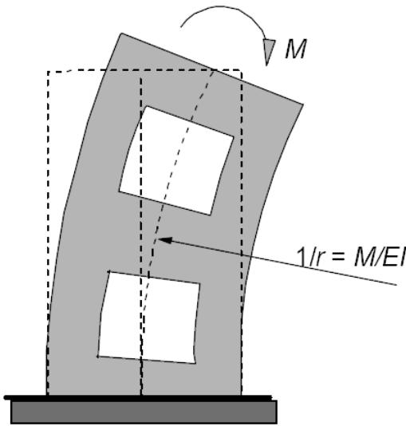
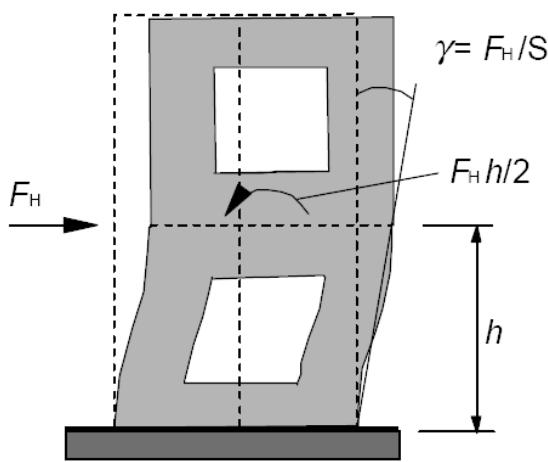

## Apéndice H Propuesta para la consideración de los efectos globales de segundo orden en las estructuras

H.1 Criterios para despreciar los efectos de segundo orden

## H.1.1 Generalidades

(1) El apartado H.1 establece los criterios para las estructuras en las que no se cumplan las condiciones del apartado 5.8.3.3(1). Los criterios se basan en el apartado 5.8.2(6) y tienen en cuenta las deformaciones producidas por la flexión global y el esfuerzo cortante, tal como se define en la figura A19.H.1.

*Figura A19.H.1 Definición de las deformaciones producidas por la flexión global y el esfuerzo cortante (1/r y γ respectivamente) y las rigideces correspondientes (EI y S respectivamente)*

## H.1.2 Sistema de arriostramiento sin deformaciones significativas de cortante

(1) Para un sistema de arriostramiento sin deformaciones significativas de cortante (por ejemplo, las pantallas sin huecos), se podrán ignorar los efectos globales de segundo orden si:

$$
F _ {V, E d} \leq 0, 1 \cdot F _ {V, B B}\tag{H.1}
$$

donde:

$F_{V,Ed}$ es la carga vertical total (en elementos arriostrados y de arriostramiento)

$F_{V,BB}$ es la carga global nominal de pandeo para flexión global, véase el punto (2).

(2) La carga global nominal de pandeo para flexión global puede tomarse como:

$$
F _ {V, B B} = \xi \sum E I / L ^ {2}\tag{H.2}
$$

donde:

$\xi$ es un coeficiente que depende del número de plantas, la variación de la rigidez, la rigidez de la coacción en la base y la distribución de cargas; véase el punto (4)

ΣEI es la suma de las rigideces a flexión de los elementos de arriostramiento en la dirección considerada, incluyendo los posibles efectos de la fisuración; véase el punto (3)

L es la altura total de edificio sobre el nivel del empotramiento.

Sec. I. Pág. 98481

> cve: BOE-A-2021-13681
Verificable en https://www.boe.es

<!-- pag 198 -->

(3) Para un elemento de arriostramiento con sección fisurada se puede utilizar la siguiente expresión en ausencia de una evaluación más precisa de la rigidez:

$$
E I \approx 0, 4 E _ {c d} I _ {c}\tag{H.3}
$$

donde:

$E_{cd} = E_{cm}/\gamma_{CE}$ es el valor de cálculo del módulo de elasticidad del hormigón, véase el apartado 5.8.6(3)

$$
I _ {c}
$$

momento de inercia del elemento de arriostramiento.

Si se demuestra que la sección no está fisurada en Estado Límite Último en la expresión (H.3) la constante 0,4 puede sustituirse por 0,8.

(4) Si los elementos de arriostramiento tienen una rigidez constante a lo largo de la altura y la carga vertical total aumenta en la misma proporción por planta, entonces $\xi$ puede tomarse como:

$$
\xi = 7, 8 \cdot \frac {n _ {s}}{n _ {s} + 1 , 6} \cdot \frac {1}{1 + 3 , 9 k}\tag{H.4}
$$

donde:

$$
n _ {s}
$$

es el número de plantas

k es la flexibilidad relativa del empotramiento, véase el punto (5).

(5) La flexibilidad relativa del empotramiento en la base se define como:

$$
k = (\theta / M) \cdot (E I / L)\tag{H.5}
$$

donde:

θ es el giro para el momento flector M

EI es la rigidez de acuerdo con el punto (3)

L es la altura total de la unidad de arriostramiento.

NOTA: Para k = 0, es decir, un empotramiento perfecto, las expresiones (H.1) – (H.4) pueden combinarse para establecer la expresión (5.18), en la que el coeficiente 0,31 es el producto de 0,1 · 0,4 · 7,8 ≈ 0,31.

## H.1.3 Sistema de arriostramiento con deformaciones significativas de cortante

(1) Podrán despreciarse los efectos globales de segundo orden si se satisface la siguiente condición:

$$
F _ {V, E d} \leq 0, 1 \cdot F _ {V, B} = 0, 1 \cdot \frac {F _ {V , B B}}{1 + F _ {V , B B} / F _ {V , B S}}\tag{H.6}
$$

donde:

$F_{V,B}$ es la carga global de pandeo teniendo en cuenta la flexión y el cortante globales

$F_{V,BB}$ es la carga global de pandeo para flexión pura, véase el apartado H.1.2(2)

$F_{V,BS}$ es la carga global de pandeo para cortante puro, $F_{V,BS} = \sum S$

Σ S es la rigidez total a cortante (fuerza por ángulo de cortante) de las unidades de arriostramiento (véase la figura A19.H.1).

NOTA: La deformación global de cortante de una unidad de arriostramiento normalmente está condicionada, en mayor medida, por las deformaciones de flexión locales (figura A19.H.1). Por tanto, en ausencia de un análisis más preciso, se puede tener en cuenta la fisuración para S de la misma manera que para EI; véase H.1.2(3).

Sec. I. Pág. 98482

> cve: BOE-A-2021-13681
Verificable en https://www.boe.es

<!-- pag 199 -->

## H.2 Métodos de cálculo de los efectos globales de segundo orden

(1) Este apartado se basa en el análisis lineal de segundo orden de acuerdo con el apartado 5.8.7. Los efectos globales de segundo orden pueden tenerse en cuenta analizando la estructura frente a fuerzas horizontales ficticias y mayoradas $F_{H,Ed}$ :

$$
F _ {H, E d} = \frac {F _ {H , 0 E d}}{1 - F _ {V , E d} / F _ {V , B}}\tag{H.7}
$$

donde:

$F_{H,0Ed}$ es la fuerza horizontal de primer orden debida al viento, imperfecciones, etc.

$F_{V,Ed}$ es la carga vertical total sobre los elementos de arriostramiento y arriostrados

$F_{V,B}$ es la carga global nominal de pandeo, véase el punto (2).

(2) La carga de pandeo, $F_{V,B}$ , puede determinarse de acuerdo con el apartado H.1.3 (o el apartado H.1.2 si las deformaciones globales de cortante son despreciables). No obstante, en este caso deben emplearse valores de la rigidez nominal acordes con el apartado 5.8.7.2, incluyendo el efecto de la fluencia.

(3) En los casos en los que no esté definida la carga global de pandeo $F_{V,B}$ , puede emplearse la expresión siguiente:

$$
F _ {H, E d} = \frac {F _ {H , 0 E d}}{1 - F _ {H , 1 E d} / F _ {H , 0 E d}}\tag{H.8}
$$

donde:

$F_{H,1Ed}$ es la fuerza horizontal ficticia, que da lugar a los mismos momentos que una carga vertical, $N_{V,Ed}$ , que actúa sobre la estructura deformada, con una deformación producida por $F_{H,0Ed}$ (deformación de primer orden) y calculada con los valores nominales de rigidez acordes con el apartado 5.8.7.2

NOTA: La expresión (H.8) proviene de un cálculo numérico paso a paso en el que el efecto de la carga vertical y los incrementos de deformación, expresados como fuerzas horizontales equivalentes, se añaden en iteraciones consecutivas. Los incrementos formarán series geométricas después de unas pocas iteraciones. Suponiendo que esto sucede incluso en la primera iteración, (lo que es análogo a suponer que $\beta = 1$ en el apartado 5.8.7.3(3)), la suma puede expresarse como en la expresión (H.8). Esta hipótesis requiere que los valores de las rigideces que representan el estado final de deformaciones se empleen en todas las iteraciones (nótese que esto es también la hipótesis básica que hay detrás del análisis basado en valores nominales de la rigidez).

En otros casos, por ejemplo si se supone que en la primera iteración las secciones no están fisuradas y se detecta que la fisuración se produce en iteraciones posteriores, o si la distribución de las fuerzas horizontales equivalentes cambia de forma significativa en las primeras iteraciones, deberán incluirse más iteraciones en el análisis hasta alcanzar la hipótesis de una serie geométrica. A continuación se presenta un ejemplo con dos iteraciones más que en la expresión (H.8):

$$
F _ {H, E d} = F _ {H, 0 E d} + F _ {H, 1 E d} + F _ {H, 2 E d} / (1 - F _ {H, 3 E d} / F _ {H, 2 E d})
$$

Sec. I. Pág. 98483

> cve: BOE-A-2021-13681
Verificable en https://www.boe.es

<!-- pag 200 -->

