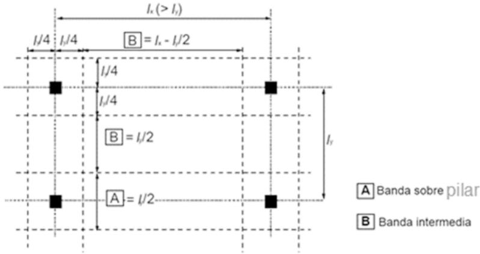
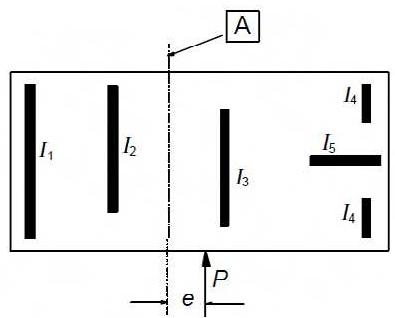

## Apéndice I Recomendaciones para el análisis de losas planas y pantallas

## I.1 Losas planas

## I.1.1 Generalidades

(1) Para el propósito de este apéndice, las losas planas tendrán un espesor uniforme o podrán incorporar regruesamientos (ábacos) sobre los pilares.

(2) Las losas planas deben analizarse empleando un método de cálculo contrastado, como el del emparrillado (en el que la placa se idealiza como un conjunto de elementos discretos interconectados), elementos finitos, límite elástico o pórtico equivalente. Deben emplearse las propiedades geométricas y de los materiales adecuadas.

## I.1.2 Cálculo del pórtico equivalente

(1) La estructura debe dividirse longitudinal y transversalmente en pórticos formados por pilares y secciones de las losas contenidas entre las líneas centrales de los paños adyacentes (área comprendida entre cuatro soportes adyacentes). La rigidez de los elementos puede calcularse a partir de sus secciones brutas. Para cargas verticales la rigidez puede basarse en el ancho total de los paños. Para cargas horizontales el 40% de este valor debe emplearse para representar el incremento de la flexibilidad en las uniones pilar/losa en las estructuras de losas planas, en comparación con las uniones pilar/viga. Debe emplearse la carga total del paño para el análisis en cada dirección.

(2) Los momentos flectores totales obtenidos a partir del cálculo deben distribuirse a lo largo del ancho de la losa. En el análisis elástico, los momentos negativos tienden a concentrarse en las líneas centrales de los pilares.

(3) Debe suponerse que los paños se dividen en bandas sobre los pilares y bandas intermedias (véase la figura A19.I.1). Los momentos flectores deben distribuirse tal como se indica en la tabla A19.I.1.

*Figura A19.I.1 División de los paños en losas planas*

A: Cuando se utilicen regruesamientos (ábacos) de una anchura > (l\_y/3), las bandas sobre los pilares deben tomarse iguales al ancho de dichos regruesamientos (ábacos). De esta manera, el ancho de las bandas intermedias deberá ajustarse en consecuencia.

> NOTA:

Sec. I. Pág. 98484

> cve: BOE-A-2021-13681
Verificable en https://www.boe.es

<!-- pag 201 -->

**Tabla A19.I.1 Reparto simplificado del momento flector para losas planas**

<table><tr><td></td><td>Momentos negativos</td><td>Momentos positivos</td></tr><tr><td>Banda sobre pilar</td><td>60% – 80%</td><td>50% – 70%</td></tr><tr><td>Banda intermedia</td><td>40% – 20%</td><td>50% – 30%</td></tr><tr><td colspan="3">NOTA: Los momentos negativos y positivos que deben resistir el pilar y las bandas intermedias siempre deben sumar 100%.</td></tr></table>

(4) Cuando el ancho de la banda sobre el pilar sea distinto a $0,5I_{x}$ (como se muestra en la figura A19.I.1) y se iguale al ancho del regruesamiento (ábaco), el ancho de la banda intermedia debe ajustarse en consecuencia.

(5) Salvo que existan vigas perimetrales, dimensionadas a torsión, los momentos transmitidos a los pilares de borde o de esquina deben limitarse al momento resistente de la sección rectangular igual a $0,17b_{e}d^{2}f_{ck}$ (véase la figura A19.9.9 para la definición de $b_{e}$ ). El momento positivo en el vano extremo debe ajustarse en consecuencia.

## I.1.3 Distribución irregular de los pilares

(1) Cuando debido a una distribución irregular de los pilares, la losa plana no pueda ser razonablemente analizada mediante el método del pórtico equivalente, puede emplearse un emparrillado u otro método elástico. En este caso suele ser suficiente la siguiente aproximación simplificada:

i) analizar la losa con la carga total, $\gamma_{Q}Q_{k} + \gamma_{G}G_{k}$ , en todos los paños,

ii) los momentos en el centro de vano y sobre el pilar deben aumentarse para tener en cuenta los efectos de la distribución de cargas. Esto puede lograrse cargando un paño crítico (o paños) con $\gamma_{Q}Q_{k} + \gamma_{G}G_{k}$ y el resto de la losa con $\gamma_{G}G_{k}$ . En el caso de que pueda existir una variación significativa entre las cargas permanentes de los distintos paños, $\gamma_{G}$ debe tomarse $\gamma_{G} = 1$ para los paños descargados,

iii) los efectos de esta carga particular pueden entonces aplicarse a otros paños y soportes críticos de manera similar.

(2) Deben aplicarse las restricciones relativas a la transmisión de momentos a los pilares de borde establecidas en el apartado I.1.2(5).

## I.2 Pantallas

(1) Las pantallas son muros de hormigón en masa o armado que contribuyen a la estabilidad lateral de la estructura.

(2) La carga lateral resistida por cada pantalla en la estructura debe obtenerse a partir de un análisis global de la estructura, teniendo en cuenta las cargas aplicadas, las excentricidades de las cargas respecto al centro de esfuerzos cortantes de la estructura y la interacción entre los distintos muros estructurales.

(3) Deben considerarse los efectos de la asimetría de la carga de viento (de acuerdo a la reglamentación específica de acciones vigente).

(4) Debe tenerse en cuenta la combinación de los efectos de la carga axil y el cortante.

(5) Además de los otros criterios de servicio de este Código, debe considerarse el efecto del movimiento horizontal de las pantallas sobre los ocupantes de la estructura, (véase Anejo 18 de este Código Estructural).

Sec. I. Pág. 98485

> cve: BOE-A-2021-13681
Verificable en https://www.boe.es

<!-- pag 202 -->

(6) En el caso de estructuras de edificación que no superen las 25 plantas, si la distribución en planta de las pantallas es sensiblemente simétrica y las pantallas no tienen huecos que produzcan deformaciones globales por cortante significativas, la carga lateral resistida por una pantalla podrá obtenerse mediante la siguiente expresión:

$$
P _ {n} = \frac {P \cdot (E I) _ {n}}{\sum (E I)} \pm \frac {(P \cdot e) \cdot y _ {n} \cdot (E I) _ {n}}{\sum (E I) \cdot y _ {n} ^ {2}}\tag{1.1}
$$

donde:

$P_{n}$ es la carga lateral en la pantalla n

$(EI)_{n}$ es la rigidez de la pantalla n

P es la carga aplicada

e es la excentricidad de P con respecto al centro de gravedad de las rigideces (véase la figura A19.I.3)

$y_{n}$ es la distancia de la pantalla n al centro de gravedad de las rigideces.

(7) Si los elementos, con o sin deformaciones por cortante significativas, se combinan a través del sistema de arriostramiento, el cálculo deberá tener en cuenta tanto la deformación a cortante como la deformación a flexión.

*Figura A19.I.3 Excentricidad de la carga respecto al centro de gravedad de las pantallas*

A Centro de gravedad del grupo de pantallas

Sec. I. Pág. 98486

> cve: BOE-A-2021-13681
Verificable en https://www.boe.es

<!-- pag 203 -->

