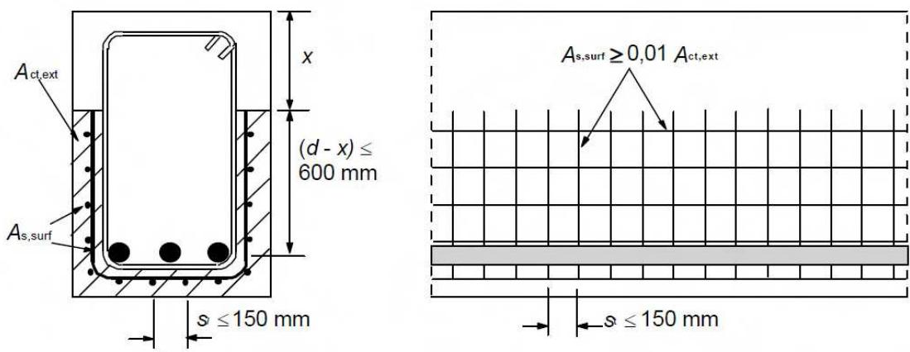
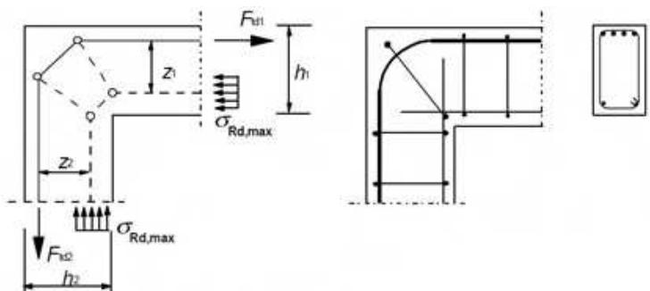
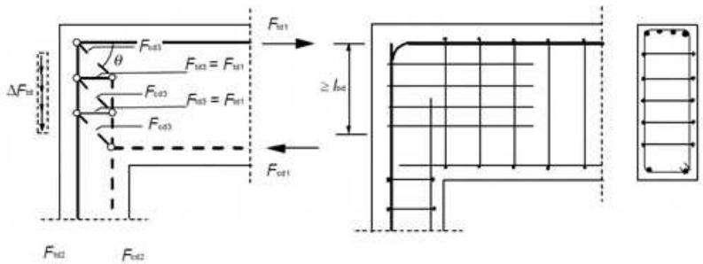
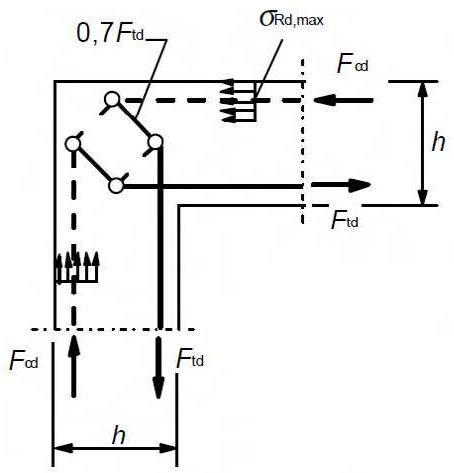
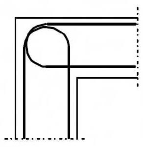
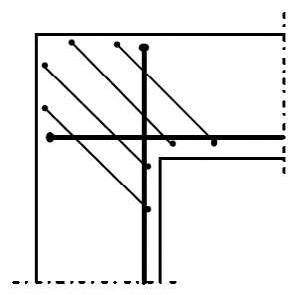
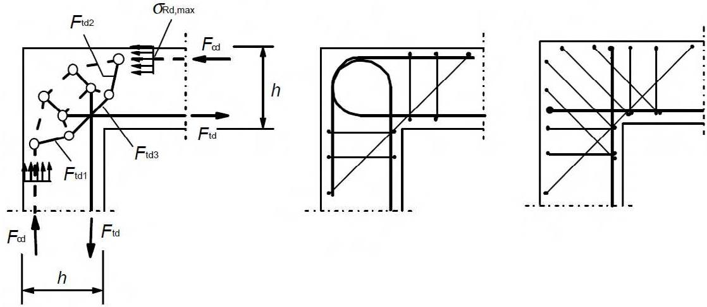
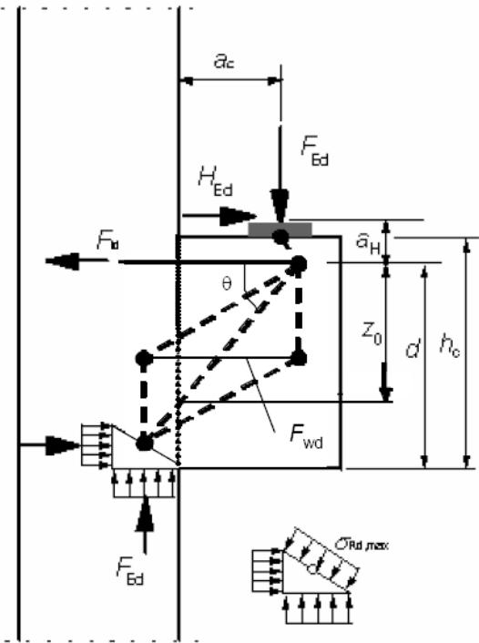
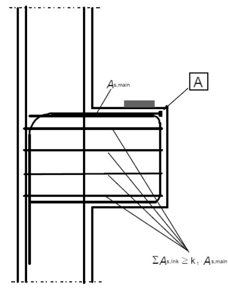
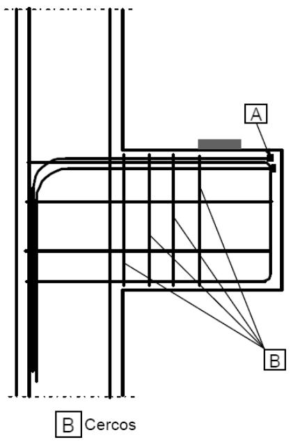

# Apéndice J Ejemplos de definición de los detalles de proyecto para situaciones particulares

## J.1 Armadura de piel

(1) La armadura de piel para resistir el desconchamiento debe emplearse cuando la armadura principal esté formada por:

\- barras con un diámetro superior a 32 mm, o

\- grupos de barras con un diámetro equivalente superior a 32 mm (véase el apartado 8.8).

La armadura de piel debe consistir en una malla electrosoldada o en barras de pequeño diámetro y disponerse fuera de los cercos tal como se indica en la figura A19.J.1.

*x es la profundidad de la fibra neutra en ELU*

(2) El área de la armadura de piel $A_{s,surf}$ no debe ser inferior a $A_{s,surfmin}$ en las dos direcciones, paralela y ortogonal a la armadura de tracción de la viga. El valor mínimo será $A_{s,surfmin} = 0,01A_{ct,ext}$ , donde $A_{ct,ext}$ el área de hormigón del recubrimiento, exterior a los cercos (véase la figura A19.J.1).

(3) En el caso de que el recubrimiento de la armadura sea superior a 70 mm, para mejorar la durabilidad debe emplearse una armadura de piel similar, con un área de $0,005A_{ct,ext}$ en cada dirección.

(4) El recubrimiento mínimo necesario para la armadura de piel se indica en el apartado 43.4.1 de este Código Estructural.

(5) Las barras longitudinales de la armadura de piel pueden tomarse como armadura longitudinal resistente a flexión y las barras transversales como armadura resistente de cortante, siempre que se cumplan los requisitos para la colocación y el anclaje de este tipo de armaduras.

## J.2 Esquinas de pórticos

## J.2.1 Generalidades

(1) La resistencia del hormigón $\sigma_{Rd,max}$ debe determinarse de acuerdo con el apartado 6.5.2 (zonas comprimidas con o sin armadura transversal).

Sec. I. Pág. 98487

> cve: BOE-A-2021-13681
Verificable en https://www.boe.es

<!-- pag 204 -->

## J.2.2 Esquinas de pórticos con momentos negativos

(1) Para un canto aproximadamente igual de viga y pilar $(2/3 < h_{2}/h_{1} < 3/2)$ (véase la figura A19.J.2(a)), no es necesario comprobar los cercos ni las longitudes de anclaje en las uniones viga–pilar, siempre que la armadura de tracción de la viga esté doblada alrededor de la esquina.

(2) La figura A19.J.2(b) muestra un modelo de bielas y tirantes para $h_{2}/h_{1} < 2/3$ para un rango limitado de tan $\theta$ definido por los valores $0,4 \leq \tan \theta \leq 1,0$ .

(3) La longitud de anclaje $l_{bd}$ debe determinarse para la fuerza $\Delta F_{td} = F_{td2} - F_{td1}$ .

(4) La armadura debe disponerse para soportar fuerzas de tracción transversales perpendiculares al plano del nudo.

*(a) Canto muy similar de viga y pilar*

*(b) Canto muy diferente de viga y pilar*

Figura A19.J.2 Esquina de pórtico con momento negativo. Modelo y armado

## J.2.3 Esquinas de pórticos con momentos positivos

(1) Para un canto aproximadamente igual de viga y pilar, pueden emplearse los modelos de bielas y tirantes establecidos en las figuras J.3(a) y J.4(a). La armadura debe disponerse en forma de lazo en la región de la esquina, o como dos barras en U superpuestas en combinación con cercos inclinados, tal como se muestra en las figuras A19.J.3(b) y (c) y en las figuras A19.J.4(b) y (c).

Sec. I. Pág. 98488

> cve: BOE-A-2021-13681
Verificable en https://www.boe.es

<!-- pag 205 -->

*a) Modelo de bielas y tirantes*

*b) y c) Detalles de armado fA19.J.3 Esquina de pórtico con un momento positivo moderado (por ejemplo $A_{S}/bh \leq 2\%$ )*

(2) Para momentos positivos elevados, deben disponerse una barra diagonal y cercos, tal como se muestra en la figura A19.J.4, para prevenir el desconchamiento.

*a) Modelo de bielas y tirantes b) y c) Detalles de armado Figura A19.J.4 Esquina de pórtico con un momento positivo elevado (por ejemplo $A_{S}/bh > 2\%$ )*

## J.3 Ménsulas cortas

(1) Las ménsulas cortas ( $a_c < z_0$ ) pueden calcularse empleando modelos de bielas y tirantes como los descritos en el apartado 6.5 (véase la figura A19.J.5). La inclinación de la biela está limitada por $1,0 \leq \tan \theta \leq 2,5$ .

Sec. I. Pág. 98489

> cve: BOE-A-2021-13681
Verificable en https://www.boe.es

<!-- pag 206 -->

*Figura J.5 Modelo de bielas y tirantes de una ménsula corta*

(2) Si $a_{c} < 0,5h_{c}$ deben disponerse cercos próximos horizontales o inclinados con $A_{s,lnk} \geq k_{1}A_{s,main}$ , junto con la armadura principal de tracción (véase la figura A19.J.6(a)). El valor de $k_{1}$ a utilizar será $k_{1} = 0,25$ .

(3) Si $a_{c} > 0,5h_{c}$ y $F_{Ed} > V_{Rd,c}$ (véase el apartado 6.2.2), deben disponerse cercos verticales próximos, $A_{s,lnk} \geq k_{2}F_{Ed}/f_{yd}$ , además de la armadura de tracción principal (véase la figura A19.J.6(b)). El valor de $k_{2}$ a utilizar será $k_{2} = 0,5$ .

(4) La armadura principal de tracción debe anclarse en sus dos extremos. Esta armadura debe anclarse al elemento de apoyo en su cara más alejada y la longitud de anclaje debe medirse a partir de la posición de la armadura vertical de la cara más próxima. La armadura debe anclarse en la ménsula corta y la longitud de anclaje debe medirse desde la cara interna de la placa de carga.

(5) Si se establecen requisitos especiales para limitar la fisuración, será eficaz la utilización de cercos inclinados en la zona de arranque de la ménsula corta.

Sec. I. Pág. 98490

> cve: BOE-A-2021-13681
Verificable en https://www.boe.es

<!-- pag 207 -->

*A Dispositivos de anclaje o lazos (a) armadura para $a_{c} \leq 0, 5 h_{c}$*

*(b) armadura para $a_{c} > 0, 5 h_{c}$ Figura A19.J.6 Detalles de armado de una ménsula corta*

Sec. I. Pág. 98491

> cve: BOE-A-2021-13681
Verificable en https://www.boe.es
